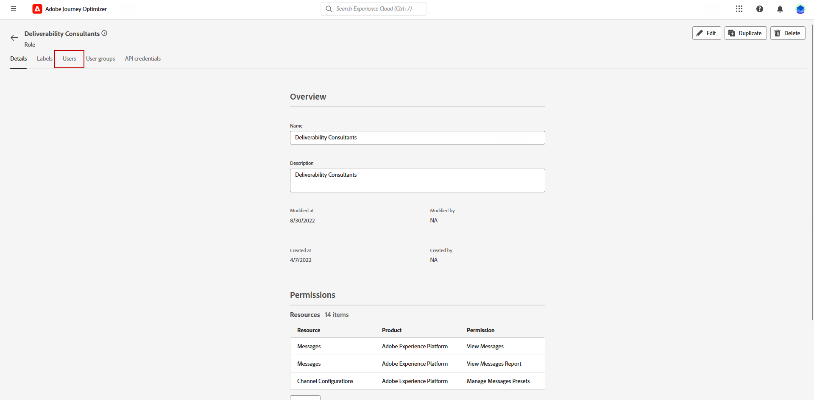

# Criar um plano de aquecimento de IP {#ip-warmup}

>[!BEGINSHADEBOX]

O que há neste guia de documentação:

* [Introdução aos planos de aquecimento de IP](ip-warmup-gs.md)
* [Criar campanhas de aquecimento de IP](ip-warmup-campaign.md)
* **[Criar um plano de aquecimento de IP](ip-warmup-plan.md)**
* [Executar o plano de aquecimento de IP](ip-warmup-execution.md)

>[!ENDSHADEBOX]

Depois de criar uma ou mais [campanhas de aquecimento de IP](ip-warmup-campaign.md) com uma superfície dedicada e a opção correspondente habilitada, você pode começar a criar seu plano de aquecimento de IP.

Para acessar, criar, editar e excluir os planos de aquecimento de IP, você deve ter a função de **[!UICONTROL Consultor de avaliação de entrega]** ou permissões relacionadas aos planos de aquecimento de IP.

+++Saiba como atribuir a função de Consultor de capacidade de entrega ou as permissões relacionadas a planos de aquecimento de IP

O controle de acesso no nível do objeto permite proteger dados e conceder acesso específico para visualizar e gerenciar seus planos. Se nenhum rótulo for atribuído ao seu plano de aquecimento de IP, ele será aberto para visualização e edição por todos os usuários.

Conceder a permissão **[!UICONTROL Exibir planos de aquecimento de IP]** restringe o acesso somente à exibição e à publicação, enquanto atribuir a permissão **[!UICONTROL Gerenciar planos de aquecimento de IP]** permite que os usuários exibam e editem o plano.

Para atribuir a permissão correspondente a uma **[!UICONTROL Função]** específica:

1. No produto [!DNL Permissions], navegue até o menu **[!UICONTROL Funções]** e selecione a função que deseja atualizar com as novas permissões **[!UICONTROL Configurações de Warmup de IP]**.

1. No painel **[!UICONTROL Função]**, clique em **[!UICONTROL Editar]**.

   

1. Arraste e solte o recurso **[!UICONTROL Configurações de IP Warmup]** para atribuir permissão.

1. Na lista suspensa de recursos **[!UICONTROL Configurações de IP Warmup]**, selecione quais permissões o usuário precisa: **[!UICONTROL Exibir Planos de IP Warmup]**, **[!UICONTROL Gerenciar Planos de IP Warmup]** e/ou **[!UICONTROL Exibir Relatórios de IP Warmup]**. Você pode selecioná-los todos de uma vez, se necessário.

   

1. Clique em **[!UICONTROL Salvar]**.

Para atribuir a função correspondente a um **[!UICONTROL Usuário]**:

1. No produto [!DNL Permissions], navegue até o menu **[!UICONTROL Funções]** e selecione a função interna **[!UICONTROL Consultor de avaliação de entrega]**.

1. No painel **[!UICONTROL Função]**, acesse a guia **[!UICONTROL Usuários]**.

   

1. Clique em **[!UICONTROL Adicionar usuário]** para atribuir a função interna **[!UICONTROL Consultor de avaliação de entrega]**.

   

1. Selecione seu **[!UICONTROL Usuário]** e clique em **[!UICONTROL Salvar]**.

   

+++

## Preparar o arquivo do plano de aquecimento de IP {#prepare-file}

O aquecimento de IP é uma atividade que consiste em aumentar gradualmente o volume de emails que saem de seus IPs e domínios para os principais provedores de serviços de Internet (ISPs), a fim de estabelecer sua reputação como remetente legítimo.

Normalmente, essa atividade é realizada com a ajuda de um especialista em capacidade de entrega que ajuda a preparar um plano bem pensado com base nos domínios do setor, casos de uso, regiões, ISPs e vários outros fatores.

<!--When working with the [!DNL Journey Optimizer] IP warmup feature, this plan takes the form of an Excel file that must contain a number of predefined columns.-->

Antes de criar um plano de aquecimento de IP na interface do [!DNL Journey Optimizer], é necessário preencher um modelo do Excel com todos os dados que alimentarão seu plano.

* Na interface do usuário, você pode baixar o [modelo de plano de aquecimento de IP](assets/IPWarmupPlan-Template.xlsx) em branco do Excel para preencher.

* Você também pode baixar um [exemplo de plano de aquecimento de IP](assets/IPWarmupPlan-Sample.xlsx) já preenchido com alguns dados que você pode usar como exemplo.

<!--
* From the user interface you can download the blank Excel IP warmup plan template to fill in.

* You can also download a sample IP warmup plan already filled in with some data you can use as an example.
-->

>[!CAUTION]
>
>Trabalhe com seu consultor de entrega para garantir que seu arquivo de plano de aquecimento de IP esteja configurado corretamente.
>
>Use o formato fornecido no modelo.

Veja abaixo um exemplo de um arquivo contendo um plano de aquecimento de IP.

### Guia Plano de aquecimento de IP {#ip-warmup-plan-tab}

* Neste exemplo, um plano foi preparado ao longo de 17 dias (chamado &#39;**execuções**&#39;) para atingir um volume de destino de mais de um milhão de perfis.

* Este planejamento é executado durante seis **fases**, cada uma contendo pelo menos uma execução.

* Você pode ter até 6 colunas (5 colunas para grupos de domínio e uma para a coluna **Outros**). Neste exemplo, o plano é dividido em seis colunas:

   * Quatro deles correspondem a **grupos de domínio predefinidos** para serem usados em seu plano (Gmail, Microsoft, Yahoo e Orange).
   * Um corresponde a um grupo de domínio personalizado (que você precisa adicionar usando a guia [Grupo de domínio personalizado](#custom-domain-group-tab)).
   * A sexta coluna, **Outros**, contém todos os endereços restantes de outros domínios que não estão explicitamente cobertos no plano. Essa coluna é opcional: se omitida, os emails irão somente para os domínios especificados.

A ideia é aumentar progressivamente o número de endereços direcionados em cada execução, enquanto reduz o número de execuções para cada fase.

Os grupos de domínio principais predefinidos que você pode adicionar ao seu plano estão listados abaixo:

<!--
* Gmail
* Adobe
* WP
* Comcast
* Yahoo
* Bigpond
* Orange
* Softbank
* Docomo
* United Internet
* Microsoft
* KDDI
* Italia Online
* La Poste
* Apple
-->

+++ Gmail
gmail.com;google.com;googlemail.com;googlemail.co.uk
+++

+++WP
wp.pl;o2.pl
+++

+++Conversão
comcast.net
+++

+++Yahoo
aol.fi;games.com;cs.com;yahoo.com.in;y7mail.com;yahoo.hu;yahoo.co.uk;yahoo.cn;yahoo.co.hu;aol.es;yahoogroups.com.sg;yahoo.ca;aol.hk;yahoogroups.com.au;yahoo.com.au;aolpoland.pl;aolnorge.no;yahoo.com.vn;yahoo.fi;aol.co.nz;yahoo.com.br;yahoo.hr;aol.cz;yahoo.ee;aol.be;aolcom.tr;yahoo.si;yahoo.ne.jp;aol.it;ymail.com;yahoo.es yahoo.dk;yahoogroups.ca;netscape.com;yahoo.com.pe;aol.kr;yahoo.ie;aol.jp;yahoo.co.id;yahoo.lt;citlink.net;aol.nl;wmconnect.com;yahoo.bg;yahoo.com.jp;aol.se;yahoo.com.hk;yahoo.de;aol.com.br;yahoo.co.kr;yahoo.nl;yahoo.com.ar;aol.dk;ygm.com;aol.cl;yahoo.co.nz;yahoo.no;aol.com;goowy.com;yahoo.cz;rocketmail.com;yahoo.sk;yahoo.sk yahoogroups.de;yahoo.gr;frontiernet.net;yahoo.ro;aim.com;yahoo.at;yahoogroups.co.in;netscape.net;luckymail.com;aol.fr;yahoo.in;aol.in;yahoo.co.jp;yahoo.rs;aol.de;yahoo.com.kr;yahoo.co.za;verizon.net;aol.com.ve;aol.com.ar;yahoo.se;myaol.jp;aol.com.co;yahoo.pt;wild4music.com;yahoogroups.com.cn;yahoogrupper.dk;yahoo.fr;yahoo.com.co;wow.com;aol.pl;yahoo.com;aol.pl;yahooxtra.co.nz;yahoo;aol.ch;yahoo.it;yahoo.com.mx;yahoo.com.ph;aolpolcka.pl;sky.com;yahoogruppi.it;aol.com.mx;yahoo.cl;aol.com.au;aolchina.com;yahoo.com.net;yahoo.be;yahoo.com.tw;aol.tw;talk21.com;compuserve.com;yahoo.com.sg;yahoogroups.com.tw;frontier.com;yahoo.co.in;yahoo.co.il;verizon.net.in;yahoo.com.tr;yahoogroups.com.hk;aol.ru;yahoogroups.co.uk yahoo.com.biz yahoo.com.hr aol.co.uk ybb.ne.jp yahoogroups.co.kr yahoo.com.my rogers.com gte.net yahoogroups.com yahoo.co.th yahoo.com.cn love.com bellatlantic.net yahoo.com.ve yahoo.com.ua;yahoo.lv;aolpolska.pl;aol.at;yahoo.pl
+++

+++Bigpond
bigpond.com;bigpond.com.au;bigpond.net;telstra.com;bigpond.net.au
+++

+++Laranja
voila.com;francetelecom.com;orange.com;orange.fr;wanadoo.fr;voila.fr
+++

+++Softbank
c.vodafone.ne.jp;jp-h.ne.jp;k.vodafone.ne.jp;jp-d.ne.jp;jp-c.ne.jp;t.vodafone.ne.jp;h.vodafone.ne.jp;r.vodafone.ne.jp;q.vodafone.ne.jp;jp-t.ne.jp;jp-q.ne.jp;s.vodafone.ne.jp;jp-s.ne.jp;jp-r.ne.jp;jp-k.ne.jp;n.vodafone.ne.jp;d.vodafone.ne.jp;softbank.ne.jp;jp-n.ne.jp;
+++

+++DoCoMo
docomo.ne.jp
+++

+++Internet Unida
gmx.de;1and1.com;gmx.fr;mail.com;1und1.de;gmx.com;gmx.net;gmx.at;web.de;gmx.ch
+++

+++Microsoft
hotmail.com.tr;live.de;live.ru;live.nl;windowslive.com;live.jp;mts.net;xbox.com;hotmail.fr;hotmail.cl;hotmail.jp;live.cl;live.at;live.com.au;live.hk;hotmail.co.th;hotmail.com.au;hotmail.com;live.com.my;live.ie;hotmail.co.kr;outlook.com.br;hotmail.dk;hotmail.co.il;live.co.kr;outlook.ie;live.cn;live.co.uk;hotmail.es;live.fr;live.no;live.dk;hotmail.it;live.com.mx;live.se;hotmail.co.uk;live.be;;live.in;hotmail.se;live.com.sg;hotmail.ch;msn.com;hotmail.co.jp;hotmail.gr;live.it;live.co.za;hotmail.ca;live.com.pt;outlook.com live.com live.com.ar hotmail.com.br hotmail.com.ar;live.ca;hotmail.de
+++

+++KDDI
au.com;ezweb.ne.jp;uqmobile.jp
+++

+++Italia Online
inwind.it;blu.it;virgilio.it;giallo.it;iol.it;libero.it
+++

+++La Poste
laposte.net
+++

+++Apple
mac.com;icloud.com;apple.com;me.com
+++

### Guia Grupo de domínio personalizado {#custom-domain-group-tab}

Você também pode adicionar mais colunas ao seu plano, incluindo grupos de domínio personalizados.

Use a guia **[!UICONTROL Grupo de Domínio Personalizado]** para definir um novo grupo de domínio. Para cada domínio, você pode adicionar todos os subdomínios que ele abrange.<!--TBC-->

Para grupos de domínio usados nesse plano, verifique se cada domínio é exclusivo para seu grupo de domínio e não se sobrepõe a outros grupos de domínio. Como os grupos de domínio globais são definidos automaticamente, os usuários devem considerar isso ao criar grupos de domínio personalizados.

Por exemplo, se você adicionar o domínio personalizado Luma, desejará que os seguintes subdomínios sejam incluídos: luma.com, luma.co.uk, luma.it, luma.fr, luma.de, etc.

### Exemplo {#example}

Digamos que você queira ter dois grupos de domínio personalizados:

* Um somente para domínios do Hotmail.
* Um para todos os outros domínios do grupo de domínio Microsoft (excluindo todos os domínios do Hotmail).

Os domínios fora do Hotmail e do grupo de domínio Microsoft serão reunidos na coluna **[!UICONTROL Outros]**.

1. Na guia **[!UICONTROL Grupo de Domínio Personalizado]**, crie o grupo de domínio **Hotmail**.

1. Adicione todos os domínios do Hotmail na mesma linha.

   Você pode [copiar e colar](#copy-paste) todos os domínios do Hotmail listados na [guia Plano de Interrupção de IP](#ip-warmup-plan-tab) seção.

1. Adicione outra linha.

1. Crie o grupo de domínio **Microsoft_X**.

1. Adicione todos os domínios do Microsoft que não são do Hotmail na mesma linha. Da mesma forma, você pode copiá-los e colá-los da lista acima. [Saiba mais](#copy-paste)

1. Volte para a guia **[!UICONTROL Plano de aquecimento de IP]**.

1. Crie três colunas: uma para o **Hotmail**, uma para o **Microsoft_X** e uma para o **Outros**.

1. Preencha as colunas de acordo com suas necessidades.

<!--Only the domain groups listed in the **[!UICONTROL IP Warmup Plan]** tab will be taken into account.-->

### Copiar e colar domínios padrão {#copy-paste}

Para criar um grupo de domínios personalizado contendo todos os domínios do Hotmail, por exemplo, você pode copiar e colar os domínios da lista padrão fornecida [acima](#ip-warmup-plan-tab).

Em seguida, use a ferramenta de conversão do Excel para converter texto em colunas:

1. Selecione **[!UICONTROL Dados]** > **[!UICONTROL Texto para colunas...]**, escolha **[!UICONTROL Delimitado]** e selecione **[!UICONTROL Próximo]**.

1. Selecione **[!UICONTROL Ponto e vírgula]**, clique em **[!UICONTROL Avançar]** e **[!UICONTROL Concluir]**.

Cada domínio agora é exibido em uma coluna diferente na mesma linha.

## Acessar e gerenciar planos de aquecimento de IP {#manage-ip-warmup-plans}

1. Acesse o menu **[!UICONTROL Administração]** > **[!UICONTROL Canais]** > **[!UICONTROL Planos de aquecimento de IP]**. Todos os planos de aquecimento de IP criados até o momento são exibidos.

   

1. Você pode filtrar pelo status. Os diferentes status são:

   * **Não iniciado**: nenhuma execução foi ativada ainda. [Saiba mais](ip-warmup-execution.md#define-runs)
   * **Ao vivo**: o plano muda para este status assim que a primeira execução na primeira fase é ativada com sucesso. [Saiba mais](ip-warmup-execution.md#define-runs)
   * **Concluído**: o plano foi marcado como concluído. <!--This option is only available if all the runs in the plan are in **[!UICONTROL Completed]** or **[!UICONTROL Draft]** status (no run can be **[!UICONTROL Live]**).--> [Saiba mais](ip-warmup-execution.md#mark-as-completed)
     <!--* **Paused**: to check (user action)-->

1. Para excluir um plano de aquecimento de IP, selecione o ícone **[!UICONTROL Excluir]** ao lado do nome de um plano e confirme a exclusão.

   >[!NOTE]
   >
   >Somente planos com o status **Não iniciado** podem ser excluídos.

   

   >[!CAUTION]
   >
   >O plano de aquecimento de IP selecionado será excluído permanentemente.

## Criar um plano de aquecimento de IP {#create-ip-warmup-plan}

>[!CONTEXTUALHELP]
>id="ajo_admin_ip_warmup_upload"
>title="Especifique o seu plano de aquecimento de IP"
>abstract="Preencha o modelo do Excel com todos os dados que alimentarão seu plano, como fases de aquecimento de IP e número-alvo de perfis, e faça upload dele aqui."
>additional-url="https://experienceleague.adobe.com/docs/journey-optimizer/using/configuration/implement-ip-warmup-plan/ip-warmup-plan.html?lang=pt-BR#prepare-file" text="Preparar o arquivo do plano de aquecimento de IP"

>[!CONTEXTUALHELP]
>id="ajo_admin_ip_warmup_surface"
>title="Selecione uma superfície de marketing"
>abstract="Você precisa selecionar a mesma superfície que a selecionada na campanha que deseja associar ao plano de aquecimento de IP."
>additional-url="https://experienceleague.adobe.com/docs/journey-optimizer/using/configuration/channel-surfaces.html?lang=pt-BR" text="Configurar superfícies de canais"
>additional-url="https://experienceleague.adobe.com/docs/journey-optimizer/using/configuration/channel-surfaces.html?lang=pt-BR" text="Criar campanhas de aquecimento de IP"

Para criar um plano de aquecimento de IP, siga as etapas abaixo.

1. Acesse o menu **[!UICONTROL Administração]** > **[!UICONTROL Canais]** > **[!UICONTROL Planos de aquecimento de IP]** e clique em **[!UICONTROL Criar plano de aquecimento de IP]**.

   

1. Preencha os detalhes do plano de aquecimento de IP: dê a ele um nome e uma descrição.

   

1. Selecione a [superfície](channel-surfaces.md) que você deseja aquecer. Somente as superfícies de marketing estão disponíveis para seleção. [Saiba mais sobre o tipo de email](../email/email-settings.md#email-type)

   >[!NOTE]
   >
   >As campanhas que você deseja associar ao plano de aquecimento de IP devem usar a mesma superfície. [Saiba como criar uma campanha de aquecimento de IP](ip-warmup-campaign.md)

1. Carregue o arquivo do Excel que contém seu plano de aquecimento de IP. [Saiba mais](#prepare-file)

   <!--
    You can also download the Excel template from the [!DNL Journey Optimizer] user interface and upload it after filling it with the IP warmup details.-->

   

   >[!NOTE]
   >
   >Caso o upload falhe, verifique se você está usando a formatação e o formato de arquivo corretos (.xls ou .xlsx). Use o [modelo](assets/IPWarmupPlan-Template.xlsx) fornecido pelo Adobe.

1. Clique em **[!UICONTROL Criar]**. Todas as fases, execuções, colunas e seu conteúdo definido no arquivo carregado são automaticamente exibidos na interface [!DNL Journey Optimizer].

   

   >[!NOTE]
   >
   >A coluna **[!UICONTROL Direcionado]** mostra a soma de todos os perfis direcionados para cada execução, o que significa todos os perfis de cada grupo de domínio definido por você, incluindo a coluna **Outros**, se houver.

Agora você está pronto para executar seu plano de aquecimento de IP. [Saiba mais](ip-warmup-execution.md)
