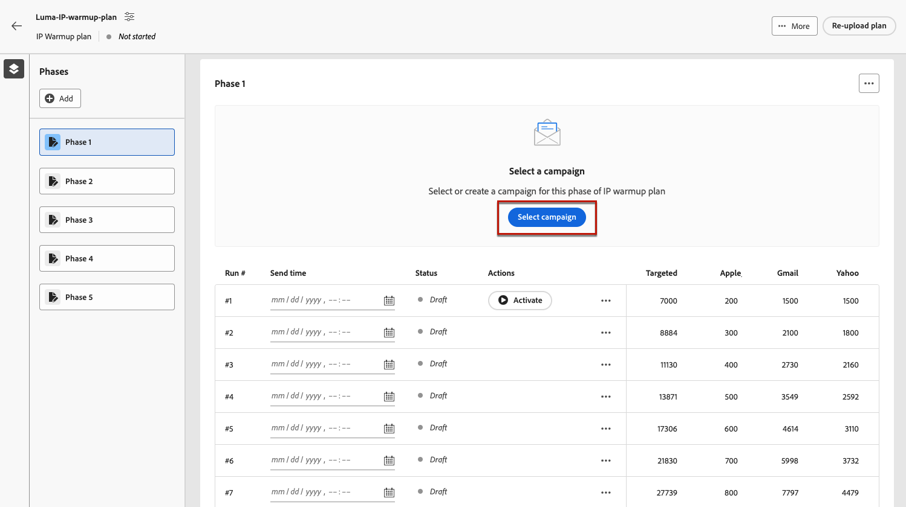

# Implementar um plano de aquecimento de IP {#ip-warmup}

<!--
>[!CONTEXTUALHELP]
>id="ajo_admin_ip_warmup_plan"
>title="Define your IP warmup plan"
>abstract="You can perform IP warmup workflows directly from the Journey Optimizer interface in a standardized and efficient way that follows the best practices for optimal deliverability."
-->

>[!AVAILABILITY]
>
>O recurso de aquecimento de IP está disponível no momento como um beta apenas para usuários selecionados. Para participar do programa beta, entre em contato com o Atendimento ao cliente da Adobe.

Com [!DNL Journey Optimizer]No entanto, é possível executar facilmente workflows de aquecimento de IP diretamente da interface do usuário, de forma padronizada e eficiente, seguindo as práticas recomendadas para a entrega ideal.

>[!CAUTION]
>
>Esse recurso se aplica somente ao canal de email.

Quando os emails são enviados usando uma nova plataforma, os provedores de serviços de Internet (ISPs) suspeitam de endereços IP que não são reconhecidos. Se grandes volumes de emails forem enviados repentinamente, os ISPs freqüentemente os marcam como spam.

Para evitar ser marcado como spam, você pode aumentar progressivamente o volume enviado usando o recurso de plano de aquecimento de IP. Uma nova opção no menu Administração permite que você faça isso com mais tranquilidade em vez de criar jornadas complexas. Isso deve garantir o desenvolvimento suave da fase de inicialização e permitir que você reduza a taxa geral de endereços inválidos.

>[!NOTE]
>
>Saiba mais sobre como aumentar sua reputação de email com o aquecimento de IP no [Guia de práticas recomendadas de capacidade de delivery](https://experienceleague.adobe.com/docs/deliverability-learn/deliverability-best-practice-guide/additional-resources/generic-resources/increase-reputation-with-ip-warming.html).

<!--
Here are the main steps:

1. You get a deliverability plan from the deliverability consulting team.

1. Create a campaign - marketer [Learn more](#create-ip-warmup-campaign)

1. Your associated practitioner (customer's practitioner/ACS consultant/partner consultant) creates a IP warmup object in project and uploads a plan.

    The CSV manifests itself like below with numbers showing up with/without domain bifurcation. Below screen shows one phase (creative) with associated runs (The plan obviously has more such phases)

1. Practitioner associates the campaign and audience at phase level and turns on some settings as needed for all runs associated with a single creative/campaign

1. Then start to execute on every day basis by simply clicking the play button

1. Reports will continue to show up at campaign level with similar capabilities as today. NO enhancements in BETA. But the IP warmup plan also serves as a consolidated report at one single place of how many executions were done and so on

Benefits are as follows:

* No more creation of daily journeys and associated testing

* Standardization on Campaign which will be easy for practitioners too

* No more pain of creating queries, audiences and testing those as system will create the audiences. At phase level, system ensures that previously targeted + new profiles are picked up AND at iteration level, system ensures that each run is having unique profiles and the count matches what is stated in plan

* Ease of excluding domains and changing the plan with help of simple toggles to exclude OR by editing numbers inline or create new phases or reupload plan if drastic change. No more pain of editing audience definitions, journey conditions

* Single place to manage and view how IP warm is progressing.

* Consolidated report at creative/campaign level as all runs for a phase 

* There is an expectation that with this, it will ease around 30% of effort and will be much better experience for consultant/partner/practitioner - right from planning to execution to reporting
-->

As principais etapas para implementar um plano de aquecimento de IP são as seguintes:

* [Criar campanhas de aquecimento de IP](#create-ip-warmup-campaign)
* [Definir um plano de aquecimento de IP](#define-ip-warmup-plan)

## Criar campanhas de aquecimento de IP {#create-ip-warmup-campaign}

>[!CONTEXTUALHELP]
>id="ajo_campaign_ip_warmup"
>title="Ativar a opção de plano de aquecimento de IP"
>abstract="Selecione a opção de ativação do plano de aquecimento de IP. Quando a campanha estiver ativa, ela poderá ser associada a um plano de aquecimento de IP."

É necessário criar uma ou mais campanhas com uma opção específica ativada para que elas possam ser usadas em um plano de aquecimento de IP. Siga as etapas abaixo.

1. Criar um [superfície](channel-surfaces.md) para o domínio e os IPs identificados para o seu plano de aquecimento.

1. Criar um [campaign](../campaigns/create-campaign.md) e selecione o [E-mail](../email/create-email.md#create-email-journey-campaign) ação.

1. Selecione a superfície criada para aquecimento de IP.

   <!--You must use the same surface as the one that will be used for the asociated IP warmup plan. [Learn how to create an IP warmup plan](#create-ip-warmup-plan)-->

1. Clique em **[!UICONTROL Criar]**.

1. No **[!UICONTROL Agendar]** , selecione **[!UICONTROL Ativação do plano de aquecimento de IP]**.

   

   A campanha [programação](../campaigns/create-campaign.md#schedule) será orientada pelo plano de aquecimento de IP ao qual será associado, o que significa que a programação não será mais definida na própria campanha.

1. [Ativar](../campaigns/review-activate-campaign.md) a campanha. Uma vez em funcionamento, ele estará pronto para uso em um plano de aquecimento de IP.

>[!NOTE]
>
>Para uma campanha ativa com o plano de aquecimento de IP ativado, a variável **[!UICONTROL Excluir]** estará disponível até ser associado a um plano de aquecimento de IP.

Para obter mais informações sobre como configurar uma campanha, consulte [esta página](../campaigns/get-started-with-campaigns.md).

## Definir um plano de aquecimento de IP {#define-ip-warmup-plan}

### Gerenciar planos de aquecimento de IP {#manage-ip-warmup-plans}

1. Acesse o **[!UICONTROL Administração]** > **[!UICONTROL Canais]** > **[!UICONTROL Planos de aquecimento de IP]** menu. Todos os planos de aquecimento de IP criados até o momento são exibidos.

   

1. Você pode filtrar pelo status. Os diferentes status são:

   * **Não iniciado**: não ocorreu nenhuma execução
   * **Em andamento**: assim que uma execução for iniciada <!--or is done?-->
   * **Em pausa**
   * **Concluído**: todas as execuções no plano foram concluídas

1. Para excluir um plano de aquecimento de IP, selecione o **[!UICONTROL Excluir]** ícone ao lado de um item de lista e confirme a exclusão.

   

   >[!CAUTION]
   >
   >O plano de aquecimento de IP selecionado será excluído permanentemente.

### Criar um plano de aquecimento de IP {#create-ip-warmup-plan}

>[!CONTEXTUALHELP]
>id="ajo_admin_ip_warmup_upload"
>title="Especificar seu plano de aquecimento de IP"
>abstract="Baixe o modelo CSV e preencha-o com os dados das fases de aquecimento de IP e o número alvo de perfis."

>[!CONTEXTUALHELP]
>id="ajo_admin_ip_warmup_surface"
>title="Selecionar uma superfície de marketing"
>abstract="Você deve selecionar a mesma superfície que a selecionada na campanha que deseja associar ao plano de aquecimento de IP."
>additional-url="https://experienceleague.adobe.com/docs/journey-optimizer/using/configuration/channel-surfaces.html?lang=pt-BR" text="Configurar superfícies de canais"
>additional-url="https://experienceleague.adobe.com/docs/journey-optimizer/using/configuration/channel-surfaces.html?lang=pt-BR" text="Criar campanhas de aquecimento de IP"

>[!CAUTION]
>
>Para criar, editar e excluir os planos de aquecimento de IP, você deve ter a **[!UICONTROL Consultor de avaliação de entrega]** permissão.
<!--Learn more on managing [!DNL Journey Optimizer] users' access rights in [this section](../administration/permissions-overview.md).-->

Quando uma ou mais campanhas ativas com o **[!UICONTROL Ativação do plano de aquecimento de IP]** estiver ativada, você poderá associá-los a um plano de aquecimento de IP.

>[!CAUTION]
>
>Trabalhe com seu consultor de entrega para garantir que seu modelo de plano de aquecimento de IP esteja configurado corretamente. <!--TBC-->

1. Acesse o **[!UICONTROL Administração]** > **[!UICONTROL Canais]** > **[!UICONTROL Planos de aquecimento de IP]** e clique em **[!UICONTROL Criar plano de aquecimento de IP]**.

   

1. Preencha os detalhes do plano de aquecimento de IP: dê a ele um nome e uma descrição.

   

1. Selecione um [superfície](channel-surfaces.md). Somente as superfícies de marketing estão disponíveis para seleção. [Saiba mais sobre tipo de email](../email/email-settings.md#email-type)

   >[!CAUTION]
   >
   >Você deve selecionar a mesma superfície que a selecionada na campanha que deseja associar ao plano de aquecimento de IP. [Saiba como criar uma campanha de aquecimento de IP](#create-ip-warmup-campaign)

1. Fazer upload do arquivo do Excel que contém seu plano de aquecimento de IP<!--which formats are allowed?-->. Você pode usar o template fornecido pela equipe de avaliação do delivery.<!--TBC?--> [Saiba mais](#upload-plan)
   <!--
    You can also download the Excel template from the [!DNL Journey Optimizer] user interface and upload it after filling it with the IP warmup details.-->

   

1. Clique em **[!UICONTROL Criar]**. O número de fases definido no arquivo carregado é exibido automaticamente em todas as execuções de cada fase. [Saiba mais](#upload-plan)

   

### Recarregar um plano de aquecimento de IP {#re-upload-plan}

É possível fazer upload novamente de outro plano de aquecimento de IP usando o botão correspondente.

>[!NOTE]
>
>Os detalhes do plano de aquecimento de IP serão alterados conforme o arquivo recém-carregado. As execuções completas e ativadas não são afetadas.

### Fazer upload do arquivo que contém o plano {#upload-plan}

Veja abaixo um exemplo de um arquivo contendo um plano de aquecimento de IP.

Cada fase corresponde a um período composto por várias execuções, às quais você atribuirá uma única campanha.

Para cada execução, você tem um determinado número de recipients e definirá uma data em que essa execução será executada.

Você pode ter quantas colunas quiser para os domínios que deseja entregar. Neste exemplo, você tem três colunas: Gmail, Adobe e Others, o que significa que

A ideia é ter mais execuções nas primeiras fases e aumentar progressivamente o número de endereços direcionados, reduzindo o número de execuções.

### Definir as fases {#define-phases}

>[!CONTEXTUALHELP]
>id="ajo_admin_ip_warmup_campaigns_excluded"
>title="Selecionar públicos das campanhas a serem excluídos"
>abstract="Selecione os públicos-alvo de outras campanhas que deseja excluir da fase atual."

>[!CONTEXTUALHELP]
>id="ajo_admin_ip_warmup_domains_excluded"
>title="Selecionar grupos de domínio a serem excluídos"
>abstract="Selecione os domínios que deseja excluir da fase atual."

1. Para cada fase, selecione a campanha que deseja associar a esta fase do plano de aquecimento de IP.

   

   Observe o seguinte:

   * Somente as campanhas com o **[!UICONTROL Ativação do plano de aquecimento de IP]** opção ativada <!--and live?--> estão disponíveis para seleção. [Saiba mais](#create-ip-warmup-campaign)

   * Você deve selecionar uma campanha que use a mesma superfície que a selecionada para o plano de aquecimento de IP atual.

   * Não é possível selecionar uma campanha que já está em uso em outra campanha de aquecimento de IP.

1. Para cada fase, aplica-se o seguinte:

   * **[!UICONTROL Exclusão de perfil]** - Os perfis das execuções anteriores dessa fase são sempre excluídos. Por exemplo, se na corrida #1 Leo foi coberto nas primeiras 6300 pessoas que estão sendo alvo, o sistema irá automaticamente garantir que Leo não receba o e-mail na execução #2.

   * **[!UICONTROL Públicos-alvo de campanha excluídos]** - Selecione os públicos-alvo de outros <!--executed/live?-->campanhas que você deseja excluir da fase atual.

     Por exemplo, talvez você esteja executando uma fase e tenha que dividi-la por qualquer motivo. Nesse caso, na fase 2, você gostaria de incluir a campanha usada na fase 1 nesta seção para que, na fase 2, as pessoas contatadas anteriormente da fase 1 não sejam incluídas. Isso pode ser feito não apenas com campanhas usadas no mesmo plano de aquecimento de IP, mas também de outro plano de aquecimento de IP.

   * **[!UICONTROL Grupos de domínios excluídos]** - Selecione os domínios que deseja excluir dessa fase, por exemplo, Gmail. <!--??-->

     Depois de executar o aquecimento de IP por alguns dias, você percebe que a reputação do ISP com um domínio diz que o hotmail não é bom e deseja resolvê-lo com o ISP, mas não deseja interromper o plano de aquecimento de IP. Nesse caso, você pode colocar o grupo de domínio hotmail na categoria excluída.

     >[!NOTE]
     >
     >A exclusão de domínio requer uma fase não executada, portanto, talvez seja necessário dividir uma fase em execução para adicionar exclusões. Da mesma forma, se o grupo de domínio não for um grupo de domínio OOTB, talvez seja necessário criar um grupo de domínio no Excel e carregá-lo e, em seguida, excluí-lo.

   

1. É possível adicionar uma fase, se necessário. Ela será adicionada após a última fase atual. Use o **[!UICONTROL Excluir fase]** botão para remover qualquer fase indesejada.

   

   >[!CAUTION]
   >
   >Não é possível desfazer a variável **[!UICONTROL Excluir]** ação.
   >
   >Se você excluir todas as fases do plano de aquecimento de IP, recomendamos refazer o upload de um plano.

### Definir as execuções {#define-runs}

1. Selecione uma programação para cada execução. <!--which is actually a window of opportunity. meaning? how many hours? shall we specify that to clarify?-->

   

1. Selecione uma hora de término, que basicamente significa a janela dentro da qual podemos executar a campanha de aquecimento caso haja atrasos no trabalho do público-alvo. Se não for especificado, tentaremos na hora de início e falharemos. Se a hora de término for fornecida, executaremos a execução entre essa janela.

1. Ativar cada execução. Certifique-se de agendar um horário com antecedência suficiente para permitir que o trabalho de segmentação seja executado. <!--explain how you can evaluate a proper time-->

   >[!CAUTION]
   >
   >Cada execução deve ser ativada pelo menos 12 horas antes da hora real de envio. Caso contrário, a segmentação pode não ser concluída. <!--How do you know when segmentation is complete? Is there a way to prevent user from scheduling less than 12 hours before the segmentation job?-->

1. Se a execução da campanha não tiver sido iniciada, é possível interromper uma execução.

   Depois que a execução da campanha for iniciada, a variável **[!UICONTROL Parar]** fica indisponível. <!--TBC in UI-->

   

1. Para adicionar uma execução, selecione **[!UICONTROL Adicionar uma execução abaixo]** no ícone de três pontos.

   

1. A qualquer momento, se quiser usar uma campanha diferente a partir de uma execução específica, selecione a **[!UICONTROL Opção Dividir para uma nova fase]** no ícone de três pontos. Uma nova fase é criada para as execuções restantes da fase atual. Siga as etapas [acima](#define-phases) para definir a nova fase.

   Por exemplo, se você selecionar essa opção para executar #4, as execuções de #4 para #8 serão movidas para uma nova fase.

<!--
You don't have to decide the campaign upfront. You can do a split later. It's a work in progress plan: you activate one run at a time with a campaign and you always have the flexibility to modify it while working on it.

But need to explain in which case you want to modify campaigns, provide examples
-->

Uma execução pode ter os seguintes status<!--TBC with Medha-->:

* **[!UICONTROL Concluído]**:
* **[!UICONTROL Falha]**:
* **[!UICONTROL Cancelado]**: você interrompeu a execução antes do início da execução da campanha.

