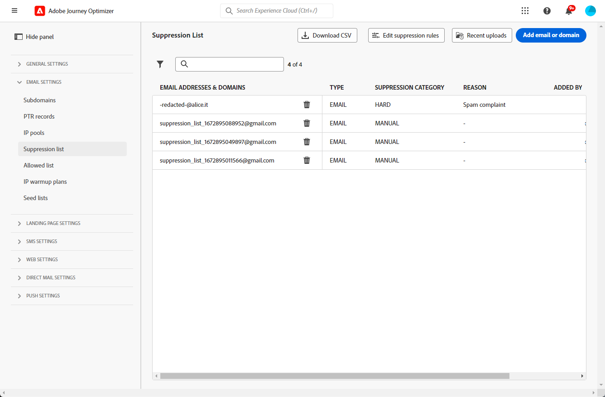
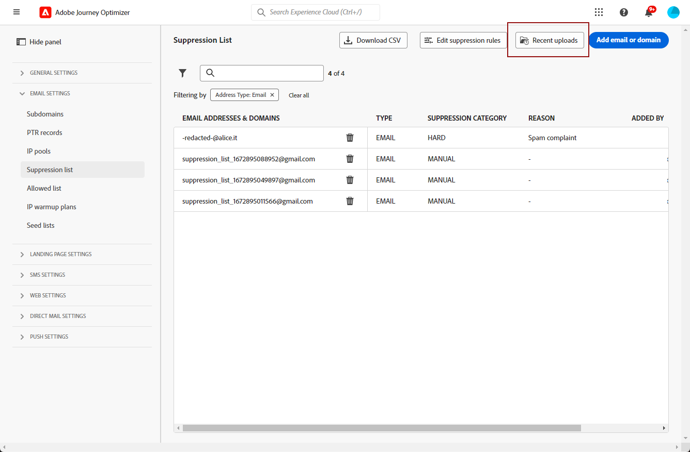

# Gerenciar a lista de supressão {#manage-suppression-list}

Com [!DNL Journey Optimizer], é possível monitorar todos os endereços de email que são excluídos automaticamente do envio em uma jornada, como:

* Endereços inválidos (devoluções permanentes).
* Endereços que consistentemente dão soft-bounce e podem afetar negativamente sua reputação de email se você continuar a incluí-los em seus deliveries.
* Recipients que emitem uma reclamação de spam de algum tipo contra uma de suas mensagens de email.

Esses endereços de email são coletados automaticamente na Journey Optimizer **lista de supressão**. Saiba mais sobre o conceito e o uso da lista de supressão em [esta seção](../reports/suppression-list.md).

Você também pode [**manualmente** adicionar um endereço ou um domínio](#add-addresses-and-domains) à lista de supressão.

>[!NOTE]
>
>Levará entre 0 e 60 minutos para [!DNL Journey Optimizer] para considerar os endereços suprimidos em emails de saída.

## Acessar a lista de supressão {#access-suppression-list}

Para acessar a lista detalhada de endereços de email excluídos, acesse **[!UICONTROL Administração]** > **[!UICONTROL Canais]** > **[!UICONTROL Configuração de email]** e selecione **[!UICONTROL Lista de supressão]**.

>[!CAUTION]
>
>As permissões para visualizar, exportar e gerenciar a lista de supressão estão restritas a [Administradores do Jornada](../administration/ootb-product-profiles.md#journey-administrator). Saiba mais sobre como gerenciar [!DNL Journey Optimizer] direitos de acesso dos usuários em [esta seção](../administration/permissions-overview.md).



Os filtros estão disponíveis para ajudar você a navegar pela lista.


Você pode filtrar na variável **[!UICONTROL Categoria de supressão]**, **[!UICONTROL Tipo de endereço]** ou **[!UICONTROL Motivo]**. Selecione as opções escolhidas para cada critério. Após a seleção, é possível limpar cada filtro ou todos os filtros exibidos na parte superior da lista.


Se você adicionar manualmente um endereço de email ou um domínio por engano, a variável **[!UICONTROL Excluir]** permite remover essa entrada.

>[!CAUTION]
>
>Nunca use o **[!UICONTROL Excluir]** para remover domínios ou endereços de email suprimidos.


Excluir um endereço de email ou um domínio da lista de supressão significa que você recomeçará a fazer o delivery para esse endereço ou domínio. Consequentemente, isso pode ter graves impactos na sua capacidade de entrega e reputação de IP, o que pode eventualmente levar ao bloqueio do seu endereço IP ou domínio de envio. Saiba mais sobre a importância de manter uma lista de supressão em [esta seção](../reports/suppression-list.md).

>[!NOTE]
>
>Continue com muito cuidado ao considerar a exclusão de qualquer endereço de email ou domínio. Em caso de dúvidas, entre em contato com um especialista em capacidade de delivery.

No **[!UICONTROL Lista de supressão]** , também é possível editar as regras de supressão. [Saiba mais](retries.md)

Para exportar a lista de supressão como um arquivo CSV, selecione o **[!UICONTROL Baixar CSV]** botão.


## Categorias e motivos de supressão {#suppression-categories-and-reasons}

Quando uma mensagem não é entregue a um endereço de email, [!DNL Journey Optimizer] determina por que o delivery falhou e associa-o a um **[!UICONTROL Categoria de supressão]**.

As categorias de supressão são as seguintes:

* **Disco rígido**: O endereço de email é enviado imediatamente para a lista de supressão.

   >[!NOTE]
   >
   >Quando o erro é o resultado de uma reclamação de spam, ele também se enquadra no **Disco rígido** categoria . O endereço de email do recipient que emitiu a reclamação é enviado imediatamente para a lista de supressão.

* **Suave**: Erros suaves enviam um endereço para a lista de supressão quando o contador de erros atinge o limite. [Saiba mais sobre tentativas](retries.md)

* **Manual**: Você também pode adicionar manualmente um endereço de email ou um domínio à lista de supressão. [Saiba mais](#add-addresses-and-domains)

>[!NOTE]
>
>Saiba mais sobre devoluções temporárias e devoluções permanentes na [Tipos de falha de delivery](../reports/suppression-list.md#delivery-failures) seção.

Para cada endereço de email listado, você também pode verificar a variável **[!UICONTROL Tipo]** (email ou domínio), **[!UICONTROL Motivo]** para excluí-lo, quem o adicionou e a data/hora em que foi adicionado à lista de supressão.


Os possíveis motivos para uma falha de delivery são:

| Motivo | Descrição | Categoria de supressão |
| --- | --- | --- |
| **[!UICONTROL Recipient Inválido]** | O recipient é inválido ou não existe. | Grave |
| **[!UICONTROL Rejeição temporária]** | A mensagem retornou por um motivo diferente dos erros suaves listados nesta tabela, como ao enviar pela taxa permitida recomendada por um ISP. | Suave |
| **[!UICONTROL Falha de DNS]** | A mensagem retornou devido a uma falha de DNS. | Suave |
| **[!UICONTROL Caixa de entrada cheia]** | A mensagem retornou devido à caixa de entrada do recipient estar cheia e não poder aceitar mais mensagens. | Suave |
| **[!UICONTROL Retransmissão Negada]** | A mensagem foi bloqueada pelo receptor porque a retransmissão não é permitida. | Suave |
| **[!UICONTROL Resposta ao desafio]** | A mensagem é um teste de resposta a desafio. | Suave |
| **[!UICONTROL Reclamação de spam]** | A mensagem foi bloqueada porque foi marcada como spam pelo recipient. | Grave |

>[!NOTE]
>
>Usuários sem assinatura não recebem emails de [!DNL Journey Optimizer], portanto, seus endereços de email não podem ser enviados para a lista de supressão. A escolha é feita no nível do Experience Platform. [Saiba mais sobre a opção de não participação](../messages/consent.md)

## Adicionar endereços e domínios manualmente {#add-addresses-and-domains}

>[!CONTEXTUALHELP]
>id="ajo_admin_suppression_list_header"
>title="Adicionar emails ou domínios à lista de supressão"
>abstract="Você pode preencher manualmente a lista de supressão do Journey Optimizer para excluir domínios e/ou endereços de email específicos do envio."

>[!CONTEXTUALHELP]
>id="ajo_admin_suppression_list"
>title="Adicionar emails ou domínios à lista de supressão"
>abstract="Você pode preencher manualmente a lista de supressão do Journey Optimizer para excluir do seu envio endereços de email e/ou domínios específicos."

<!--New contextual help content for September release:
To populate the Journey Optimizer suppression list, you can manually add email addresses or domains - one at a time, or in bulk mode through a CSV file upload. These specific email addresses and/or domains will be excluded from your sending.-->

Quando uma mensagem falha ao ser entregue a um endereço de email, esse endereço é adicionado automaticamente à lista de supressão com base na regra de supressão definida ou na contagem de rejeição.

No entanto, também é possível preencher manualmente a variável [!DNL Journey Optimizer] lista de supressão para excluir domínios e/ou endereços de email específicos do seu envio.

Você pode adicionar endereços de email ou domínios [uma de cada vez](#add-one-address-or-domain)ou [no modo em massa](#upload-csv-file) por meio de um upload de arquivo CSV.

Para fazer isso, selecione o **[!UICONTROL Adicionar email ou domínio]** , em seguida, siga um dos métodos abaixo.


### Adicionar um endereço ou domínio {#add-one-address-or-domain}

>[!CONTEXTUALHELP]
>id="ajo_admin_suppression_list_address"
>title="Adicionar um item à lista de supressão"
>abstract="Você pode preencher a lista de supressão adicionando endereços de email e/ou domínios, um por um."

1. Selecione o **[!UICONTROL Um por um]** opção.

   

1. Escolha o tipo de endereço: **[!UICONTROL Endereço de email]** ou **[!UICONTROL Endereço do domínio]**.

1. Insira o endereço de email ou domínio que deseja excluir do envio.

   >[!NOTE]
   >
   >Certifique-se de inserir um endereço de email válido (como abc@company.com) ou domínio (como abc.company.com).

1. Especifique um motivo, se necessário.

   >[!NOTE]
   >
   >Todos os caracteres ASCII compreendidos entre 32 e 126 são permitidos no **[!UICONTROL Motivo]** campo. A lista completa pode ser encontrada em [esta página](https://en.wikipedia.org/wiki/Wikipedia:ASCII#ASCII_printable_characters){target=&quot;_blank&quot;} por exemplo.

1. Clique em **[!UICONTROL Enviar]**.

### Fazer upload de um arquivo CSV {#upload-csv-file}

>[!CONTEXTUALHELP]
>id="ajo_admin_suppression_list_csv"
>title="Fazer upload do CSV para adicionar itens à lista de supressão"
>abstract="Você pode preencher a lista de supressão carregando um arquivo CSV preenchido com os endereços de email/domínios que deseja excluir."

1. Selecione o **[!UICONTROL Fazer upload de CSV]** opção.

   

1. Baixe o modelo CSV a ser usado, que inclui as colunas e o formato abaixo:

   ```
   TYPE,VALUE,COMMENT
   EMAIL,abc@somedomain.com,Comment
   DOMAIN,somedomain.com,Comment
   ```

   >[!CAUTION]
   >
   >Não altere os nomes das colunas no modelo CSV.
   >
   >O tamanho do arquivo não deve exceder 1 MB.

1. Preencha o modelo CSV com os endereços de email e/ou domínios que deseja adicionar à lista de supressão.

   >[!NOTE]
   >
   >Todos os caracteres ASCII compreendidos entre 32 e 126 são permitidos no **Comentário** coluna. A lista completa pode ser encontrada em [esta página](https://en.wikipedia.org/wiki/Wikipedia:ASCII#ASCII_printable_characters){target=&quot;_blank&quot;} por exemplo.

1. Depois de concluído, arraste e solte seu arquivo CSV e clique em **[!UICONTROL Enviar]**.

   

>[!NOTE]
>
>Quando o upload estiver concluído, verifique se ele foi bem-sucedido verificando o status na interface. [Saiba como](#recent-uploads)

### Verificar o status de uploads recentes {#recent-uploads}

Você pode verificar a lista dos arquivos CSV mais recentes que você carregou.

Para fazer isso, no **[!UICONTROL Lista de supressão]** , clique no botão **[!UICONTROL Uploads recentes]** botão.



Os uploads mais recentes enviados e seus status correspondentes são exibidos.

Se um relatório de erros estiver associado a um arquivo, é possível baixá-lo para verificar os erros encontrados.


Abaixo está um exemplo do tipo de entradas que você pode encontrar no relatório de erro:

```
type,value,comments,failureReason
Email,examplemail.com,MANUAL,Invalid format for value: examplemail.com
Email,examplemail,MANUAL,Invalid format for value: examplemail
Email,example@mail,MANUAL,Invalid format for value: example@mail
Domain,example,MANUAL,Invalid format for value: example
Domain,example.!com,MANUAL,Invalid format for value: example.!com
Domain,!examplecom,MANUAL,Invalid format for value: !examplecom
```
