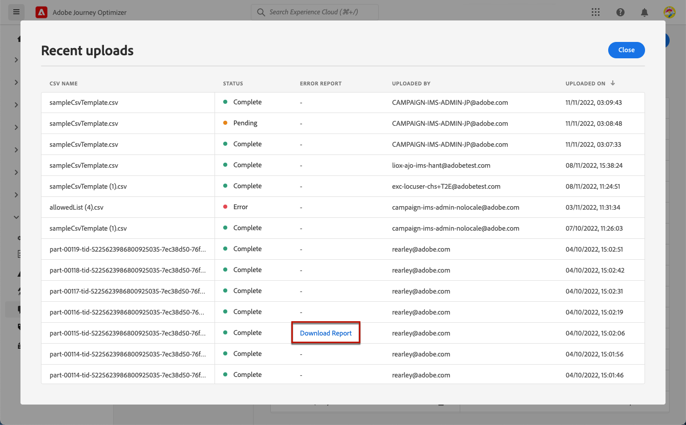
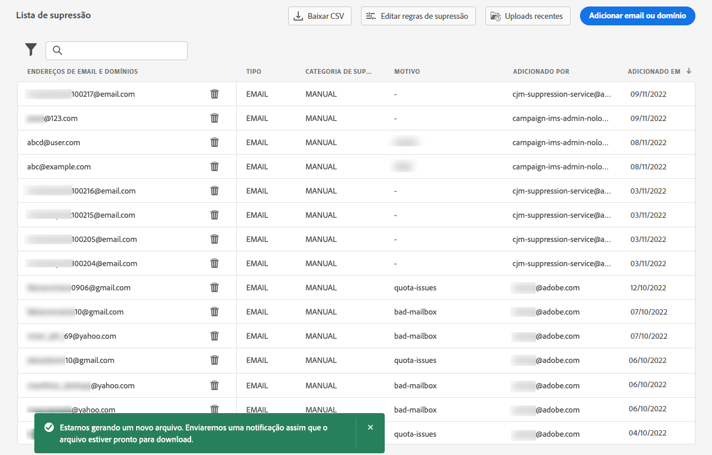
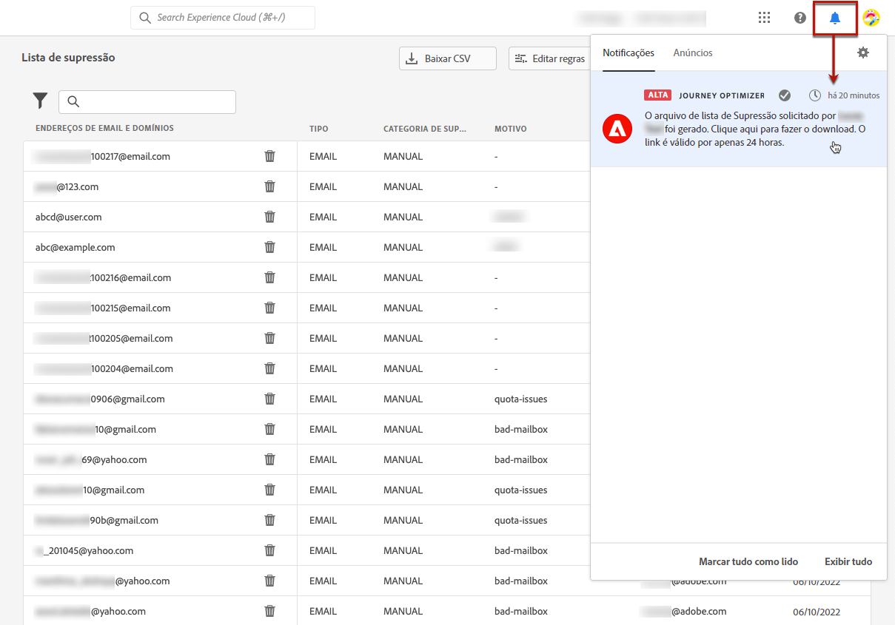

# Gerenciar a lista de supressão {#manage-suppression-list}

Com [!DNL Journey Optimizer], você pode monitorar todos os endereços de email que são excluídos automaticamente de enviarem uma jornada ou uma campanha, como rejeições permanentes, devoluções temporárias e reclamações de spam.

Esses endereços de email são coletados automaticamente na Journey Optimizer **lista de supressão**. Uma lista de supressão consiste em endereços e domínios que serão excluídos de seus públicos-alvo. Ele reúne endereços de email e domínios que são suprimidos em todas as correspondências em um único ambiente de cliente, ou seja, são específicos de uma ID da organização associada a uma ID de sandbox.

Saiba mais sobre o conceito e o uso da lista de supressão em [esta seção](../reports/suppression-list.md).


## Acessar a lista de supressão {#access-suppression-list}

Para acessar a lista detalhada de domínios e endereços de email excluídos, navegue até **[!UICONTROL Administração]** > **[!UICONTROL Canais]** > **[!UICONTROL Configuração de email]** e selecione **[!UICONTROL Lista de supressão]**.

>[!CAUTION]
>
>As permissões para visualizar, exportar e gerenciar a lista de supressão estão restritas a [Administradores do Jornada](../administration/ootb-product-profiles.md#journey-administrator). Saiba mais sobre como gerenciar [!DNL Journey Optimizer] direitos de acesso dos usuários em [esta seção](../administration/permissions-overview.md).


Os filtros estão disponíveis para ajudar você a navegar pela lista.


Você pode filtrar na variável **[!UICONTROL Categoria de supressão]**, **[!UICONTROL Tipo de endereço]** ou **[!UICONTROL Motivo]**. Selecione as opções escolhidas para cada critério. Após a seleção, é possível limpar cada filtro ou todos os filtros exibidos na parte superior da lista.


## Entender os motivos da falha {#suppression-categories-and-reasons}

Quando uma mensagem não é entregue a um endereço de email, [!DNL Journey Optimizer] determina por que o delivery falhou e associa-o a um **[!UICONTROL Categoria de supressão]**.

As categorias de supressão são as seguintes:

* **Disco rígido**: Uma rejeição permanente indica um endereço de email inválido (ou seja, um endereço de email que não existe). Isso envolve uma mensagem de devolução do servidor de email de recebimento que declara explicitamente que o endereço é inválido. O endereço de email é enviado imediatamente para a lista de supressão.

   Quando o erro é o resultado de uma reclamação de spam, ele também se enquadra no **Disco rígido** categoria . O endereço de email do recipient que emitiu a reclamação é enviado imediatamente para a lista de supressão.

* **Suave**: Uma rejeição temporária é uma rejeição temporária de email que ocorreu para um endereço de email válido. O endereço de email é adicionado à lista de supressão após várias tentativas. Erros suaves enviam um endereço para a lista de supressão quando o contador de erros atinge o limite. [Saiba mais sobre tentativas](retries.md)

* **Manual**: Erros manuais foram adicionados manualmente à lista de supressão. [Saiba mais](#add-addresses-and-domains)

Para cada endereço de email listado, você também pode verificar a variável **[!UICONTROL Tipo]** (email ou domínio), **[!UICONTROL Motivo]** para excluí-lo, quem o adicionou e a data/hora em que foi adicionado à lista de supressão.


Os possíveis motivos para uma falha de delivery são:

| Motivo | Descrição | Categoria |
| --- | --- | --- |
| **[!UICONTROL Recipient Inválido]** | O recipient é inválido ou não existe. | Grave |
| **[!UICONTROL Rejeição temporária]** | A mensagem retornou por um motivo diferente dos erros suaves listados nesta tabela, como ao enviar pela taxa permitida recomendada por um ISP. | Suave |
| **[!UICONTROL Falha de DNS]** | A mensagem retornou devido a uma falha de DNS. | Suave |
| **[!UICONTROL Caixa de entrada cheia]** | A mensagem retornou devido à caixa de entrada do recipient estar cheia e não poder aceitar mais mensagens. | Suave |
| **[!UICONTROL Retransmissão Negada]** | A mensagem foi bloqueada pelo receptor porque a retransmissão não é permitida. | Suave |
| **[!UICONTROL Resposta ao desafio]** | A mensagem é um teste de resposta a desafio. | Suave |
| **[!UICONTROL Reclamação de spam]** | A mensagem foi bloqueada porque foi marcada como spam pelo recipient. | Grave |

>[!NOTE]
>
>Usuários sem assinatura não recebem emails de [!DNL Journey Optimizer], portanto, seus endereços de email não podem ser enviados para a lista de supressão. A escolha é feita no nível do Experience Platform. [Saiba mais sobre a opção de não participação](../privacy/opt-out.md)


### Regras de supressão  {#suppression-rules}

No **[!UICONTROL Lista de supressão]** também é possível editar o parâmetro de tentativa associado às regras de supressão no **[!UICONTROL Botão Editar regras de supressão]**. Use esta opção para atualizar o limite de repetição da sandbox atual. [Saiba mais](retries.md)


## Adicionar endereços e domínios à lista de supressão{#add-addresses-and-domains}

>[!CONTEXTUALHELP]
>id="ajo_admin_suppression_list_header"
>title="Adicionar emails ou domínios à lista de supressão"
>abstract="Você pode preencher manualmente a lista de supressão do Journey Optimizer para excluir domínios e/ou endereços de email específicos do envio."

>[!CONTEXTUALHELP]
>id="ajo_admin_suppression_list"
>title="Adicionar emails ou domínios à lista de supressão"
>abstract="Para preencher a lista de supressão, é possível adicionar manualmente endereços de email ou domínios: um de cada vez ou no modo em massa por meio de um upload de arquivo CSV. Esses domínios e/ou endereços de email específicos serão excluídos do envio."

Quando uma mensagem falha ao ser entregue a um endereço de email, esse endereço é adicionado automaticamente à lista de supressão com base na regra de supressão definida ou na contagem de rejeição.

No entanto, também é possível preencher manualmente a variável [!DNL Journey Optimizer] lista de supressão para excluir domínios e/ou endereços de email específicos do seu envio.

>[!NOTE]
>
>Pode levar até 60 minutos para [!DNL Journey Optimizer] para considerar os endereços suprimidos em emails de saída.

Você pode adicionar endereços de email ou domínios [uma de cada vez](#add-one-address-or-domain)ou [no modo em massa](#upload-csv-file) por meio de um upload de arquivo CSV.

### Adicionar um endereço ou domínio {#add-one-address-or-domain}

>[!CONTEXTUALHELP]
>id="ajo_admin_suppression_list_address"
>title="Adicionar um item à lista de supressão"
>abstract="Você pode preencher a lista de supressão adicionando endereços de email e/ou domínios, um por um."

Para adicionar um endereço de email ou domínio à lista de supressão, siga as etapas abaixo:

1. Selecione o **[!UICONTROL Adicionar email ou domínio]** botão.

   

1. Escolha a **[!UICONTROL Um por um]** opção.

   

1. Selecione o tipo de endereço: **[!UICONTROL Endereço de email]** ou **[!UICONTROL Endereço do domínio]**.

1. Insira o endereço de email ou domínio que deseja excluir do envio.

   >[!NOTE]
   >
   >Certifique-se de inserir um endereço de email válido (como abc@company.com) ou domínio (como abc.company.com).

1. (opcional) Insira um motivo. Todos os caracteres de impressão ASCII compreendidos entre 32 e 126 são permitidos neste campo.

1. Use o **[!UICONTROL Enviar]** para confirmar.

### Fazer upload de um arquivo CSV {#upload-csv-file}

>[!CONTEXTUALHELP]
>id="ajo_admin_suppression_list_csv"
>title="Fazer upload do CSV para adicionar itens à lista de supressão"
>abstract="Você pode preencher a lista de supressão carregando um arquivo CSV preenchido com os endereços de email/domínios que deseja excluir."

Para adicionar um grupo de endereços de email ou domínios à lista de supressão, siga as etapas abaixo:

1. Selecione o **[!UICONTROL Adicionar email ou domínio]** botão.
1. Escolha a **[!UICONTROL Fazer upload de CSV]** opção.

   

1. Baixe o modelo CSV a ser usado, que inclui as colunas e o formato abaixo:

   ```
   TYPE,VALUE,COMMENT
   EMAIL,abc@somedomain.com,Comment
   DOMAIN,somedomain.com,Comment
   ```

1. Preencha o modelo CSV com os endereços de email e/ou domínios para adicionar à lista de supressão. Todos os caracteres de impressão ASCII compreendidos entre 32 e 126 são permitidos no **COMENTÁRIO** coluna.

   >[!CAUTION]
   >
   >Não altere o nome das colunas no modelo CSV.
   >
   >O tamanho do arquivo não deve exceder 1 MB.

1. Depois de concluído, arraste e solte seu arquivo CSV e use a **[!UICONTROL Enviar]** para confirmar.

   

Quando o upload estiver concluído, você poderá verificar seu status no [Uploads recentes](#recent-uploads) , conforme detalhado abaixo.

### Verificar status de uploads {#recent-uploads}

Use o **[!UICONTROL Uploads recentes]** para verificar o status dos arquivos CSV carregados mais recentemente.


Os status possíveis são:

* **[!UICONTROL Pending]**: O upload do arquivo está sendo processado.
* **[!UICONTROL Erro]**: O processo de upload do arquivo falhou devido a um problema técnico ou a um erro de formato de arquivo.
* **[!UICONTROL Concluído]**: O processo de upload de arquivo foi concluído com êxito.

Durante o upload, se alguns endereços não estiverem no formato correto, eles não serão adicionados ao [!DNL Journey Optimizer] lista de supressão.

Nesse caso, quando o upload é concluído, ele é associado a um relatório. Você pode baixá-lo para verificar os erros encontrados<!-- and understand why they were not added to the suppression list-->.



Abaixo está um exemplo do tipo de entradas que você pode encontrar no relatório de erro:

```
type,value,comments,failureReason
Email,examplemail.com,MANUAL,Invalid format for value: examplemail.com
Email,examplemail,MANUAL,Invalid format for value: examplemail
Email,example@mail,MANUAL,Invalid format for value: example@mail
Domain,example,MANUAL,Invalid format for value: example
Domain,example.!com,MANUAL,Invalid format for value: example.!com
Domain,!examplecom,MANUAL,Invalid format for value: !examplecom
```

## Remover um endereço da lista de supressão{#remove-from-suppression-list}

Você pode atualizar manualmente a lista de supressão. A remoção de um endereço de email da quarentena é uma operação sensível e pode afetar sua reputação de IP e taxas de deliverability. Certifique-se de prosseguir com cautela.

Ao excluir um endereço de email ou um domínio da lista de supressão, o Adobe Journey Optimizer pode iniciar novamente o delivery para esse endereço ou domínio.  Saiba mais sobre a capacidade de entrega no [esta seção](../reports/deliverability.md).

Para remover um endereço da lista de supressão, use o **[!UICONTROL Excluir]** botão.


>[!NOTE]
>
>Continue com muito cuidado ao considerar a exclusão de qualquer endereço de email ou domínio. Em caso de dúvidas, entre em contato com um especialista em capacidade de delivery.


Por exemplo, no caso de uma interrupção do Provedor de serviços de Internet (ISP), os emails são marcados incorretamente como devoluções permanentes porque não podem ser entregues com êxito ao recipient. Esses endereços de email devem ser removidos da lista de supressão.

Para fazer isso, filtre a lista de supressão para exibir os domínios ou endereços de email afetados. Por exemplo, se uma interrupção do ISP aconteceu de 11 de novembro de 2022 a 13 de novembro de 2022 no **test.com** , filtre os endereços adicionados à lista de supressão nesse período, conforme abaixo:


Também é necessário adicionar um filtro no tipo de rejeição permanente, dependendo dos detalhes da interrupção. Esses detalhes são fornecidos pelo ISP, como o código de erro exato retornado ao remetente. Por exemplo: `550 <email address> recipient rejected` ou `550 5.1.1 ‘email address’: user lookup success but no user record found`.

Depois de identificados, esses endereços podem ser removidos manualmente da lista de supressão usando o **[!UICONTROL Excluir]** botão. Esses endereços podem ser incluídos em campanhas de email futuras.

## Baixe a lista de supressão {#download-suppression-list}

<!--
>[!CONTEXTUALHELP]
>id="ajo_admin_suppression_list_download"
>title="Export the list as a CSV file"
>abstract="To download the suppression list, you can either export the current list by generating a new file, or download the file that was previously generated."
-->

Para exportar a lista de supressão como um arquivo CSV, siga as etapas abaixo:

1. Selecione o **[!UICONTROL Baixar CSV]** botão.

   

1. Aguarde até que o arquivo seja gerado.

   

   >[!NOTE]
   >
   >O tempo de download depende do tamanho do arquivo, o que significa o número de endereços que estão na lista de supressão.
   >
   >Uma solicitação de download pode ser processada de cada vez para uma determinada sandbox.

1. Depois que o arquivo for gerado, você receberá uma notificação. Clique no ícone de sino na parte superior direita da tela para exibi-lo.

1. Clique na notificação propriamente dita para baixar o arquivo.

   

   >[!NOTE]
   >
   >O link é válido por 24 horas.

<!--When downloading the CSV file, you can choose to either:

* Download the file that was previously generated by another user or yourself.

* Generate a new file in order to export the current suppression list.-->