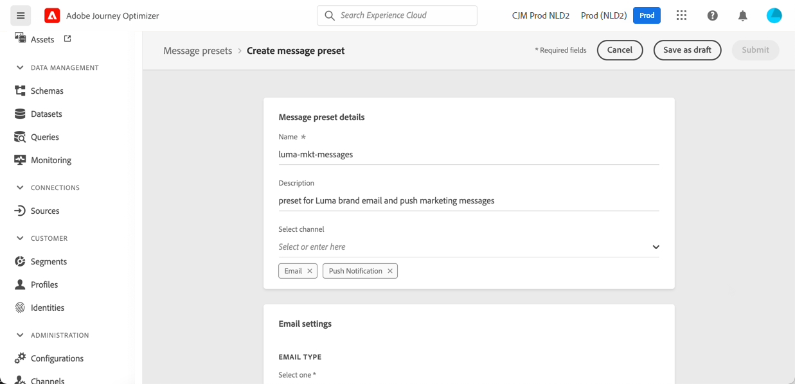
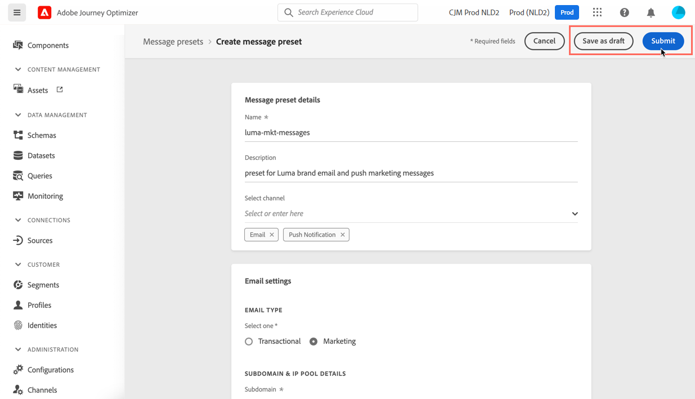

# Criar predefinições de mensagem

Com [!DNL Journey Optimizer], é possível configurar predefinições de mensagens que definem todos os parâmetros técnicos necessários para mensagens de email e de notificação por push: tipo de email, email e nome do remetente, aplicativos móveis e muito mais.

>[!CAUTION]
>
> * A configuração de predefinições de mensagens é restrita aos Administradores do Jornada. [Saiba mais](../administration/ootb-product-profiles.md#journey-administrator)
>
> * Você deve executar as etapas de configuração de Email e Push antes de criar predefinições de mensagem.

Após configurar as predefinições de mensagem, é possível selecioná-las ao criar mensagens na lista **[!UICONTROL Presets]**.

➡️ [Saiba como criar e usar predefinições de email neste vídeo](#video-presets)

## Criar uma predefinição de mensagem {#create-message-preset}

Para criar uma predefinição de mensagem, siga estas etapas:

1. Acesse o menu **[!UICONTROL Channels]** / **[!UICONTROL Message presets]** e clique em **[!UICONTROL Create Message preset]**.

   

1. Insira um nome e uma descrição (opcional) para a predefinição, em seguida, selecione os canais a serem configurados.

   

   >[!NOTE]
   >
   > Os nomes devem começar com uma letra (A-Z). Ela só pode conter caracteres alfanuméricos. Você também pode usar caracteres de sublinhado `_`, pontos`.` e hífen `-`.

1. Defina as configurações de **email**.

   

   * Selecione o tipo de mensagem que será enviada com a predefinição: **Transacional** ou **Marketing**

      >[!CAUTION]
      >
      > **** As mensagens transacionais podem ser enviadas para perfis que cancelaram a assinatura em comunicações de marketing. Essas mensagens só podem ser enviadas em contextos específicos, como redefinição de senha, status do pedido, notificação de delivery, por exemplo.

   * Selecione o subdomínio a ser usado para enviar os emails. [Saiba mais](about-subdomain-delegation.md)
   * Selecione o pool de IP a ser associado à predefinição. [Saiba mais](ip-pools.md)
   * Insira os parâmetros de cabeçalho para os emails enviados usando essa predefinição.

      >[!CAUTION]
      >
      >Exceto pelo campo **Responder para (encaminhar email)**, o domínio de endereços de email deve usar o [subdomínio delegado](about-subdomain-delegation.md) selecionado no momento.

      * **[!UICONTROL Sender name]**: Nome do remetente, como o nome da sua marca.

      * **[!UICONTROL Sender email]**: O endereço de email que deseja usar para suas comunicações. Por exemplo, se o subdomínio delegado for *marketing.luma.com*, você poderá usar *contact@marketing.luma.com*.

      * **[!UICONTROL Reply to (name)]**: O nome que será usado quando o recipient clicar no botão  **** Responder em seu software cliente de email.

      * **[!UICONTROL Reply to (email)]**: O endereço de email que será usado quando o recipient clicar no botão  **** Responder em seu software de cliente de email. Os emails enviados para esse endereço serão encaminhados para o endereço **[!UICONTROL Reply to (forward email)]** fornecido abaixo. Você deve usar um endereço definido no subdomínio delegado (por exemplo, *reply@marketing.luma.com*), caso contrário, os emails serão descartados.

      * **[!UICONTROL Reply to (forward email)]**: Todos os emails recebidos pelo  [!DNL Journey Optimizer] para o subdomínio delegado serão encaminhados para este endereço de email. Você pode especificar qualquer endereço, exceto um endereço de email definido no subdomínio delegado. Por exemplo, se o subdomínio delegado for *marketing.luma.com*, qualquer endereço como *abc@marketing.luma.com* será proibido.

      * **[!UICONTROL Error email]**: Todos os erros gerados pelos ISPs após alguns dias de envio de email (rejeições assíncronas) são recebidos neste endereço.

      

      >[!NOTE]
      >
      >Os nomes devem começar com uma letra (A-Z). Ela só pode conter caracteres alfanuméricos. Você também pode usar caracteres de sublinhado `_`, pontos`.` e hífen `-`.

   * Configure os **parâmetros de nova tentativa de email**. Por padrão, o [período de tempo de repetição](retries.md#retry-duration) é definido como 84 horas, mas você pode ajustar essa configuração para melhor atender às suas necessidades.

      

      Você deve inserir um valor inteiro (em horas ou minutos) dentro do seguinte intervalo:
      * Para o tipo de email de marketing, o período mínimo de tentativas é de 6 horas.
      * Para o tipo de email transacional, o período mínimo de nova tentativa é de 10 minutos.
      * Para ambos os tipos de email, o período máximo de tentativas é de 84 horas (ou 5040 minutos).

1. Defina as configurações de **notificação por push**.

   

   * Selecione pelo menos uma plataforma: **iOS** e/ou **Android**

   * Selecione os aplicativos móveis a serem usados para cada plataforma.

      Para obter mais informações sobre como configurar seu ambiente para enviar notificações por push, consulte [esta seção](../push-gs.md).

1. Depois que todos os parâmetros tiverem sido configurados, clique em **[!UICONTROL Submit]** para confirmar. Você também pode salvar a predefinição de mensagem como rascunho e retomar sua configuração posteriormente.

   

1. Depois que a predefinição de mensagem tiver sido criada, ela será exibida na lista com o status **[!UICONTROL Processing]**.

   Durante essa etapa, várias verificações serão executadas para verificar se foram configuradas corretamente. O tempo de processamento é de cerca de **48h-72h** e pode demorar até **7-10 dias**.

   Essas verificações incluem testes de deliverability realizados pela equipe de deliverability do Adobe:

   * Validação de SPF
   * Validação de DKIM
   * Validação de registro MX
   * Verificar IPs inclua na lista de bloqueios
   * Verificação do anfitrião
   * Verificação de pool de IPs
   * Registro A/PTR, verificação de subdomínio t/m/res

   >[!NOTE]
   >
   >Se as verificações não forem bem-sucedidas, saiba mais sobre os possíveis motivos de falha em [this section](#monitor-message-presets).

1. Depois que as verificações são bem-sucedidas, a predefinição de mensagem recebe o status **[!UICONTROL Active]** . Ele está pronto para ser usado para entregar mensagens.

   <!-- later on, users will be notified in Pulse -->

   

## Monitorar predefinições de mensagem {#monitor-message-presets}

Todas as predefinições de mensagem são exibidas no menu **[!UICONTROL Channels]** / **[!UICONTROL Message presets]**. Os filtros estão disponíveis para ajudar você a navegar pela lista (tipo de canal, usuário, status).

As predefinições de mensagem podem ter os seguintes status:

* **[!UICONTROL Draft]**: A predefinição de mensagem foi salva como rascunho e ainda não foi enviada. Abra-o para retomar a configuração.
* **[!UICONTROL Processing]**: A predefinição de mensagem foi enviada e está passando por várias etapas de verificação.
* **[!UICONTROL Active]**: A predefinição de mensagem foi verificada e pode ser selecionada para criar mensagens.
* **[!UICONTROL Failed]**: Uma ou várias verificações falharam durante a verificação da predefinição de mensagem.
* **[!UICONTROL De-activated]**: A predefinição de mensagem é desativada. Ele não pode ser usado para criar novas mensagens.

Em caso de falha na criação de uma predefinição de mensagem, os detalhes sobre cada possível motivo de falha são descritos abaixo.

Se um desses erros ocorrer, entre em contato com a [Adobe Customer Care Support Team](https://helpx.adobe.com/br/enterprise/admin-guide.html/enterprise/using/support-for-experience-cloud.ug.html){target=&quot;_blank&quot;} para obter assistência.

* **Falha** na validação do SPF: O SPF (Sender Policy Framework) é um protocolo de autenticação de email que permite especificar IPs autorizados que podem enviar emails de um determinado subdomínio. Falha na validação de SPF significa que os endereços IP no registro SPF não correspondem aos endereços IP usados para enviar emails para os provedores de caixa de correio.

* **Falha** na validação do DKIM: DKIM (DomainKeys Identified Mail) permite que o servidor do recipient verifique se a mensagem recebida foi enviada pelo remetente genuíno do domínio associado e se o conteúdo da mensagem original não foi alterado no caminho. Falha na validação DKIM significa que os servidores de email de recebimento não podem verificar a autenticidade do conteúdo da mensagem e sua associação com o domínio de envio.:

* **Falha** na validação do registro MX: Falha na validação de registro MX (Mail eXchange) significa que os servidores de email responsáveis por aceitar emails de entrada em nome de um determinado subdomínio não estão configurados corretamente.

* **Falha** nas configurações de deliverability: A falha das configurações de deliverability pode ocorrer devido a qualquer um dos seguintes motivos:
   * incluir na lista de bloqueios dos IPs alocados
   * Nome `helo` inválido
   * Emails enviados de IPs diferentes daqueles especificados no pool de IP da predefinição correspondente
   * Não é possível enviar emails para caixas de entrada dos principais ISPs, como Gmail e Yahoo

## Editar predefinições de mensagem

Para editar uma predefinição de mensagem, primeiro é necessário desativá-la para torná-la indisponível para criar novas mensagens (as mensagens publicadas usando essa predefinição não serão afetadas e continuarão funcionando). Em seguida, é necessário duplicar a predefinição de mensagem para criar uma nova versão que será usada para criar novas mensagens:

1. Acesse a lista de predefinições de mensagens e desative a predefinição de mensagens que deseja editar.

   

1. Duplique a predefinição de mensagem desativada. Uma cópia com o status **[!UICONTROL Draft]** é adicionada automaticamente à lista.

   

1. Abra a predefinição de mensagem duplicada, modifique-a de acordo com suas necessidades e envie suas alterações. A predefinição de mensagem passará pelo mesmo ciclo de validação que durante a etapa de [criação](#create-message-preset).

1. Depois de validado, ele obtém o status **[!UICONTROL Active]** e está pronto para ser usado para criar novas mensagens.

   >[!NOTE]
   >
   >As predefinições de mensagens desativadas não podem ser excluídas para evitar qualquer problema nas jornadas que usam essas predefinições para enviar mensagens.

## Vídeo tutorial{#video-presets}

Saiba como criar predefinições de mensagens, usá-las e delegar um subdomínio e criar um pool de IP.

>[!VIDEO](https://video.tv.adobe.com/v/334343?quality=12)
