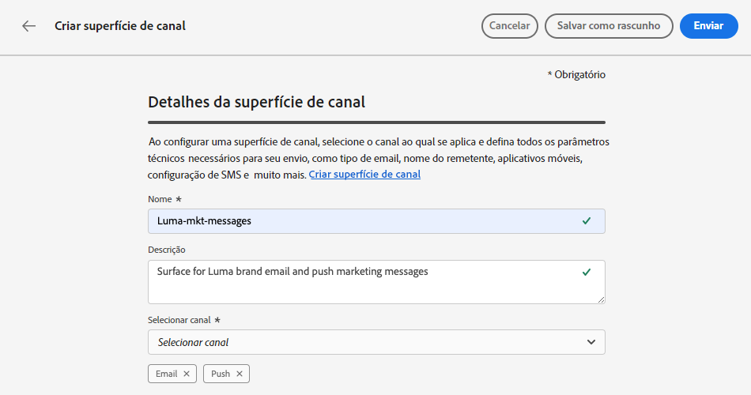
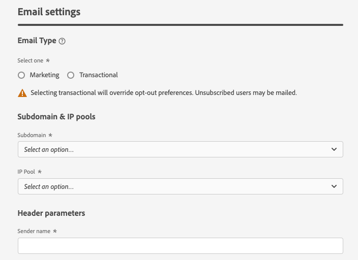
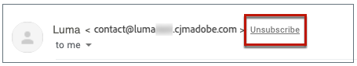

# Criar predefinições de mensagem {#message-presets-creation}

Com [!DNL Journey Optimizer], é possível configurar predefinições de mensagens que definem todos os parâmetros técnicos necessários para mensagens de email e de notificação por push: tipo de email, email e nome do remetente, aplicativos móveis e muito mais.

>[!CAUTION]
>
> * A configuração de predefinições de mensagem está restrita a [Administradores do Jornada](../administration/ootb-product-profiles.md#journey-administrator). Para criar, editar e excluir predefinições de mensagem, você deve ter a variável [Gerenciar predefinições de mensagens](../administration/high-low-permissions.md#manage-message-presets).
>
> * Você deve executar [Configuração de email](#configure-email-settings) e [Configuração por push](../configuration/push-configuration.md) etapas antes de criar predefinições de mensagem.

Depois que as predefinições de mensagem forem configuradas, você poderá selecioná-las ao criar mensagens do **[!UICONTROL Presets]** lista.

➡️ [Saiba como criar e usar predefinições de email neste vídeo](#video-presets)

## Criar uma predefinição de mensagem {#create-message-preset}

Para criar uma predefinição de mensagem, siga estas etapas:

1. Acesse o **[!UICONTROL Channels]** > **[!UICONTROL Branding]** > **[!UICONTROL Message presets]** , em seguida, clique em **[!UICONTROL Create Message preset]**.

   

1. Insira um nome e uma descrição (opcional) para a predefinição, em seguida, selecione os canais a serem configurados.

   

   >[!NOTE]
   >
   > Os nomes devem começar com uma letra (A-Z). Ela só pode conter caracteres alfanuméricos. Você também pode usar o sublinhado `_`, ponto`.` e hífen `-` caracteres.

1. Configure o **email** configurações. [Saiba mais](#configure-email-settings)

1. Configure o **notificação por push** configurações. [Saiba mais](#configure-push-settings)

   <!--Configure SMS settings. [Learn more](#configure-sms-settings) -->

1. Depois que todos os parâmetros tiverem sido configurados, clique em **[!UICONTROL Submit]** para confirmar. Você também pode salvar a predefinição de mensagem como rascunho e retomar sua configuração posteriormente.

   

1. Depois que a predefinição de mensagem tiver sido criada, ela será exibida na lista com a variável **[!UICONTROL Processing]** status.

   Durante essa etapa, várias verificações serão executadas para verificar se foram configuradas corretamente. O tempo de processamento está por vir **48h-72h** e pode **7 a 10 dias úteis**.

   Essas verificações incluem testes técnicos e de configuração realizados pela equipe de Adobe:

   * Validação de SPF
   * Validação de DKIM
   * Validação de registro MX
   * Verificar IPs inclua na lista de bloqueios
   * Verificação do anfitrião
   * Verificação de pool de IPs
   * Registro A/PTR, verificação de subdomínio t/m/res

   >[!NOTE]
   >
   >Se as verificações não forem bem-sucedidas, saiba mais sobre os possíveis motivos de falha em [esta seção](#monitor-message-presets).

1. Depois que as verificações são bem-sucedidas, a predefinição de mensagem recebe a variável **[!UICONTROL Active]** status. Ele está pronto para ser usado para entregar mensagens.

   

## Definir configurações de email {#configure-email-settings}

As configurações de email são definidas em uma seção dedicada da configuração predefinida de mensagens.

Defina as configurações conforme descrito abaixo.

### Tipo de email{#email-type}

>[!CONTEXTUALHELP]
>id="ajo_admin_presets_emailtype"
>title="Tipo de email"
>abstract="A Concluir"

No **TIPO DE EMAIL** selecione o tipo de mensagem que será enviada com a predefinição: **Marketing** ou **Transacional**.

* Choose **Marketing** para mensagens promocionais: essas mensagens exigem o consentimento do usuário.

* Choose **Transacional** para mensagens não comerciais, como confirmação de pedido, notificações de redefinição de senha ou informações de delivery, por exemplo.

When [criação de uma mensagem](../messages/get-started-content.md#create-new-message), é necessário escolher uma predefinição de mensagem válida para a categoria e o(s) canal(s) selecionados.

>[!CAUTION]
>
>**Transacional** as mensagens podem ser enviadas aos perfis que cancelaram a assinatura das comunicações de marketing. Essas mensagens só podem ser enviadas em contextos específicos.

### Subdomínio e pool IP {#subdomains-and-ip-pools}

No **DETALHES DO SUBDOMÍNIO E DO POOL IP** na seção , você deve:

1. Selecione o subdomínio a ser usado para enviar os emails. [Saiba mais](about-subdomain-delegation.md)

1. Selecione o pool de IP a ser associado à predefinição. [Saiba mais](ip-pools.md)

### List-Unsubscribe {#list-unsubscribe}

Em [selecionar um subdomínio](#subdomains-and-ip-pools) na lista, a variável **[!UICONTROL Enable List-Unsubscribe]** será exibida.

Essa opção está ativada por padrão.

Se você deixá-lo ativado, um link de cancelamento de subscrição será incluído automaticamente no cabeçalho do email, como:

Se você desativar esta opção, nenhum link de cancelamento de subscrição será exibido no cabeçalho do email.

O link de cancelamento de subscrição consiste em dois elementos:

* Um **cancelar inscrição do endereço de email**, para a qual todas as solicitações de cancelamento de subscrição são enviadas.

   Em [!DNL Journey Optimizer], o endereço de email de cancelamento de inscrição é o padrão **[!UICONTROL Mailto (unsubscribe)]** endereço exibido na predefinição de mensagem, com base no [subdomínio selecionado](#subdomains-and-ip-pools).

   

* O **cancelar inscrição do URL**, que é o URL da landing page onde o usuário será redirecionado depois de cancelado a assinatura.

   Se você adicionar um [link para opção de não participação com um clique](../messages/consent.md#one-click-opt-out) para uma mensagem criada usando essa predefinição, o URL de cancelamento de subscrição será o URL definido para o link de recusa de um clique.

   

   >[!NOTE]
   >
   >Se você não adicionar um link para opção de não participação com um clique no conteúdo da mensagem, nenhuma landing page será exibida para o usuário.

Saiba mais sobre como adicionar um link de cancelamento de subscrição de cabeçalho às suas mensagens em [esta seção](../messages/consent.md#unsubscribe-header).

<!--Select the **[!UICONTROL Custom List-Unsubscribe]** option to enter your own Unsubscribe URL and/or your own Unsubscribe email address.(to add later)-->

### Rastreamento de URL{#url-tracking}

Para identificar onde e por que uma pessoa clicou em seu link, é possível adicionar parâmetros de UTM para rastreamento de URL na  **[!UICONTROL URL TRACKING CONFIGURATION (web analytics)]** seção.

Com base nos parâmetros definidos, um código de UTM será aplicado ao final do URL incluído no conteúdo da mensagem. Você poderá comparar os resultados em uma ferramenta de análise da Web, como o Google Analytics.

Três parâmetros de UTM estão disponíveis por padrão. É possível adicionar até 10 parâmetros de rastreamento. Para adicionar um parâmetro de UTM, selecione o **[!UICONTROL Add new UTM param]** botão.

Para configurar um parâmetro de UTM, você pode inserir diretamente os valores desejados no **[!UICONTROL Name]** e **[!UICONTROL Value]** ou escolha em uma lista de valores predefinidos navegando até os seguintes objetos:

* Atributos de jornada: ID da fonte, Nome da fonte, ID da versão de origem
* Atributos da mensagem: ID da ação, Nome da ação
* Atributos do offer decisioning: ID da oferta, Nome da oferta

>[!CAUTION]
>
>Não selecione uma pasta: navegue até a pasta necessária e selecione um atributo de perfil para usar como um valor de UTM.

### Parâmetros de cabeçalho{#email-header}

No **[!UICONTROL HEADER PARAMETERS]** , insira os nomes do remetente e os endereços de email associados ao tipo de mensagens enviadas usando essa predefinição.

>[!CAUTION]
>
>Os endereços de email devem usar o [subdomínio delegado](about-subdomain-delegation.md).

* **[!UICONTROL Sender name]**: O nome do remetente, como o nome da sua marca.

* **[!UICONTROL Sender email]**: O endereço de email que deseja usar para suas comunicações. Por exemplo, se o subdomínio delegado for *marketing.luma.com*, você pode usar *contact@marketing.luma.com*.

* **[!UICONTROL Reply to (name)]**: O nome que será usado quando o recipient clicar no **Responder** no software cliente de email.

* **[!UICONTROL Reply to (email)]**: O endereço de email que será usado quando o recipient clicar no link **Responder** no software cliente de email. Você deve usar um endereço definido no subdomínio delegado (por exemplo, *reply@marketing.luma.com*), caso contrário, os emails serão descartados.

* **[!UICONTROL Error email]**: Todos os erros gerados pelos ISPs após alguns dias de envio de email (rejeições assíncronas) são recebidos neste endereço.

>[!NOTE]
>
>Os endereços devem começar com uma letra (A-Z) e só podem conter caracteres alfanuméricos. Você também pode usar o sublinhado `_`, ponto`.` e hífen `-` caracteres.

### Parâmetros de nova tentativa de email{#email-retry}

>[!CONTEXTUALHELP]
>id="ajo_admin_presets_retryperiod"
>title="Período de tempo de nova tentativa de email"
>abstract="A Concluir"

Você pode configurar o **Parâmetros de nova tentativa de email**.

Por padrão, a variável [período de tempo de nova tentativa](retries.md#retry-duration) está definida para 84 horas, mas você pode ajustar essa configuração para melhor atender às suas necessidades.

Você deve inserir um valor inteiro (em horas ou minutos) dentro do seguinte intervalo:

* Para emails de marketing, o período mínimo de nova tentativa é de 6 horas.
* Para emails transacionais, o período mínimo de nova tentativa é de 10 minutos.
* Para ambos os tipos de email, o período máximo de tentativas é de 84 horas (ou 5040 minutos).

## Definir configurações de push {#configure-push-settings}

As configurações de push são definidas em uma seção dedicada da configuração predefinida de mensagem.

Para definir as configurações de push associadas à predefinição de mensagem, siga as etapas abaixo:

1. Selecione pelo menos uma plataforma: **iOS** e/ou **Android**.

1. Selecione os aplicativos móveis a serem usados para cada plataforma.

Para obter mais informações sobre como configurar o ambiente para enviar notificações por push, consulte [esta seção](../configuration/push-gs.md).

<!--
## Configure SMS settings {#configure-sms-settings}

1. Select the **[!UICONTROL SMS Type]** that will be sent with the preset: **[!UICONTROL Transactional]** or **[!UICONTROL Marketing]**.

    
    
1. Select the **[!UICONTROL SMS configuration]** to associate with the preset.
        
    For more on how to configure your environment to send SMS messages, refer to [this section](sms-configuration.md).

1. Enter the **[!UICONTROL Sender number]** ​you want to use for your communications.
-->

## Monitorar predefinições de mensagem {#monitor-message-presets}

Todas as suas predefinições de mensagem são exibidas no **[!UICONTROL Channels]** > **[!UICONTROL Message presets]** menu. Os filtros estão disponíveis para ajudar você a navegar pela lista (tipo de canal, usuário, status).

Depois de criadas, as predefinições de mensagem podem ter os seguintes status:

* **[!UICONTROL Draft]**: A predefinição de mensagem foi salva como rascunho e ainda não foi enviada. Abra-o para retomar a configuração.
* **[!UICONTROL Processing]**: A predefinição de mensagem foi enviada e está passando por várias etapas de verificação.
* **[!UICONTROL Active]**: A predefinição de mensagem foi verificada e pode ser selecionada para criar mensagens.
* **[!UICONTROL Failed]**: Uma ou várias verificações falharam durante a verificação da predefinição de mensagem.
* **[!UICONTROL Deactivated]**: A predefinição de mensagem é desativada. Ele não pode ser usado para criar novas mensagens.

Em caso de falha na criação de uma predefinição de mensagem, os detalhes sobre cada possível motivo de falha são descritos abaixo.

Se um desses erros ocorrer, entre em contato com o [Atendimento ao cliente do Adobe](https://helpx.adobe.com/br/enterprise/admin-guide.html/enterprise/using/support-for-experience-cloud.ug.html){target=&quot;_blank&quot;} para obter assistência.

* **Falha na validação do SPF**: O SPF (Sender Policy Framework) é um protocolo de autenticação de email que permite especificar IPs autorizados que podem enviar emails de um determinado subdomínio. Falha na validação de SPF significa que os endereços IP no registro SPF não correspondem aos endereços IP usados para enviar emails para os provedores de caixa de correio.

* **Falha na validação do DKIM**: DKIM (DomainKeys Identified Mail) permite que o servidor do recipient verifique se a mensagem recebida foi enviada pelo remetente genuíno do domínio associado e se o conteúdo da mensagem original não foi alterado no caminho. Falha na validação DKIM significa que os servidores de email de recebimento não podem verificar a autenticidade do conteúdo da mensagem e sua associação com o domínio de envio.:

* **Falha na validação do registro MX**: Falha na validação de registro MX (Mail eXchange) significa que os servidores de email responsáveis por aceitar emails de entrada em nome de um determinado subdomínio não estão configurados corretamente.

* **Falha nas configurações da capacidade de entrega**: A falha das configurações de deliverability pode ocorrer devido a qualquer um dos seguintes motivos:
   * incluir na lista de bloqueios dos IPs alocados
   * Inválido `helo` name
   * Emails enviados de IPs diferentes daqueles especificados no pool de IP da predefinição correspondente
   * Não é possível enviar emails para caixas de entrada dos principais ISPs, como Gmail e Yahoo

## Editar uma predefinição de mensagem {#edit-message-preset}

Para editar uma predefinição de mensagem, siga as etapas abaixo.

>[!NOTE]
>
>Não é possível editar o **[!UICONTROL Push notification settings]**. Se uma predefinição de mensagem estiver configurada apenas para o canal de notificação por push, ela não será editável.

1. Na lista, clique em um nome predefinido de mensagem para abri-la.

   

1. Edite as propriedades conforme desejado.

   >[!NOTE]
   >
   >Se uma predefinição de mensagem tiver a variável **[!UICONTROL Active]** , o **[!UICONTROL Name]**, **[!UICONTROL Select channel]** e **[!UICONTROL Subdomain]** Os campos estão esmaecidos e não podem ser editados.

1. Clique em **[!UICONTROL Submit]** para confirmar as alterações.

   

   >[!NOTE]
   >
   >Você também pode salvar a predefinição de mensagem como rascunho e retomar a atualização posteriormente.

Depois que as alterações forem enviadas, a predefinição de mensagem passará por um ciclo de validação semelhante ao vigente quando [criação de uma predefinição](#create-message-preset).

>[!NOTE]
>
>Se você só editar a variável **[!UICONTROL Description]**, **[!UICONTROL Email type]** e/ou **[!UICONTROL Email retry parameters]** , a atualização é instantânea.

Para predefinições de mensagens com a variável **[!UICONTROL Active]** , você pode verificar os detalhes da atualização. Para fazer isso:

* Clique no botão **[!UICONTROL Recent update]** ícone que é exibido ao lado do nome da predefinição ativa.

   

* Você também pode acessar os detalhes de atualização de uma predefinição de mensagem ativa enquanto a atualização estiver em andamento.

   

No **[!UICONTROL Recent update]** você pode ver informações como o status da atualização e a lista de alterações solicitadas.

### Atualizar status {#update-statuses}

Uma atualização de predefinição de mensagem pode ter os seguintes status:

* **[!UICONTROL Processing]**: A atualização da predefinição de mensagem foi enviada e está passando por várias etapas de verificação.
* **[!UICONTROL Success]**: A predefinição de mensagem atualizada foi verificada e pode ser selecionada para criar mensagens.
* **[!UICONTROL Failed]**: Uma ou várias verificações falharam durante a verificação de atualização predefinida de mensagem.

Cada status é detalhado abaixo.

### Processamento

Várias verificações de deliverability serão executadas para verificar se a predefinição foi atualizada corretamente.

>[!NOTE]
>
>Se você só editar a variável **[!UICONTROL Description]**, **[!UICONTROL Email type]** e/ou **[!UICONTROL Email retry parameters]** , a atualização é instantânea.

O tempo de processamento está por vir **48h-72h** e pode **7 a 10 dias úteis**. Saiba mais sobre as verificações realizadas durante o ciclo de validação em [esta seção](#create-message-preset).

Se você editar uma predefinição que já estava ativa:

* O seu estatuto permanece **[!UICONTROL Active]** enquanto o processo de validação estiver em andamento.

* O **[!UICONTROL Recent update]** ícone é exibido ao lado do nome da predefinição na lista de predefinições de mensagem.

* Durante o processo de validação, as mensagens configuradas usando essa predefinição ainda usam a versão mais antiga da predefinição.

>[!NOTE]
>
>Não é possível modificar uma predefinição de mensagem enquanto a atualização estiver em andamento. Ainda é possível clicar no nome, mas todos os campos estão esmaecidos. As alterações não serão refletidas até que a atualização seja bem-sucedida.

### Sucesso {#success}

Depois que o processo de validação for bem-sucedido, a nova versão da predefinição será usada automaticamente em todas as mensagens usando essa predefinição. No entanto, pode ser necessário aguardar:
* alguns minutos antes de ser consumido pelas mensagens unitárias,
* até o próximo lote para que a predefinição seja efetiva nas mensagens em lote.

### Falha {#failed}

Se o processo de validação falhar, a versão mais antiga da predefinição ainda será usada.

Saiba mais sobre os possíveis motivos de falha em [esta seção](#monitor-message-presets).

Quando a atualização falhar, a predefinição poderá ser editada novamente. Você pode clicar no nome e atualizar as configurações que precisam ser corrigidas.

## Desativar uma predefinição de mensagem {#deactivate-preset}

Para criar uma **[!UICONTROL Active]** não disponível para criar novas mensagens, você pode desativá-la. No entanto, as mensagens publicadas usando essa predefinição não serão afetadas e continuarão funcionando.

>[!NOTE]
>
>Não é possível desativar uma predefinição de mensagem durante o processamento de uma atualização. Aguarde até que a atualização seja bem-sucedida ou tenha falhado. Saiba mais sobre [edição de predefinições de mensagens](#edit-message-preset) e no [status de atualização](#update-statuses).

1. Acesse a lista de predefinições de mensagens.

1. Para obter a predefinição ativa de sua escolha, clique no botão **[!UICONTROL More actions]** botão.

1. Selecione **[!UICONTROL Deactivate]**.

   

>[!NOTE]
>
>As predefinições de mensagens desativadas não podem ser excluídas para evitar qualquer problema no jornada usando essas predefinições para enviar mensagens.

Não é possível editar diretamente uma predefinição de mensagem desativada. No entanto, você pode duplicá-lo e editar a cópia para criar uma nova versão que será usada para criar novas mensagens. Também é possível ativá-la novamente e aguardar até que a atualização seja bem-sucedida na edição.

## Vídeo tutorial{#video-presets}

Saiba como criar predefinições de mensagens, usá-las e delegar um subdomínio e criar um pool de IP.

>[!VIDEO](https://video.tv.adobe.com/v/334343?quality=12)
