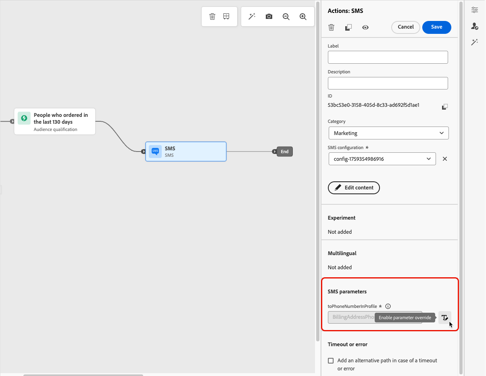

# Alterar os endereços de execução {#change-primary-email}

>[!CONTEXTUALHELP]
>id="ajo_admin_execution_address"
>title="Definir qual endereço usar"
>abstract="Quando vários endereços de email ou números de telefone estão disponíveis no banco de dados (pessoal, profissional etc.), você pode escolher qual deles priorizar para envio."

>[!CONTEXTUALHELP]
>id="ajo_admin_execution_address_header"
>title="Definir qual endereço usar"
>abstract="Edite os campos usados para determinar o endereço de email ou número de telefone dos perfis para priorizar o envio."

Ao direcionar um perfil, vários endereços de email ou números de telefone podem estar disponíveis no banco de dados (endereço de email profissional, número de telefone pessoal etc.).

Nesse caso, [!DNL Journey Optimizer] usos **[!UICONTROL Campos de execução]** para determinar qual endereço de email ou número de telefone usar no serviço de perfil em prioridade.

Para verificar os campos que são usados por padrão, acesse o **[!UICONTROL Administração]** > **[!UICONTROL Canais]** > **[!UICONTROL Geral]** > **[!UICONTROL Campos de execuções]** menu.

Os valores atuais são usados para todos os deliveries no nível da sandbox. Você pode atualizar esses campos, se necessário.

Na maioria dos casos, você alterará um campo de execução globalmente e definirá um valor que deve ser usado para todas as mensagens de email ou SMS. <!--[Learn how](#admin-settings)-->

<!--In some specific use cases only, you can override the value set globally and define a different value at the journey level. [Learn more](#journey-parameters)-->

## Atualizar as configurações de Administração {#admin-settings}

Para alterar os campos de execução globalmente no nível da sandbox, siga as etapas abaixo.

1. Acesse o  **[!UICONTROL Canais]** > **[!UICONTROL Geral]** > **[!UICONTROL Campos de execuções]** menu.

1. Clique em **[!UICONTROL Editar]** para alterar os valores padrão.

   

1. Clique no campo atual de sua escolha ou no ícone de edição para selecionar um novo campo.

   

1. A lista de campos XDM do tipo email disponíveis é exibida. Selecione o campo a ser usado.

   

1. Clique em **[!UICONTROL Salvar]** para confirmar sua escolha.

O campo de execução é atualizado e agora será usado como o endereço principal.

<!--1. You can also select an additional field to use as secondary email address. This allows you to determine which field to use if the primary field is empty for a profile. -->

## Substituir um valor nos parâmetros de jornada {#journey-parameters}

Somente para casos de uso específicos, é possível substituir o conjunto de campos de execução globalmente e definir um valor diferente no nível da jornada, especialmente para o canal de email.

Ao adicionar uma **[!UICONTROL E-mail]** ação para um [jornada](../email/create-email.md#create-email-journey-campaign), o endereço de email principal é exibido nos parâmetros avançados do jornada.

Em alguns contextos específicos, é possível substituir esse valor usando o **[!UICONTROL Habilitar substituição de parâmetro]** ícone à direita do **[!UICONTROL endereço]** campo.

>[!CAUTION]
>
>A substituição de endereço de email deve ser usada somente para casos de uso específicos. Na maioria das vezes, não é necessário alterar o endereço de email, pois o valor definido como o endereço principal nos **[!UICONTROL Campos de execução]** é o que deve ser usado.

Substituir esse valor pode ser útil, por exemplo, para:

* Teste um email. É possível adicionar seu próprio endereço de email: depois de publicar a jornada, o email será enviado para você.
* Enviar um email aos assinantes de uma lista. Saiba mais [neste caso de uso](../building-journeys/message-to-subscribers-uc.md).
