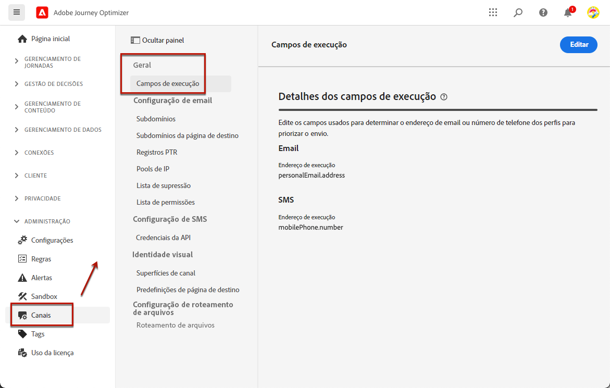
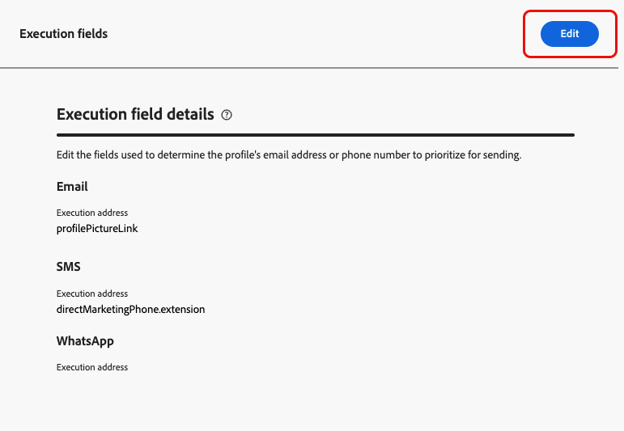

# Alterar os endereços principais {#change-primary-email}

>[!CONTEXTUALHELP]
>id="ajo_admin_execution_address"
>title="Definir qual endereço usar"
>abstract="Quando vários endereços estão disponíveis no banco de dados (pessoal, profissional etc.), você pode escolher qual endereço priorizar para envio."

Ao direcionar um perfil, vários endereços de email ou números de telefone podem estar disponíveis no banco de dados (endereço de email profissional, número de telefone pessoal etc.).

Com [!DNL Journey Optimizer], você pode determinar qual endereço de email ou número de telefone usar no serviço de perfil e priorizar quando vários endereços estiverem disponíveis. Para fazer isso, siga as etapas abaixo.

1. Acesse o  **[!UICONTROL Canais]** > **[!UICONTROL Geral]** > **[!UICONTROL Campos de execuções]** menu.

   

1. Os campos que são usados atualmente por padrão para determinar o endereço de email e o número de telefone dos perfis são exibidos nessa tela. Clique em **[!UICONTROL Editar]** para alterá-las.

   

1. Clique no campo atual de sua escolha ou no ícone de edição para selecionar um novo campo.

   

1. A lista de campos XDM do tipo de email disponíveis é exibida. Selecione o campo a ser usado.

   

1. Clique em **[!UICONTROL Salvar]** para confirmar sua escolha.

O campo de execução é atualizado e agora será usado como o endereço principal.

<!--1. You can also select an additional field to use as secondary email address. This allows you to determine which field to use if the primary field is empty for a profile. -->
