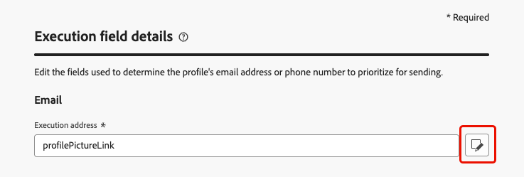

# Alterar os endereços de execução {#change-primary-email}

>[!CONTEXTUALHELP]
>id="ajo_admin_execution_address"
>title="Definir qual endereço usar"
>abstract="Quando vários endereços de email ou números de telefone estão disponíveis no banco de dados (pessoal, profissional etc.), você pode escolher qual deles priorizar para envio."

>[!CONTEXTUALHELP]
>id="ajo_admin_execution_address_header"
>title="Definir qual endereço usar"
>abstract="Edite os campos usados para determinar o endereço de email ou número de telefone dos perfis para priorizar o envio."

Ao direcionar um perfil, vários endereços de email ou números de telefone podem estar disponíveis no banco de dados (endereço de email profissional, número de telefone pessoal etc.).

Nesse caso, [!DNL Journey Optimizer] usa **[!UICONTROL Campos de execução]** para determinar qual endereço de email ou número de telefone usar do serviço de perfil em prioridade.

Para verificar os campos que são usados por padrão no momento, acesse o menu **[!UICONTROL Administração]** > **[!UICONTROL Canais]** > **[!UICONTROL Configurações gerais]** > **[!UICONTROL Campos de execuções]**.

{width=90%}

>[!NOTE]
>
>Os campos de execução estão disponíveis para os canais de email, SMS e WhatsApp.

Os valores atuais são usados para todos os deliveries no nível da sandbox. Você pode atualizar esses campos, se necessário.

Na maioria dos casos, você alterará um campo de execução globalmente e definirá um valor que deve ser usado para todas as mensagens de email, SMS ou WhatsApp.

## Atualizar as configurações de Administração {#admin-settings}

Para alterar os campos de execução globalmente no nível da sandbox, siga as etapas abaixo.

1. Acesse o menu **[!UICONTROL Canais]** > **[!UICONTROL Configurações gerais]** > **[!UICONTROL Campos de execuções]**.

1. Clique em **[!UICONTROL Editar]** para alterar os valores padrão.

   {width=70%}

1. Clique no campo atual de sua escolha ou no ícone de edição para selecionar um novo campo.

   {width=70%}

1. A lista de campos XDM do tipo email disponíveis é exibida. Selecione o campo a ser usado.

   {width=90%}

1. Clique em **[!UICONTROL Salvar]** para confirmar sua escolha.

O campo de execução é atualizado e agora será usado como o endereço principal.

<!--1. You can also select an additional field to use as secondary email address. This allows you to determine which field to use if the primary field is empty for a profile. -->

## Substitua o campo de execução padrão nos parâmetros de jornada {#override-execution-address-journey}

>[!CONTEXTUALHELP]
>id="ajo_journey_execution_address"
>title="Definir um valor personalizado"
>abstract="Em alguns casos específicos, é possível substituir o endereço de execução padrão. Use o ícone **Habilitar substituição de parâmetro** à direita do campo para definir um endereço principal personalizado."
>additional-url="https://experienceleague.adobe.com/pt-br/docs/journey-optimizer/using/configuration/primary-email-addresses#journey-parameters" text="Sobre o endereço de execução"

Para casos de uso específicos, é possível substituir o conjunto de campos de execução globalmente e definir um valor diferente no nível da jornada.

Substituir esse valor pode ser útil, por exemplo, para:

* Teste o delivery. Você pode adicionar seu próprio endereço de email ou número de telefone: depois de publicar a jornada, o email, SMS ou mensagem de WhatsApp é enviado para você.
* Enviar uma mensagem aos assinantes de uma lista. Saiba mais [neste caso de uso](../building-journeys/message-to-subscribers-uc.md).

Ao adicionar uma ação de **[!UICONTROL Email]**, **[!UICONTROL SMS]** ou **[!UICONTROL WhatsApp]** a uma [jornada](../email/create-email.md#create-email), o endereço de email ou número de telefone principal é exibido nos parâmetros avançados de jornada.

Substitua esse valor usando o ícone **[!UICONTROL Habilitar substituição de parâmetro]** à direita do campo.

{width=85%}

>[!CAUTION]
>
>A substituição de endereço de email ou número de telefone deve ser usada somente para casos de uso específicos. Na maioria das vezes, não é necessário alterá-lo, pois o valor definido como o endereço principal nos **[!UICONTROL Campos de execução]** no nível da sandbox é o que deve ser usado.

## Substituir o campo de execução padrão na configuração do canal {#override-execution-address-channel-config}

>[!CONTEXTUALHELP]
>id="ajo_email_config_execution_address"
>title="Substituir o endereço de execução padrão a ser usado"
>abstract="Quando vários endereços de email ou números de telefone estiverem disponíveis no banco de dados (pessoal, profissional etc.), você poderá escolher qual deles priorizar para envio. O endereço principal é definido no nível da sandbox, mas aqui você pode substituir a configuração padrão para essa configuração de canal específica."

Você pode alterar o endereço de execução padrão de uma [configuração de canal](channel-surfaces.md) de email, SMS ou WhatsApp específica.

Para fazer isso, vá para a seção **[!UICONTROL Execution dimension]** e edite o campo dedicado em **[!UICONTROL Execution Address]**.

>[!NOTE]
>
>Para o [canal do WhatsApp](../whatsapp/whatsapp-configuration.md#whatsapp-configuration), o **[!UICONTROL Campo de Execução do WhatsApp]** está na seção **[!UICONTROL Configurações do WhatsApp]**.

{width=85%}

Em seguida, selecione um item na lista de campos XDM do tipo email disponíveis.

O campo de execução é atualizado e, em seguida, usado como o endereço principal das campanhas ou jornadas que usam essa configuração de canal. Ele substitui a [configuração geral](#admin-settings) definida no nível da sandbox.

<!--[Learn more on the execution address in the email configuration ](../email/email-settings.md#execution-address)-->
