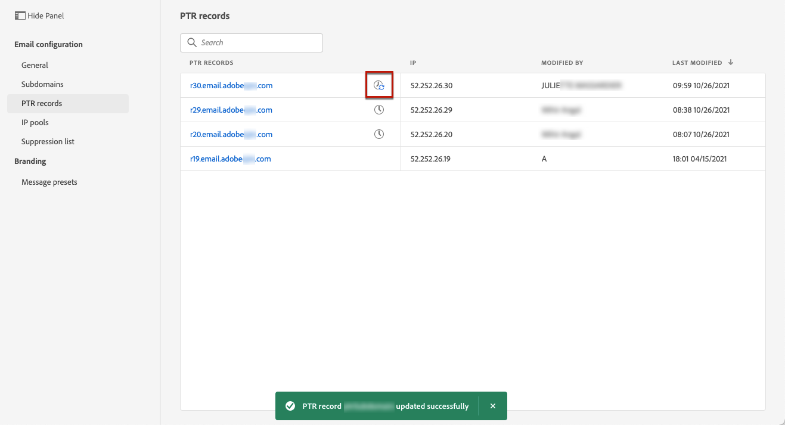
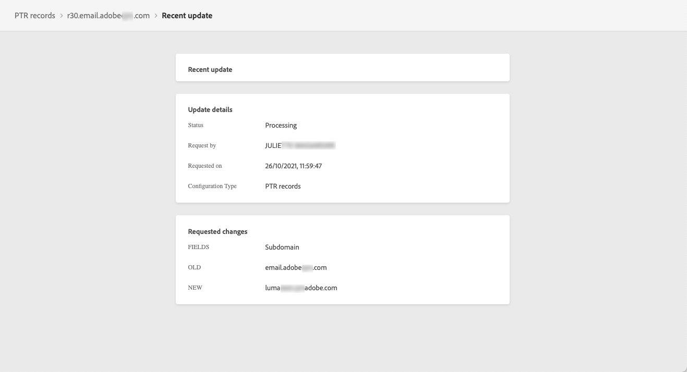

# Registros PTR

## Sobre registros PTR

Um registro de ponteiro (PTR) é um tipo de registro de Sistema de Nome de Domínio (DNS) que fornece o nome de domínio vinculado a um endereço IP.

Com registros PTR, os servidores de email de recebimento podem verificar a autenticidade do envio dos servidores de email identificando se seus endereços IP correspondem aos nomes com os quais os servidores se conectam.

## Acesse os registros PTR dos subdomínios

Depois que um subdomínio é delegado no Adobe Journey Optimizer, um registro PTR é criado automaticamente e associado a esse subdomínio. Você pode acessá-lo pelo **[!UICONTROL Channels]** > **[!UICONTROL Email configuration]** > **[!UICONTROL PTR records]** menu.

A lista mostra os registros PTR gerados para cada subdomínio delegado, usando a sintaxe abaixo:

* &quot;r&quot; para registro,
* &quot;xx&quot; para os dois últimos algarismos do endereço IP,
* nome do subdomínio.

Você pode abrir um registro PTR na lista para exibir o nome do subdomínio associado e o endereço IP.

## Editar um registro PTR {#edit-ptr-record}

Você pode modificar um registro PTR para editar o subdomínio associado a um endereço IP.

1. Na lista, clique em um nome de registro PTR para abri-lo.

   

1. Edite o subdomínio conforme desejado.

   

   >[!NOTE]
   >
   >Não é possível modificar o **[!UICONTROL IP]** e **[!UICONTROL PTR record]** campos.

1. Clique em **[!UICONTROL SAve]** para confirmar as alterações.

Um **[!UICONTROL Updating]** ícone é exibido ao lado do nome do registro PTR na lista.

Para verificar os detalhes de atualização do registro PTR, clique no botão **[!UICONTROL Updating]** ou **[!UICONTROL Recent updates]** ícone .

Você pode ver informações como o status da atualização e as alterações solicitadas.

## Atualizar status

Uma atualização de registro PTR pode ter os seguintes status:

* **[!UICONTROL Processing]**: A atualização do registro PTR foi enviada e está passando por um processo de verificação.
* **[!UICONTROL Success]**: O registro PTR atualizado foi verificado e o novo subdomínio agora está associado ao endereço IP.
* **[!UICONTROL Failed]**: Uma ou várias verificações falharam durante a verificação de atualização de registro PTR.

### Processamento

Várias verificações de deliverability serão executadas para verificar se o novo subdomínio a ser associado ao endereço IP é válido. <!--The processing time is around **48h-72h**, and can take up to **7-10 days**. Learn more on the checks performed during the validation cycle in [this section](#create-message-preset).-->

>[!NOTE]
>
>Não é possível modificar um registro PTR enquanto a atualização estiver em curso. Você ainda pode clicar no nome, mas a variável **[!UICONTROL Subdomain]** está acinzentado. As alterações não serão refletidas até que a atualização seja bem-sucedida.

Durante o processo de validação, o subdomínio antigo ainda estará associado ao endereço IP.

### Sucesso

Depois que o processo de validação for bem-sucedido, o novo subdomínio será associado automaticamente ao endereço IP.

### Falha

Se o processo de validação falhar, o registro PTR mais antigo será exibido. O subdomínio válido que foi associado anteriormente ao endereço IP permanece inalterado.

Os possíveis tipos de erro de atualização são os seguintes:
* Falha ao criar um novo DNS de encaminhamento para o registro PTR
* Falha ao atualizar o registro
* Falha na reintegração das afinidades

Quando a atualização falhar, o registro PTR poderá ser editado novamente. Você pode clicar em seu nome e atualizar o subdomínio novamente.
