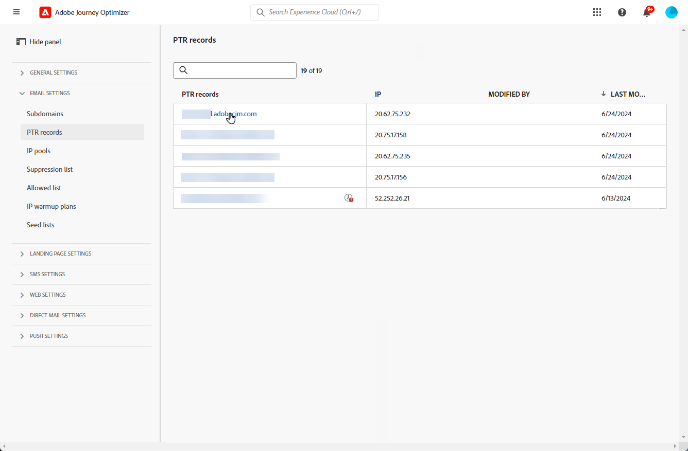

# Registros PTR {#ptr-records}

>[!CONTEXTUALHELP]
>id="ajo_admin_ptr_record"
>title="Registros PTR de subdomínios"
>abstract="Um registro de ponteiro (PTR) é um tipo de registro DNS que fornece o nome de domínio vinculado a um endereço IP, o que ajuda os servidores de email de recebimento a verificar os endereços IP dos remetentes. Edite um registro de PTR somente após considerações e discussões apropriadas com seu especialista em capacidade de entrega."

>[!CONTEXTUALHELP]
>id="ajo_admin_ptr_record_header"
>title="Registros PTR de subdomínios"
>abstract="Depois que um subdomínio é delegado à Adobe no Journey Optimizer, um registro PTR é criado automaticamente e associado a esse subdomínio."

## Sobre registros PTR {#about-ptr-records}

Um registro de ponteiro (PTR) é um tipo de registro DNS (Domain Name System) que fornece o nome do domínio vinculado a um endereço IP.

Com os registros PTR, os servidores de email de recebimento podem verificar a autenticidade dos servidores de email de envio, identificando se seus endereços IP correspondem aos nomes aos quais os servidores se conectam.

## Acessar os registros PTR de subdomínios {#access-ptr-records}

Uma vez [um subdomínio é delegado](delegate-subdomain.md) no Adobe Journey Optimizer, um registro PTR é criado e associado automaticamente a esse subdomínio. Você pode acessá-lo pelo **[!UICONTROL Administração]** > **[!UICONTROL Canais]** > **[!UICONTROL Configuração de email]** > **[!UICONTROL Registros PTR]** menu.

A lista mostra os registros PTR gerados para cada subdomínio delegado, usando a sintaxe abaixo:

* &quot;r&quot; para registro,
* &quot;xx&quot; para os dois últimos algarismos do endereço IP,
* nome do subdomínio.

É possível abrir um registro PTR na lista para exibir o nome do subdomínio e o endereço IP associados.

## Editar um registro PTR {#edit-ptr-record}

Você pode modificar um registro PTR para editar o subdomínio associado a um endereço IP.

>[!CAUTION]
>
>Os registros PTR são comuns a todos os ambientes. Portanto, qualquer modificação em um registro PTR também afetará as sandboxes de produção.
>
>Continue com muito cuidado ao editar registros PTR. Em caso de dúvidas, entre em contato com um especialista em capacidade de delivery.

### Subdomínios totalmente delegados {#fully-delegated-subdomains}

Para editar um registro PTR com um subdomínio que esteja [totalmente delegado](delegate-subdomain.md#full-subdomain-delegation) para Adobe, siga as etapas abaixo.

1. Na lista, clique em um nome de registro PTR para abri-lo.

   

1. Selecionar um subdomínio [totalmente delegado](delegate-subdomain.md#full-subdomain-delegation) para Adobe da lista.

   

1. Clique em **[!UICONTROL Salvar]** para confirmar as alterações.

>[!NOTE]
>
>Não é possível modificar a variável **[!UICONTROL IP]** e **[!UICONTROL Registro PTR]** campos.

### Subdomínios delegados usando o método CNAME {#edit-ptr-subdomains-cname}

Para editar um registro PTR com um subdomínio que é delegado a Adobe usando o [método CNAME](delegate-subdomain.md#cname-subdomain-delegation), siga as etapas abaixo.

1. Na lista, clique em um nome de registro PTR para abri-lo.

   

1. Selecione um subdomínio delegado ao Adobe usando o [método CNAME](delegate-subdomain.md#cname-subdomain-delegation) da lista.

   

1. É necessário criar um novo registro DNS de encaminhamento na plataforma de hospedagem. Para fazer isso, copie o registro gerado pelo Adobe. Depois de concluído, marque a caixa &quot;I confirm...&quot;.

   

   >[!NOTE]
   >
   >Se você receber esta mensagem: &quot;Crie o DNS de encaminhamento primeiro e tente novamente&quot;, siga as etapas abaixo:
   >   * Verifique no provedor de DNS se o registro de DNS de encaminhamento foi criado com êxito.
   >   * Os registros no DNS podem não ser sincronizados imediatamente. Aguarde alguns minutos e tente novamente.

1. Clique em **[!UICONTROL Salvar]** para confirmar as alterações.

>[!NOTE]
>
>Não é possível modificar a variável **[!UICONTROL IP]** e **[!UICONTROL Registro PTR]** campos.

## Verificar detalhes de atualização do registro PTR {#check-ptr-record-update}

Depois de confirmar a edição do registro PTR, a variável **[!UICONTROL Processando]** O ícone é exibido ao lado do nome do registro PTR na lista.

>[!NOTE]
>
>A variável [processamento de atualização](#processing) O pode levar até 3 horas.

Para verificar os detalhes de atualização do registro PTR, clique no ícone ao lado dele. Saiba mais sobre os status associados aos diferentes ícones no [nesta seção](#ptr-record-update-statuses).

Você pode ver informações como o status da atualização e as alterações solicitadas.

## Status de atualização do registro PTR {#ptr-record-update-statuses}

Uma atualização de registro PTR pode ter os seguintes status:

*  **[!UICONTROL Processando]**: a atualização do registro PTR foi enviada e está passando por um processo de verificação.
*  **[!UICONTROL Sucesso]**: o registro PTR atualizado foi verificado e o novo subdomínio agora está associado ao endereço IP.
*  **[!UICONTROL Failed]**: uma ou várias verificações falharam durante a verificação de atualização do registro PTR.

### Processamento {#processing}

Várias verificações de entrega serão realizadas para verificar se o novo subdomínio a ser associado ao endereço IP é válido. Isso pode levar até 3 horas.

>[!NOTE]
>
>Não é possível modificar um registro PTR enquanto a atualização estiver em andamento. Você ainda pode clicar no nome, mas a variável **[!UICONTROL Subdomínio]** está esmaecido. As alterações não serão refletidas até que a atualização seja bem-sucedida.

Durante o processo de validação, o subdomínio antigo ainda é associado ao endereço IP.

### Sucesso {#success}

Depois que o processo de validação for bem-sucedido, o novo subdomínio será associado automaticamente ao endereço IP.

### Falha {#failes}

Se o processo de validação falhar, o registro PTR mais antigo será exibido. O subdomínio válido que foi associado anteriormente ao endereço IP permanece inalterado.

Os possíveis tipos de erro de atualização são os seguintes:
* Falha ao criar um novo DNS de encaminhamento para o registro PTR
* Falha ao atualizar o registro
* Falha ao reintegrar as afinidades

Se a atualização falhar, o registro PTR se tornará editável novamente. Você pode clicar no nome e atualizar o subdomínio novamente.
