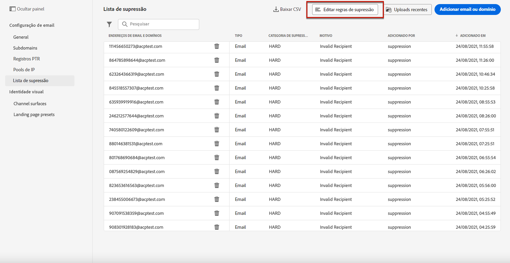

# Tentativas {#retries}

Quando uma mensagem de email falha devido a um evento temporário **Rejeição suave** , várias tentativas são executadas. Cada erro incrementa um contador de erros. Quando esse contador atinge o limite, o endereço é adicionado à lista de supressão.

>[!NOTE]
>
>Saiba mais sobre os tipos de erros no [Tipos de falha de delivery](../reports/suppression-list.md#delivery-failures) seção.

Na configuração padrão, o limite é definido como 5 erros.

* Para o mesmo delivery, no quinto erro encontrado no [período de tempo de nova tentativa](#retry-duration), o endereço é suprimido.

* Se houver diferentes deliveries e dois erros ocorrerem pelo menos em 24 horas de intervalo, o contador de erros será incrementado a cada erro e o endereço também será suprimido na quinta tentativa.

Se um delivery for bem-sucedido após uma tentativa, o contador de erros do endereço será reinicializado.

Caso o valor padrão de 5 não atenda às suas necessidades, você poderá modificar o limite de erro seguindo as etapas abaixo.

1. Vá para **[!UICONTROL Channels]** > **[!UICONTROL Email configuration]** > **[!UICONTROL Suppression list]**.

1. Selecione o botão **[!UICONTROL Edit suppression rules]**.

   

1. Edite o número permitido de devoluções temporárias consecutivas de acordo com suas necessidades.

   

   Você deve inserir um valor inteiro entre 1 e 20, o que significa que o número mínimo de tentativas é 1 e o número máximo é 20.

   >[!CAUTION]
   >
   >Qualquer valor maior que 10 pode causar problemas de reputação de entrega, bem como limitação de IP ou  de incluir na lista de bloqueios por ISPs. [Saiba mais sobre a capacidade de entrega](../reports/deliverability.md)

## Período de repetição {#retry-duration}

O **período de tempo de nova tentativa** é o período no qual qualquer mensagem de email do delivery que encontrou um erro temporário ou uma rejeição temporária será repetida.

Por padrão, as tentativas serão executadas para **3,5 dias** ou **84 horas**) a partir do momento em que a mensagem foi adicionada à fila de email.

No entanto, para garantir que as tentativas de repetição não sejam mais executadas quando não forem mais necessárias, é possível alterar essa configuração de acordo com suas necessidades ao criar ou editar uma [superfície do canal](channel-surfaces.md) (ou seja, predefinição de mensagem) aplicável ao canal de email.

Por exemplo, você pode definir o período de nova tentativa como 24 horas para um email transacional relacionado à redefinição de senha e contendo um link válido por apenas um dia. Da mesma forma, para uma venda à meia-noite, você pode definir um período de repetição de 6 horas.

>[!NOTE]
>
>O período de repetição não pode exceder 84 horas. O período mínimo de tentativas é de 6 horas para emails de marketing e 10 minutos para emails transacionais.

Saiba como ajustar os parâmetros de repetição de email ao criar uma superfície de canal em [esta seção](channel-surfaces.md#create-channel-surface).

