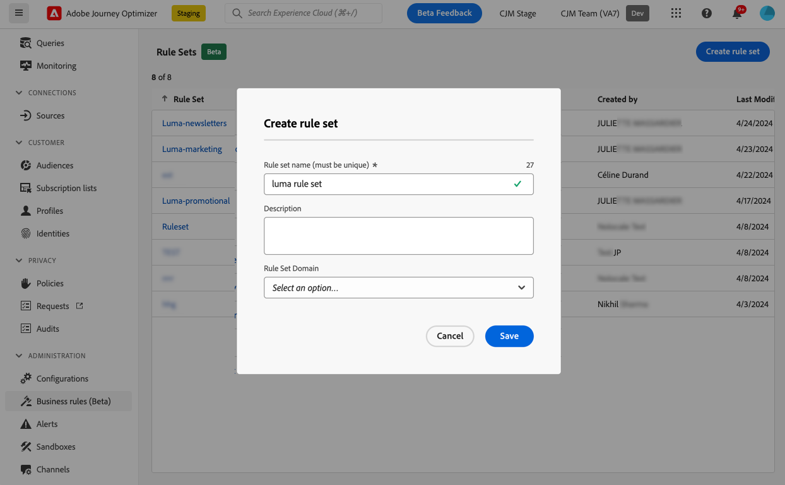
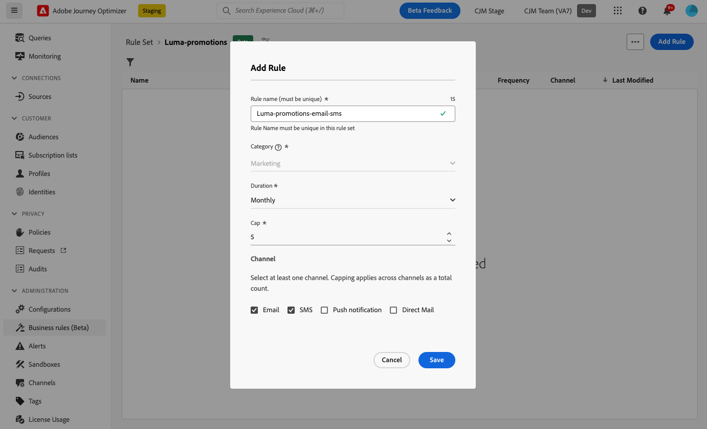

# Trabalhar com conjuntos de regras {#rule-sets}

>[!CONTEXTUALHELP]
>id="ajo_business_rules_rule_sets"
>title="Conjuntos de regras"
>abstract="Use conjuntos de regras para aplicar limites de frequência a diferentes tipos de comunicações de marketing. Por exemplo, é possível criar um conjunto de regras para limitar o número de **comunicações promocionais** enviadas a clientes e outro conjunto de regras para limitar o número de **informativos** enviados."

>[!AVAILABILITY]
>
>Os conjuntos de regras estão atualmente disponíveis em Disponibilidade limitada para um grupo selecionado de clientes. Observe que esse recurso será gradualmente implementado para mais usuários no futuro. Entre em contato com a equipe de conta, se estiver interessado em ser adicionado à lista de espera.

## Introdução aos conjuntos de regras {#gs}

### O que são conjuntos de regras? {#what}

Além das regras de negócios globais que restringem o número de vezes que os usuários recebem mensagens em um ou vários canais, os conjuntos de regras permitem **agrupar várias regras em conjuntos de regras** e aplicá-las às campanhas de sua escolha. Isso oferece maior granularidade para controlar a frequência com que os usuários receberão uma mensagem, dependendo do tipo de comunicação.

Por exemplo, você pode criar um conjunto de regras para limitar o número de **comunicações promocionais** enviadas aos seus clientes e outro conjunto de regras para limitar o número de **boletins informativos** enviados a eles. Dependendo do tipo de campanha que está sendo criada, você pode optar por aplicar a comunicação promocional ou o conjunto de regras de boletins informativos.

➡️ [Descubra este recurso no vídeo](#video)

### Conjuntos de regras globais e personalizadas {#global-custom}

Ao acessar conjuntos de regras pela primeira vez no menu **[!UICONTROL Administração]** > **[!UICONTROL Regras de negócio (Beta)]**, um conjunto de regras padrão é pré-criado e ativo: **Conjunto de Regras Padrão Global**.

Esse conjunto de regras contém regras globais que podem ser aplicadas para controlar a frequência com que os usuários recebem mensagens em um ou vários canais, de modo semelhante a como as regras de negócios atuais operam. Todas as regras definidas nesse conjunto de regras se aplicam a todos os canais selecionados, independentemente de as comunicações serem enviadas de uma jornada ou campanha. [Saiba como trabalhar com regras de negócios](frequency-rules.md)

Além desse conjunto de regras &quot;Conjunto de regras padrão global&quot;, você pode criar **conjuntos de regras personalizados** que podem ser aplicados a qualquer campanha para restringir o número de mensagens enviadas nessa campanha. [Saiba como criar conjuntos de regras personalizados](#create)

>[!IMPORTANT]
>
>Por enquanto, conjuntos de regras personalizados podem ser aplicados somente a **campanhas**. Somente as regras definidas no conjunto de regras &quot;Conjunto de regras padrão global&quot; se aplicam às comunicações do jornada e das campanhas.

### Regras de limite de canal e jornadas {#domain}

Ao criar um conjunto de regras, é necessário especificar se as regras no conjunto de regras aplicarão regras de limite específicas para canais de comunicação ou jornadas.  Isso é feito selecionando um Canal ou domínio do Jornada para o conjunto de regras ao criá-lo. [Saiba como criar um conjunto de regras](#create)

* Domínio **Channel**: aplique regras de limitação para canais de comunicação. Por exemplo, não envie mais de 1 comunicação por email ou SMS por dia.
* Domínio **Jornada**: aplique regras de limite de entrada e simultaneidade a uma jornada. Por exemplo, não insira perfis em mais de uma jornada simultaneamente.

## Criar seu primeiro conjunto de regras personalizado {#create-rule-set}

### Crie o conjunto de regras e selecione seu domínio {#create}

Para criar um conjunto de regras, siga as etapas abaixo.

>[!NOTE]
>
>É possível criar até 3 conjuntos de regras personalizados.

1. Acesse a lista **[!UICONTROL Conjuntos de regras]** e clique em **[!UICONTROL Criar conjunto de regras]**.

   

1. Defina um nome exclusivo para o conjunto de regras e adicione uma descrição.

1. Selecione o domínio do conjunto de regras. O domínio permite especificar se o conjunto de regras conterá regras de limitação específicas para canais de comunicação ou jornadas:

   * **Canal**: aplique regras de limitação para canais de comunicação. Por exemplo, não envie mais de 1 comunicação por email ou SMS por dia.
   * **Jornada**: aplique regras de limite de entrada e simultaneidade a uma jornada. Por exemplo, não insira perfis em mais de uma jornada simultaneamente.

   

1. Clique em **[!UICONTROL Salvar]**.

1. Agora você pode [definir as regras](#create-new-rule) que deseja adicionar a este conjunto de regras.

### Adicionar regras ao conjunto de regras {#create-new-rule}

>[!CONTEXTUALHELP]
>id="ajo_rule_sets_category"
>title="Selecionar a categoria da regra da mensagem"
>abstract="Quando ativadas e aplicadas a uma mensagem, todas as regras de frequência correspondentes à categoria selecionada serão automaticamente aplicadas a essa mensagem. Atualmente, somente a categoria Marketing está disponível."

>[!CONTEXTUALHELP]
>id="ajo_rule_sets_capping"
>title="Definir o limite para a regra"
>abstract="Especifique o número máximo de mensagens enviadas a um perfil de cliente no intervalo de tempo escolhido. O limite de frequência será baseado no período do calendário selecionado e redefinido no início do intervalo de tempo correspondente."

>[!CONTEXTUALHELP]
>id="ajo_rule_sets_channel"
>title="Definir os canais aos quais a regra se aplica"
>abstract="Selecione pelo menos um canal. O limite se aplica em canais como uma contagem total."

>[!CONTEXTUALHELP]
>id="ajo_rule_sets_duration"
>title="Selecionar a categoria da regra da mensagem"
>abstract="Quando ativadas e aplicadas a uma mensagem, todas as regras de frequência correspondentes à categoria selecionada serão automaticamente aplicadas a essa mensagem. Atualmente, somente a categoria Marketing está disponível."

Para adicionar uma regra a um conjunto de regras, acesse o conjunto e clique em **[!UICONTROL Adicionar regra]**.

Os parâmetros disponíveis para a regra dependem do domínio do conjunto de regras selecionado em sua criação.

+++Configurar regras de limitação de canal (domínio **Canal**)

1. Defina um nome exclusivo para a regra.

1. O campo **Categoria** especifica a categoria da mensagem à qual a regra se aplica. Por enquanto, este campo é somente leitura, pois somente a categoria **[!UICONTROL Marketing]** está disponível.

1. Na lista suspensa **[!UICONTROL Duração]**, selecione se deseja que o limite seja aplicado mensalmente, semanalmente ou diariamente. O limite de frequência se baseia no período de calendário selecionado. Ela é redefinida no início do intervalo de tempo correspondente.

   

   O prazo de validade do contador para cada período é o seguinte:

   * **[!UICONTROL Mensal]**: o limite de frequência é válido até o último dia do mês às 23:59:59 UTC. Por exemplo, a expiração mensal de janeiro é 01-31 23:59:59 UTC.

   * **[!UICONTROL Semanalmente]**: o limite de frequência é válido até sábado, 23:59:59 UTC dessa semana, pois a semana do calendário começa no domingo. A expiração ocorre independentemente da criação da regra. Por exemplo, se a regra for criada na quinta-feira, ela será válida até o sábado às 23:59:59.

   * **[!UICONTROL Diariamente]**: o limite de frequência diário é válido para o dia até 23:59:59 UTC e é redefinido como 0 no início do dia seguinte.

     >[!CAUTION]
     >
     >Para garantir a precisão das regras diárias de limite de frequência, o uso de [segmentação por transmissão](https://experienceleague.adobe.com/docs/experience-platform/segmentation/ui/streaming-segmentation.html){target="_blank"} é obrigatório. Saiba mais sobre os métodos de avaliação de público-alvo em [esta seção](../audience/about-audiences.md#evaluation-method-in-journey-optimizer).

   Observe que o valor do contador de perfil é atualizado assim que a comunicação é entregue. Esteja ciente disso ao enviar grandes volumes de comunicações, pois a taxa de transferência pode resultar no recebimento do email em minutos ou até horas após o início da comunicação (caso você esteja enviando milhões de comunicações simultaneamente).

   Isso é importante no caso de um recipient receber duas comunicações próximas. Sugerimos espaçar as comunicações em pelo menos duas horas, sempre que possível, para dar tempo suficiente para que o recipient receba a comunicação e o valor do contador para atualizar de acordo.

1. Defina o limite para sua regra, o que significa o número máximo de mensagens que podem ser enviadas para um perfil de usuário individual a cada mês, semana ou dia, de acordo com sua seleção acima.

1. Selecione o canal que deseja usar para esta regra: **[!UICONTROL Email]**, **[!UICONTROL SMS]**, **[!UICONTROL Notificação por push]** ou **[!UICONTROL Correspondência direta]**.

   >[!NOTE]
   >
   >Você deve selecionar pelo menos um canal para criar a regra.

1. Selecione vários canais se desejar aplicar o limite em todos os canais selecionados como uma contagem total.

   Por exemplo, defina o limite como 5 e selecione os canais de email e de sms. Se um perfil já tiver recebido três emails de marketing e dois sms de marketing para o período selecionado, esse perfil será excluído do próximo delivery de qualquer email ou sms de marketing.

+++

+++Configurar regras de limitação de jornada (**Jornada** domínio)

1. Forneça um nome exclusivo para a regra.

1. Na lista suspensa **[!UICONTROL Tipo de Regra]**, especifique o tipo de limite para a regra.

   * **[!UICONTROL Limite de Entrada de Jornada]**: Limita o número de entradas na jornada em um determinado período para um perfil.
   * **[!UICONTROL Limite de Simultaneidade de Jornada]**: Limita quantas jornadas um perfil pode ser inscrito simultaneamente.

1. Informações detalhadas sobre como configurar regras de limite de jornada estão disponíveis na seção [Limite de Jornada e arbitragem](../conflict-prioritization/journey-capping.md).

+++

1. Clique em **[!UICONTROL Salvar]** para confirmar a criação da regra. Sua mensagem foi adicionada ao conjunto de regras, com o status **[!UICONTROL Rascunho]**.

   

1. Repita as etapas acima para adicionar quantas regras forem necessárias ao conjunto de regras.

Agora é necessário ativar cada regra antes de aplicá-la a qualquer mensagem. [Saiba mais](#activate-rule)

### Ativar as regras e o conjunto de regras {#activate-rule}

Quando criada, uma regra tem o status **[!UICONTROL Rascunho]** e ainda não está afetando nenhuma mensagem. Para habilitá-lo, clique no botão **[!UICONTROL Mais ações]** ao lado da regra e selecione **[!UICONTROL Ativar]**.

Você também deve ativar o conjunto de regras para acessá-lo em campanhas/jornadas e aplicá-lo às suas mensagens.

>[!NOTE]
>
>Pode levar até 10 minutos para que uma regra ou um conjunto de regras seja totalmente ativado. Não é necessário modificar mensagens ou republicar jornadas para que uma regra entre em vigor.

<!--Currently, once a rule set is activated, no more rules can be added to that rule set.-->

Para desativar uma regra ou um conjunto de regras, clique no botão **[!UICONTROL Mais ações]** ao lado do item desejado e selecione **[!UICONTROL Desativar]**.

Seu status será alterado para **[!UICONTROL Inativo]** e a regra não se aplicará a futuras execuções de mensagem. As mensagens em execução no momento não serão afetadas.

>[!NOTE]
>
>A desativação de uma regra ou conjunto de regras não afeta ou redefine qualquer contagem em perfis individuais.

## Acessar e gerenciar conjuntos de regras {#access-rule-sets}

Todos os conjuntos de regras criados são exibidos no menu **[!UICONTROL Administração]** > **[!UICONTROL Regras de negócio (Beta)]**. Eles são classificados por data da última modificação.

Clique no nome de um conjunto de regras para exibir e editar seu conteúdo. Todas as regras incluídas nesse conjunto de regras são listadas. O menu contextual na parte superior direita permite:

* Editar o nome e a descrição do conjunto de regras
* Ativar o conjunto de regras - [saiba mais](#activate-rule)
* Excluir o conjunto de regras

Para cada regra no conjunto de regras, o botão **[!UICONTROL Mais ações]** permite:

* Editar a regra
* Ativar a regra [saiba mais](#activate-rule)
* Excluir a regra

<!--### Permissions{#permissions-frequency-rules}

To access, create, edit or delete message frequency rules, you must have the **[!UICONTROL Manage frequency rules]** permission. 

Users with the **[!UICONTROL View frequency rules]** permission are able to view rules, but not to modify or delete them.

Learn more about permissions in [this section](../administration/high-low-permissions.md).-->

## Aplicar conjuntos de regras a uma mensagem ou jornada {#apply-frequency-rule}

É possível aplicar um conjunto de regras a uma mensagem ou jornada, dependendo do domínio selecionado ao criar o conjunto de regras. Expanda as seções abaixo para obter mais informações.

+++ Aplicar um conjunto de regras a uma mensagem

1. Ao criar uma [campanha](../campaigns/create-campaign.md), selecione um dos canais definidos para o conjunto de regras e edite o conteúdo da sua mensagem.

1. Na tela de edição de conteúdo, clique no botão **[!UICONTROL Adicionar Regra de Negócios]**.

1. Selecione o [conjunto de regras criado](#create-rule-set).

   

   >[!NOTE]
   >
   >Somente conjuntos de regras [ativados](#activate-rule) são exibidos na lista.

   <!--Messages where the category selected is **[!UICONTROL Transactional]** will not be evaluated against business rules.-->

1. Antes de ativar sua campanha, certifique-se de agendar a execução pelo menos 10 minutos no futuro.

   Isso permite tempo suficiente para preencher os valores do contador no perfil da regra de negócios selecionada. Se você ativar a campanha imediatamente, os valores do contador do conjunto de regras não serão preenchidos nos perfis dos recipients e a mensagem não será contada em relação às regras de limite de frequência para os conjuntos de regras personalizados.

   

1. Você pode ver o número de perfis excluídos da entrega no [relatório de Customer Journey Analytics](../reports/report-gs-cja.md) e no [relatório ao vivo](../reports/live-report.md), em que as regras de frequência serão listadas como um possível motivo para os usuários excluídos da entrega.

>[!NOTE]
>
>Várias regras podem ser aplicadas ao mesmo canal, mas quando o limite inferior for atingido, o perfil será excluído dos próximos deliveries.

<!--
## Example: combine several rules {#frequency-rule-example}

You can combine several message frequency rules, such as described in the example below.

1. [Create a rule](#create-new-rule) called *Overall Marketing Capping*:

   * Select all channels.
   * Set capping to 12 monthly.

   

1. To further restrict the number of marketing-based push notifications that a user is sent, create a second rule called *Push Marketing Cap*:

   * Select Push channel.
   * Set capping to 4 monthly.

   

1. Save and [activate](#activate-rule) the rule.

1. [Create a message](../building-journeys/journeys-message.md) for every channel you want to communicate through and select the **[!UICONTROL Marketing]** category for each message. [Learn how to apply a frequency rule](#apply-frequency-rule)

   

In this scenario, an individual profile:
* can receive up to 12 marketing messages per month;
* but will be excluded from marketing push notifications after they have received 4 push notifications.-->

Ao testar as regras de frequência, é recomendável usar um [perfil de teste](../audience/creating-test-profiles.md) recém-criado, pois, quando o limite de frequência de um perfil é atingido, não há como redefinir o contador até o próximo período. A desativação de uma regra permitirá que perfis limitados recebam mensagens, mas não removerá nem excluirá incrementos de contador.

+++

+++ Aplicar um conjunto de regras a uma jornada

Para aplicar uma regra de limitação a uma jornada, acesse a jornada e abra suas propriedades. No menu suspenso **[!UICONTROL Regras de limitação]**, selecione o conjunto de regras relevante.

>[!IMPORTANT]
>
>Se uma jornada for ativada imediatamente, pode levar até 15 minutos para que o sistema comece a suprimir clientes. Você pode agendar sua jornada para começar pelo menos 15 minutos no futuro para evitar essa possibilidade.

+++

## Vídeo tutorial {#video}

>[!VIDEO](https://video.tv.adobe.com/v/3435531?quality=12)
