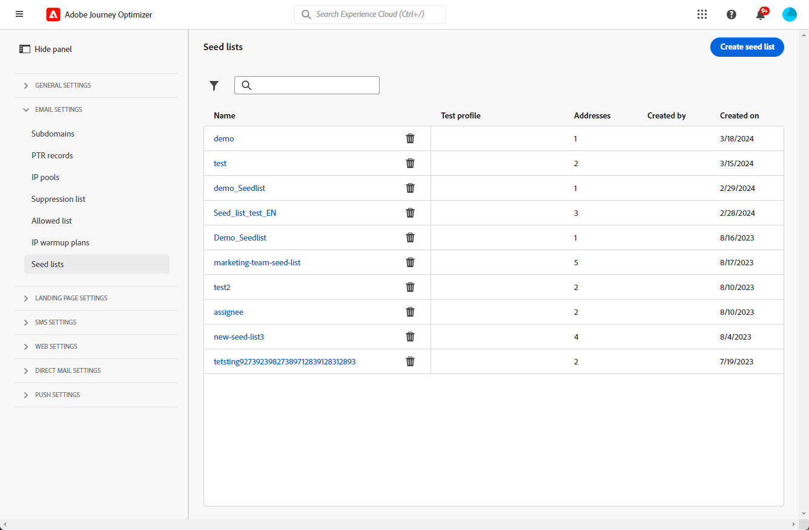

# Usar listas de seeds {#seed-lists}

As listas de seeds em [!DNL Journey Optimizer] permitem que você inclua automaticamente seed addresses específicos em seus deliveries.

>[!CAUTION]
>
>Atualmente, esse recurso se aplica somente ao canal de email.

Seed addresses são usados para direcionar destinatários que não correspondem aos critérios de destino definidos. Dessa forma, os destinatários que estiverem fora do escopo de entrega podem recebê-lo, como qualquer outro destinatário target receberia.

Os seed addresses não são perfis reais nem perfis de teste, pois não incluem detalhes do perfil. São apenas recipients pertencentes a participantes internos armazenados no sistema. Quando selecionados em uma campanha ou jornada específica, eles são incluídos no tempo de execução do delivery, o que significa que receberão uma cópia do delivery para fins de garantia.

* Ao receber deliveries ao mesmo tempo e nas mesmas condições que seus clientes, as seed lists permitem monitorar as cópias de email enviadas para garantir que todos os formatos de exibição, imagens e links estejam corretos, além de acompanhar as mensagens reais enviadas aos seus destinatários.

  Por exemplo:

+++ Se você for um gerente de marketing:

  Você deseja que todos os membros da equipe recebam cópias das mensagens enviadas ao mesmo tempo que os clientes. Dessa forma, sua equipe pode garantir que as mensagens sejam enviadas com o layout esperado, URLs ativos, texto e imagens corretos - tudo conforme planejado antes da execução.

+++

+++ Se você for um proprietário de produto:

  Você precisa rastrear as mensagens reais enviadas aos clientes. Na verdade, sua equipe e liderança podem estar interessadas em algumas campanhas e precisam ser adicionadas em uma base ad hoc para receber cópias da mensagem no momento do delivery.

+++

* Outro motivo para usar seed lists é a proteção da sua lista de endereçamento. Inserir seed addresses em sua lista de mala direta permite que você seja notado, se ela estiver sendo usada por um terceiro, pois esses seed addresses receberão as entregas enviadas à sua lista de mala direta.

>[!NOTE]
>
>As variantes são compatíveis, incluindo variantes multilíngues e de experimentação. Cada seed address recebe uma única cópia de cada variante da mesma mensagem, por exemplo, versões diferentes de um [experimento de conteúdo](../content-management/get-started-experiment.md). Observe que emails de seed separados não são enviados para conteúdo condicional.

## Acessar as listas de propagação {#access-seed-lists}

Para acessar as listas de propagação já criadas, vá para **[!UICONTROL Administração]** > **[!UICONTROL Canais]** > **[!UICONTROL Configurações de email]** e selecione **[!UICONTROL Lista de propagação]**.

<!--
>[!CAUTION]
>
>Permissions to view, export and manage the seed lists are restricted to [Journey Administrators](../administration/ootb-product-profiles.md#journey-administrator). Learn more about managing [!DNL Journey Optimizer] users' access rights in [this section](../administration/permissions-overview.md).-->

>[!CAUTION]
>
>Para exibir, editar e gerenciar listas de propagação, você deve ter a permissão **[!UICONTROL Gerenciar Lista de Propagação]**.

Você pode pesquisar seed lists por nome e/ou filtrar pelo usuário que criou a lista ou pela data de criação. Depois de selecionado, é possível limpar o filtro exibido na parte superior da lista.

Use o botão **[!UICONTROL Excluir]** para remover permanentemente uma entrada.

>[!CAUTION]
>
>Não é possível excluir uma lista de propagação usada em uma [campanha](../campaigns/review-activate-campaign.md) ou [jornada](../building-journeys/publishing-the-journey.md) ativa. Você precisa desativar a campanha/jornada ou editá-la para usar outra configuração que não tenha a lista de propagação selecionada. [Saiba mais sobre como usar uma lista de propagação](#use-seed-list)

Você pode clicar no nome de uma lista de propagação para editá-la. <!--Use the **[!UICONTROL Edit]** button to edit a seed list.-->

## Criar uma lista de sementes {#create-seed-list}

>[!CONTEXTUALHELP]
>id="ajo_seed_list_details"
>title="Definir uma lista de sementes"
>abstract="Use uma lista de sementes para adicionar automaticamente endereços internos específicos ao público-alvo da entrega para fins de garantia. As listas de sementes permitem monitorar as cópias das mensagens enviadas para garantir que todos os elementos de exibição estejam corretos e proteger sua lista de mala direta. Atualmente, esse recurso se aplica somente ao canal de email."
>additional-url="https://experienceleague.adobe.com/docs/journey-optimizer/using/configuration/seed-lists.html?lang=pt-BR#use-seed-list" text="O que são listas de seeds?"

>[!CONTEXTUALHELP]
>id="ajo_seed_addresses"
>title="Preenchimento da lista de sementes"
>abstract="Selecione os endereços que serão incluídos na execução da entrega e que receberão uma cópia exata da mensagem. É possível importar um arquivo CSV ou inserir manualmente endereços de email."

Para criar uma lista de propagação, siga as etapas abaixo.

1. Acesse o menu **[!UICONTROL Administração]** > **[!UICONTROL Canais]** > **[!UICONTROL Configurações de email]** > **[!UICONTROL Lista de propagação]**.

1. Selecione o botão **[!UICONTROL Criar lista de propagação]**.

   <!---->

1. Preencha os detalhes. Comece adicionando um nome.

   

   >[!NOTE]
   >
   >Os nomes devem começar com uma letra (A-Z) e incluir apenas caracteres alfanuméricos ou caracteres especiais ( _, ., -).

1. Selecione o canal. Atualmente, somente o canal de email está disponível.

1. Selecione um perfil de teste. Como os seed addresses não incluem detalhes do perfil, esse perfil de teste será usado apenas para exibir os dados de personalização na mensagem enviada aos seed addresses.

   >[!NOTE]
   >
   >Somente um perfil de teste pode ser selecionado por vez.

1. Adicione os seed addresses para os quais deseja enviar seus deliveries. É possível importar um arquivo CSV ou inserir manualmente endereços de email.

   

   >[!NOTE]
   >
   >Você pode combinar ambas as opções, mas o número total de endereços em uma lista de propagação não pode exceder 300.

1. Clique em **[!UICONTROL Criar]** para confirmar. A lista de propagação recém-criada é exibida na [tela Lista de propagação](#access-seed-lists).

## Usar uma lista de propagação em uma campanha ou jornada {#use-seed-list}

Agora que sua lista de seeds foi criada, você pode usá-la em qualquer campanha ou jornada para incluir os seed addresses correspondentes nos deliveries. Para isso, siga as etapas abaixo.

>[!CAUTION]
>
>As mensagens enviadas para seed addresses não são incluídas nos relatórios do jornada ou da campanha.

1. Crie uma configuração e selecione o canal **[!UICONTROL Email]**. [Saiba mais](../email/email-settings.md)

1. Selecione a lista de propagação de sua escolha na [seção correspondente](../email/email-settings.md#seed-list).

   >[!NOTE]
   >
   >Só é possível selecionar uma lista de seeds por vez.

   

1. Envie a configuração.

1. Crie uma [campanha](../campaigns/create-campaign.md) ou uma [jornada](../building-journeys/journey-gs.md).

1. Selecione a ação **[!UICONTROL Email]** e selecione a [configuração](channel-surfaces.md), incluindo a lista de propagação que é relevante para você.

   

1. Ative sua [campanha](../campaigns/review-activate-campaign.md) ou publique sua [jornada](../building-journeys/publishing-the-journey.md).

Agora, sempre que uma mensagem de email for enviada aos seus clientes por meio dessa campanha ou jornada, os endereços de email na seed list selecionada também a receberão nas mesmas condições, ao mesmo tempo e com o mesmo conteúdo que os recipients direcionados.

>[!NOTE]
>
>Para jornadas recorrentes, o delivery de email é enviado aos seed addresses em cada execução de jornada, desde que pelo menos um perfil chegue ao nó de email.
