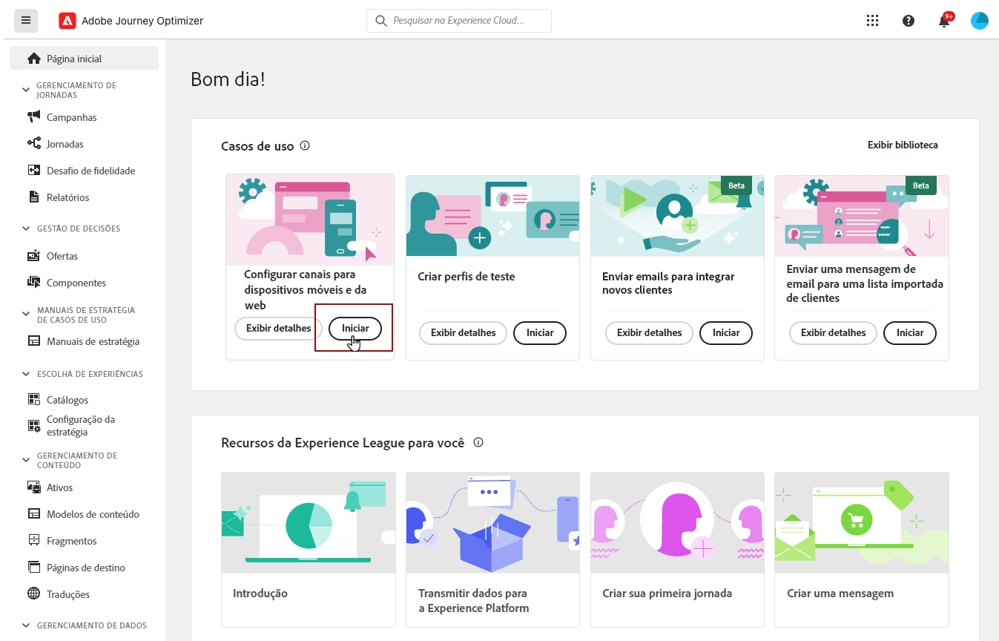
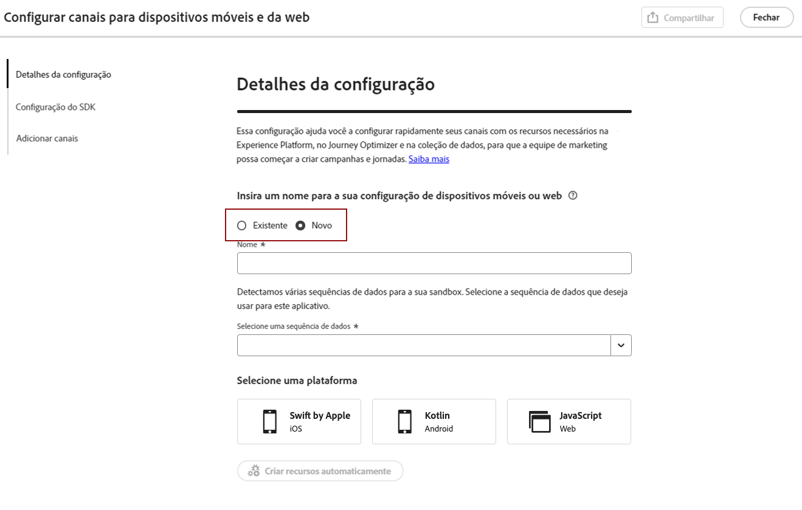
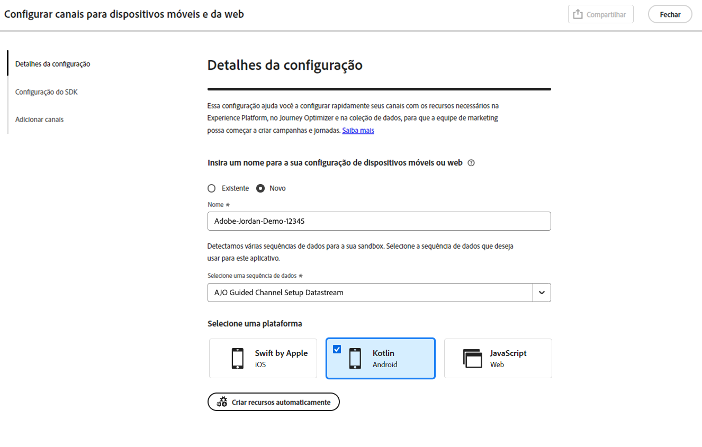
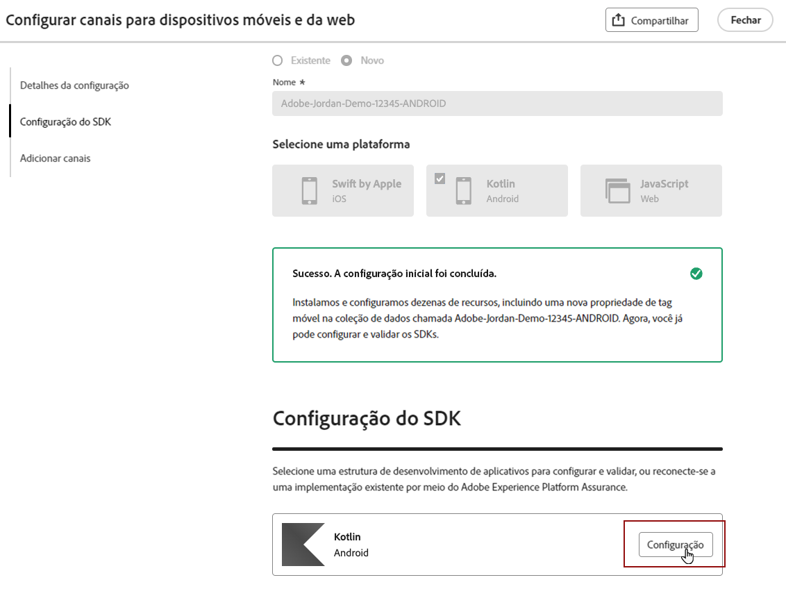
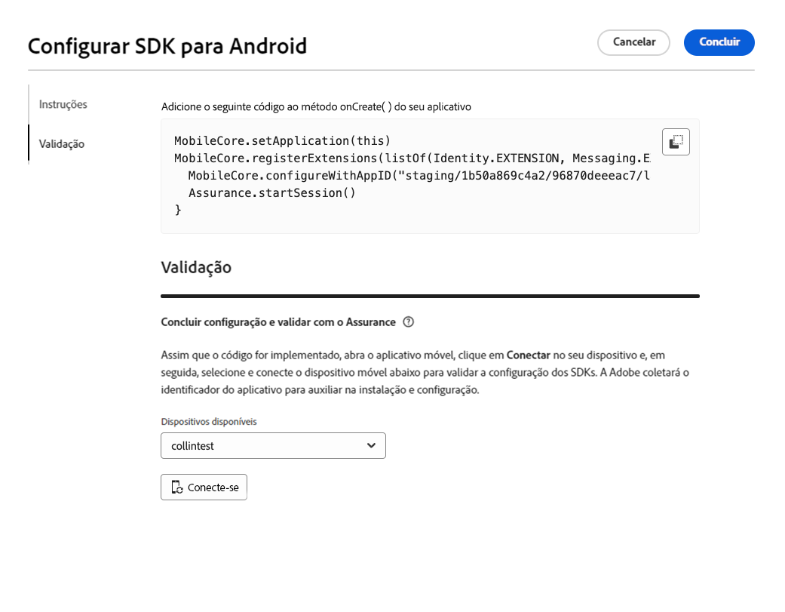
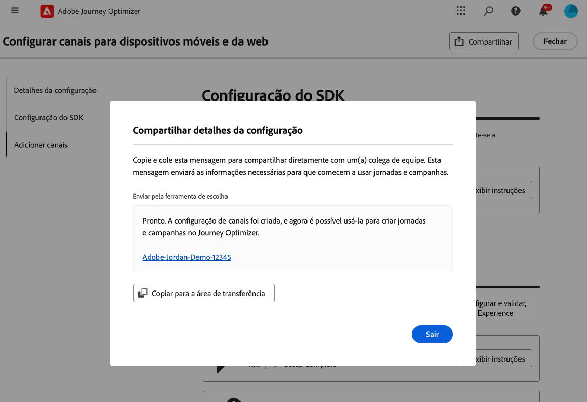
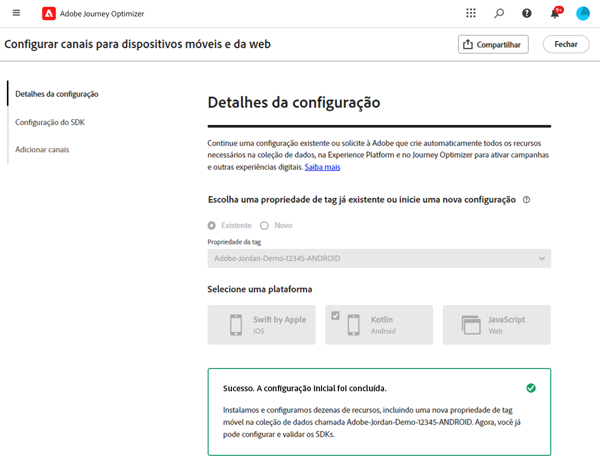

# Definir a configuração móvel do Android {#set-mobile-android}

>[!IMPORTANT]
>
>Para garantir compatibilidade e desempenho ideal, use as seguintes versões do SDK:
>
> * Core 3.1.0 ou posterior
> * Mensagens 3.1.0 ou posteriores

Essa configuração do Android simplifica a configuração rápida de canais de marketing, garantindo que todos os recursos necessários sejam facilmente acessíveis nos aplicativos Experience Platform, Journey Optimizer e Coleção de dados. Isso permite que sua equipe de marketing comece imediatamente a criar campanhas e jornadas.

## Criar uma nova configuração do Android {#new-setup-android}

>[!CONTEXTUALHELP]
>id="ajo_mobile_web_setup_android_initialization_code"
>title="Adicionar código de inicialização"
>abstract="Integre o código de inicialização ao método **onCreate()** do aplicativo. Esse método é executado quando o aplicativo é criado pela primeira vez, garantindo que o código seja executado durante a fase de configuração inicial. A inserção adequada do código aqui é fundamental para garantir que o aplicativo seja configurado e inicializado corretamente antes que qualquer operação subsequente seja executada."

>[!CONTEXTUALHELP]
>id="ajo_mobile_web_setup_android_dependencies_add"
>title="Adicionar dependências"
>abstract="Você precisa adicionar as seguintes bibliotecas ao seu projeto usando o arquivo Gradle do aplicativo: Core, Assurance, Edge, Edge Identity e Messaging."

>[!CONTEXTUALHELP]
>id="ajo_mobile_web_setup_android_dependencies_import"
>title="Importar dependências"
>abstract="Na classe Application do seu aplicativo, importe os seguintes pacotes: Mobile Core, Assurance, Edge, Edge Identity e Messaging."
>additional-url="https://experienceleague.adobe.com/en/docs/platform-learn/implement-mobile-sdk/app-implementation/install-sdks#import-extensions" text="Consulte Documentação da coleção de dados"

<!--
>[!CONTEXTUALHELP]
>id="ajo_mobile_web_setup_push_token_android"
>title="Retrieve the device token"
>abstract="TBC"

>[!CONTEXTUALHELP]
>id="ajo_mobile_web_setup_push_android_studio"
>title="Launch the application from Android Studio"
>abstract="TBC"
-->

1. Na página inicial do Journey Optimizer, clique em **[!UICONTROL Iniciar]** no cartão **[!UICONTROL Configurar canais móveis e da Web]**.

   

1. Criar uma **[!UICONTROL Nova]** configuração.

   Se você já tiver configurações existentes, poderá optar por selecionar uma ou criar uma nova configuração.

   

1. Insira um **[!UICONTROL Nome]** para sua nova configuração e selecione ou crie sua **[!UICONTROL Sequência de Dados]**. Este **[!UICONTROL Nome]** será usado para todos os recursos criados automaticamente.

1. Se sua organização tiver vários fluxos de dados, selecione um entre as opções existentes. Se você não tiver uma sequência de dados, uma será criada automaticamente para você.

1. Selecione a plataforma Android que deseja configurar e clique em **[!UICONTROL Criar recursos automaticamente]**.

   

1. Para simplificar o processo de configuração, os recursos necessários são criados automaticamente para ajudar você a começar. Isso inclui a criação de uma nova **[!UICONTROL Propriedade de Marca Móvel]** e a instalação de extensões.

   Veja abaixo uma lista abrangente de todos os recursos gerados automaticamente:

+++ Recursos criados

   <table>
    <thead>
    <tr>
    <th><strong>Solução</strong></th>
    <th><strong>Recursos criados automaticamente</strong></th>
    </tr>
    </thead>
    <tbody>
    <tr>
    <td>
    
Journey Optimizer

    </td>
    <td>
    <ul>
    <li>Configuração de canal</li>
    <li>Credencial de push (somente mensagem de push para dispositivos móveis)</li>
    </ul>
    </td>
    </tr>
    <tr>
    <td>
    
Tags

    </td>
    <td>
    <ul>
    <li>Propriedade da tag móvel</li>
    <li>Regras</li>
    <li>Elementos de dados</li>
    <li>Biblioteca</li>
    <li>Ambientes (preparo, produção, desenvolvimento)</li>
    </ul>
    </td>
    </tr>
    <tr>
    <td>
    
Extensões de tags

    </td>
    <td>
    <ul>
    <li>Edge Network Adobe Experience Platform</li>
    <li>Adobe Journey Optimizer</li>
    <li>AEP Assurance</li>
    <li>Consentimento (com políticas de consentimento padrão ativadas)</li>
    <li>Identidade (com ECID padrão, com regras de compilação padrão)</li>
    <li>Núcleo móvel</li>
    </ul>
    </td>
    </tr>
    <tr>
    <td>
    
Assurance

    </td>
    <td>
    
Sessão do Assurance

    </td>
    </tr>
    <tr>
    <td>
    
Sequências de dados

    </td>
    <td>
    
Sequência de dados com serviços

    </td>
    </tr>
    <tr>
    <td>
    
Experience Platform

    </td>
    <td>
    <ul>
    <li>Conjunto de dados</li>
    <li>Esquema</li>
    </ul>
    </td>
    </tr>
    </tbody>
    </table>

+++

1. Quando a geração de recursos estiver concluída, clique em **[!UICONTROL Configurar]** para começar a configurar seu SDK.

   

1. Primeiro, é necessário adicionar e importar dependências, conforme descrito na interface do usuário do. [Saiba mais](https://experienceleague.adobe.com/en/docs/platform-learn/implement-mobile-sdk/app-implementation/install-sdks).

1. Copie e cole o seguinte código no método onCreate() de seu aplicativo.

1. Para validar o SDK diretamente no aplicativo móvel, basta abrir o aplicativo móvel e permitir o acesso ao [Adobe Assurance](https://experienceleague.adobe.com/en/docs/experience-platform/assurance/home). O Assurance é uma ferramenta eficiente que permite testar e validar completamente sua implementação, garantindo que tudo esteja funcionando corretamente.

   Depois de conectado, o dispositivo será automaticamente detectado e listado no menu suspenso **[!UICONTROL Dispositivo disponível]**, permitindo que você monitore e solucione problemas da instalação facilmente em tempo real.

   

1. Clique em **[!UICONTROL Conectar]**.

1. Agora você pode configurar seus canais [No aplicativo](#inapp-channel) e/ou [Push](#push-channel).

1. Após concluir a configuração, compartilhe a **[!UICONTROL Configuração do canal]** gerada automaticamente com os membros da equipe responsáveis pela criação de Jornadas e Campanhas.

   A **[!UICONTROL Configuração de Canal]** deve ser referenciada na interface de Campanhas ou do Jornada, permitindo uma conexão perfeita entre sua configuração e a execução de jornadas e campanhas direcionadas para seu público-alvo.

   

## Modificar uma configuração existente {#reconnect}

Depois de criar sua configuração, você pode facilmente revisitá-la a qualquer momento para adicionar mais canais ou fazer mais ajustes para atender às suas necessidades

1. Na página inicial do Journey Optimizer, clique em **[!UICONTROL Iniciar]** no cartão **[!UICONTROL Configurar canais móveis e da Web]**.

   

1. Selecione **[!UICONTROL Existente]** e escolha sua **[!UICONTROL propriedade de Marca]** existente no menu suspenso.

   

1. Ao acessar sua configuração existente, é necessário reconectar-se com o Adobe Assurance. No menu de Instalação do SDK, clique em **[!UICONTROL Reconectar]**.

1. Selecione seu dispositivo no menu suspenso **[!UICONTROL Dispositivos disponíveis]** e clique em **[!UICONTROL Conectar]**.

1. Agora você pode atualizar sua configuração conforme necessário.

## Configurar canal no aplicativo {#inapp-channel}

<!--
>[!CONTEXTUALHELP]
>id="ajo_mobile_web_setup_inapp_tag_property"
>title="Choose your tag property"
>abstract="TBC"
-->

O canal no aplicativo não requer configuração adicional. Para verificar se a configuração é precisa, envie uma mensagem de teste sem esforço usando o recurso Assurance. Isso fornecerá feedback imediato sobre a prontidão do sistema para entregar mensagens no aplicativo de maneira eficaz.

Para fazer isso, basta clicar em **[!UICONTROL Exibir mensagem no aplicativo]**.

Para simplificar o processo de configuração, os recursos necessários são criados automaticamente para ajudar você a começar. Isso inclui a criação de uma Configuração de canal.

Agora você pode enviar mensagens no aplicativo usando a **[!UICONTROL Configuração de canal]** configurada anteriormente. [Saiba como criar mensagens no aplicativo](../in-app/create-in-app.md)

## Configurar canal push {#push-channel}

>[!CONTEXTUALHELP]
>id="ajo_mobile_web_setup_push_token"
>title="Recuperar o token do dispositivo"
>abstract="Para garantir que o token de push do dispositivo seja sincronizado corretamente com o perfil do Adobe Experience Platform, é necessário incorporar o código a seguir no aplicativo. Essa integração é essencial para manter recursos de comunicação atualizados e garantir uma experiência perfeita para o usuário."

>[!CONTEXTUALHELP]
>id="ajo_mobile_web_setup_push_xcode"
>title="Iniciar o aplicativo a partir do Xcode"
>abstract="Para obter o token de push, primeiro inicie o aplicativo usando o Xcode. Depois que o aplicativo for iniciado, reinicie-o para garantir que o processo de validação seja concluído. O Adobe fornecerá seu token de push como parte dos resultados da validação. Esse token é essencial para ativar as notificações por push e será exibido assim que a configuração for validada com êxito."

>[!CONTEXTUALHELP]
>id="ajo_mobile_web_push_certificate_fcm"
>title="Fornecer um certificado de push"
>abstract="Arraste e solte seu arquivo de chave privada .json. Esse arquivo contém informações de autenticação necessárias para uma integração segura e comunicação entre o aplicativo e o servidor."

1. Após configurar o SDK móvel, clique em **[!UICONTROL Adicionar]** no cartão de notificação por push.

1. Recupere o token do Dispositivo inserindo o código fornecido na função de retorno de chamada `FireBaseMessaging.getInstance.getToken ()` na interface do usuário.

1. Registre o Serviço de Mensagens adicionando o código fornecido na interface do usuário ao arquivo `AndroidManifest.xml`.

1. Arraste e solte seu arquivo de chave privada .json.

1. Para verificar se a configuração é precisa, envie uma mensagem de teste sem esforço usando o recurso Assurance. Isso fornecerá feedback imediato sobre a prontidão do sistema para fornecer notificações por push de maneira eficaz.

   Para fazer isso, basta clicar em **[!UICONTROL Enviar mensagem de push]**.

Para simplificar o processo de configuração, os recursos necessários são criados automaticamente para ajudar você a começar. Isso inclui a criação de uma **[!UICONTROL Configuração de canal]** e **[!UICONTROL Credencial de push]**.

Agora você pode enviar notificações por push usando a **[!UICONTROL Configuração de canal]** configurada anteriormente. [Saiba como criar notificações por push](../push/create-push.md)
