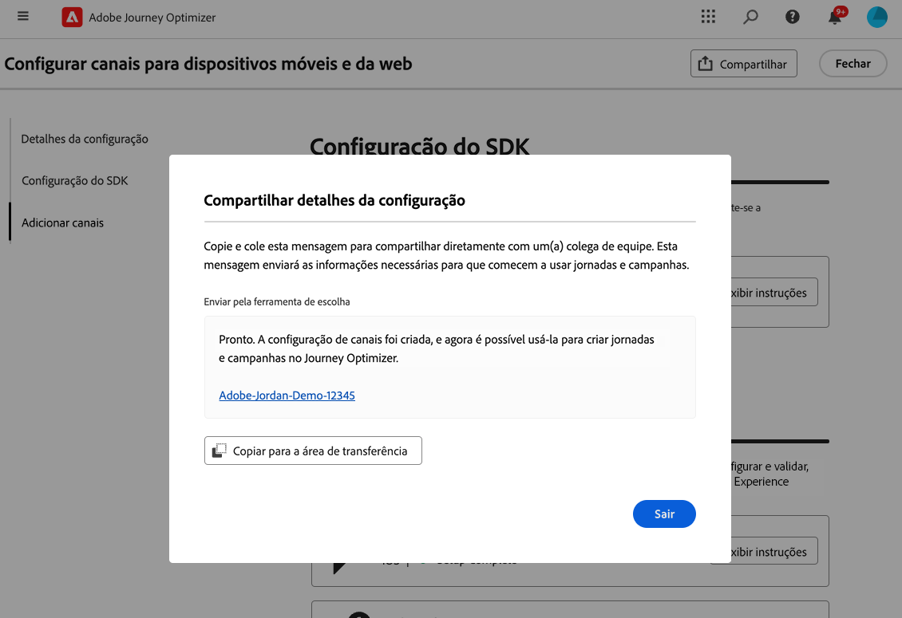
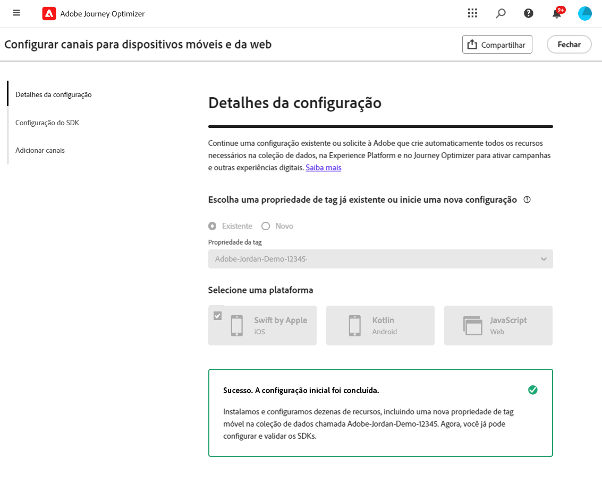

# Definir a configuração móvel do iOS {#set-mobile-ios}

>[!IMPORTANT]
>
>Para garantir compatibilidade e desempenho ideal, use as seguintes versões do SDK:
>
> * Core SDK: 5.2.0 ou posterior
> * Messaging SDK: 5.1.1 ou posterior

Essa configuração do iOS simplifica a configuração rápida de canais de marketing, disponibilizando prontamente todos os recursos essenciais nos aplicativos Experience Platform, Journey Optimizer e Coleção de dados. Isso permite que sua equipe de marketing comece rapidamente a criar campanhas e jornadas.

## Criar uma nova configuração do iOS {#new-setup-ios}

1. Na página inicial do Journey Optimizer, clique em **[!UICONTROL Iniciar]** no cartão **[!UICONTROL Configurar canais móveis e da Web]**.

   

1. Criar uma **[!UICONTROL Nova]** configuração.

   Se você já tiver configurações existentes, poderá optar por selecionar uma ou criar uma nova configuração.

   

1. Insira um **[!UICONTROL Nome]** para sua nova configuração e selecione ou crie sua **[!UICONTROL Sequência de Dados]**. Este **[!UICONTROL Nome]** será usado para todos os recursos criados automaticamente.

1. Se sua organização tiver vários fluxos de dados, selecione um entre as opções existentes. Se você não tiver uma sequência de dados, uma será criada automaticamente para você.

1. Selecione a plataforma iOS e clique em **[!UICONTROL Criar recursos automaticamente]**.

   

1. Para simplificar o processo de configuração, os recursos necessários são criados automaticamente para ajudar você a começar. Isso inclui a criação de uma nova **[!UICONTROL Propriedade de Marca Móvel]** e a instalação de extensões.

   Veja abaixo uma lista abrangente de todos os recursos gerados automaticamente:

+++ Recursos criados

   <table>
    <thead>
    <tr>
    <th><strong>Solução</strong></th>
    <th><strong>Recursos criados automaticamente</strong></th>
    </tr>
    </thead>
    <tbody>
    <tr>
    <td>
    <p>Journey Optimizer</p>
    </td>
    <td>
    <ul>
    <li>Configuração de canal</li>
    <li>Credencial de push (somente mensagem de push para dispositivos móveis)</li>
    </ul>
    </td>
    </tr>
    <tr>
    <td>
    <p>Tags</p>
    </td>
    <td>
    <ul>
    <li>Propriedade da tag móvel</li>
    <li>Regras</li>
    <li>Elementos de dados</li>
    <li>Biblioteca</li>
    <li>Ambientes (preparo, produção, desenvolvimento)</li>
    </ul>
    </td>
    </tr>
    <tr>
    <td>
    <p>Extensões de tags</p>
    </td>
    <td>
    <ul>
    <li>Edge Network Adobe Experience Platform</li>
    <li>Adobe Journey Optimizer</li>
    <li>AEP Assurance</li>
    <li>Consentimento (com políticas de consentimento padrão ativadas)</li>
    <li>Identidade (com ECID padrão, com regras de compilação padrão)</li>
    <li>Núcleo móvel</li>
    </ul>
    </td>
    </tr>
    <tr>
    <td>
    <p>Assurance</p>
    </td>
    <td>
    <p>Sessão do Assurance</p>
    </td>
    </tr>
    <tr>
    <td>
    <p>Sequências de dados</p>
    </td>
    <td>
    <p>Sequência de dados com serviços</p>
    </td>
    </tr>
    <tr>
    <td>
    <p>Experience Platform</p>
    </td>
    <td>
    <ul>
    <li>Conjunto de dados</li>
    <li>Esquema</li>
    </ul>
    </td>
    </tr>
    </tbody>
    </table>

+++

1. Quando a geração de recursos estiver concluída, clique em **[!UICONTROL Configurar]** para começar a configurar seu SDK.

   

1. Primeiro, é necessário adicionar e importar dependências, conforme descrito na interface do usuário do. [Saiba mais](https://experienceleague.adobe.com/en/docs/platform-learn/implement-mobile-sdk/app-implementation/install-sdks).

1. Insira o código de inicialização no método `onCreate()` do aplicativo. Esse código de teste permite se conectar ao Assurance e validar a configuração do aplicativo antes de passar para a produção.

   {zoomable="yes"}

1. Para validar o SDK diretamente no aplicativo móvel, basta abrir o aplicativo móvel e permitir o acesso ao [Adobe Assurance](https://experienceleague.adobe.com/en/docs/experience-platform/assurance/home). O Assurance é uma ferramenta eficiente que permite testar e validar completamente sua implementação, garantindo que tudo esteja funcionando corretamente.

   Depois de conectado, o dispositivo será automaticamente detectado e listado no menu suspenso **[!UICONTROL Dispositivo disponível]**, permitindo que você monitore e solucione problemas da instalação facilmente em tempo real.

   {zoomable="yes"}

1. Clique em **[!UICONTROL Conectar]**.

   {zoomable="yes"}

1. Agora você pode configurar seus canais [No aplicativo](#inapp-channel) e/ou [Push](#push-channel).

1. Após concluir a configuração, compartilhe a **[!UICONTROL Configuração do canal]** gerada automaticamente com os membros da equipe responsáveis pela criação de Jornadas e Campanhas.

   A **[!UICONTROL Configuração de Canal]** deve ser referenciada na interface de Campanhas ou do Jornada, permitindo uma conexão perfeita entre sua configuração e a execução de jornadas e campanhas direcionadas para seu público-alvo.

   {zoomable="yes"}

## Modificar uma configuração existente {#reconnect}

Depois de criar sua configuração, você pode facilmente revisitá-la a qualquer momento para adicionar mais canais ou fazer mais ajustes para atender às suas necessidades

1. Na página inicial do Journey Optimizer, clique em **[!UICONTROL Iniciar]** no cartão **[!UICONTROL Configurar canais móveis e da Web]**.

   

1. Selecione **[!UICONTROL Existente]** e escolha sua **[!UICONTROL propriedade de Marca]** existente no menu suspenso.

   

1. Ao acessar sua configuração existente, é necessário reconectar-se com o Adobe Assurance. No menu de Instalação do SDK, clique em **[!UICONTROL Reconectar]**.

   

1. Selecione seu dispositivo no menu suspenso **[!UICONTROL Dispositivos disponíveis]** e clique em **[!UICONTROL Conectar]**.

   {zoomable="yes"}

1. Agora você pode atualizar sua configuração conforme necessário.

## Configurar canal no aplicativo {#inapp-channel}

O canal no aplicativo não requer configuração adicional. Para verificar se a configuração é precisa, envie uma mensagem de teste sem esforço usando o recurso Assurance. Isso fornecerá feedback imediato sobre a prontidão do sistema para entregar mensagens no aplicativo de maneira eficaz.

Para fazer isso, basta clicar em **[!UICONTROL Exibir mensagem no aplicativo]**.

{zoomable="yes"}

Para simplificar o processo de configuração, os recursos necessários são criados automaticamente para ajudar você a começar. Isso inclui a criação de uma Configuração de canal.

Agora você pode enviar mensagens no aplicativo usando a **[!UICONTROL Configuração de canal]** configurada anteriormente. [Saiba como criar mensagens no aplicativo](../in-app/create-in-app.md)

## Configurar canal push {#push-channel}

>[!CONTEXTUALHELP]
>id="ajo_mobile_web_setup_push_certificate"
>title="Fornecer um certificado de push"
>abstract="O arquivo de chave .p8 contém uma chave privada usada para autenticar seu aplicativo nos servidores da Apple para notificações por push seguras. Você pode adquirir essa chave na página Certificados, Identificadores e Perfis em sua conta de desenvolvedor."

>[!CONTEXTUALHELP]
>id="ajo_mobile_web_setup_push_key_id"
>title="ID da chave"
>abstract="A ID da chave, uma cadeia de 10 caracteres atribuída durante a criação da chave de autenticação p8, pode ser encontrada na guia **Chaves** da página Certificados, Identificadores e Perfis da sua conta de desenvolvedor."

>[!CONTEXTUALHELP]
>id="ajo_mobile_web_setup_push_team_id"
>title="ID da equipe"
>abstract="A ID da equipe, um valor de sequência de caracteres usado para identificar sua equipe, pode estar localizada na guia **Associação** da sua conta de desenvolvedor."

1. Após configurar o SDK móvel, clique em **[!UICONTROL Adicionar]** no cartão de notificação por push.

1. Primeiro, no método `didRegisterForRemoteNotificationsWithDeviceToken` do seu `AppDelegate`, adicione o seguinte código para sincronizar o token de push do dispositivo com seu perfil do Adobe Experience Platform.

   ```
   MobileCore.setPushIdentifier(deviceToken)
   ```

1. Arraste e solte seu arquivo .p8 Apple Push Notification Authentication Key. Essa chave pode ser adquirida na página Certificados, Identificadores e Perfis.

1. Forneça as seguintes informações:

   * ID da chave: uma string de 10 caracteres atribuída durante a criação da chave de autenticação p8. Ele pode ser encontrado na guia Chaves da página Certificados, Identificadores e Perfis.

   * ID da equipe: um valor de sequência de caracteres que pode ser encontrado na guia Associação.

   {zoomable="yes"}

1. Para verificar se a configuração é precisa, envie uma mensagem de teste sem esforço usando o recurso Assurance. Isso fornecerá feedback imediato sobre a prontidão do sistema para fornecer notificações por push de maneira eficaz.

   Para fazer isso, basta clicar em **[!UICONTROL Enviar mensagem de push]**.

   {zoomable="yes"}

Para simplificar o processo de configuração, os recursos necessários são criados automaticamente para ajudar você a começar. Isso inclui a criação de uma **[!UICONTROL Configuração de canal]** e **[!UICONTROL Credencial de push]**.

Agora você pode enviar notificações por push usando a **[!UICONTROL Configuração de canal]** configurada anteriormente. [Saiba como criar notificações por push](../push/create-push.md)
