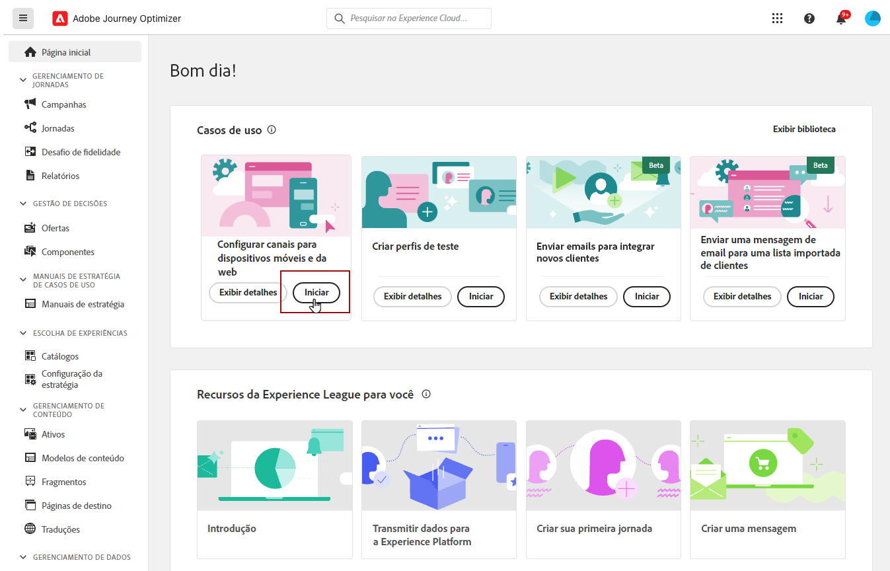
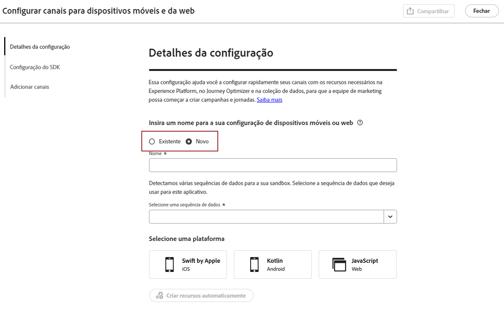

# Definir configuração da Web {#set-mobile-web}

>[!CONTEXTUALHELP]
>id="ajo_mobile_web_setup_javascript_code"
>title="Código Javascript"
>abstract="A marca `<head>` contém metadados e recursos essenciais que são carregados antes do conteúdo principal da sua página da Web. Colocar o código nesta seção garante que ele seja inicializado e executado corretamente antecipadamente, permitindo que sua página da Web seja carregada e funcione com eficiência. Ao adicionar código à seção `<head>`, você ajuda a aprimorar a estrutura, o desempenho e a experiência geral do usuário do seu site."

>[!CONTEXTUALHELP]
>id="ajo_mobile_web_setup_javascript_site"
>title="Iniciar site e validar"
>abstract="Depois que o código tiver sido implementado com sucesso e estiver ativo em seu site, forneça o URL de base. Se necessário, você poderá retornar a essa página em um estágio posterior para revalidar e confirmar se a configuração está funcionando como esperado."

Essa configuração facilita a configuração rápida de canais de marketing, garantindo que todos os recursos necessários estejam prontamente disponíveis no Experience Platform, Journey Optimizer e Coleção de dados. Isso permite que sua equipe de marketing comece imediatamente com a criação de campanhas e jornadas.

## Criar uma nova configuração da Web {#new-setup}

1. Na página inicial do Journey Optimizer, clique em **[!UICONTROL Iniciar]** no cartão **[!UICONTROL Configurar canais móveis e da Web]**.

   

1. Criar uma **[!UICONTROL Nova]** configuração.

   Se você já tiver configurações existentes, poderá optar por selecionar uma ou criar uma nova configuração.

   

1. Insira um **[!UICONTROL Nome]** para sua nova configuração e selecione ou crie sua **[!UICONTROL Sequência de Dados]**. Este **[!UICONTROL Nome]** será usado para todos os recursos criados automaticamente.

1. Se sua organização tiver vários fluxos de dados, selecione um entre as opções existentes. Se você não tiver uma sequência de dados, uma será criada automaticamente para você.

1. Selecione a plataforma da Web e clique em **[!UICONTROL Criar recursos automaticamente]**.

   

1. Para simplificar o processo de configuração, os recursos necessários são criados automaticamente para ajudar você a começar.

   Veja abaixo uma lista abrangente de todos os recursos gerados automaticamente:

+++ Recursos criados

   <table>
    <thead>
    <tr>
    <th><strong>Solução</strong></th>
    <th><strong>Recursos criados automaticamente</strong></th>
    </tr>
    </thead>
    <tbody>
    <tr>
    </tr>
    <tr>
    <td>
    
Tags

    </td>
    <td>
    <ul>
    <li>Propriedade da tag móvel</li>
    <li>Regras</li>
    <li>Elementos de dados</li>
    <li>Biblioteca</li>
    <li>Ambientes (preparo, produção, desenvolvimento)</li>
    </ul>
    </td>
    </tr>
    <tr>
    <td>
    
Extensões de tags

    </td>
    <td>
    <ul>
    <li>Edge Network Adobe Experience Platform</li>
    <li>Adobe Journey Optimizer</li>
    <li>AEP Assurance</li>
    <li>Consentimento (com políticas de consentimento padrão ativadas)</li>
    <li>Identidade (com ECID padrão, com regras de compilação padrão)</li>
    <li>Núcleo móvel</li>
    </ul>
    </td>
    </tr>
    <tr>
    <td>
    
Assurance

    </td>
    <td>
    
Sessão do Assurance

    </td>
    </tr>
    <tr>
    <td>
    
Sequências de dados

    </td>
    <td>
    
Sequência de dados com serviços

    </td>
    </tr>
    <tr>
    <td>
    
Experience Platform

    </td>
    <td>
    <ul>
    <li>Conjunto de dados</li>
    <li>Esquema</li>
    </ul>
    </td>
    </tr>
    </tbody>
    </table>

+++

1. Quando a geração de recursos estiver concluída, clique em **[!UICONTROL Configurar]** para começar a configurar seu SDK.

   

1. Cole o código exibido na tela na tag `<head>` do documento.

   {zoomable="yes"}

1. Para validar o SDK diretamente no aplicativo móvel, basta colar o URL base.

   {zoomable="yes"}

1. Selecione **[!UICONTROL Iniciar site e validar]** para conectar seu site.

   {zoomable="yes"}

1. Após concluir a configuração, compartilhe a **[!UICONTROL Propriedade da Web Móvel]** gerada automaticamente com os membros da equipe responsáveis pela criação de Jornadas e Campanhas.

   A **[!UICONTROL Propriedade da Web Móvel]** deve ser referenciada na interface de Campanhas ou do Jornada, permitindo uma conexão perfeita entre a sua configuração e a execução de jornadas e campanhas direcionadas para o seu público-alvo.

   

Agora você pode criar páginas da Web usando a **[!UICONTROL Propriedade da Web Móvel]** configurada anteriormente. [Saiba como criar uma página da Web](../web/create-web.md)

## Modificar uma configuração existente {#reconnect}

Depois de criar sua configuração, você pode facilmente revisitá-la a qualquer momento para adicionar mais canais ou fazer mais ajustes para atender às suas necessidades

1. Na página inicial do Journey Optimizer, clique em **[!UICONTROL Iniciar]** no cartão **[!UICONTROL Configurar canais móveis e da Web]**.

   

1. Selecione **[!UICONTROL Existente]** e escolha sua **[!UICONTROL propriedade de Marca]** existente no menu suspenso.

   

1. Agora você pode atualizar sua configuração conforme necessário.
