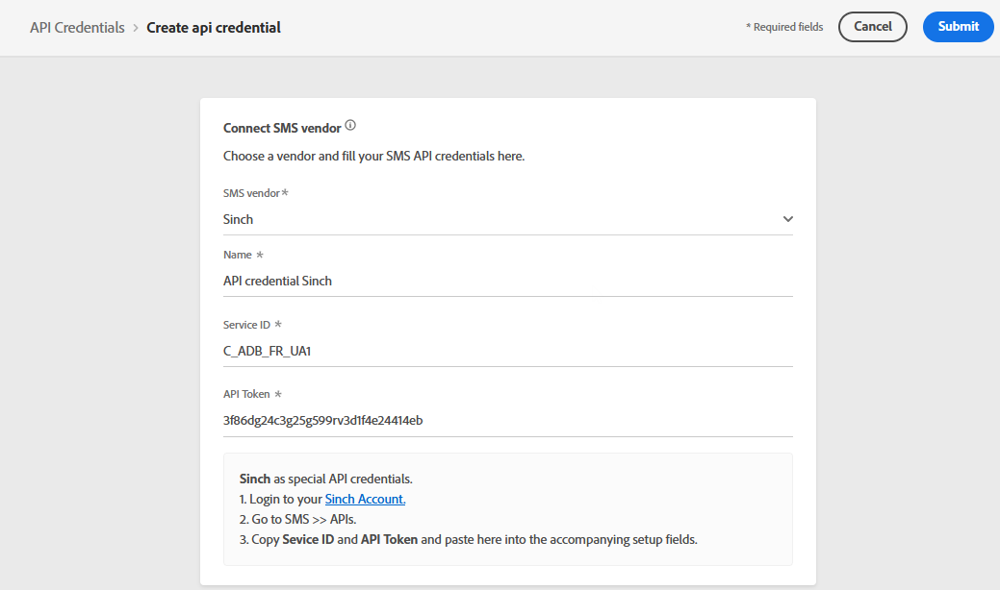

# Configurar canal de SMS {#sms-configuration}

>[!CAUTION]
>
> O uso do canal SMS está disponível no momento somente para usuários selecionados. Se quiser aproveitar esse recurso, entre em contato com o executivo da sua conta Adobe.

[!DNL Journey Optimizer] O permite criar suas jornadas e enviar mensagens para o público-alvo.

## Criar nova credencial da API {#create-api}

Para configurar seu fornecedor de SMS com o Journey Optimizer, siga estas etapas:

1. Acesse o **[!UICONTROL Administration]** > **[!UICONTROL Channels]** > **[!UICONTROL API Credentials]** , em seguida, clique em **[!UICONTROL Create API credential]**.

   

1. Selecione Sinalizar como seu **[!UICONTROL SMS vendor]**.

1. Insira um **[!UICONTROL Name]** para sua Credencial da API.

1. Insira seu **[!UICONTROL Service ID]** e **[!UICONTROL API Token]**.

   >[!NOTE]
   >
   > O Sinch requer credenciais de API especiais. Para encontrar seu **[!UICONTROL Service ID]** e **[!UICONTROL API Token]**, acesse o menu SMS > APIs da conta do Sinch ,

   

1. Clique em **[!UICONTROL Submit]** ao concluir a configuração das credenciais da API.

Depois de criar e configurar sua credencial de API, agora é necessário criar uma predefinição de mensagem para mensagens SMS.

## Criar uma predefinição de mensagem para mensagens SMS {#message-preset-sms}

Após configurar o canal SMS, é necessário criar uma predefinição de mensagem para enviar mensagens SMS de **[!DNL Journey Optimizer]**.

Para criar uma predefinição de mensagem, siga estas etapas:

1. Acesse o **[!UICONTROL Channels]** > **[!UICONTROL Branding]** > **[!UICONTROL Message presets]** , em seguida, clique em **[!UICONTROL Create Message preset]**.

   

1. Insira um nome e uma descrição (opcional) para a predefinição, depois selecione o canal SMS.

   

   >[!NOTE]
   >
   > Os nomes devem começar com uma letra (A-Z). Ela só pode conter caracteres alfanuméricos. Você também pode usar o sublinhado `_`, ponto`.` e hífen `-` caracteres.

1. Configure o **SMS** configurações.

   

   * Selecione o **[!UICONTROL SMS Type]** que será enviado com a predefinição: **[!UICONTROL Transactional]** ou **[!UICONTROL Marketing]**.

   * Selecione o **[!UICONTROL SMS configuration]** para associar com a predefinição.

      Para obter mais informações sobre como configurar seu ambiente para enviar mensagens SMS, consulte [esta seção](sms-configuration.md).

   * Insira o **[!UICONTROL Sender number]** &#x200B; você deseja usar para suas comunicações.

1. Depois que todos os parâmetros tiverem sido configurados, clique em **[!UICONTROL Submit]** para confirmar. Você também pode salvar a predefinição de mensagem como rascunho e retomar sua configuração posteriormente.

   

1. Depois que a predefinição de mensagem tiver sido criada, ela será exibida na lista com a variável **[!UICONTROL Processing]** status.

   >[!NOTE]
   >
   >Se as verificações não forem bem-sucedidas, saiba mais sobre os possíveis motivos de falha em [esta seção](#monitor-message-presets).

1. Depois que as verificações são bem-sucedidas, a predefinição de mensagem recebe a variável **[!UICONTROL Active]** status. Ele está pronto para ser usado para entregar mensagens.

   

Agora você está pronto para enviar mensagens SMS com o Journey Optimizer.

**Tópicos relacionados**

* [Criar uma mensagem de SMS.](../messages/create-sms.md)
* [Adicionar uma mensagem em uma jornada](../building-journeys/journeys-message.md)
