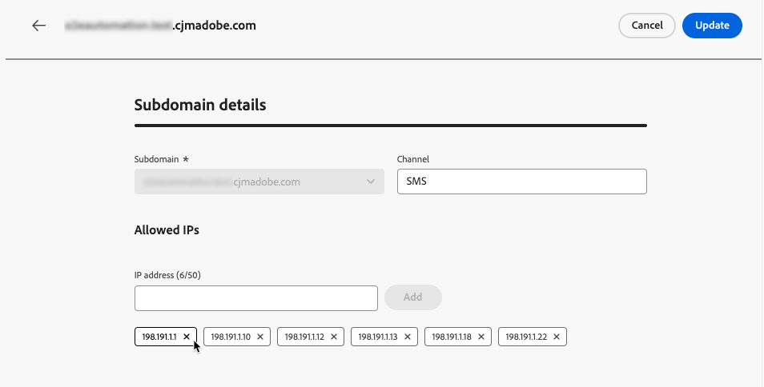

# Gerenciar IPs permitidos {#waf-ip-allowlist}

>[!CONTEXTUALHELP]
>id="ajo_waf_allowed_ips"
>title="Inserir IPs permitidos para o subdomínio selecionado"
>abstract="Selecione um subdomínio delegado e insira os IPs de saída públicos do Firewall do Aplicativo Web. Depois de salvo, [!DNL Journey Optimizer] rejeitará qualquer solicitação de entrada para esse subdomínio que não se origina de um dos IPs declarados. Sempre confirme os IPs de saída exatos com a equipe de segurança antes de salvar."

>[!BEGINSHADEBOX]

**Nesta página:** Adicione e gerencie seus IPs de saída do WAF (Firewall de Aplicativo Web) por subdomínio delegado diretamente no [!DNL Journey Optimizer], para que somente o tráfego roteado pelo seu firewall possa alcançar seus links hospedados no [!DNL Journey Optimizer].

>[!ENDSHADEBOX]

Organizações com requisitos rigorosos de segurança de rede — como as do setor financeiro — podem exigir que todas as solicitações para links hospedados por [!DNL Adobe Journey Optimizer] fluam por meio de um **Firewall de Aplicativo Web** (WAF) gerenciado pelo cliente antes de acessar a rede Adobe. Qualquer solicitação que ignore o firewall deve ser rejeitada.

[!DNL Journey Optimizer] permite que os administradores configurem, por subdomínio delegado, os IPs de saída públicos de sua WAF. Depois de definido, somente o tráfego originário desses IPs pode alcançar o subdomínio correspondente. Todas as outras solicitações de entrada — incluindo solicitações diretas que ignoram o firewall — são rejeitadas.

## Como funciona {#waf-ip-allowlist-how-it-works}

Habilitar o roteamento somente WAF para um subdomínio requer duas etapas, conforme detalhado abaixo.

1. **Redirecionamento de DNS**: os registros DNS do subdomínio devem ser atualizados para rotear o tráfego para a WAF da sua organização em vez de diretamente para a borda de rede da Adobe.
1. **Declaração de IP de saída do WAF**: sua organização fornece os IPs de saída públicos da sua WAF em [!DNL Journey Optimizer]. Esses são os IPs a partir dos quais o firewall envia solicitações para a Adobe.

Quando ambos estiverem em vigor, o fluxo de tráfego funcionará da seguinte maneira:

1. Um destinatário clica em um link em uma comunicação [!DNL Adobe Journey Optimizer].
1. A solicitação chega à WAF da sua organização, que a inspeciona e filtra de acordo com suas políticas de segurança.
1. O WAF encaminha a solicitação para a borda de rede da Adobe, de um de seus IPs de saída declarados.
1. [!DNL Journey Optimizer] verifica o IP de origem da solicitação de entrada em relação à lista de permissões do subdomínio.
   - **Correspondências de IP** → a solicitação passou pelo WAF → processada normalmente.
   - **IP não corresponde** → a solicitação ignorou a WAF → **rejeitou com um erro 403 Proibido**. O recipient vê um link quebrado.

As solicitações de subdomínios sem IPs permitidos configurados não são afetadas e continuam a funcionar como antes.

## Medidas de proteção e restrições {#waf-ip-allowlist-guardrails}

| Controle | Detalhe |
| --- | --- |
| **Formato de IP** | Intervalos IPv4, IPv6 e CIDR aceitos. Valores malformados são rejeitados em linha antes de serem salvos. |
| **Prevenção de duplicatas** | Nenhum IP duplicado no mesmo subdomínio. O mesmo IP pode ser usado em diferentes subdomínios. |
| **Aviso de intervalo reservado** | Um aviso de não bloqueio é exibido quando intervalos privados/reservados são inseridos (os IPs de saída do WAF normalmente são públicos). |
| **Somente subdomínios delegados** | Somente subdomínios delegados e verificados podem ser selecionados. |
| **Limite por subdomínio** | Máximo de **50 entradas de IP** por subdomínio. |
| **Proteções de bloqueio** | Digite para confirmar a remoção total; avisos explícitos sempre que uma ação reabrir um subdomínio para todo o tráfego. |

>[!CAUTION]
>
>Uma configuração incorreta interrompe imediatamente todos os links no subdomínio afetado.

Se IPs de saída incorretos do WAF forem salvos, o [!DNL Journey Optimizer] rejeitará todas as solicitações recebidas para esse subdomínio, incluindo as legítimas de destinatários reais que clicam em links em comunicações, que receberão uma página de erro 403.

Sempre confirme os IPs de saída exatos com sua equipe de segurança antes de salvar e teste em um subdomínio de não produção primeiro, se possível.

## Acessar e gerenciar IPs permitidos {#waf-ip-allowlist-access}

>[!NOTE]
>
>Para acessar e gerenciar a lista de permissões IP, você deve ter a permissão **[!UICONTROL Exibir IPs Permitidos]** e **[!UICONTROL Gerenciar IPs Permitidos]**. [Saiba mais](../administration/ootb-permissions.md)

Para acessar a lista de subdomínios para os quais você permitiu os IPs do Firewall do Aplicativo Web, vá para **[!UICONTROL Administração]** > **[!UICONTROL Canais]** > **[!UICONTROL Configurações Gerais]** e selecione **[!UICONTROL Lista de permissões - IPs]**.

{width="90%"}

A página de inventário lista todos os subdomínios que têm pelo menos um IP permitido, em todos os tipos de canal (Email, Página de aterrissagem, SMS, Web). Saiba mais sobre subdomínios em [esta seção](about-subdomain-delegation.md).

A lista mostra o número de IPs permitidos por subdomínio e o autor da última modificação.

Você pode filtrar o inventário por tipo de canal e pesquisar por nome de subdomínio.

## Adicionar IPs à lista de permissões {#waf-ip-allowlist-add}

Para adicionar IPs à lista de permissões para um determinado subdomínio, siga as etapas abaixo.

1. No inventário **[!UICONTROL Lista de permissões - IPs]**, clique no botão **[!UICONTROL Adicionar IPs permitidos]**.

1. Selecione o subdomínio de destino na lista suspensa **[!UICONTROL Subdomínio]**. Somente [subdomínios delegados](delegate-subdomain.md) são listados, em todos os tipos de canais suportados: Email, Página de aterrissagem, SMS e Web.

1. No campo **[!UICONTROL Endereço IP]**, insira os IPs de saída públicos da sua WAF. Há suporte para intervalos IPv4, IPv6 e CIDR (por exemplo, `203.0.113.42`, `2001:db8::1`, `203.0.113.0/24`).

   Cada entrada válida e não duplicada é validada em linha antes de ser adicionada. Você pode adicionar até **50 entradas de IP por subdomínio**.

   

   >[!IMPORTANT]
   >
   >Um aviso é exibido quando intervalos de IP privados ou reservados (RFC 1918, loopback, link-local) são inseridos. Os IPs de saída do WAF normalmente são endereços públicos.

1. Se necessário, você pode remover um IP da lista clicando no ícone **✕** no chip.

1. Clique em **[!UICONTROL Save]**. A lista de permissões é aplicada e propagada para a borda. O subdomínio aparece no inventário e seus IPs são aplicados imediatamente.

Agora, qualquer solicitação para esse subdomínio de qualquer IP que não esteja nessa lista será rejeitada.

>[!CAUTION]
>
>Confirme esses IPs com sua equipe de segurança — valores incorretos quebrarão todos os links nesse subdomínio.

## Editar IPs permitidos {#waf-ip-allowlist-edit}

Para atualizar os IPs permitidos para um subdomínio existente, clique no nome do subdomínio no inventário.

O campo **[!UICONTROL Subdomínio]** é somente leitura <!--as well as the Channel field--> — ele não pode ser alterado após a criação.

Adicione novos IPs usando o campo de entrada ou remova IPs existentes clicando no ícone **✕** em cada chip.

>[!IMPORTANT]
>
>Remover o último IP de um subdomínio o reabre para todo o tráfego de entrada.

## Remover IPs permitidos {#waf-ip-allowlist-remove}

Para remover todos os IPs da lista de permissões de um subdomínio, use o ícone **Excluir** da coluna **[!UICONTROL Ações]** do inventário. Isso suspende totalmente a restrição do WAF para esse subdomínio.

Uma janela pop-up de confirmação é aberta. Digite o nome exato do subdomínio para confirmar e clique em **[!UICONTROL Remover]**.

{width="80%"}

>[!WARNING]
>
>Após a confirmação, essa ação remove todos os IPs permitidos para o subdomínio que você inseriu. O tráfego de entrada será aceito novamente de qualquer origem, incluindo solicitações que ignoram o Firewall do Aplicativo Web. Isso não pode ser desfeito — Os IPs devem ser inseridos novamente para restaurar a restrição.

Após remover todos os IPs, o subdomínio não aparece mais no inventário. Você pode reconfigurá-lo a qualquer momento adicionando IPs novamente para esse subdomínio.
