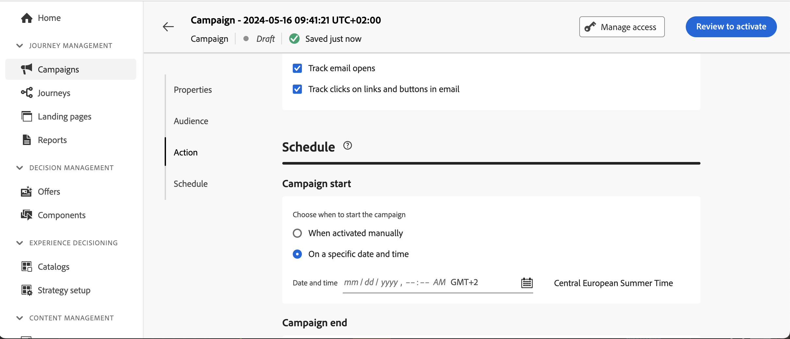

# Limite de frequência por canal e tipo de comunicação {#rule-sets}

Os conjuntos de regras do **Canal** aplicam regras de limitação aos canais de comunicação. Por exemplo, não envie mais de 1 comunicação por email ou SMS por dia.

O uso de conjuntos de regras de canal permite definir o limite de frequência por tipo de comunicação para evitar sobrecarga de clientes com mensagens semelhantes. Por exemplo, você pode criar um conjunto de regras para limitar o número de **comunicações promocionais** enviadas aos seus clientes e outro conjunto de regras para limitar o número de **boletins informativos** enviados a eles. Dependendo do tipo de campanha que está sendo criada, você pode optar por aplicar a comunicação promocional ou o conjunto de regras de boletins informativos.

## Criar uma regra de limite de canal

>[!CONTEXTUALHELP]
>id="ajo_rule_sets_channel"
>title="Definir os canais aos quais a regra se aplica"
>abstract="Selecione pelo menos um canal. O limite se aplica em canais como uma contagem total."

Para criar um conjunto de regras de canal, siga estas etapas:

>[!NOTE]
>
>Você pode criar até três conjuntos de regras locais de domínio do canal e até cinco conjuntos de regras locais de domínio do jornada.

1. Acesse a lista **[!UICONTROL Conjuntos de regras]** e clique em **[!UICONTROL Criar conjunto de regras]**.

   

1. Selecione o conjunto de regras ao qual deseja adicionar a regra de limitação ou crie um novo conjunto de regras:

   * Para usar um conjunto de regras existente, selecione-o na lista. As regras de limitação de canal só podem ser adicionadas a conjuntos de regras com o domínio &quot;canal&quot;. Você pode verificar essas informações nas listas de conjuntos de regras, na coluna **[!UICONTROL Domínio]**.

     

   * Para criar a regra de limitação dentro de um novo conjunto de regras, clique em **[!UICONTROL Criar conjunto de regras]**, especifique um nome exclusivo para o conjunto de regras e selecione &quot;Canal&quot; no menu suspenso **[!UICONTROL Domínio do Conjunto de Regras]** e clique em **[!UICONTROL Salvar]**.

     

1. Na tela do conjunto de regras, clique no botão **[!UICONTROL Adicionar regra]** e defina um nome exclusivo para a regra.

1. O campo **Categoria** especifica a categoria da mensagem à qual a regra se aplica. Por enquanto, este campo é somente leitura, pois somente a categoria **[!UICONTROL Marketing]** está disponível.

   

1. Na lista suspensa **[!UICONTROL Duração]**, selecione se deseja que o limite seja aplicado mensalmente, semanalmente ou diariamente. O limite de frequência se baseia no período de calendário selecionado. Ela é redefinida no início do intervalo de tempo correspondente.

   O prazo de validade do contador para cada período é o seguinte:

   * **[!UICONTROL Mensal]**: o limite de frequência é válido até o último dia do mês às 23:59:59 UTC. Por exemplo, a expiração mensal de janeiro é 01-31 23:59:59 UTC.

   * **[!UICONTROL Semanalmente]**: o limite de frequência é válido até sábado, 23:59:59 UTC dessa semana, pois a semana do calendário começa no domingo. A data de expiração se aplica independentemente de quando a regra foi criada. Por exemplo, se a regra for criada na quinta-feira, ela será válida até o sábado às 23:59:59.

   * **[!UICONTROL Diariamente]**: o limite de frequência diário é válido para o dia até 23:59:59 UTC e é redefinido como 0 no início do dia seguinte.

     >[!CAUTION]
     > 
     >Para garantir a precisão das regras diárias de limite de frequência, escolha o namespace de prioridade mais alta ao criar uma campanha ou jornada. Saiba mais sobre a prioridade de namespace no [Guia do serviço de identidade da Platform](https://experienceleague.adobe.com/pt-br/docs/experience-platform/identity/features/identity-graph-linking-rules/namespace-priority){target="_blank"}

   Observe que o valor do contador de perfil é atualizado assim que a comunicação é entregue. Esteja ciente disso ao enviar grandes volumes de comunicações, pois a taxa de transferência pode resultar no recebimento do email em minutos ou até horas após o início da comunicação (caso você esteja enviando milhões de comunicações simultaneamente).

   Isso é importante no caso de um recipient receber duas comunicações próximas. Sugerimos espaçar as comunicações em pelo menos duas horas, sempre que possível, para dar tempo suficiente para que o recipient receba a comunicação e o valor do contador para atualizar de acordo.

1. Defina o limite para sua regra, o que significa o número máximo de mensagens que podem ser enviadas para um perfil de usuário individual a cada mês, semana ou dia, de acordo com sua seleção acima.

1. Selecione o canal que deseja usar para esta regra: **[!UICONTROL Email]**, **[!UICONTROL SMS]**, **[!UICONTROL Notificação por push]** ou **[!UICONTROL Correspondência direta]**.

1. Selecione vários canais se desejar aplicar o limite em todos os canais selecionados como uma contagem total.

   Por exemplo, defina o limite como 5 e selecione os canais de email e de sms. Se um perfil já tiver recebido três emails de marketing e dois sms de marketing para o período selecionado, esse perfil será excluído do próximo delivery de qualquer email ou sms de marketing.

1. Clique em **[!UICONTROL Salvar]** para confirmar a criação da regra. Sua mensagem foi adicionada ao conjunto de regras, com o status **[!UICONTROL Rascunho]**.

   

1. Repita as etapas acima para adicionar quantas regras forem necessárias ao conjunto de regras.

1. Quando a regra de limitação estiver pronta para ser aplicada a mensagens, ative o conjunto de regras e a regra em que ele foi adicionado. [Saiba como ativar conjuntos de regras](../conflict-prioritization/rule-sets.md#create)

## Aplicar conjuntos de regras a uma mensagem {#apply-frequency-rule}

Para aplicar um conjunto de regras a uma mensagem, siga estas etapas:

1. Ao criar uma mensagem de jornada ou campanha, selecione um dos canais definidos para o conjunto de regras e edite o conteúdo da mensagem

1. Na tela de edição de conteúdo, clique no botão **[!UICONTROL Adicionar Regra de Negócios]**.

1. Selecione o conjunto de regras criado.

   

   >[!NOTE]
   >
   >Somente conjuntos de regras [ativados](#activate-rule) são exibidos na lista.

   <!--Messages where the category selected is **[!UICONTROL Transactional]** will not be evaluated against business rules.-->

1. Antes de ativar sua jornada ou campanha, certifique-se de agendar a execução dela pelo menos 20 minutos no futuro.

   Isso permite tempo suficiente para preencher os valores do contador no perfil da regra de negócios selecionada. Se você ativar a campanha imediatamente, os valores do contador do conjunto de regras não serão preenchidos nos perfis dos recipients e a mensagem não será contada em relação às regras de limite de frequência para os conjuntos de regras personalizados.

   

1. Você pode visualizar o número de perfis excluídos da entrega no [Relatório do Customer Journey Analytics](../reports/report-gs-cja.md) e no [Relatório ao vivo](../reports/live-report.md), em que as regras de frequência serão listadas como um possível motivo para os usuários excluídos da entrega.

>[!NOTE]
>
>Várias regras podem ser aplicadas ao mesmo canal, mas quando o limite inferior for atingido, o perfil será excluído dos próximos deliveries.

Ao testar as regras de frequência, é recomendável usar um [perfil de teste](../audience/creating-test-profiles.md) recém-criado, pois, quando o limite de frequência de um perfil é atingido, não há como redefinir o contador até o próximo período. A desativação de uma regra permitirá que perfis limitados recebam mensagens, mas não removerá nem excluirá incrementos de contador.

<!--
## Example: combine several rules {#frequency-rule-example}

You can combine several message frequency rules, such as described in the example below.

1. [Create a rule](#create-new-rule) called *Overall Marketing Capping*:

   * Select all channels.
   * Set capping to 12 monthly.

   

1. To further restrict the number of marketing-based push notifications that a user is sent, create a second rule called *Push Marketing Cap*:

   * Select Push channel.
   * Set capping to 4 monthly.

   

1. Save and [activate](#activate-rule) the rule.

1. [Create a message](../building-journeys/journeys-message.md) for every channel you want to communicate through and select the **[!UICONTROL Marketing]** category for each message. [Learn how to apply a frequency rule](#apply-frequency-rule)

   

In this scenario, an individual profile:
* can receive up to 12 marketing messages per month;
* but will be excluded from marketing push notifications after they have received 4 push notifications.-->

## Vídeo tutorial {#video}

>[!VIDEO](https://video.tv.adobe.com/v/3444731?quality=12&captions=por_br)
