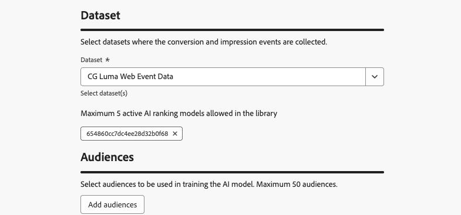

# Usar modelos de IA para classificar jornadas {#journey-ai-models}

>[!AVAILABILITY]
>
>Este recurso está atualmente com a Disponibilidade Limitada. Entre em contato com o representante da Adobe para obter acesso.

O [!DNL Adobe Journey Optimizer] ajuda você a controlar quais jornadas um perfil pode inserir quando se qualificar para mais do que o sistema permite. Para fazer isso, você pode usar [conjuntos de regras](rule-sets.md) para definir limites na entrada de jornada ou simultaneidade. Quando um perfil é qualificado para mais jornadas do que o limite permite, a prioridade atribuída a cada jornada determina quais jornadas são selecionadas.

Em vez de usar a prioridade, você também pode usar **modelos de IA** nas fórmulas de classificação para classificar jornadas dinamicamente com base em pontuações de modelo treinadas.

## Criar um modelo de IA {#create-ai-model}

<!--
Do you need specific permissions to create AI models?
>[!CAUTION]
>
>To create, edit, or delete AI models, you must have the **Manage Ranking Strategies** permission. [Learn more](../administration/high-low-permissions.md#manage-ranking-strategies)
-->

Para criar um modelo de IA para classificação de jornada, siga as etapas abaixo.

1. Crie um conjunto de dados em que os eventos de conversão serão coletados. [Saiba como](../experience-decisioning/data-collection/create-dataset.md)

1. Acesse a seção **[!UICONTROL Classificação de orquestração]** e selecione a guia **[!UICONTROL Modelos de IA]**. A lista de modelos de IA criados anteriormente é exibida.

1. Clique em **[!UICONTROL Criar modelo de IA]**.

1. Especifique um nome exclusivo e, se necessário, uma descrição para o modelo de IA.

   {width="85%"}

   >[!NOTE]
   >
   >O objeto de classificação é a entidade à qual a fórmula de classificação será aplicada. Por padrão, o objeto de classificação está definido como **[!UICONTROL Jornada]**.

<!--
1. Select the type of AI model you want to create:

    * **[!UICONTROL Auto-optimization]** optimizes based on past performance. [Learn more](../experience-decisioning/ranking/auto-optimization-model.md)
    * **[!UICONTROL Personalized optimization]** optimizes and personalizes based on audiences and performance. [Learn more](../experience-decisioning/ranking/personalized-optimization-model.md)
-->

1. Na seção **[!UICONTROL Métrica de otimização]**, todas as métricas da [!DNL Customer Journey Analytics] [visualização de dados](https://experienceleague.adobe.com/en/docs/analytics-platform/using/cja-dataviews/data-views){target="_blank"} padrão são exibidas na lista. Selecione a métrica em que deseja otimizar seu modelo.

   {width="70%"}

   [!DNL Journey Optimizer] classificações com base no **índice de conversão** (Índice de conversão = Número total de eventos de conversão / Número total de eventos de impressão). A taxa de conversão é calculada usando:

   * **Eventos de impressão** (itens exibidos)
   * **Eventos de conversão** (itens que resultam em cliques ou conversões)

   Esses eventos são capturados automaticamente usando o Web SDK ou o SDK móvel. Saiba mais na visão geral do [Adobe Experience Platform Web SDK](https://experienceleague.adobe.com/docs/experience-platform/edge/home.html?lang=pt-BR).

1. Selecione os conjuntos de dados nos quais os eventos de conversão e impressão são coletados. Saiba como criar esses conjuntos de dados [nesta seção](../experience-decisioning/data-collection/create-dataset.md).

   {width="85%"}

   >[!CAUTION]
   >
   >Somente os conjuntos de dados criados a partir de esquemas associados ao grupo de campos **[!UICONTROL Evento de experiência - Interações de apresentação]** são exibidos na lista suspensa. Você pode selecionar até 5 conjuntos de dados.

1. &#x200B;<!--If you are creating a **[!UICONTROL Personalized optimization]** AI model, -->Selecione os segmentos a serem usados para treinar o modelo de IA.

   >[!NOTE]
   >
   >Você pode selecionar até 50 públicos-alvo.

1. Salve e ative o modelo de IA.

O modelo de IA agora está disponível para seleção ao criar uma fórmula de classificação.

## Referencie o modelo de IA em uma fórmula para classificar jornadas {#reference-ai-model}

Agora é possível definir o modelo de IA como uma referência para criar uma fórmula de classificação e, em seguida, atribuir a fórmula a um conjunto de regras e aplicar o conjunto de regras às suas jornadas. Para isso, siga as etapas abaixo.

1. Crie uma fórmula de classificação. [Saiba como](journey-ranking-formulas.md#create-journey-ranking-formula)

1. Use o botão **[!UICONTROL Selecionar modelo de IA]** para selecionar o modelo de IA que deseja usar na fórmula.

   {width="80%"}

1. Em pelo menos uma das seções de **[!UICONTROL Critério]**, defina uma condição e selecione **[!UICONTROL Pontuação do modelo de IA]** como o método de classificação. Por exemplo, se a jornada tiver uma tag &quot;Promo&quot;, a pontuação da classificação será a pontuação do modelo de IA.

   {width="60%"}

1. Clique em **[!UICONTROL Criar]** para concluir a fórmula de classificação.

1. Agora crie um conjunto de regras e selecione a fórmula criada como o método de classificação. [Saiba como](journey-ranking-formulas.md#assign-formula-to-ruleset)

1. Crie as regras de limitação de jornada e salve o conjunto de regras.

1. Aplique o conjunto de regras às jornadas desejadas e salve-as. [Saiba como](journey-ranking-formulas.md#assign-rule-set-to-journey)

   >[!NOTE]
   >
   >Somente um conjunto de regras pode ser aplicado a uma jornada de cada vez.

Todas as jornadas que usam esse conjunto de regras serão classificadas com a fórmula que faz referência ao modelo de IA selecionado quando o limite é aplicado.
