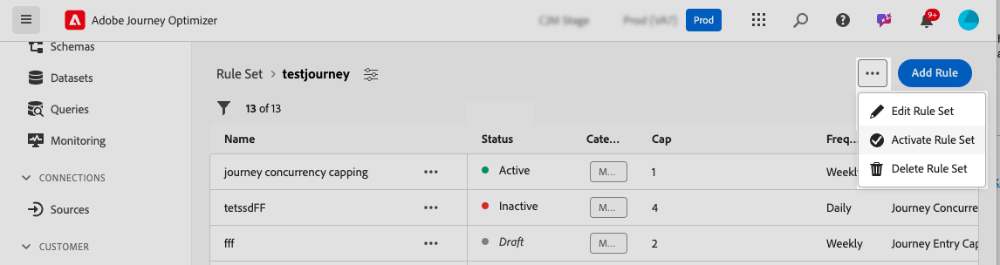

# Limite e arbitragem de jornada {#journey-capping}

>[!AVAILABILITY]
>
>Os recursos de conflito e priorização estão atualmente disponíveis em Disponibilidade limitada para um grupo selecionado de clientes. Observe que esses recursos serão lançados de forma gradual para mais usuários no futuro. Entre em contato com a equipe de conta se tiver interesse em participar da lista de espera desses recursos.

O limite de jornada ajuda a limitar o número de jornadas nas quais um perfil pode ser inscrito, evitando a sobrecarga de comunicação. No Journey Optimizer, você pode definir dois tipos de regras de limitação:

* **Limite de entrada** limita o número de entradas de jornada em um determinado período para um perfil.
* **Limite de simultaneidade** limita quantas jornadas um perfil pode ser inscrito simultaneamente.

Ambos os tipos de limite de jornada usam pontuações de prioridade para arbitrar entradas.

➡️ [Descubra este recurso no vídeo](#video)

## Criar uma regra de limitação de jornada {#create-rule}

>[!CONTEXTUALHELP]
>id="ajo_rule_set_concurrency_prioritization"
>title="Priorização antecipada"
>abstract=" Se uma jornada de prioridade mais alta for agendada dentro do período especificado aqui, o cliente será impedido de entrar nessa jornada. Para situações em que você deseja que as jornadas sejam inseridas em ordem de chegada, sugerimos escolher o período de previsão Diário e garantir que a pontuação de prioridade de qualquer outra jornada nesse dia seja menor que a pontuação de prioridade da jornada. Atribuir uma pontuação de prioridade de 100 a uma jornada também garantiria que ela fosse incluída."

>[!CONTEXTUALHELP]
>id="ajo_rule_set_rule_type"
>title="Tipo de regra"
>abstract="Especifique o tipo de limite para a regra. O **[!UICONTROL Limite de entrada da jornada]** limita o número de entradas na jornada em um determinado período para um perfil, enquanto o **[!UICONTROL Limite de Simultaneidade da Jornada]** limita em quantas jornadas um perfil pode ser inscrito simultaneamente."

Para criar uma regra de limite de jornada, siga estas etapas:

1. Navegue até o menu **[!UICONTROL Regras de negócio (Beta)]** para acessar o inventário de conjuntos de regras.

1. Selecione o conjunto de regras ao qual deseja adicionar a regra de limitação ou crie um novo conjunto de regras:

   * Para usar um conjunto de regras existente, selecione-o na lista. As regras de limitação de jornada só podem ser adicionadas a conjuntos de regras com o domínio &quot;jornada&quot;. Você pode verificar essas informações nas listas de conjuntos de regras, na coluna **[!UICONTROL Domínio]**.

     

   * Para criar a regra de limitação dentro de um novo conjunto de regras, clique em **[!UICONTROL Criar conjunto de regras]**, especifique um nome exclusivo para o conjunto de regras e selecione &quot;Jornada&quot; no menu suspenso **[!UICONTROL Domínio do Conjunto de Regras]** e clique em **[!UICONTROL Salvar]**.

     

1. Na tela do conjunto de regras, clique no botão **[!UICONTROL Adicionar regra]** e configure a regra para atender às suas necessidades:

   

   * Forneça um nome exclusivo para a regra.

   * Na lista suspensa **[!UICONTROL Tipo de Regra]**, especifique o tipo de limite para a regra.

      * **[!UICONTROL Limite de Entrada de Jornada]**: Limita o número de entradas na jornada em um determinado período para um perfil.
      * **[!UICONTROL Limite de Simultaneidade de Jornada]**: Limita quantas jornadas um perfil pode ser inscrito simultaneamente.

   * Expanda as seções abaixo para saber como configurar cada tipo de limite:

     +++Configurar uma regra de limite de entrada de jornada

      1. No campo **[!UICONTROL Limite]**, defina o número máximo de jornadas que um perfil pode inserir.
      1. No campo **[!UICONTROL Duration]**, defina o período a ser considerado. Observe que a duração se baseia no fuso horário UTC. Por exemplo, o limite Diário será redefinido à meia-noite UTC.

     Neste exemplo, queremos impedir que perfis insiram mais de &quot;5&quot; jornadas em um mês.

     

     >[!NOTE]
     >
     >O sistema levará em consideração a prioridade das jornadas programadas futuras que tenham essa mesma regra aplicada a ele.
     >
     >Neste exemplo, se o profissional de marketing já tiver inserido 4 jornadas e houver outra jornada programada para este mês com uma prioridade mais alta, os clientes não poderão entrar na jornada de prioridade mais baixa.

+++

     +++Configurar uma regra de limite de simultaneidade de jornada

      1. No campo **[!UICONTROL Limite]**, defina o número máximo de jornadas nas quais um perfil pode ser inscrito simultaneamente.

      1. Use o campo **[!UICONTROL Priorização antecipada]** para arbitrar as entradas de jornada com base nas pontuações de prioridade em um período escolhido (por exemplo, 1 dia, 7 dias, 30 dias). Isso ajuda a priorizar a entrada em jornadas de valor mais alto se um perfil estiver qualificado para várias jornadas.

     Neste exemplo, queremos impedir que os perfis entrem na jornada se já estiverem inscritos em outra jornada que contenha o mesmo conjunto de regras. Se outra jornada nos próximos 7 dias tiver uma pontuação de prioridade mais alta, o perfil não inserirá essa jornada.

     {width="50%" zommable="yes"}

+++

1. Quando a regra de limitação estiver pronta para ser aplicada às jornadas, ative-a clicando no botão de reticências ao lado do nome.

   

1. Ative todo o conjunto de regras clicando no botão de reticências ao lado do botão Adicionar regra no canto superior direito da tela.

   

## Aplicar regras de limitação a jornadas {#apply-capping}

>[!CONTEXTUALHELP]
>id="ajo_journey_capping_rule"
>title="Aplicar conjunto de regras a jornadas"
>abstract="Aplique um conjunto de regras para excluir essa jornada para parte do seu público-alvo com base em regras de limite de frequência."

Para aplicar uma regra de limitação a uma jornada, acesse a jornada e abra suas propriedades. No menu suspenso **[!UICONTROL Regras de limitação]**, selecione o conjunto de regras relevante. Quando a jornada for ativada, as regras de limitação definidas no conjunto de regras entrarão em vigor.

>[!IMPORTANT]
>
>Se uma jornada for ativada imediatamente, pode levar até 15 minutos para que o sistema comece a suprimir clientes. Você pode agendar sua jornada para começar pelo menos 15 minutos no futuro para evitar essa possibilidade.

Quando a jornada estiver ativa, você poderá verificar no relatório de jornadas se o conjunto de regras levou a qualquer exclusão da jornada, na tabela **[!UICONTROL Exclusões de Jornadas]**. [Saiba como trabalhar com relatórios do jornada](../reports/journey-global-report-cja.md)

## Vídeo tutorial {#video}

>[!VIDEO](https://video.tv.adobe.com/v/3435530?quality=12)
