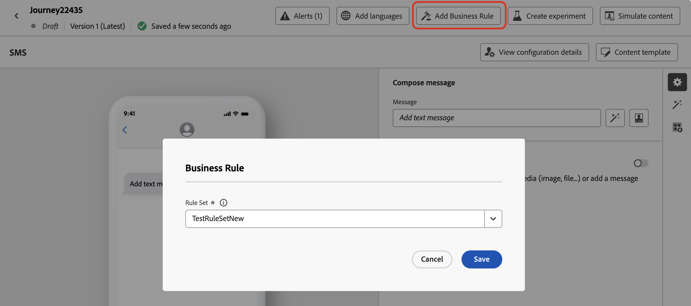
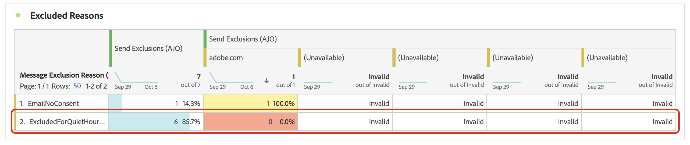

# Definir horas de silêncio {#quiet-hours}

## O que são horas de silêncio

O **Período de silêncio** permite definir exclusões com base no tempo para **emails**, **SMS**, **Push** e **WhatsApp** canais. Elas garantem que nenhuma mensagem seja enviada durante períodos específicos, ajudando você a respeitar as preferências do cliente e os requisitos de conformidade.

Você pode aplicar horas de silêncio por meio de **conjuntos de regras**, que podem ser atribuídos a ações individuais em campanhas ou jornadas para obter um controle preciso.

Ao simplificar esses processos, você pode aprimorar a experiência do cliente, economizar tempo e garantir a conformidade com as regras de comunicação:

* **Não desperte seu cliente** - *O cliente certo, o canal certo, a hora certa* é o mantra de muitos profissionais de marketing, portanto, faz sentido que o tempo seja uma parte essencial da jornada do cliente. Ao definir uma regra de Período de silêncio, as marcas têm melhor controle sobre quando os contatos estão recebendo mensagens, garantindo que elas as recebam quando houver mais probabilidade de tomar providências em relação à sua mensagem.
* **Conveniência** - intercepte facilmente comunicações entre campanhas e jornadas quando precisar impedir que um público receba uma mensagem sem precisar interromper toda a jornada ou campanha.
* **Economia de Tempo** - Gerencie exclusões em um local criando uma **regra baseada em tempo**, em vez de adicionar vários nós de condição com expressões personalizadas.\
  <!--* **Extra Safeguard** - Benefit from an extra safeguard in case audience criteria or time-window configurations were incorrectly set, ensuring individuals are still excluded when they should be.-->

>[!AVAILABILITY]
>
>Atualmente, as regras de horário de silêncio estão disponíveis apenas para um conjunto de organizações (Disponibilidade limitada). Para ser adicionado à lista de espera, entre em contato com o representante da Adobe.

➡️ [Conheça este recurso no vídeo](#video)

## Medidas de proteção e limitações

* **Canais com suporte** - Email, SMS, Push e WhatsApp.
  <!--* **Custom actions** – For custom actions, only quiet hours rules are enforced. If a rule set also includes other rules (e.g., frequency capping), those rules are ignored.-->
* **Atraso de propagação** - As atualizações de uma regra de horas de silêncio podem levar até 12 horas para serem aplicadas às ações de canal que já usam essa regra.
  <!--* **Pre-suppression window** – The system begins suppressing communications 30 minutes before quiet hours start, ensuring that no messages are delivered once the quiet period begins.-->
* **Latência de alto volume** - No caso de comunicações de alto volume, o sistema pode demorar mais para começar a aplicar com êxito supressões de horas silenciosas.

## Criar regras de Período de silêncio

Para definir horas de silêncio, crie uma regra dentro de um conjunto de regras personalizado. Siga estas etapas:

1. Navegue até **[!UICONTROL Regras de negócio]** para acessar o inventário de conjuntos de regras.

1. Escolha um conjunto de regras personalizado existente ou crie um novo:

   +++Criar uma regra de Silencioso em um conjunto de regras existente

   Selecione o conjunto de regras no inventário. As regras de Período de silêncio podem ser adicionadas apenas aos conjuntos de regras com o domínio &quot;canal&quot;. Você pode verificar essas informações na coluna **[!UICONTROL Domínio]**.

   

   +++

   +++Criar uma regra de Silêncio em um novo conjunto de regras

   Clique em **[!UICONTROL Criar conjunto de regras]**, digite um nome exclusivo e selecione &quot;Canal&quot; no menu suspenso **[!UICONTROL Domínio do Conjunto de Regras]**.

   

   +++

   >[!NOTE]
   >
   >O período de silêncio só pode ser definido em **conjuntos de regras personalizados**. O conjunto de regras global não oferece suporte à configuração de horas silenciosas.

1. Na tela do conjunto de regras, clique em **[!UICONTROL Adicionar regra]** e forneça um nome exclusivo para a regra.

1. O campo **Categoria** especifica a categoria da mensagem à qual a regra se aplica. Por enquanto, este campo é somente leitura e o padrão é **[!UICONTROL Marketing]**.

1. No menu suspenso **[!UICONTROL Tipo de regra]**, selecione **[!UICONTROL Período de silêncio]**.

   

1. Na seção **[!UICONTROL Datas e horas]**, defina quando aplicar horas silenciosas:

   1. Escolha o **[!UICONTROL Fuso horário]** para usar:

      * **[!UICONTROL UTC/GMT]** - Aplicar uma janela de tempo GMT padrão a todos os destinatários no público, independentemente dos fusos horários individuais.
      * **[!UICONTROL Usar fuso horário local dos destinatários]** - Use o campo de fuso horário de cada perfil. [Saiba mais sobre o gerenciamento de fuso horário no jornada](../building-journeys/timezone-management.md#timezone-from-profiles)

        >[!IMPORTANT]
        >
        >Se um perfil não tiver fuso horário, as horas de silêncio não serão aplicadas a esse perfil.

   1. Especifique o período em que as horas de espera devem ser aplicadas.

      * **[!UICONTROL Semanalmente]** - Escolha dias da semana específicos e um intervalo de tempo. Você também pode aplicar a regra **[!UICONTROL Todo o dia]** (essa opção só está disponível por até 3 dias consecutivos).

        

      * **[!UICONTROL Data personalizada]** - Escolha datas específicas no calendário e um intervalo de tempo. Você também pode aplicar a regra **[!UICONTROL Todo o dia]** (essa opção só está disponível por até 3 dias consecutivos).

        

   1. Clique no botão **[!UICONTROL Adicionar mais datas]** para adicionar até 5 períodos separados.

      

1. Na seção **[!UICONTROL Manipulando ações durante as horas de silêncio]**, escolha como as mensagens serão tratadas durante o período selecionado:

   

   * **[!UICONTROL Mensagem da fila]** - As mensagens são enviadas ao final do período de silêncio, a menos que estejam no estado Pausado.

     >[!NOTE]
     >
     >Essa opção está disponível somente para ações de jornada. Se aplicada a uma ação de campanha, ela se comportará da mesma forma que selecionar a opção **[!UICONTROL Descartar mensagem]**.

   * **[!UICONTROL Descartar mensagem]** - As mensagens nunca são enviadas. Se desejar que a jornada ou campanha contendo a mensagem termine com o cancelamento do envio, selecione **[!UICONTROL Descartar e sair da jornada ou campanha]**.

## Aplicar Período de silêncio a jornadas e campanhas {#apply}

Depois que a regra é salva e o conjunto de regras é ativado, você pode aplicá-lo às ações em jornadas e campanhas. Canais com suporte: **Email, SMS, Push, WhatsApp**. Navegue pelas guias abaixo para obter mais detalhes.

>[!BEGINTABS]

>[!TAB Aplicar ações de canal de Silêncio no jornada]

1. Abra a jornada, selecione uma [ação de canal](../building-journeys/journeys-message.md) e edite o conteúdo da mensagem.
1. Clique no botão **[!UICONTROL Adicionar regra de negócios]** e selecione o conjunto de regras que contém a regra de Período de silêncio.

   

   >[!NOTE]
   >
   >Somente conjuntos de regras [ativados](#activate-rule) são exibidos na lista.

1. Ative sua jornada.

>[!TAB Aplicar Período de Silêncio às ações da campanha]

1. Edite sua campanha e acesse a guia **[!UICONTROL Ações]**.
1. Na seção **[!UICONTROL Regras de negócio]**, selecione o conjunto de regras que contém a regra de Silêncio.

   

   >[!NOTE]
   >
   >Somente conjuntos de regras [ativados](#activate-rule) são exibidos na lista.

1. Ative sua campanha.

>[!ENDTABS]

## Próximas etapas

Depois que sua jornada ou campanhas forem ativadas e executadas, você poderá exibir o número de perfis excluídos da comunicação no [Relatório do Customer Journey Analytics](../reports/report-gs-cja.md) e no [Relatório ao vivo](../reports/live-report.md), em que as regras de Período de espera serão listadas como um possível motivo para os usuários serem excluídos da entrega.

<!--

>[!TAB Apply Quiet hours to custom actions]

1. Open your journey and add or select a custom action in the canvas.

1. In the **[!UICONTROL Business rules]** section, select the rule set containing the Quiet hours rule.

   

   >[!NOTE]
   >
   >Only [activated](#activate-rule) rule sets display in the list.

1. Activate your journey.

-->

## Vídeo tutorial {#video}

Saiba como usar o recurso de horários de silêncio no Adobe Journey Optimizer.

>[!VIDEO](https://video.tv.adobe.com/v/3475857?captions=por_br&quality=12)
