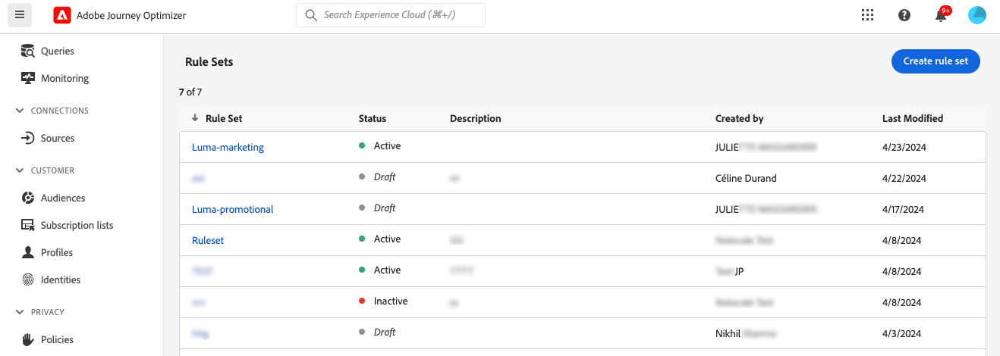

# Trabalhar com conjuntos de regras {#rule-sets}

>[!CONTEXTUALHELP]
>id="ajo_business_rules_rule_sets"
>title="Conjuntos de regras"
>abstract="Use conjuntos de regras para aplicar limites de frequência a diferentes tipos de comunicações de marketing. Você também pode criar conjuntos de regras para excluir jornadas para parte do público-alvo com base em regras de limite de frequência."

## Introdução aos conjuntos de regras {#gs}

### O que são conjuntos de regras? {#what}

Os conjuntos de regras permitem **agrupar várias regras em conjuntos de regras** e aplicá-las às jornadas e campanhas de sua escolha. Dessa forma, você tem mais granularidade para limitar a frequência e a quantidade de jornadas que um cliente pode inserir em um determinado intervalo de tempo ou controlar a frequência com que os usuários receberão uma mensagem, dependendo do tipo de comunicação.

Você pode criar dois tipos de conjuntos de regras:

* Os conjuntos de regras do **Canal** aplicam regras de limitação aos canais de comunicação. Por exemplo, não envie mais de 1 comunicação por email ou SMS por dia.
* Os conjuntos de regras **Jornada** aplicam regras de limite de simultaneidade e de entrada a uma jornada. Por exemplo, não insira perfis em mais de uma jornada simultaneamente.

➡️ [Conheça este recurso no vídeo](#video)

### Permissões {#permissions-frequency-rules}

Para trabalhar com regras de negócios, você precisa das seguintes permissões:

* **[!UICONTROL Exibir Regras de Frequência]**: acessar e exibir regras de negócios.
* **[!UICONTROL Gerenciar Regras de Frequência]**: Criar, editar ou excluir regras de negócios.

Saiba mais sobre permissões [nesta seção](../administration/high-low-permissions.md).

### Conjuntos de regras globais e personalizadas {#global-custom}

Ao acessar conjuntos de regras pela primeira vez no menu **[!UICONTROL Administração]** > **[!UICONTROL Regras de negócio]**, um conjunto de regras padrão é pré-criado e está ativo: **Conjunto de Regras Padrão Global**.

Esse conjunto de regras contém regras globais que podem ser aplicadas para controlar a frequência com que os usuários recebem mensagens em um ou vários canais. Todas as regras definidas nesse conjunto de regras se aplicam a todos os canais selecionados, independentemente de as comunicações serem enviadas de uma jornada ou campanha.

Além desse conjunto de regras &quot;Conjunto de regras padrão global&quot;, você pode criar **conjuntos de regras** que podem ser aplicados a qualquer jornada ou campanha para aplicar regras de limitação específicas. [Saiba como criar conjuntos de regras personalizados](#create)

## Criar e ativar conjuntos de regras {#Create}

>[!CONTEXTUALHELP]
>id="ajo_rule_set_domain"
>title="Domínio do conjunto de regras"
>abstract="Ao criar um conjunto de regras, é necessário determinar se as regras no conjunto aplicarão regras de limitação específicas para canais de comunicação ou jornadas."

>[!CONTEXTUALHELP]
>id="ajo_rule_sets_category"
>title="Selecionar a categoria da regra da mensagem"
>abstract="Quando ativadas e aplicadas a uma mensagem, todas as regras de frequência correspondentes à categoria selecionada serão automaticamente aplicadas a essa mensagem. Atualmente, somente a categoria Marketing está disponível."

<!--NOT USED?
[!CONTEXTUALHELP]
>id="ajo_rule_sets_capping"
>title="Set the capping for your rule"
>abstract="Specify the maximum number of messages sent to a customer profile within the chosen time frame. The frequency cap will be based on the selected calendar period and will be reset at the beginning of the corresponding time frame."-->

>[!CONTEXTUALHELP]
>id="ajo_rule_sets_duration"
>title="Selecionar a categoria da regra da mensagem"
>abstract="Quando ativadas e aplicadas a uma mensagem, todas as regras de frequência correspondentes à categoria selecionada serão automaticamente aplicadas a essa mensagem. Atualmente, somente a categoria Marketing está disponível."

>[!CONTEXTUALHELP]
>id="ajo_rule_set_rule_capping"
>title="Limite de regras"
>abstract="Definir a limitação para a regra. Dependendo do domínio do conjunto de regras e da seleção no campo “Tipo de regra”, este campo pode definir o número máximo de mensagens que podem ser enviadas a um perfil ou o número máximo de jornadas das quais o perfil pode participar ou nas quais pode ser inscrito simultaneamente."

Para criar um conjunto de regras, siga as etapas abaixo.

>[!NOTE]
>
>É possível criar até 10 conjuntos de regras locais ativos para o domínio do canal e para o domínio do jornada.

1. Acesse a lista **[!UICONTROL Conjuntos de regras]** e clique em **[!UICONTROL Criar conjunto de regras]**.

   

1. Defina um nome exclusivo para o conjunto de regras e adicione uma descrição.

1. Selecione o domínio do conjunto de regras e clique em **[!UICONTROL Salvar]**.

   * Domínio **Channel**: aplique regras de limitação para canais de comunicação.
   * Domínio **Jornada**: aplique regras de limite de entrada e simultaneidade a uma jornada.

   

1. Defina as regras que deseja adicionar a esse conjunto de regras. Para fazer isso, acesse o conjunto de regras e clique em **[!UICONTROL Adicionar regra]**.

1. Configure os parâmetros de regra para atender às suas necessidades. Os parâmetros disponíveis para a regra dependem do domínio do conjunto de regras selecionado em sua criação.

   Informações detalhadas sobre como configurar o jornada e as regras de limite de canal estão disponíveis nestas seções:

   * [limite de Jornada](../conflict-prioritization/journey-capping.md)
   * [Limite de frequência por canal e tipo de comunicação](../conflict-prioritization/channel-capping.md)

1. Clique em **[!UICONTROL Salvar]** para confirmar a criação da regra. Sua mensagem foi adicionada ao conjunto de regras, com o status **[!UICONTROL Rascunho]**.

   

1. Repita as etapas acima para adicionar quantas regras forem necessárias ao conjunto de regras.

1. Quando criada, uma regra tem o status **[!UICONTROL Rascunho]** e ainda não está afetando nenhuma mensagem. Para habilitá-lo, clique no botão **[!UICONTROL Mais ações]** ao lado da regra e selecione **[!UICONTROL Ativar]**.

   

1. Ative o conjunto de regras para aplicá-lo às suas jornadas e mensagens.

   

   >[!NOTE]
   >
   >Pode levar até 20 minutos para que uma regra ou um conjunto de regras seja totalmente ativado. Não é necessário modificar mensagens ou republicar jornadas para que uma regra entre em vigor.

<!--Currently, once a rule set is activated, no more rules can be added to that rule set.-->

1. É possível aplicar um conjunto de regras a uma mensagem ou jornada, dependendo do domínio selecionado ao criar o conjunto de regras.

   Informações detalhadas sobre como aplicar o conjunto de regras estão disponíveis nestas seções:

   * [Aplicar um conjunto de regras a uma jornada](../conflict-prioritization/journey-capping.md#apply-capping)
   * [Aplicar regras de limitação a uma mensagem](../conflict-prioritization/channel-capping.md#apply)

## Acessar e gerenciar conjuntos de regras {#access-rule-sets}

Todos os conjuntos de regras criados são exibidos no menu **[!UICONTROL Administração]** > **[!UICONTROL Regras de negócio]**. Eles são classificados por data da última modificação.

Clique no nome de um conjunto de regras para exibir e editar seu conteúdo. Todas as regras incluídas nesse conjunto de regras são listadas. O menu contextual na parte superior direita permite editar o nome e a descrição do conjunto de regras, ativá-lo e excluí-lo.

Para cada regra no conjunto de regras, o botão **[!UICONTROL Mais ações]** permite editar a regra, ativá-la e excluí-la.

Para desativar uma regra ou um conjunto de regras, clique no botão **[!UICONTROL Mais ações]** ao lado do item desejado e selecione **[!UICONTROL Desativar]**.

Seu status será alterado para **[!UICONTROL Inativo]** e a regra não se aplicará a futuras execuções de mensagem. As mensagens em execução no momento não serão afetadas.

>[!NOTE]
>
>A desativação de uma regra ou conjunto de regras não afeta ou redefine qualquer contagem em perfis individuais.

## Vídeo tutorial {#video}

>[!VIDEO](https://video.tv.adobe.com/v/3444731?quality=12&captions=por_br)
