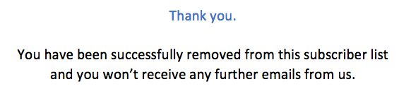

# Gerenciar recusa {#consent}

Use o [!DNL Journey Optimizer] para rastrear o consentimento dos recipients para comunicação e entender como eles desejam se envolver com a marca gerenciando suas preferências e assinaturas. <!--Their preferences and subscriptions are handled through Consent management.-->

Regulamentos como o GDPR afirmam que você deve estar em conformidade com requisitos específicos antes de poder usar informações de titulares de dados. Além disso, os titulares de dados devem poder modificar o consentimento a qualquer momento.

**Por que é importante?**

* O não cumprimento desses regulamentos traz riscos legais normativos para sua marca.
* Os regulamentos ajudam a evitar o envio de comunicações não solicitadas para seus recipients, o que pode fazer com que eles marquem suas mensagens como spam e prejudiquem sua reputação.

Saiba mais sobre como gerenciar a privacidade e os regulamentos aplicáveis na [Documentação do Experience Platform](https://experienceleague.adobe.com/docs/experience-platform/privacy/home.html?lang=pt-BR){target=&quot;_blank&quot;}.

<!--* Recipients should be able to opt-in/opt-out from receiving electronic communication through one or more channel
* Recipients expect the brand to offer preference centre capability that controls how brand should engage with them (example: channel of communication, invasive and non-invasive tracking etc). This helps to fulfil regulatory obligations and also facilitates quality engagement with recipient. 
* The third category is the capability to offer subscription to recipients (newsletter, etc)-->

## Gerenciamento de recusa {#opt-out-management}

Oferecer a capacidade de cancelar a assinatura dos recipients ao receberem comunicações de uma marca é um requisito legal. Saiba mais sobre a legislação aplicável no [Documentação do Experience Platform](https://experienceleague.adobe.com/docs/experience-platform/privacy/regulations/overview.html#regulations){target=&quot;_blank&quot;}.

Portanto, você sempre deve incluir um **link para cancelar a inscrição** em cada email enviado aos recipients:

* Ao clicar nesse link, os recipients serão direcionados a uma página de aterrissagem que inclui um botão para confirmar a recusa.
* Ao clicar no botão de recusa, será feita uma chamada do Adobe I/O para atualizar os dados do perfil com essas informações. [Saiba mais](#consent-service-api).

### Adicionar um link de cancelamento de subscrição {#add-unsubscribe-link}

Para adicionar um link de cancelamento de inscrição, siga as etapas abaixo:

1. Crie sua página de aterrissagem de unsubscription.

1. Hospede-o no sistema de terceiros de sua escolha.

1. [Criar uma mensagem](../../help/using/create-message.md) no [!DNL Journey Optimizer].

   <!--The link to your landing page should contain a static URL and the profile ID.-->

1. Selecione o texto no seu conteúdo e insira um link usando a barra de ferramentas contextual.

   

1. Selecione o **[!UICONTROL Unsubscription link]** na lista suspensa **[!UICONTROL Link type]**.

   

1. No **[!UICONTROL Link]** cole o link na página de aterrissagem.

   

1. Clique em **[!UICONTROL Save]**.

1. Salve o conteúdo e [publique a mensagem](../../help/using/publish-manage-message.md).

   >[!NOTE]
   >
   >O URL da página de aterrissagem de terceiros incluirá três parâmetros que serão usados para atualizar as preferências dos perfis por meio de uma chamada do Adobe I/O. [Saiba mais nesta seção](#consent-service-api).

1. Envie sua mensagem com o link para a página de aterrissagem por meio de uma [jornada](building-journeys/journey.md).

1. Depois que a mensagem for recebida, se o recipient clicar no link de cancelamento de inscrição, a página de aterrissagem será exibida.

   

1. Se o recipient clicar no botão de recusa na página de aterrissagem (aqui, o botão **Cancelar inscrição**), os dados do perfil serão atualizados por meio de uma [chamada do Adobe I/O](#opt-out-api).

   O recipient que recusou a inscrição é então redirecionado para uma tela de mensagem de confirmação indicando que a recusa foi bem-sucedida.

   

   Como resultado, esse usuário não receberá a comunicação da sua marca, a menos que faça a assinatura novamente.

Para verificar se a escolha do perfil correspondente foi atualizada, acesse a Experience Platform e o perfil selecionando um namespace de identidade e um valor de identidade correspondente. Saiba mais na [Documentação do Experience Platform](https://experienceleague.adobe.com/docs/experience-platform/profile/ui/user-guide.html#getting-started){target=&quot;_blank&quot;}.


Na guia **[!UICONTROL Attributes]**, é possível ver que o valor de **[!UICONTROL choice]** foi alterado para **[!UICONTROL no]**.

<!--The opt-out URL is resolved upon each recipient receiving the message. It is then personalized with the relevant encrypted parameters (profile ID, profile name, journey ID, sandbox ID, and message execution ID).-->

### Chamada de API de recusa {#opt-out-api}

Depois que o recipient optar por cancelar a inscrição, uma API do Adobe I/O<!--Consent service API to capture the encrypted data and-->será chamada para atualizar a preferência do perfil correspondente.

Essa chamada POST do Adobe I/O é a seguinte:

Endpoint: platform.adobe.io/journey/imp/consent/preferences
<!--This is the new AEP specific AEP for consent instead of the AJO consent API that was previously used: cjm.adobe.io/imp/consent/preferences-->

Parâmetros de consulta:

* **params**: contém a carga criptografada
* **sig**: assinatura <!--which signature?-->
* **pid**: ID de perfil criptografada

Esses parâmetros estão disponíveis no link de cancelamento de inscrição enviado para o recipient, ou seja, o URL que abrirá a página de aterrissagem de terceiros para determinado recipient:


<!--QUESTION: How do you get the URL built for each recipient? Do you have to wait until each targeted recipient receives the unsubscribe link or can you deduce it in advance? Is it done automatically upon the API call or do you have to do something manually for each profile? In other words will the LP automatically include the 3 parameters or do you have to insert something manually? Still not completely clear-->

Requisitos do cabeçalho:

* x-api-key
* x-gw-ims-org-id
* x-sandbox-name
* autorização (token de usuário da conta técnica) <!--How do you find this information? And other header elements?-->

Corpo da solicitação:

```
{
   "marketing": [
       {
            "type": "email",           
            "choice": "no",          
            "scope": "channel"       
        }
    ],
 
}
```

<!--The Consent service /-->[!DNL Journey Optimizer] will <!--decrypt and-->use these parameters to update the corresponding profile's choice.
<!--and provide an answer back to the landing page.-->

## Cancelamento de um clique {#one-click-opt-out}

À medida que muitos clientes buscam um processo mais fácil de cancelar a assinatura, você também pode adicionar um link para opção de não participação com um clique no seu conteúdo de email. Esse link permitirá que seus recipients cancelem rapidamente a assinatura de suas comunicações, sem serem redirecionados para uma página de aterrissagem onde precisam confirmar a recusa.

Saiba como adicionar um link para opção de não participação ao conteúdo da mensagem em [esta seção](message-tracking.md#one-click-opt-out-link).

Depois que a mensagem for enviada por meio de um [jornada](building-journeys/journey.md), se um recipient clicar no link para opção de não participação, seu perfil será rejeitado imediatamente.

## Link de cancelamento de inscrição no cabeçalho {#unsubscribe-email}

Se o sistema de email dos destinatários suportar a exibição de um link de cancelamento de inscrição no cabeçalho do email, os emails enviados com o [!DNL Journey Optimizer] incluirão automaticamente este link.

Por exemplo, o link de cancelamento de inscrição será exibido assim no Gmail:


Dependendo do sistema de email, clicar no link de cancelamento de inscrição no cabeçalho terá um dos seguintes resultados:

* O perfil correspondente é cancelado imediatamente e essa escolha é atualizada no Experience Platform. Saiba mais na [Documentação do Experience Platform](https://experienceleague.adobe.com/docs/experience-platform/profile/ui/user-guide.html#getting-started){target=&quot;_blank&quot;}.

* Isso tem o mesmo efeito que clicar no link de cancelamento de inscrição no conteúdo do email: o destinatário é redirecionado a uma página de aterrissagem, em que encontrará um botão para confirmar a recusa. Saiba mais sobre o gerenciamento de recusa [nesta seção](#opt-out-management).

## Encaminhar o gerenciamento de recusa {#push-opt-out-management}

Os recipients de push podem cancelar a inscrição por meio de seus próprios dispositivos.

Por exemplo, ao baixar ou ao usar seu aplicativo, eles podem optar por parar as notificações. Da mesma forma, é possível alterar as configurações de notificação por meio do sistema operacional móvel.
