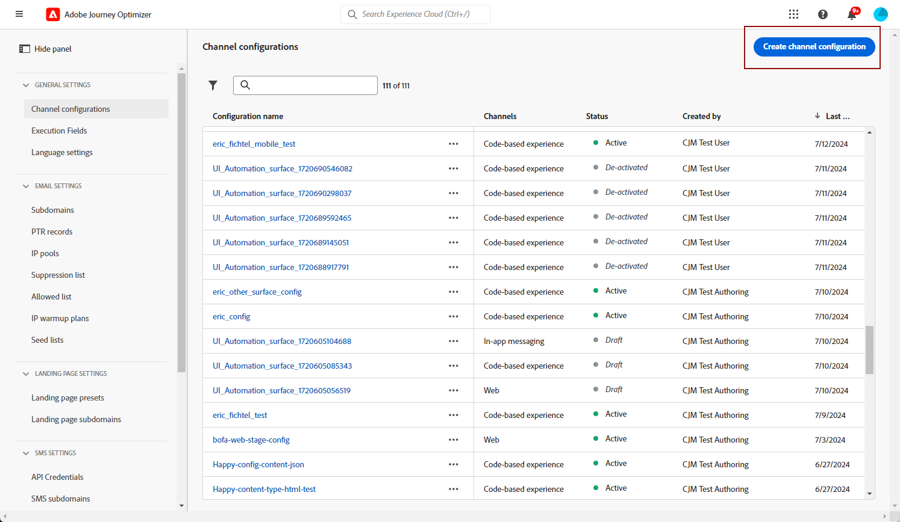
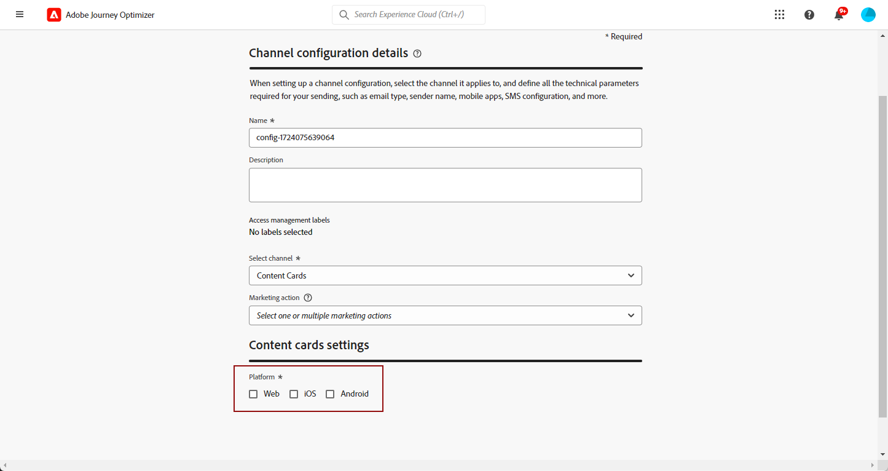

# Configurar cartões de Conteúdo {#content-card-configuration}

## O que é uma configuração? {#surface-definition}

Uma **configuração de experiência do cartão de conteúdo** é qualquer entidade projetada para interação do usuário ou do sistema, que é exclusivamente identificada por um **URI**.

Em outras palavras, uma superfície pode ser vista como um container em qualquer nível de hierarquia com uma entidade (ponto de contato) que existe.

* Pode ser uma página da Web, um aplicativo para dispositivos móveis, um aplicativo de desktop, um local de conteúdo específico em uma entidade maior (por exemplo, um `div`) ou um padrão de exibição não padrão (por exemplo, um quiosque ou um banner de aplicativo de desktop).

* Ela também pode se estender para partes específicas de containers de conteúdo para fins de não exibição ou exibição abstrata (por exemplo, blobs JSON fornecidos aos serviços).

* Também pode ser uma superfície curinga que corresponde a várias definições de superfície do cliente (por exemplo, um local de Hero image em cada página do site pode ser traduzido em um URI de superfície como: web://mydomain.com/*#hero_image).

Basicamente, um URI de superfície é composto por várias seções:

1. **Tipo**: web, aplicativo móvel, ATM, quiosque, TVCD, serviço etc.
1. **Propriedade**: URL da página ou pacote de aplicativos
1. **Container**: local na atividade da página/aplicativo

A tabela abaixo lista alguns exemplos de definição de URI de superfície para vários dispositivos.

**Web e dispositivos móveis**

| Tipo | URI | Descrição |
| --------- | ----------- | ------- | 
| Web | `web://domain.com/path/page.html#element` | Representa um elemento individual em uma página específica de um domínio específico, onde um elemento pode ser um rótulo, como nos seguintes exemplos: hero_banner, top_nav, menu, rodapé etc. |
| Aplicativo para iOS | `mobileapp://com.vendor.bundle/activity#element` | Representa um elemento específico em uma atividade do aplicativo nativo, como um botão ou outro elemento de exibição. |
| Aplicativo para Android | `mobileapp://com.vendor.bundle/#element` | Representa um elemento específico em um aplicativo nativo. |

**Outros tipos de dispositivo**

| Tipo | URI | Descrição |
| --------- | ----------- | ------- | 
| Desktop | `desktop://com.vendor.bundle/#element` | Representa um elemento específico em um aplicativo, como um botão, menu, banner hero, etc. |
| Aplicativo de TV | `tvcd://com.vendor.bundle/#element` | Representa um elemento específico de uma Smart TV ou um aplicativo em um dispositivo conectado a uma TV: ID do pacote. |
| Serviço | `service://servicename/#element` | Representa um processo do lado do servidor ou outra entidade manual. |
| Quiosque | `kiosk://location/screen#element` | Exemplo de possíveis tipos de superfície adicionais que podem ser adicionados facilmente. |
| ATM | `atm://location/screen#element` | Exemplo de possíveis tipos de superfície adicionais que podem ser adicionados facilmente. |

**Superfícies curingas**

| Tipo | URI | Descrição |
| --------- | ----------- | ------- | 
| Web com curinga | `wildcard:web://domain.com/*#element` | Superfície curinga: representa um elemento individual em cada uma das páginas em um domínio específico. |
| Web com curinga | `wildcard:web://*domain.com/*#element` | Superfície curinga: representa um elemento individual em cada uma das páginas em todos os domínios que terminam em “domain.com”. |

## Criar uma configuração de cartão de conteúdo {#create-config}

1. Acesse o menu **[!UICONTROL Canais]** > **[!UICONTROL Identidade visual]** > **[!UICONTROL Configurações de canal]** e clique em **[!UICONTROL Criar configuração de canal]**.

   

1. Insira um nome e uma descrição (opcional) para a configuração.

   >[!NOTE]
   >
   > Os nomes devem começar com uma letra (A-Z). Ele só pode conter caracteres alfanuméricos. Também é possível usar sublinhado `_`, ponto`.` e hífen `-` caracteres.

1. Para atribuir rótulos de uso de dados personalizados ou de núcleo à configuração, você pode selecionar **[!UICONTROL Gerenciar acesso]**. [Saiba mais sobre OLAC (Controle de Acesso em Nível de Objeto)](../administration/object-based-access.md).

1. Selecione o canal **[!UICONTROL Cartão de conteúdo]**.

   

1. Selecione **[!UICONTROL Ação de marketing]**(s) para associar políticas de consentimento às mensagens que usam essa configuração. Todas as políticas de consentimento associadas à ação de marketing são utilizadas para respeitar as preferências dos clientes. [Saiba mais](../action/consent.md#surface-marketing-actions)

1. Selecione a plataforma para a qual a experiência de cartão de conteúdo será aplicada.

   

1. Para a Web:

   * Especifique uma **[!UICONTROL URL da página]** para aplicar as alterações a uma única página exclusivamente.

   * Ou crie uma **[!UICONTROL Regra de correspondência de páginas]** para direcionar várias URLs que correspondam à regra especificada. Por exemplo, isso pode ser usado para aplicar alterações universalmente em um site, como atualizar um banner principal em todas as páginas ou adicionar uma imagem superior para exibir em cada página de produto. [Saiba mais](../web/web-configuration.md)

1. Para iOS e Android:

   * Insira ou selecione sua **[!UICONTROL ID do aplicativo]**, **[!UICONTROL Localização ou caminho dentro do aplicativo]** e **[!UICONTROL URL de Visualização]**.

1. Envie suas alterações.

Agora você pode selecionar sua configuração ao criar sua experiência com o cartão de Conteúdo.
