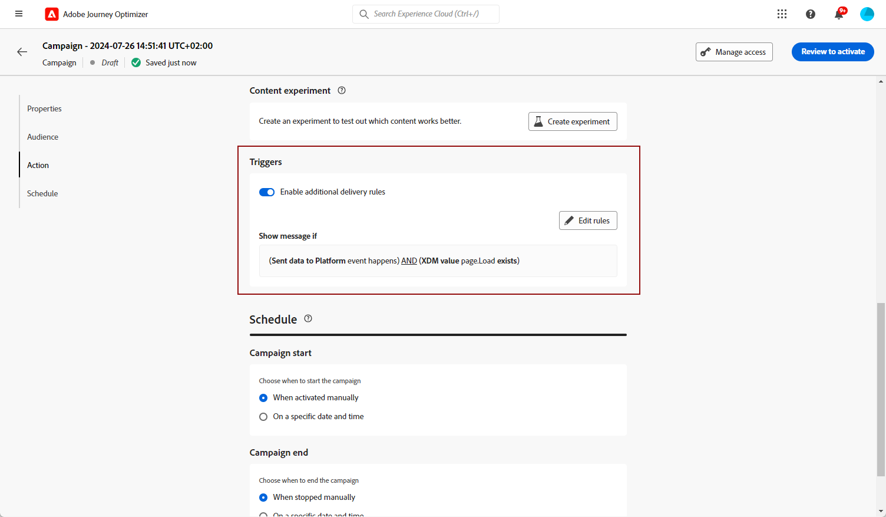

# Criar cartões de conteúdo {#create-content-card}

>[!BEGINSHADEBOX]

**Índice**

* [Introdução a cartões de conteúdo](get-started-content-card.md)
* [Pré-requisitos dos cartões de conteúdo](content-card-configuration-prereq.md)
* [Configurar canal de cartões de conteúdo no Journey Optimizer](content-card-configuration.md)
* **Criar cartões de conteúdo**
* [Criar cartões de conteúdo](design-content-card.md)
* [Relatório de cartões de conteúdo](content-card-report.md)

>[!ENDSHADEBOX]

>[!AVAILABILITY]
>
>Atualmente, os cartões de conteúdo estão disponíveis apenas para algumas organizações (disponibilidade limitada). Para obter acesso, entre em contato com seu representante da Adobe.

>[!BEGINTABS]

>[!TAB Adicionar cartões de Conteúdo a uma jornada]

Para adicionar cartões de Conteúdo a uma jornada, siga estas etapas:

1. Abra a jornada e arraste e solte uma atividade de **[!UICONTROL Cartão]** da seção **[!UICONTROL Ações]** da paleta.

   

1. Insira um **[!UICONTROL Rótulo]** e uma **[!UICONTROL Descrição]** para a mensagem.

1. Escolha a [configuração do cartão de conteúdo](content-card-configuration.md) para usar.

   

1. Agora você pode começar a criar seu conteúdo com o botão **[!UICONTROL Editar conteúdo]**. [Saiba mais](design-content-card.md)

1. Habilite a opção **[!UICONTROL Habilitar regras de entrega adicionais]**. Em seguida, **[!UICONTROL Edite as regras]** para escolher o(s) evento(s) e os critérios que acionarão sua mensagem. Os construtores de regras permitem que os usuários especifiquem critérios e valores que, quando atendidos, acionam um conjunto de ações.

   

   1. Clique em **[!UICONTROL Adicionar condição]** para selecionar seu evento.

      +++Consulte Evento disponível.

      | Pacote | Acionador | Definição |
      |---|---|---|
      | Enviar dados para a Platform | Dados enviados para a plataforma | Acionado quando o aplicativo móvel emite um evento de experiência de borda para enviar dados ao Adobe Experience Platform. Normalmente, a chamada de API [sendEvent](https://developer.adobe.com/client-sdks/documentation/edge-network/api-reference/#sendevent) da extensão do AEP Edge. |
      | Rastreamento principal | Rastrear ação | Acionado quando a funcionalidade herdada oferecida na API de código móvel [trackAction](https://developer.adobe.com/client-sdks/documentation/mobile-core/api-reference/#trackaction) é chamada. |
      | Rastreamento principal | Rastrear estado | Acionado quando a funcionalidade herdada oferecida na API de código móvel [trackState](https://developer.adobe.com/client-sdks/documentation/mobile-core/api-reference/#trackstate) é chamada. |
      | Rastreamento principal | Coletar PII | Acionado quando a funcionalidade herdada oferecida na API de código móvel [collectPII](https://developer.adobe.com/client-sdks/documentation/mobile-core/api-reference/#collectpii) é chamada. |
      | Ciclo de vida do aplicativo | Inicialização do aplicativo | Acionadas a cada execução, incluindo falhas e instalações. Também é acionado em um resumo do plano de fundo quando o tempo limite da sessão do ciclo de vida é excedido. |
      | Ciclo de vida do aplicativo | Instalação do aplicativo | Disparado na primeira execução após a instalação ou reinstalação. |
      | Ciclo de vida do aplicativo | Atualização de aplicativo | Disparado na primeira execução após uma atualização ou quando o número da versão é alterado. |
      | Ciclo de vida do aplicativo | Fechamento do aplicativo | Disparado quando o aplicativo é fechado. |
      | Ciclo de vida do aplicativo | Falha de aplicativo | Disparado quando o aplicativo não estiver em segundo plano antes do fechamento. O evento é enviado quando o aplicativo é iniciado após a falha. O relatório de falha do Adobe Mobile não implementa um gerenciador de exceção global não detectado. |

+++

   1. Escolha a condição **[!UICONTROL Or]** se quiser adicionar mais **[!UICONTROL Triggers]** para expandir ainda mais sua regra.

   1. Escolha a condição **[!UICONTROL And]** se desejar adicionar **[!UICONTROL Características]** e ajustar melhor sua regra.

      +++Consulte as Características disponíveis.

      | Pacote | Traços | Definição |
      |---|---|---|
      | Informações do dispositivo | Nome da operadora | Acionado quando um dos nomes da operadora da lista é atendido. |
      | Informações do dispositivo | Nome do dispositivo | Acionado quando um dos nomes do dispositivo é atendido. |
      | Informações do dispositivo | Localidade | Acionado quando um dos idiomas da lista é atendido. |
      | Informações do dispositivo | Versão do sistema operacional | Disparado quando uma das versões do sistema operacional especificadas é atendida. |
      | Informações do dispositivo | Versão anterior do sistema operacional | Disparado quando uma das versões anteriores do sistema operacional é atendida. |
      | Informações do dispositivo | Modo de execução | Acionado se o modo Executar for aplicativo ou extensão. |
      | Ciclo de vida do aplicativo | ID do aplicativo | Acionado quando a ID do aplicativo especificada é atendida. |
      | Ciclo de vida do aplicativo | Dia da semana | Acionado quando o dia da semana especificado é atendido. |
      | Ciclo de vida do aplicativo | Dia desde a primeira visita | Disparado quando o número especificado de dias desde a primeira utilização é atingido. |
      | Ciclo de vida do aplicativo | Dia desde a última visita | Disparado quando o número especificado de dias desde a última utilização é atingido. |
      | Ciclo de vida do aplicativo | Dia desde a atualização | Disparado quando o número especificado de dias desde a última atualização é atingido. |
      | Ciclo de vida do aplicativo | Data de instalação | Disparado quando a data de instalação especificada é atingida. |
      | Ciclo de vida do aplicativo | Lançamentos | Disparado quando o número especificado de inicializações é atingido. |
      | Ciclo de vida do aplicativo | Hora do dia | Disparado quando o horário especificado é cumprido. |

+++

   1. Clique em **[!UICONTROL Criar grupo]** para agrupar acionadores.

1. Se necessário, conclua o fluxo de jornada arrastando e soltando ações ou eventos adicionais. [Saiba mais](../building-journeys/about-journey-activities.md)

1. Quando o cartão de Conteúdo estiver pronto, finalize a configuração e publique sua jornada para ativá-lo.

Para obter mais informações sobre como configurar uma jornada, consulte [esta página](../building-journeys/journey-gs.md).

>[!TAB Adicionar cartões de Conteúdo a uma campanha]

Para começar a criar seus cartões de conteúdo por meio de uma campanha, siga as etapas abaixo.

1. Crie uma campanha. [Saiba mais](../campaigns/create-campaign.md)

1. Selecione o tipo de campanha que deseja executar

   * **[!UICONTROL Agendado - Marketing]**: execute a campanha imediatamente ou em uma data especificada. As campanhas agendadas têm como objetivo enviar mensagens de **marketing**. Eles são configurados e executados na interface do usuário do.

   * **[!UICONTROL Acionado por API - Marketing/Transacional]**: execute a campanha usando uma chamada de API. As campanhas acionadas por API têm como objetivo enviar **mensagens de marketing** ou **mensagens transacionais**, ou seja, mensagens enviadas após uma ação executada por um indivíduo: redefinição de senha, compra de carrinho etc. [Saiba como acionar uma campanha usando APIs](../campaigns/api-triggered-campaigns.md)

   

1. Na seção **[!UICONTROL Properties]**, especifique um nome e uma descrição para a campanha.

1. Na seção **Público-alvo**, clique no botão **[!UICONTROL Selecionar público-alvo]** para exibir a lista de públicos-alvo do Adobe Experience Platform disponíveis. [Saiba mais sobre públicos-alvo](../audience/about-audiences.md)

1. No campo **[!UICONTROL Namespace de identidade]**, escolha o namespace a ser usado para identificar os indivíduos do segmento selecionado. [Saiba mais sobre namespaces](../event/about-creating.md#select-the-namespace)

1. Selecione a ação **[!UICONTROL Cartão de conteúdo]**.

   

1. Selecione ou crie uma nova [Configuração do cartão de conteúdo](content-card-configuration.md).

1. Para testar o conteúdo da mensagem, clique em **[!UICONTROL Criar experimento]**. Isso permite testar várias variáveis de um delivery em populações de amostra para determinar qual tratamento tem o maior impacto no público-alvo direcionado. [Saiba mais sobre o experimento de conteúdo](../content-management/content-experiment.md).

1. Se forem necessários acionadores adicionais, use a opção **[!UICONTROL Habilitar regras de entrega adicionais]**. Regras de entrega adicionais não são necessárias.

   Clique em **[!UICONTROL Editar acionadores]** para selecionar o(s) evento(s) e os critérios para entrega de mensagens. O construtor de regras permite especificar condições e valores que, quando atendidos, acionam ações.

   

1. Você pode agendar sua campanha para uma data específica ou definir para recorrência em intervalos regulares. [Saiba mais](../campaigns/create-campaign.md#schedule)

1. Agora você pode começar a criar seu conteúdo com o **[!UICONTROL Editar conteúdo]**. [Saiba mais](design-content-card.md)

   

>[!ENDTABS]
