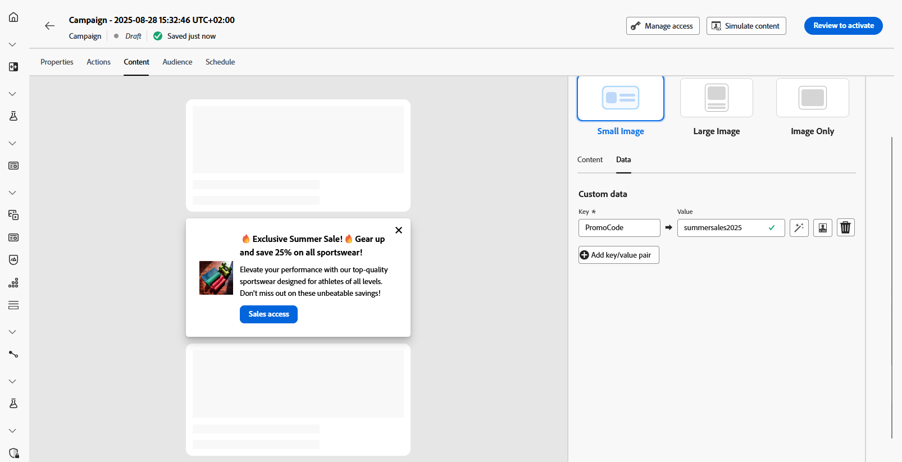

# Criar conteúdo de cartões de conteúdo {#design-content-card}

A construção de criação para Cartões fornece uma experiência de criação baseada em formulário que fornece aos profissionais de marketing entradas básicas que podem ser usadas para serem renderizadas pelo desenvolvedor.

Depois que o conteúdo é definido e personalizado, você pode revisá-lo e ativá-lo. Sua campanha será enviada de acordo com o agendamento definido. [Saiba mais nesta página](../campaigns/review-activate-campaign.md).

## Layout do cartão de conteúdo

Na seção **[!UICONTROL Layout do cartão de conteúdo]**, escolha uma das três opções de layout de imagem com base nos requisitos de mensagens.

* **[!UICONTROL Imagem pequena]**: exibe uma imagem compacta junto com o texto, ideal para mensagens em que o conteúdo tem prioridade sobre as imagens.

* **[!UICONTROL Imagem grande]**: apresenta uma imagem proeminente acima ou ao lado do texto, tornando as exibições o foco principal da mensagem.

* **[!UICONTROL Somente imagem]**: mostra a imagem sem o texto de acompanhamento, perfeita para mensagens orientadas por visuais ou imagens autônomas.

## Guia Conteúdo {#content-tab}

Na guia **[!UICONTROL Conteúdo]**, você pode personalizar seus cartões de conteúdo definindo conteúdo e adicionando mídia e botões de ação diretamente nesta guia.

### Conteúdo do texto {#title-body}

Para redigir a mensagem, digite o texto nos campos **[!UICONTROL Título]** e **[!UICONTROL Corpo]**.

Se desejar personalizar ainda mais sua mensagem, use o ícone **[!UICONTROL Personalization]** para adicionar elementos personalizados. Para obter instruções detalhadas sobre como usar os recursos de personalização, consulte [esta seção](../personalization/personalize.md).

### Mídia {#add-media}

O campo **[!UICONTROL Mídia]** permite que você aprimore seus cartões de conteúdo adicionando mídia, o que pode tornar sua apresentação mais envolvente para os usuários finais.

Para incluir mídia, digite a URL da mídia que deseja usar ou clique no ícone **[!UICONTROL Selecionar Assets]** para escolher entre os ativos armazenados na biblioteca do Assets. [Saiba mais sobre o gerenciamento de ativos](../integrations/assets.md).

+++Mais opções com formatação avançada

Se o **[!UICONTROL Modo de formatação avançado]** estiver ativado, você poderá adicionar um **[!UICONTROL Texto alternativo]** para aplicativos de leitura de tela e outro ativo no campo **[!UICONTROL URL de Mídia de Modo Escuro]**.

+++

### Botão Fechar {#close-button}

Escolha o **[!UICONTROL Estilo]** do seu **[!UICONTROL botão Fechar]** para personalizar sua aparência.

Você pode selecionar entre os seguintes estilos:

* **[!UICONTROL Nenhum]**
* **[!UICONTROL Simples]**
* **[!UICONTROL Círculo]**

<!--
+++More options with advanced formatting

If the **[!UICONTROL Advanced formatting mode]** is switched on, you can choose for your **[!UICONTROL Header]** and **[!UICONTROL Body]**:

* the **[!UICONTROL Font]**
* the **[!UICONTROL Pt size]**
* the **[!UICONTROL Font Color]**
* the **[!UICONTROL Alignment]**
+++
-->

### Botões {#add-buttons}

Adicione botões para que os usuários interajam com seus cartões de conteúdo.

1. Clique no **[!UICONTROL Botão Adicionar]** para criar um novo botão de ação.

1. Edite o campo de botão **[!UICONTROL Título]** para especificar o rótulo que será exibido no botão.

1. Selecione um **[!UICONTROL Interagir evento]** para definir qual ação será acionada quando os usuários clicarem ou interagirem com o botão.

1. No campo **[!UICONTROL Destino]**, digite a URL da Web ou o deep link para o qual os usuários serão direcionados após interagirem com o botão.

<!--
+++More options with advanced formatting

If the **[!UICONTROL Advanced formatting mode]** is switched on, you can choose for your **[!UICONTROL Buttons]**:

* the **[!UICONTROL Font]**
* the **[!UICONTROL Pt size]**
* the **[!UICONTROL Font Color]**
* the **[!UICONTROL Alignment]**

+++
-->

### Comportamento ao clicar

No campo **[!UICONTROL URL de Destino]**, insira a URL da Web ou o deep link que direcionará os usuários para o destino desejado depois que eles interagirem com seu cartão de conteúdo. Pode ser um site externo, uma página específica no aplicativo ou qualquer outro local para o qual você deseja que os usuários sejam direcionados com base em sua interação.

## Guia Dados

## Dados personalizados {#custom-data}

Na seção **[!UICONTROL Dados personalizados]**, clique em **[!UICONTROL Adicionar par de chave/valor]** para incluir variáveis personalizadas na carga. Esses pares chave/valor permitem transmitir dados adicionais, dependendo da configuração específica. Isso permite adicionar conteúdo personalizado ou dinâmico, informações de rastreamento ou quaisquer outros dados relevantes para sua configuração.
