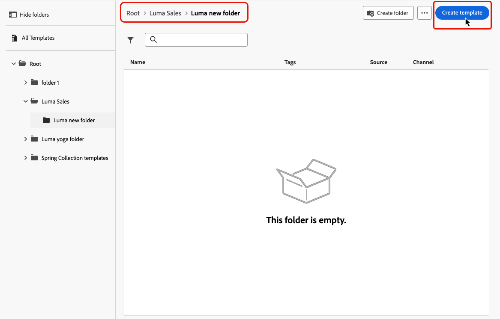

# Acessar e gerenciar modelos de conteúdo {#access-manage-templates}

## Acessar modelos de conteúdo {#access}

Para acessar a lista de modelos de conteúdo, selecione **[!UICONTROL Content Management]** > **[!UICONTROL Content Templates]** no menu esquerdo.

Todos os modelos criados na sandbox atual—de uma jornada ou campanha usando a opção **[!UICONTROL Salvar como modelo]**, ou do menu **[!UICONTROL Modelos de conteúdo]**—são exibidos. [Saiba como criar modelos](#create-content-templates)

O painel à esquerda permite organizar modelos de conteúdo em pastas. Por padrão, todos os modelos são exibidos. Ao selecionar uma pasta, somente os modelos e as pastas incluídos na pasta selecionada são exibidos. [Saiba mais](#folders)

Para localizar um item específico, comece digitando um nome no campo de pesquisa. Quando uma [pasta](#folders) é selecionada, a pesquisa se aplica a todos os modelos de conteúdo ou pastas no primeiro nível de hierarquia dessa pasta<!--(not nested items)-->.

Você pode classificar modelos de conteúdo por:

* Tipo
* Canal
* Data de criação ou modificação
* Marcas - [Saiba mais sobre marcas](../start/search-filter-categorize.md#tags)

Você também pode optar por exibir somente os itens criados ou modificados por você.

>[!NOTE]
>
>A partir de março de 2025, os modelos de conteúdo do tipo HTML serão descontinuados. Você ainda pode acessar modelos de conteúdo HTML existentes criados anteriormente no [!DNL Journey Optimizer].

## Usar pastas para gerenciar modelos de conteúdo {#folders}

Para navegar facilmente pelos modelos de conteúdo, use pastas para organizá-los com mais eficiência em uma hierarquia estruturada. Isso permite categorizar e gerenciar os itens de acordo com as necessidades da organização.

1. Clique no botão **[!UICONTROL Todos os modelos de conteúdo]** para exibir todos os itens criados anteriormente sem o agrupamento de pastas.

1. Clique na pasta **[!UICONTROL Raiz]** para exibir todas as pastas criadas.

   >[!NOTE]
   >
   >Se você ainda não criou pastas, todos os modelos de conteúdo são exibidos.

1. Clique em qualquer pasta dentro da pasta **[!UICONTROL Raiz]** para exibir seu conteúdo.

1. Ao clicar na pasta **[!UICONTROL Raiz]** ou em qualquer outra pasta, o botão **[!DNL Create folder]** é exibido. Selecione-o.

   

1. Digite um nome para a nova pasta e clique em **[!UICONTROL Salvar]**. A nova pasta é exibida na parte superior da lista de modelos de conteúdo dentro da pasta **[!UICONTROL Raiz]** ou dentro da pasta selecionada no momento.

1. Clique no botão **[!UICONTROL Mais ações]** para renomear ou excluir a pasta.

   

1. Usando o botão **[!UICONTROL Mais ações]**, você também pode mover o modelo de conteúdo para outra pasta existente.

   

1. Navegue até a pasta que acabou de criar. Cada novo modelo de conteúdo que você [cria](create-content-templates.md) daqui é salvo na pasta atual.

   

## Editar e excluir modelos de conteúdo {#edit}

* Para editar o conteúdo de um modelo, clique no item desejado na lista e faça as alterações desejadas. Também é possível editar as propriedades do template de conteúdo clicando no botão de edição ao lado do nome do template.

  

* Para excluir um modelo, selecione o botão **[!UICONTROL Mais ações]** ao lado do modelo desejado e selecione **[!UICONTROL Excluir]**.

  

>[!NOTE]
>
>Quando um modelo é editado ou excluído, as campanhas ou jornadas, incluindo o conteúdo criado usando esse modelo, não são afetadas.

## [!BADGE Disponibilidade limitada]{type=Informative} Exibir modelos como miniaturas {#template-thumbnails}

Selecione o modo de **[!UICONTROL exibição de grade]** para exibir cada modelo como uma miniatura.

>[!AVAILABILITY]
>
>Esse recurso foi lançado com disponibilidade limitada (DL) para um pequeno grupo de clientes.

>[!NOTE]
>
>Miniaturas apropriadas só podem ser geradas para modelos de conteúdo de email do tipo HTML.

Ao atualizar o conteúdo, aguarde alguns segundos para que as alterações sejam refletidas na miniatura.

## Exportar modelos de conteúdo para outra sandbox {#export}

O Journey Optimizer permite copiar um modelo de conteúdo de uma sandbox para outra. Por exemplo, você pode copiar um modelo do seu ambiente de sandbox de Preparo para a sua sandbox de Produção.

O processo de cópia é realizado por meio de uma **exportação e importação de pacotes** entre as sandboxes de origem e destino. Informações detalhadas sobre como exportar objetos e importá-los para uma sandbox de destino estão disponíveis nesta seção: [Copiar objetos para outra sandbox](../configuration/copy-objects-to-sandbox.md)

