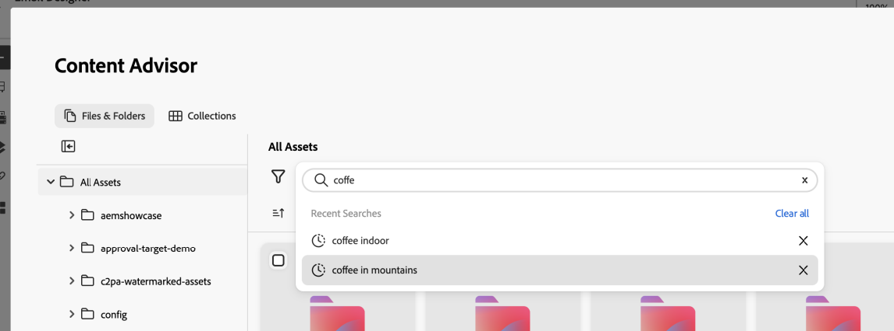
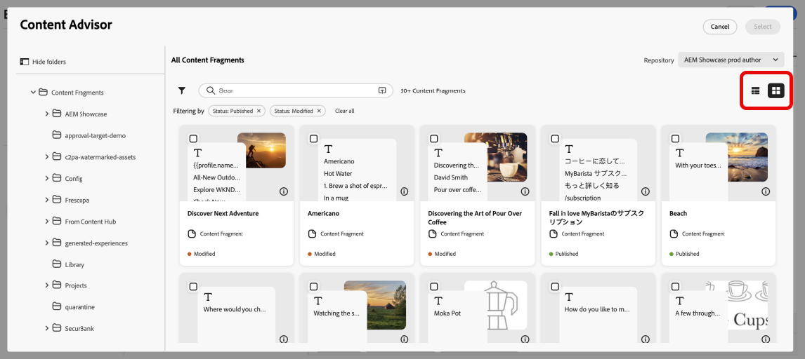
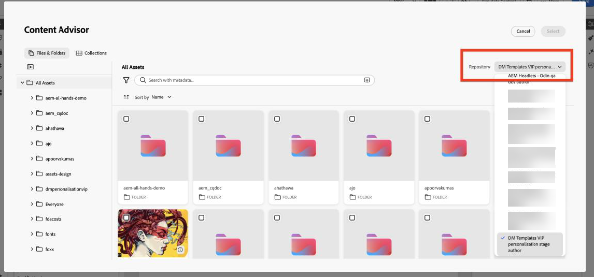

# Trabalhar com o Supervisor de conteúdo do Adobe Experience Manager {#aem-content-advisor}

>[!AVAILABILITY]
>
>O Adobe Experience Manager Content Advisor está disponível somente em workflows de criação de canal.

O Adobe Experience Manager Content Advisor substitui a detecção determinística pela detecção padronizada orientada por intenções a partir de uma superfície unificada. Ele permite a detecção unificada e baseada em IA do Assets e de fragmentos de conteúdo diretamente nos fluxos de trabalho de criação do Journey Optimizer, melhorando a produtividade do profissional de marketing e a eficiência da campanha.

## Recursos disponíveis

### Para Assets {#asset-features}

O Adobe Experience Manager Content Advisor oferece os seguintes recursos de ativos:

* &#x200B;
  +++ Pesquisa semântica de IA

  Pesquise ativos usando a linguagem natural em vez de palavras-chave exatas ou nomes de arquivo. Descreva o que você precisa em linguagem simples, por exemplo, &quot;café nas montanhas&quot;, e a IA encontra ativos contextualmente relevantes com base no significado e no conteúdo, não apenas correspondências de texto.

  {zoomable="yes"}

  +++

* &#x200B;
  +++ Histórico de pesquisa recente

  Acesse as pesquisas recentes para reutilizar rapidamente palavras-chave e contextos. Isso economiza tempo ao trabalhar em campanhas semelhantes ou quando é necessário refinar pesquisas anteriores.

  {zoomable="yes"}

  +++ 

* &#x200B;
  +++ Fazer upload do resumo

  Carregue um documento de resumo de marketing para exibir automaticamente os ativos que se alinham ao contexto da campanha. A IA analisa seu resumo e sugere ativos relevantes com base no conteúdo e nos requisitos descritos no documento.

  {zoomable="yes"}

  +++

* &#x200B;
  +++ Painel de informações do ativo

  Exiba metadados e propriedades detalhados de qualquer ativo usando o ícone **Informações**. Isso inclui dimensões de ativos, tamanho do arquivo, data de criação, tags e outras informações relevantes para ajudá-lo a tomar decisões informadas.

  {zoomable="yes"}

  +++

* &#x200B;
  +++ Painel Dynamic Media

  Acesse representações dinâmicas, recortes inteligentes e modificações instantâneas com base na configuração do repositório.

  {zoomable="yes"}

  O painel Dynamic Media fornece acesso a representações dinâmicas, recortes inteligentes e modificações instantâneas. Você pode inserir modificadores diretamente no painel para criar representações personalizadas.

  **Disponibilidade**

  A disponibilidade do Dynamic Media depende da configuração do repositório:

   * **Scene7**: disponível para ativos publicados (exceto Vídeo e PDF). [Saiba mais sobre os modificadores do Dynamic Media Scene7](https://experienceleague.adobe.com/docs/dynamic-media-developer-resources/image-serving-api/image-serving-api/http-protocol-reference/command-reference/r-is-http-modifiers.html){target="_blank"}

   * **OpenAPI**: disponível para ativos aprovados (exceto Vídeo). [Saiba mais sobre o Dynamic Media com modificadores OpenAPI](https://experienceleague.adobe.com/docs/experience-manager-cloud-service/content/assets/dynamicmedia/image-profiles.html){target="_blank"}

   * **Scene7 e OpenAPI**: disponíveis quando ambas as configurações existem e o ativo atende aos critérios.

  **Empilhar seleção**

  Os botões exibidos dependem da configuração do repositório:

   * **Botão do Scene7 somente**: o repositório tem configuração do Scene7 e o ativo foi publicado no Dynamic Media.
   * **Botão OpenAPI**: o repositório tem a configuração OpenAPI e o ativo foi aprovado.
   * **Ambos os botões**: o repositório tem configurações e o ativo foi publicado e aprovado.
  +++

### Para fragmento de conteúdo {#content-fragment-features}

O Supervisor de Conteúdo do Adobe Experience Manager fornece os seguintes recursos de Fragmento de Conteúdo:

* &#x200B;
  +++ Listagem da exibição de modelo 

  Alterne entre as exibições de miniatura e tabela para procurar Fragmentos de conteúdo no formato que funciona melhor para seu fluxo de trabalho. A exibição em miniatura fornece contexto visual, enquanto a exibição em tabela mostra informações detalhadas em um formato estruturado.

  {zoomable="yes"}

  +++

* &#x200B;
  +++ Painel Informações 

  Clique no ícone **[!UICONTROL Informações]** para abrir um painel direito exibindo variações de fragmento, propriedades e detalhes de **[!UICONTROL Referenciado por]**. A seção **[!UICONTROL Referenciado por]** mostra todas as entidades Adobe Experience Manager nas quais o fragmento é usado, com links para exibir essas referências diretamente no Adobe Experience Manager.

  {zoomable="yes"}

  +++

* &#x200B;
  +++ Abrir no Adobe Experience Manager

  Abra rapidamente qualquer fragmento de conteúdo diretamente no Adobe Experience Manager para edição usando o ícone ao lado do título. Essa integração perfeita permite alternar entre o Journey Optimizer e o Adobe Experience Manager sem perder o contexto.

  {zoomable="yes"}

  +++

* &#x200B;
  +++ Visualização JSON

  Visualize a estrutura JSON dos fragmentos de conteúdo em um formato tabular limpo e organizado. Isso ajuda você a entender a estrutura de dados do fragmento e verificar o conteúdo antes de usá-lo em suas campanhas.

  {zoomable="yes"}

  +++

## Acessar o Supervisor de Conteúdo do Adobe Experience Manager {#access}

Para acessar o Supervisor de Conteúdo do Adobe Experience Manager no Journey Optimizer, siga estas etapas:

1. Crie uma campanha no Adobe Journey Optimizer e adicione uma ação de canal, por exemplo, Email.

1. Clique em **[!UICONTROL Editar conteúdo]** e em **[!UICONTROL Editar corpo de email]** para abrir o editor de conteúdo.

1. Arraste e solte um componente HTML ou Texto no seu conteúdo de email.

1. Passe o mouse sobre o componente e clique em **[!UICONTROL Mostrar o código-fonte]** (para componentes do HTML) ou **[!UICONTROL Adicionar Personalization]** (para componentes de Texto).

1. No Editor do Personalization, escolha o ponto de entrada de conteúdo:

   * Para adicionar um ativo, clique em **[!UICONTROL Assets]** e em **[!UICONTROL Abrir Seletor de Ativos]**.

     {zoomable="yes"}

   * Para adicionar um Fragmento de Conteúdo do Adobe Experience Manager, clique em **[!UICONTROL Fragmento de Conteúdo do AEM]** e em **[!UICONTROL Abrir Seletor de CF do AEM]**.

     {zoomable="yes"}

1. Selecione o repositório do Adobe Experience Manager.

   {zoomable="yes"}

1. Procure e selecione o ativo ou fragmento de conteúdo que deseja usar e insira-o no conteúdo.

