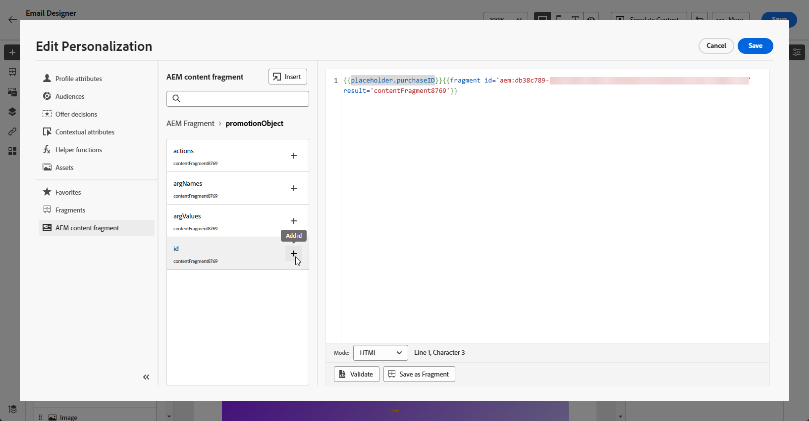

# Fragmentos de conteúdo do Adobe Experience Manager {#aem-fragments}

Ao integrar o Adobe Experience Manager com o Adobe Journey Optimizer, agora é possível incorporar facilmente os fragmentos de conteúdo do AEM no conteúdo de email do Journey Optimizer. Essa conexão simplificada simplifica o processo de acesso e aproveitamento do conteúdo AEM, permitindo a criação de campanhas e jornadas personalizadas e dinâmicas.

Para saber mais sobre o Fragmento de conteúdo do AEM, consulte a [documentação sobre o Experience Manager](https://experienceleague.adobe.com/en/docs/experience-manager-cloud-service/content/sites/authoring/fragments/content-fragments).

## Limitações {#limitations}

* Disponível somente para o canal de email.

* No momento, os usuários não podem alternar a instância do AEM à qual estão conectados, pois cada sandbox é limitada a uma única instância.

* É recomendável limitar o número de usuários com acesso para publicar fragmentos de conteúdo para reduzir o risco de erros acidentais em emails.

* Para conteúdo multilíngue, somente o fluxo manual é compatível.

* As variantes não são compatíveis no momento.

* É necessário criar uma tag especificamente para o Journey Optimizer.

+++ Saiba como criar sua tag do Journey Optimizer

   1. Acesse seu ambiente **Experience Manager**.

   1. No menu **Ferramentas**, navegue até a guia **Geral** e selecione **Marcação**.

   1. Clique em **Criar uma Nova Marca**.

   1. Verifique se a ID segue a seguinte sintaxe: `ajo-enabled:{AJO-OrgId}/{AJO-SandboxName}`.

   1. Clique em **Criar**.

  Agora você pode atribuir essa tag Journey Optimizer aos fragmentos de conteúdo.
+++

## Adicionar fragmentos de conteúdo do AEM {#aem-add}

Depois de criar e personalizar os [Fragmentos de conteúdo do AEM](https://experienceleague.adobe.com/en/docs/experience-manager-cloud-service/content/sites/authoring/fragments/content-fragments), você pode importá-lo para a campanha ou jornada do Jornada Otimizer.

1. Depois de criar sua [Campanha](../email/create-email.md) ou [Jornada](../email/create-email.md) com uma ação de email, acesse o designer de email para configurar o conteúdo do email. [Saiba mais](../email/get-started-email-design.md)

1. Clique dentro de um bloco de texto ou na linha de assunto e selecione **[!UICONTROL Adicionar Personalization]** na barra de ferramentas contextual.

   

1. No menu **[!UICONTROL Fragmento de Conteúdo do AEM]** no painel esquerdo, clique em **[!UICONTROL Abrir seletor de CF do AEM]**.

   

1. Selecione um **[!UICONTROL Fragmento de conteúdo]** na lista disponível para importar para o conteúdo do Journey Optimizer.

   >[!IMPORTANT]
   >
   >Somente **[!UICONTROL Fragmentos de conteúdo]** publicados podem ser usados.

1. Clique em **[!UICONTROL Mostrar filtros]** para ajustar a lista de Fragmentos de conteúdo.

   O seletor de Fragmento de conteúdo inclui filtros pré-configurados:

   * **[!UICONTROL Status]**: publicado, Modificado
   * **[!UICONTROL Marca]**: definida automaticamente com base no seu ambiente do Journey Optimizer (ID organizacional e sandbox)

   

1. Depois de selecionar seu **[!UICONTROL Fragmento do conteúdo]**, clique em **[!UICONTROL Selecionar]** para abri-lo.

   

1. Escolha os campos desejados em seu **[!UICONTROL Fragmento do conteúdo]** para adicionar ao conteúdo.

   

1. Clique em **[!UICONTROL Salvar]** e verifique sua mensagem na visualização. Agora você pode testar e verificar o conteúdo da sua mensagem conforme detalhado em [esta seção](preview.md).

Depois de executar os testes e validar o conteúdo, você pode enviar seu email para o público com a [Campanha](../campaigns/review-activate-campaign.md) ou a [Jornada](../building-journeys/publishing-the-journey.md).
