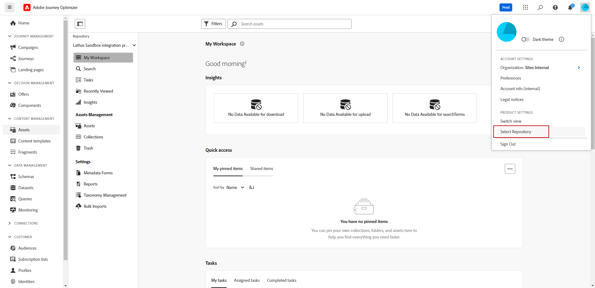

# Criar e gerenciar ativos com o [!DNL Assets Essentials]{#experience-manager-assets}

## Introdução ao [!DNL Assets Essentials] {#get-started-assets-essentials}

Junte os fluxos de trabalho de marketing e de criação usando o [!DNL Adobe Experience Manager Assets Essentials]. Integrado nativamente no [!DNL Adobe Journey Optimizer], acesse o [!DNL Assets Essentials] para armazenar, gerenciar, descobrir e distribuir ativos digitais. Ele fornece um repositório único e centralizado de ativos que você pode usar para preencher suas mensagens.

[!DNL Adobe Experience Manager Assets Essentials] O é um espaço de trabalho de ativos colaborativo e centralizado que estende seu sistema criativo e unifica ativos digitais para a entrega de experiências. Você pode organizar, marcar e encontrar facilmente ativos de produção aprovados para garantir a consistência da marca em todas as equipes. Com sua experiência de usuário intuitiva, o access [!DNL Assets Essentials] para compartilhar ativos instantaneamente nos aplicativos Adobe Creative e Experience Cloud.

Saiba mais em [Documentação do Adobe Experience Manager Assets Essentials](https://experienceleague.adobe.com/docs/experience-manager-assets-essentials/help/introduction.html){target="_blank"}.

O [!DNL Adobe Experience Manager Assets Essentials] pode ser acessado diretamente a partir do [!DNL Adobe Journey Optimizer], através da seção **[!UICONTROL Ativos]** no menu esquerdo. Também é possível acessar ativos e pastas quando [criação de conteúdo de email](../email/get-started-email-design.md).

## Pré-requisitos{#assets-prerequisites}

Antes de usar [!DNL Adobe Experience Manager Assets Essentials], é necessário adicionar usuários à **Usuários consumidores do Assets Essentials** ou/e **Usuários do Assets Essentials** Perfis de produto. Leia mais em [Documentação do Assets Essentials](https://experienceleague.corp.adobe.com/docs/experience-manager-assets-essentials/help/get-started-admins/deploy-administer.html#add-user-groups){target="_blank"}.

>[!NOTE]
>Para produtos do Journey Optimizer obtidos antes de 6 de janeiro de 2022, é necessário implantar o [!DNL Adobe Experience Manager Assets Essentials] para sua organização. Saiba mais na seção [Implantar o Assets Essentials](https://experienceleague.adobe.com/docs/experience-manager-assets-essentials/help/deploy-administer.html?lang=pt-BR){target="_blank"}.

## Fazer upload e inserir ativos{#add-asset}

Para importar arquivos para [!DNL Assets Essentials], primeiro é necessário navegar ou criar a pasta em que ela será armazenada. Você poderá inseri-los no conteúdo de email.

Para obter mais informações sobre como fazer upload de ativos, consulte [Documentação do Adobe Experience Manager Assets Essentials](https://experienceleague.adobe.com/docs/experience-manager-assets-essentials/help/add-delete.html){target="_blank"}.

1. De [!DNL Adobe Journey Optimizer] , selecione a **[!UICONTROL Assets]** na guia **[!UICONTROL Gestão de conteúdo]** menu para acessar [!DNL Assets Essentials].

   

1. Escolha o repositório dos ativos no Journey Optimizer. Você pode optar por um repositório do Assets Essentials ou um repositório do Assets as a Cloud Service, desde que seja o proprietário dessa solução.

   

+++ Saiba como alternar o repositório de ativos.

   Para alterar o repositório do Assets, selecione o ícone Conta no canto superior direito e clique em **[!UICONTROL Selecionar repositório]**.

   

+++

1. Clique duas vezes em uma pasta na seção central ou na exibição em árvore para abri-la.

   Você também pode clicar em **[!UICONTROL Criar pasta]** para criar uma nova pasta.

   

1. Uma vez na pasta selecionada ou criada, clique em **[!UICONTROL Adicionar ativos]** para fazer upload do novo ativo para a sua pasta.

   

1. No **[!UICONTROL Fazer upload de arquivos]**, clique em **[!UICONTROL Procurar]** e escolha se deseja **[!UICONTROL Procurar arquivos]** ou **[!UICONTROL Procurar pastas]**.

1. Selecione o arquivo que deseja fazer upload. Quando terminar, clique em **[!UICONTROL Carregar]**. Para saber mais sobre como gerenciar seus ativos, consulte esta [página](https://experienceleague.adobe.com/docs/experience-manager-assets-essentials/help/manage-organize.html).

1. Para editar ainda mais seus ativos com o Adobe Photoshop Express, clique duas vezes neles. Em seguida, no menu à direita, selecione a opção **[!UICONTROL Modo de edição]** ícone. [Saiba mais](https://experienceleague.adobe.com/docs/experience-manager-assets-essentials/help/edit-images.html){target="_blank"}.

   

1. De [!DNL Adobe Journey Optimizer], selecione o **[!UICONTROL Seletor de ativos]** no painel esquerdo do designer de email.

   

1. Selecione o criado anteriormente **[!UICONTROL Assets]** pasta. Você também pode pesquisar seu ativo ou pasta na barra de pesquisa.

1. Arraste e solte seu ativo no conteúdo de email.

   

1. É possível personalizar ainda mais seus ativos, como adicionar um link externo ou um texto usando o **[!UICONTROL Configurações]** e **[!UICONTROL Estilos]** guias. [Saiba mais sobre configurações de componentes](../email/content-components.md)

   

   <!--
    After adding your asset to your email, use the **[!UICONTROL Find similar Stock photos]** option to locate Stock photos that match the content, color, and composition of your image. [Learn more about Adobe Stock](stock.md).

    Note that this option is available for licensed/unlicensed Stock images and images from your Assets folder. 

    
    -->