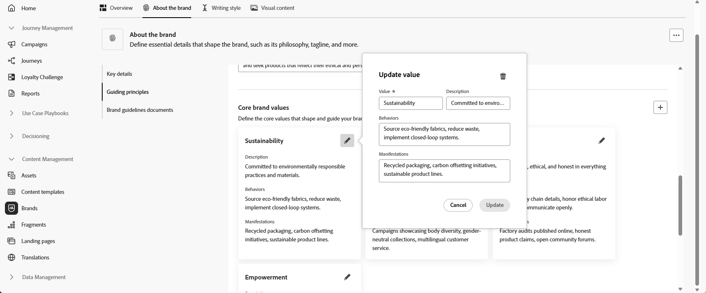

# Personalizar sua marca {#brands-personalize}

## Sobre a marca {#about-brand}

Use a guia **[!UICONTROL Sobre a marca]** para estabelecer a identidade principal da sua marca, descrevendo a finalidade, a personalidade, o slogan e outros atributos de definição.

1. Comece preenchendo as informações fundamentais da sua marca na categoria **[!UICONTROL Detalhes da chave]**:

   * **[!UICONTROL Nome do Kit de Marcas]**: digite o nome do kit de marcas.

   * **[!UICONTROL Quando usar]**: especifique cenários ou contextos nos quais este kit de marcas deve ser aplicado.

   * **[!UICONTROL Nome da Marca]**: insira o nome oficial da marca.

   * **[!UICONTROL Descrição da marca]**: forneça uma visão geral do que esta marca representa.

   * **[!UICONTROL Slogan padrão]**: adicione o slogan principal associado à marca.

     

1. Na categoria **[!UICONTROL Princípios orientadores]**, esclareça a direção principal e a filosofia da sua marca:

   * **[!UICONTROL Missão]**: detalhe a finalidade de sua marca.

   * **[!UICONTROL Vision]**: descreva sua meta de longo prazo ou o estado futuro desejado.

   * **[!UICONTROL Posicionamento no mercado]**: explique como sua marca está posicionada no mercado.

     

1. Na categoria **[!UICONTROL Valores de marca principais]**, clique em  para adicionar os valores de marca principais e preencher os detalhes:

   * **[!UICONTROL Valor]**: nomeie um valor de marca principal.

   * **[!UICONTROL Descrição]**: explique o que esse valor significa para sua marca.

   * **[!UICONTROL Comportamentos]**: descreva as ações ou atitudes que refletem este valor na prática.

   * **[!UICONTROL Manifestações]**: forneça exemplos de como esse valor é expresso em marcas reais.

     

1. Se necessário, clique no ícone para atualizar ou excluir um de seus valores de marca principal.

   

Agora você pode personalizar ainda mais sua marca ou [publicar sua marca](brands.md#create-brand-kit).

## Estilo de escrita {#writing-style}

>[!CONTEXTUALHELP]
>id="ajo_brand_writing_style"
>title="Estilo de escrita e pontuação de alinhamento"
>abstract="A seção Estilo de escrita define padrões para idioma, formatação e estrutura para garantir conteúdo claro e consistente. A pontuação de alinhamento, classificada de alta a baixa, mostra o desempenho do seu conteúdo em seguir essas diretrizes e destaca as áreas a serem melhoradas."

A seção **[!UICONTROL Estilo de escrita]** descreve os padrões para a escrita de conteúdo, detalhando como o idioma, a formatação e a estrutura devem ser usados para manter a clareza, a coerência e a consistência entre todos os materiais.

+++ Categoria disponível e exemplos

<table>
  <thead>
    <tr>
      <th>Categoria</th>
      <th>Subcategoria</th>
      <th>Exemplo de diretrizes</th>
      <th>Exemplo de exclusões</th>
    </tr>
  </thead>
  <tbody>
    <tr>
      <td rowspan="4">Padrões de criação de conteúdo</td>
      <td>Padrões de mensagem da marca</td>
      <td>Destaque a inovação e as mensagens direcionadas ao cliente.</td>
      <td>Não exagere nos recursos do produto.</td>
    </tr>
    <tr>
      <td>Uso do slogan</td>
      <td>Coloque o slogan abaixo do logotipo em todos os ativos de marketing digital.</td>
      <td>Não modifique ou traduza o slogan.</td>
    </tr>
    <tr>
      <td>Mensagens principais</td>
      <td>Enfatize a principal declaração de benefícios, como maior produtividade.</td>
      <td>Não use propostas de valor não relacionadas.</td>
    </tr>
    <tr>
      <td>Padrões de nomenclatura</td>
      <td>Use nomes simples e descritivos, como "ProScheduler".</td>
      <td>Não use termos complexos ou caracteres especiais.</td>
    </tr>
    <tr>
      <td rowspan="5">Estilo de comunicação da marca</td>
      <td>Características de personalidade da marca</td>
      <td>Amigável e acessível.</td>
      <td>Não seja derrotista.</td>
    </tr>
    <tr>
      <td>Mecânica de escrita</td>
      <td>Mantenha as frases curtas e impactantes.</td>
      <td>Não use jargão em excesso.</td>
    </tr>
    <tr>
      <td>Tom de situação</td>
      <td>Mantenha um tom profissional nas comunicações de crise.</td>
      <td>Não ignore as comunicações de suporte.</td>
    </tr>
    <tr>
      <td>Diretrizes de Escolha do Word</td>
      <td>Use palavras como "inovador" e "inteligente".</td>
      <td>Evite palavras como "barato" ou "hack".</td>
    </tr>
    <tr>
      <td>Padrões de Idioma</td>
      <td>Siga as convenções do inglês americano.</td>
      <td>Não misture ortografias britânicas e americanas.</td>
    </tr>
    <tr>
      <td rowspan="3">Padrões de conformidade legal</td>
      <td>Padrões de marca comercial</td>
      <td>Sempre use o símbolo ™ ou ®.</td>
      <td>Não omita símbolos legais quando necessário.</td>
    </tr>
    <tr>
      <td>Padrões de direitos autorais</td>
      <td>Inclua avisos de direitos autorais nos materiais de marketing.</td>
      <td>Não use conteúdo de terceiros sem permissão.</td>
    </tr>
    <tr>
      <td>Padrões de isenção de responsabilidade</td>
      <td>Exibir avisos de isenção de responsabilidade de forma legível em ativos digitais.</td>
      <td>Não oculte isenções de responsabilidade em áreas não visíveis.</td>
    </tr>
</table>

+++

 

Para personalizar seu **[!UICONTROL Estilo de Redação]**:

1. Na guia **[!UICONTROL Estilo de Escrita]**, clique em  para adicionar uma diretriz, exceção ou exclusão.

1. Insira sua diretriz, exceção ou exclusão. Você também pode incluir **[!UICONTROL Exemplos]** para ilustrar melhor como ele deve ser aplicado.

   

1. Especifique o **contexto de uso** para sua diretriz, exceção ou exclusão:

   * **[!UICONTROL Tipo de canal]**: escolha onde esta diretriz, exceção ou exclusão deve ser aplicada. Por exemplo, talvez você queira que um estilo de escrita específico apareça apenas em E-mail, Celular, Impressões ou outros canais de comunicação.

   * **[!UICONTROL Tipo de elemento]**: especifique a qual elemento de conteúdo a regra se aplica. Isso pode incluir elementos como Títulos, Botões, Links ou outros componentes no conteúdo.

     

1. Depois de configurar sua diretriz, exceção ou exclusão, clique em **[!UICONTROL Adicionar]**.

1. Se necessário, selecione uma de suas diretrizes ou exclusões para atualizar ou excluir.

1. Clique no  para editar seu exemplo ou no ícone para excluí-lo.

   

Agora você pode personalizar ainda mais sua marca ou [publicar sua marca](#create-brand-kit).

## Conteúdo visual {#visual-content}

>[!CONTEXTUALHELP]
>id="ajo_brand_imagery"
>title="Pontuação de alinhamento de conteúdo visual"
>abstract="A Pontuação de alinhamento do conteúdo visual indica o quanto o conteúdo corresponde às diretrizes de marca configuradas. Com pontuação de alta a baixa, ajuda a avaliar o alinhamento rapidamente. Explore as diferentes categorias para identificar áreas para aprimoramento e os elementos que podem ser exteriores à marca."

A seção **[!UICONTROL Conteúdo visual]** define os padrões de imagem e design, detalhando as especificações necessárias para manter uma aparência de marca unificada e consistente.

+++ Categorias e exemplos disponíveis

<table>
  <thead>
    <tr>
      <th>Categoria</th>
      <th>Exemplo de diretrizes</th>
      <th>Exemplo de exclusões</th>
    </tr>
  </thead>
  <tbody>
    <tr>
      <td>Padrões de fotografia</td>
      <td>Use a iluminação natural para fotos ao ar livre.</td>
      <td>Evite imagens editadas ou pixeladas em excesso.</td>
    </tr>
    <tr>
      <td>Padrões de ilustração</td>
      <td>Use estilos limpos e minimalistas.</td>
      <td>Evite complexos demais.</td>
    </tr>
    <tr>
      <td>Ícone padrões</td>
      <td>Use um sistema de grade de 24px consistente.</td>
      <td>Não misture dimensões de ícone, use espessuras de traçado inconsistentes ou desvie das regras de grade.</td>
    </tr>
    <tr>
      <td>Diretrizes de uso</td>
      <td>Escolha imagens de estilo de vida que reflitam clientes reais usando o produto em ambientes profissionais.</td>
      <td>Não use imagens que estejam em contradição com o tom da marca ou que apareçam fora de contexto.</td>
    </tr>
</table>

+++

 

Para personalizar seu **[!UICONTROL conteúdo visual]**:

1. Na guia **[!UICONTROL Visual content]**, clique em  para adicionar uma diretriz, exclusão ou exemplo.

1. Insira sua diretriz, exclusão ou exemplo.

   

1. Especifique o **contexto de uso** para sua diretriz ou exclusão:

   * **[!UICONTROL Tipo de canal]**: escolha onde esta diretriz, exceção ou exclusão deve ser aplicada. Por exemplo, talvez você queira que um estilo de escrita específico apareça apenas em E-mail, Celular, Impressões ou outros canais de comunicação.

   * **[!UICONTROL Tipo de elemento]**: especifique a qual elemento de conteúdo a regra se aplica. Isso pode incluir elementos como Títulos, Botões, Links ou outros componentes no conteúdo.

     

1. Depois de configurar sua diretriz, exceção ou exclusão, clique em **[!UICONTROL Adicionar]**.

1. Para adicionar uma imagem mostrando o uso correto, selecione **[!UICONTROL Exemplo]** e clique em **[!UICONTROL Selecionar imagem]**. Você também pode adicionar uma imagem mostrando o uso incorreto como exemplo de exclusão.

   

1. Se necessário, selecione uma de suas diretrizes ou exclusões para atualizar ou excluir.

1. Selecione um dos seus exemplos para atualizá-lo, substitua a imagem ou clique no ícone para excluí-la.

   

Agora você pode personalizar ainda mais sua marca ou [publicar sua marca](brands.md#create-brand-kit).

<!--
## Colors {#colors}

The **[!UICONTROL Colors]** section the standards for your brand's color system, outlining how colors are selected, organized, and applied across experiences. It ensures consistent use of primary, secondary, accent, and neutral colors to maintain a cohesive, accessible, and recognizable brand identity.

+++ Available categories and examples

<table>
  <thead>
    <tr>
      <th>Category</th>
      <th>Guidelines Example</th>
      <th>Exclusions Example</th>
    </tr>
  </thead>
  <tbody>
    <tr>
      <td>Primary colors</td>
      <td>Use primary brand colors for logos, headers, and main call-to-action elements.</td>
      <td>Do not substitute or modify primary brand colors.</td>
    </tr>
    <tr>
      <td>Secondary colors</td>
      <td>Use secondary colors to support layouts, illustrations, and UI components.</td>
      <td>Do not let secondary colors overpower primary brand colors.</td>
    </tr>
    <tr>
      <td>Accent colors</td>
      <td>Use accent colors sparingly for buttons, links, and alerts.</td>
      <td>Do not use accent colors for large background areas.</td>
    </tr>
    <tr>
      <td>Neutral colors</td>
      <td>Use neutral colors for text, dividers, borders, and subtle UI elements.</td>
      <td>Avoid using neutrals with poor contrast or heavy color casts.</td>
    </tr>
    <tr>
      <td>Background colors</td>
      <td>Use light or neutral backgrounds to ensure readability and visual clarity.</td>
      <td>Do not place text or logos on low-contrast backgrounds.</td>
    </tr>
    <tr>
      <td>Additional colors</td>
      <td>Use additional colors only for data visualization or approved campaigns.</td>
      <td>Do not introduce unapproved or off-brand colors.</td>
    </tr>
    <tr>
      <td>Color scales</td>
      <td>Use approved tints and shades for UI states such as hover, active, and disabled.</td>
      <td>Do not create unofficial shades or gradients.</td>
    </tr>
    <tr>
      <td>Usage guidelines</td>
      <td>Maintain consistent color usage and accessible contrast across all assets.</td>
      <td>Do not mix conflicting palettes or apply colors inconsistently.</td>
    </tr>
</table>

+++

 

To personalize your **[!UICONTROL Colors]**:

1. From the **[!UICONTROL Colors]** tab, click  to add a color, guideline or exclusion. 

1. Enter your color information to define it accurately:

    * **Color name**: Provide a clear, descriptive name to identify the color within your brand system.

    * **Color value**: Choose your color using the hue picker or enter precise values using RGB, HEX, or Pantone name/code to ensure consistency across digital and print assets.

    

1. Review your selection to confirm accuracy and visual consistency and click **[!UICONTROL Add]** to save your color.

1. Then, enter your guideline or exclusion.

1. Specify the Usage context for your guideline or exclusion:

    * **[!UICONTROL Channel type]**: Choose where this guideline, exception, or exclusion should apply. For example, you may want a specific writing style to appear only in Email, Mobile, Prints, or other communication channels.

    * **[!UICONTROL Element type]**: Specify which content element the rule applies to. This could include elements such as Headings, Buttons, Links, or other components within your content.

      
  
1. Once your guideline, exception, or exclusion is set up, click **[!UICONTROL Add]**. 

1. If needed, select one of your guideline or exclusion to update or delete.

1. Select one your guideline or exclusion to update it. Click the icon to delete it. 

    

1. Click **[!UICONTROL Add group]** to define additional colors for your brand or to add a color scale group.

You can now further personalize your brand or [publish your brand](brands.md#create-brand-kit).

-->