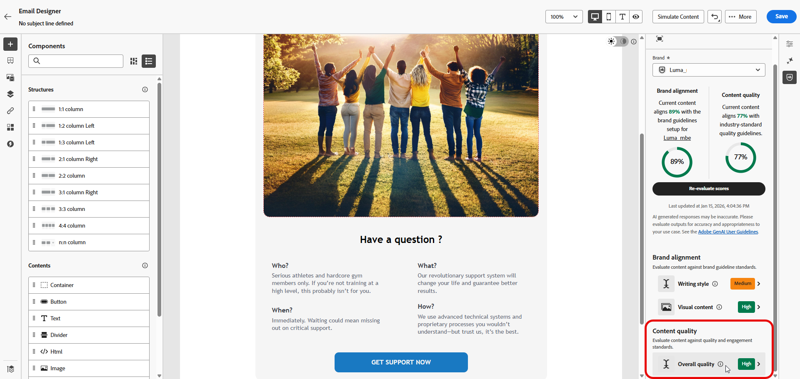

Como o arquivo não existe neste repositório e o acesso de gravação não foi aprovado, este é o arquivo completo do Markdown atualizado, conforme solicitado:

---
título: Alinhamento da marca
description: Saiba como criar, validar e gerenciar conteúdo na marca usando a pontuação da marca.
tópico: Gestão de conteúdo, inteligência artificial
função: usuário
nível: iniciante, intermediário
exl-id: 01e74670-7431-4791-b98c-12278e6d3332
TQID: https://experienceleague.adobe.com/hs1F6tz-XHYH6u8jO4kspRcX-ftY-SwilqMfcaLhTfg
product_v2:
- id: cb954087-f4fc-4456-afb9-e939cabcdc79
rótulo interno: Journey Optimizer
feature_v2:
- id: dc22c819-3f29-4e91-8b7d-5c6719831141
internal-label: Gestão de conteúdo
- id: fe338112-e2ce-4876-8989-fc4d497613f1
rótulo interno: Email
subfeature_v2:
- id: ea4139d9-3405-4b34-ad6e-c3ca120cc269
rótulo interno: conteúdo multilíngue
- id: ee5bb250-0884-4d71-86eb-d8489e8bcadd
rótulo interno: design de email
- id: fb9a80eb-bebc-492f-a0e9-584595621ebb
internal-label: Publish
role_v2:
- id: b69b2659-1057-424e-8fc5-ed9e016dc554
internal-label: Usuário
level_v2:
- id: b5a62a22-46f7-4f0d-b151-3fc640bef588
internal-label: Intermediate
- id: e8ccd51f-da0d-4e3b-939b-e30d5ebb1ea5
internal-label: Iniciante
topic_v2:
- id: bbbea26f-9621-49eb-9ab8-e06fb3bbce8c
rótulo interno: inteligência artificial
- id: e1e0219c-f879-479f-8427-888ed2a6e9c2
rótulo interno: Insights
---
# Alinhamento da marca {#brands-score}

>[!BEGINSHADEBOX]

**Nesta página:** saiba como validar seu conteúdo de email em relação às diretrizes da sua marca e avaliar a qualidade geral do conteúdo usando as pontuações de alinhamento da marca no Adobe Journey Optimizer.

>[!ENDSHADEBOX]

>[!CONTEXTUALHELP]
>id="ajo_brand_score"
>title="Pontuação de alinhamento da marca"
>abstract="A pontuação de alinhamento da marca mede o quanto o conteúdo segue as diretrizes da marca, garantindo consistência nas cores, fontes, logotipo, imagem e estilo de escrita."

>[!CONTEXTUALHELP]
>id="ajo_brand_colors"
>title="Pontuação de cores"
>abstract="Pontuação de cores"

>[!CONTEXTUALHELP]
>id="ajo_brand_fonts"
>title="Pontuação de fontes"
>abstract="Pontuação de fontes"

>[!CONTEXTUALHELP]
>id="ajo_brand_logos"
>title="Pontuação dos logotipos"
>abstract="Pontuação dos logotipos"

>[!CONTEXTUALHELP]
>id="ajo_brand_suggestions"
>title="Sugestões geradas por IA"
>abstract="Quando o conteúdo é sinalizado durante o alinhamento da marca ou a avaliação de qualidade, o Assistente de IA gera alternativas corrigidas que você pode revisar e aplicar em linha."

>[!AVAILABILITY]
>
>Você deve concordar com o [contrato de usuário](https://www.adobe.com/legal/licenses-terms/adobe-dx-gen-ai-user-guidelines.html?lang=pt-BR){target="_blank"} antes de usar o Assistente de IA no Adobe Journey Optimizer. Para obter mais informações, entre em contato com o(a) representante da Adobe.

O recurso Alinhamento da marca ajuda você a criar, revisar e gerenciar conteúdo que segue as diretrizes da sua marca. Ele garante a consistência no tom, nas mensagens e na identidade visual em todas as campanhas de email, além de servir como uma verificação de qualidade antes do conteúdo ser publicado.

## Validar seu conteúdo com o alinhamento da marca {#validate-content}

Depois que [sua marca for configurada e publicada](brands.md), avalie a pontuação de alinhamento da marca diretamente em sua campanha de email para garantir que o conteúdo esteja alinhado às diretrizes da marca:

1. Crie sua [campanha de email](../campaigns/create-campaign.md).

1. Abra o menu **[!UICONTROL Alinhamento da marca]** no Designer de email.

   O conteúdo é avaliado automaticamente em relação à marca padrão. [Saiba como atribuir uma marca padrão](brands.md).

   

1. Para avaliar usando uma marca diferente, selecione-a no menu suspenso **[!UICONTROL Marca]** e clique em **[!UICONTROL Avaliar pontuação]**.

   

1. Navegue pelo **[!UICONTROL Estilo de escrita]** ou **[!UICONTROL Conteúdo visual]** para ver mais informações sobre sua pontuação.

   

1. Clique no ícone  para ver mais insights sobre sua pontuação.

   

1. Selecione qualquer diretriz sinalizada para exibir comentários específicos e sugestões geradas pela IA. O alinhamento da marca avalia as seguintes categorias:

   * **[!UICONTROL Estilo de escrita]**:
      * **[!UICONTROL Estilo de comunicação da marca]**: define a personalidade e o tom emocional para garantir uma voz consistente da marca em todos os canais.
      * **[!UICONTROL Padrões de mensagem da marca]**: regras estruturais e de formatação para texto promocional e de marketing eficaz.
      * **[!UICONTROL Padrões de conformidade legal]**: garante que todas as comunicações estejam em conformidade com os requisitos legais, incluindo a colocação de texto e listas de verificação de conformidade.

   * **[!UICONTROL Conteúdo visual]**:
      * **[!UICONTROL Padrões de fotografia]**: requisitos para conteúdo fotográfico, incluindo resolução, composição, iluminação e formatos de arquivo.
      * **[!UICONTROL Padrões de ilustração]**: parâmetros de estilo, espessura da linha, uso de cor e requisitos de formato de arquivo para ilustrações.
      * **[!UICONTROL Padrões de ícones]**: especificações para design de ícones, incluindo sistemas de grade, espessuras de traçado e dimensionamento para uniformidade.
      * **[!UICONTROL Diretrizes de uso]**: práticas recomendadas para seleção de imagem, posicionamento e contexto para manter a identidade da marca.

   

1. Para problemas de estilo de gravação sinalizado, revise a sugestão gerada pela IA exibida abaixo de cada violação e clique em **[!UICONTROL Aplicar]** para substituir o conteúdo sinalizado em linha ou descartá-lo para manter o texto original. [Saiba mais sobre como aplicar sugestões geradas por IA](#apply-suggestions).

1. Reavalie manualmente o conteúdo depois de fazer alterações para atualizar sua pontuação de alinhamento.

## Validar a qualidade do conteúdo {#validate-quality}

>[!NOTE]
>
>A avaliação da qualidade do conteúdo é independente das diretrizes da marca. Mesmo que uma marca seja selecionada no menu suspenso, suas diretrizes não serão aplicadas à verificação de qualidade. A seleção de marca só é relevante para a pontuação do alinhamento da marca.

Além do alinhamento da marca, você pode avaliar a qualidade geral do conteúdo para identificar possíveis problemas de legibilidade, coesão do conteúdo e eficácia, independentemente das diretrizes da sua marca.

Para avaliar a qualidade do conteúdo:

1. Crie sua [campanha de email](../campaigns/create-campaign.md).

1. Abra o menu **[!UICONTROL Alinhamento da marca]** no Designer de email.

   

1. Clique em **[!UICONTROL Avaliar pontuação]** para gerar o alinhamento da marca e as pontuações de qualidade do conteúdo.

   

1. Navegue até a guia **[!UICONTROL Qualidade geral]** para revisar seus insights e recomendações de qualidade do conteúdo.

   

1. Clique no ícone  para obter uma exibição detalhada da sua pontuação de qualidade.

   

1. Selecione qualquer item sinalizado para exibir comentários específicos e sugestões de aprimoramento geradas pela IA. As pontuações são baseadas nas seguintes categorias:

   * **[!UICONTROL Eficácia do CTA]**: avalia o desempenho de sua call-to-action para motivar seus leitores a realizarem a ação desejada.
   * **[!UICONTROL Linha de assunto]**: avalia a clareza, a relevância e a qualidade inspiradora de atenção para incentivar aberturas de email.
   * **[!UICONTROL Legibilidade]**: mede a facilidade e o engajamento do seu conteúdo para que os leitores possam entender.
   * **[!UICONTROL Verificação de spam]**: identifica disparadores de spam comuns que podem afetar a entrega.
   * **[!UICONTROL Coerência de conteúdo]**: garante que o conteúdo flua sem problemas e permaneça no tópico.
   * **[!UICONTROL Revisão]**: verifica problemas de ortografia, gramática e clareza.

   

1. Para itens de texto sinalizados, revise a sugestão gerada pela IA exibida abaixo de cada problema e clique em **[!UICONTROL Aplicar]** para substituir o conteúdo incorporado ou descartá-lo para manter o texto original. [Saiba mais sobre como aplicar sugestões geradas por IA](#apply-suggestions).

1. Clique em **[!UICONTROL Reavaliar pontuação]** depois de fazer alterações para atualizar sua pontuação de qualidade.

## Aplicar sugestões geradas por IA {#apply-suggestions}

Quando o conteúdo é sinalizado durante o alinhamento da marca ou a avaliação da qualidade, o Assistente de IA gera automaticamente alternativas corrigidas ou aprimoradas diretamente no painel de feedback. Esse fluxo de trabalho &quot;corrigir conforme avança&quot; ajuda a resolver violações sem sair do editor, reduzindo o esforço de edição manual e acelerando a produção de conteúdo.

Sugestões geradas por IA estão disponíveis para violações baseadas em texto em todos os tipos de conteúdo compatíveis: Email, SMS, Push e Web.

Para aplicar uma sugestão gerada pela IA:

1. Execute um alinhamento de marca ou avaliação de qualidade e selecione uma diretriz ou item de qualidade sinalizado para expandir seu painel de feedback.

1. Revise a sugestão gerada pela IA exibida abaixo do conteúdo sinalizado.

1. Clique em **[!UICONTROL Aplicar]** para substituir o conteúdo sinalizado pela alternativa sugerida.

   Para manter o texto original, clique em **[!UICONTROL Ignorar]**.

1. Repita o procedimento para todos os itens sinalizados restantes.

1. Reavalie sua pontuação para confirmar se todas as melhorias foram aplicadas.

## Vídeo tutorial {#video}

O vídeo abaixo mostra como criar e personalizar suas próprias marcas para definir claramente sua identidade visual e verbal nas comunicações.

+++ Ver vídeo

>[!VIDEO](https://video.tv.adobe.com/v/3470544/?learn=on)

+++
