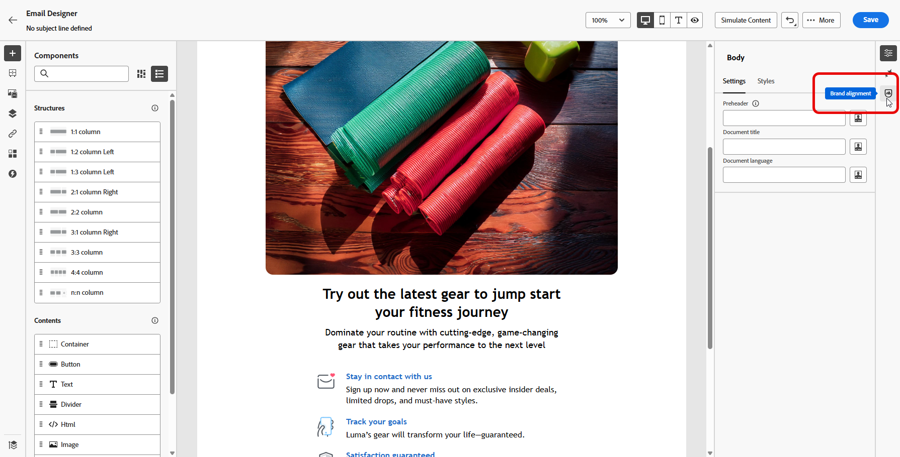

# Alinhamento da marca (Beta){#brands-score}

>[!CONTEXTUALHELP]
>id="ajo_brand_score"
>title="Pontuação de alinhamento da marca"
>abstract="Sua pontuação de Alinhamento da marca mede o quão bem seu conteúdo segue as diretrizes da sua marca, garantindo a consistência em cores, fontes, logotipo, imagem e estilo de escrita."

>[!CONTEXTUALHELP]
>id="ajo_brand_colors"
>title="Pontuação de cores"
>abstract="Pontuação de cores"

>[!CONTEXTUALHELP]
>id="ajo_brand_fonts"
>title="Pontuação de fontes"
>abstract="Pontuação de fontes"

>[!CONTEXTUALHELP]
>id="ajo_brand_logos"
>title="Pontuação dos logotipos"
>abstract="Pontuação dos logotipos"

>[!AVAILABILITY]
>
>Esse recurso foi lançado como um beta privado. Ele será disponibilizado progressivamente a todos os clientes em versões futuras.
>Você deve concordar com o [contrato de usuário](https://www.adobe.com/legal/licenses-terms/adobe-dx-gen-ai-user-guidelines.html){target="_blank"} antes de usar o Assistente de IA no Adobe Journey Optimizer. Para obter mais informações, entre em contato com o(a) representante da Adobe.

O recurso Alinhamento da marca foi criado para ajudar você a criar, revisar e gerenciar conteúdo que se mantenha fiel às diretrizes da sua marca. Ele garante a consistência no tom, nas mensagens e na identidade visual em todas as campanhas de email, além de servir como uma verificação de qualidade antes do conteúdo ser publicado.

## Validar seu conteúdo com o alinhamento da marca {#validate-content}

Depois que [sua marca for configurada e publicada](brands.md), avalie a pontuação de alinhamento da marca diretamente em sua campanha de email para garantir que o conteúdo esteja alinhado às diretrizes da marca:

1. Crie sua [campanha de email](../campaigns/create-campaign.md).

1. Abra o menu **[!UICONTROL Alinhamento da Marca]** no designer de email.

   Seu conteúdo será avaliado automaticamente em relação à sua marca padrão. [Saiba como atribuir uma marca padrão](brands.md).

   

1. Para avaliar usando uma marca diferente, selecione-a no menu suspenso **[!UICONTROL Marca]** e clique em **[!UICONTROL Reavaliar pontuação]**.

   

1. Navegue pela **Pontuação de alinhamento da marca** (Alta, Medium, Baixa) e revise os comentários detalhados.

1. Clique no ícone de  para ver mais insights sobre sua pontuação.

   

1. Selecione qualquer diretriz sinalizada para exibir comentários e sugestões específicos.

   

1. Edite seu conteúdo com base nas recomendações para melhorar o alinhamento da marca.

1. Reavalie manualmente o conteúdo depois de fazer alterações para atualizar sua pontuação de alinhamento.
