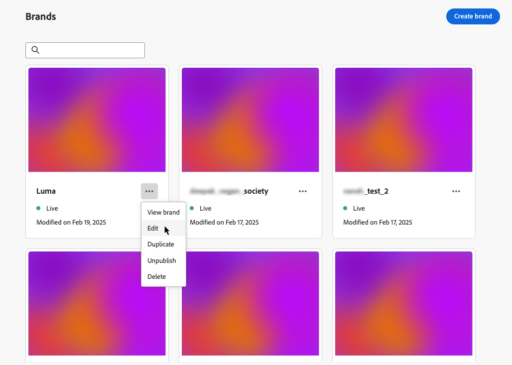

# Criar e gerenciar suas marcas {#brands}

>[!CONTEXTUALHELP]
>id="ajo_brands_overview"
>title="Marcas"
>abstract="Crie e personalize suas próprias marcas para definir sua identidade visual e verbal exclusiva, facilitando a geração de conteúdo que corresponda ao estilo e à voz da sua marca."

>[!AVAILABILITY]
>
>Esse recurso foi lançado como um beta privado. Ele estará progressivamente disponível para todos os clientes em versões futuras.

As diretrizes da marca são um conjunto detalhado de regras e padrões que estabelecem a identidade visual e verbal de uma marca. Eles atuam como uma referência para manter uma representação de marca consistente em todas as plataformas de marketing e comunicação.

<!--Upload feature currently behind feature flag--

In [!DNL Journey Optimizer], you now have the option to manually input and organize your brand details or upload brand guideline documents for automatic information extraction.-->

## Acessar marcas {#generative-access}

Para acessar o menu **[!UICONTROL Marcas]** em [!DNL Adobe Journey Optimizer], os usuários precisam receber as permissões do **[!UICONTROL Kit de marcas gerenciadas]** ou **[!UICONTROL Habilitar assistente de IA]**. [Saiba mais](../administration/permissions.md)

+++  Saiba como atribuir permissões relacionadas à marca

1. No produto **Permissões**, abra a guia **Funções** e selecione a **função** desejada.

1. Clique em **Editar** para modificar as permissões.

1. Adicione o recurso **Assistente de IA** e selecione **Kit de marca gerenciado** ou **[!UICONTROL Habilitar assistente de IA]** no menu suspenso.

   Observe que a permissão **[!UICONTROL Habilitar assistente de Ia]** fornece acesso somente leitura ao menu **[!UICONTROL Marcas]**.

   {zoomable="yes"}

1. Clique em **Salvar** para aplicar as alterações.

   As permissões de todos os usuários já atribuídos a essa função serão atualizadas automaticamente.

1. Para atribuir essa função a novos usuários, navegue até a guia **Usuários** no painel **Funções** e clique em **Adicionar usuário**.

1. Insira o nome do usuário, seu endereço de email ou escolha na lista e clique em **Salvar**.

1. Se o usuário não tiver sido criado anteriormente, consulte [esta documentação](https://experienceleague.adobe.com/pt-br/docs/experience-platform/access-control/abac/permissions-ui/users).

+++

## Criar sua marca {#create-brand-kit}

>[!CONTEXTUALHELP]
>id="ajo_brands_create"
>title="Criar sua marca"
>abstract="Insira o nome da sua marca e faça upload do arquivo de diretrizes da marca. A ferramenta extrairá automaticamente os principais detalhes, facilitando a manutenção da identidade da sua marca."

Para criar e gerenciar as diretrizes da sua marca, siga as etapas abaixo.

<!--Upload feature currently behind feature flag--

To create and manage your Brand guideline, you can either enter the details yourself, or upload your brand guidelines document to have the information extracted automatically:-->

1. No menu **[!UICONTROL Marcas]**, clique em **[!UICONTROL Criar marca]**.

   

1. Digite um **[!UICONTROL Nome]** para sua marca<!--and a **[!UICONTROL Description]** to your brand guideline-->.

   

<!--Upload feature currently behind feature flag so hidden from doc - should be available again by EOM (Feb)--

1. Drag and drop or select your file to upload your brand guidelines and extract automatically relevant brand information. Click **[!UICONTROL Create brand]**.

    The information extraction process now begins. Note that it may take several minutes to complete.

    

1. Your Content and visual creation standards are now automatically populated. Browse through the different tabs to adapt the information as needed.

-->

1. Na guia **[!UICONTROL Estilo de Escrita]**, clique em  para adicionar uma diretriz ou exclusão, incluindo exemplos.

   

1. Na guia **[!UICONTROL Visual content]**, clique em  para adicionar outra diretriz ou exclusão.

1. Para adicionar uma imagem mostrando o uso correto, selecione **[!UICONTROL Exemplo]** e clique em **[!UICONTROL Selecionar imagem]**. Você também pode adicionar uma imagem mostrando o uso incorreto como exemplo de exclusão.

   

1. Após a configuração, clique em **[!UICONTROL Salvar]** e em **[!UICONTROL Publicar]** para disponibilizar a diretriz da marca no assistente de IA.

1. Para fazer modificações na sua marca publicada, clique em **[!UICONTROL Editar marca]**.

   >[!NOTE]
   >
   >Isso cria uma cópia temporária no modo de edição, substituindo a versão online depois de publicada.

   

1. No painel **[!UICONTROL Marcas]**, abra o menu avançado clicando no ícone  para:

   * Exibir marca
   * Editar
   * Duplicar
   * Publicação
   * Cancelar publicação
   * Excluir

   

As diretrizes da sua marca agora podem ser acessadas no menu suspenso **[!UICONTROL Marca]** do menu do assistente de IA, permitindo que ele gere conteúdo e ativos alinhados às suas especificações. [Saiba mais sobre o assistente de IA](gs-generative.md)

