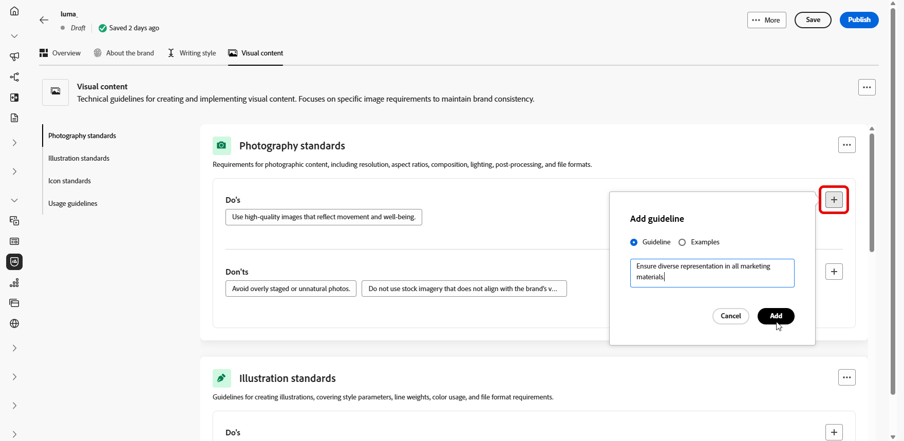

# Criar e gerenciar suas marcas {#brands}

>[!CONTEXTUALHELP]
>id="ajo_brand_overview"
>title="Introdução a marcas"
>abstract="Crie e personalize suas próprias marcas para definir uma identidade visual e verbal única, além de facilitar a geração de conteúdo que corresponda ao estilo e à voz da sua marca."

>[!CONTEXTUALHELP]
>id="ajo_brand_ai_menu"
>title="Selecione sua marca"
>abstract="Escolha sua marca para garantir que todo o conteúdo gerado por IA seja personalizado para se alinhar às suas especificações e diretrizes."

>[!CONTEXTUALHELP]
>id="ajo_brand_score_overview"
>title="Seleção da marca"
>abstract="Selecione sua marca para garantir que o conteúdo seja criado em alinhamento com as diretrizes, os padrões e a identidade específicos, mantendo a consistência e a integridade da marca."

>[!AVAILABILITY]
>
>Esse recurso está disponível como um beta privado. Ele será disponibilizado progressivamente a todos os clientes em versões futuras.
>
>Você deve concordar com o [contrato de usuário](https://www.adobe.com/legal/licenses-terms/adobe-dx-gen-ai-user-guidelines.html){target="_blank"} antes de usar o Assistente de IA no Adobe Journey Optimizer. Para obter mais informações, entre em contato com o representante da Adobe.

As diretrizes da marca são um conjunto detalhado de regras e padrões que estabelecem a identidade visual e verbal de uma marca. Eles atuam como uma referência para manter uma representação de marca consistente em todas as plataformas de marketing e comunicação.

No [!DNL Journey Optimizer], agora há a opção de inserir e organizar manualmente os detalhes da sua marca ou carregar documentos de diretrizes da marca para extração automática de informações.

## Acessar marcas {#generative-access}

Para acessar o menu **[!UICONTROL Marcas]** em [!DNL Adobe Journey Optimizer], os usuários precisam receber as permissões **[!UICONTROL Gerenciar kit de marca]** ou **[!UICONTROL Habilitar assistente de IA]**. [Saiba mais](../administration/permissions.md)

+++  Saiba como atribuir permissões relacionadas à marca

Para atribuir permissões para marcas, siga estas etapas:

1. No produto **Permissões**, abra a guia **Funções** e selecione a **função** desejada.

1. Clique em **Editar** para modificar as permissões.

1. Adicione o recurso **Assistente de IA** e selecione **Gerenciar kit de marca** ou **[!UICONTROL Habilitar assistente de IA]** no menu suspenso.

   Observe que a permissão **[!UICONTROL Habilitar assistente de Ia]** fornece acesso somente leitura ao menu **[!UICONTROL Marcas]**.

   {zoomable="yes"}

1. Clique em **Salvar** para aplicar as alterações.

   As permissões de todos os usuários já atribuídos a essa função serão atualizadas automaticamente.

1. Para atribuir essa função a novos usuários, navegue até a guia **Usuários** no painel **Funções** e clique em **Adicionar usuário**.

1. Insira o nome do usuário, seu endereço de email ou escolha na lista e clique em **Salvar**.

1. Se o usuário não tiver sido criado anteriormente, consulte [esta documentação](https://experienceleague.adobe.com/pt-br/docs/experience-platform/access-control/abac/permissions-ui/users).

+++

## Crie e gerencie a sua marca {#create-brand-kit}

>[!CONTEXTUALHELP]
>id="ajo_brands_create"
>title="Crie sua marca"
>abstract="Insira o nome e faça upload do arquivo de diretrizes da marca. A ferramenta extrairá automaticamente os principais detalhes, facilitando a manutenção da identidade da marca."

Para criar e gerenciar as diretrizes de marca, você pode inserir os detalhes por conta própria ou fazer upload do documento de diretrizes de marca para que as informações sejam extraídas automaticamente:

1. No menu **[!UICONTROL Marcas]**, clique em **[!UICONTROL Criar marca]**.

   

1. Digite um **[!UICONTROL Nome]** para sua marca.

1. Arraste e solte ou selecione seu arquivo para fazer upload das diretrizes da marca e extrair automaticamente informações relevantes sobre a marca. Clique em **[!UICONTROL Criar marca]**.

   O processo de extração de informações agora começa. Observe que pode levar vários minutos para ser concluído.

   

1. Seus padrões de criação de conteúdo e visual agora são preenchidos automaticamente. Navegue pelas diferentes guias para adaptar as informações conforme necessário. [Saiba mais](#personalize)

1. No menu avançado de cada seção ou categoria, você pode adicionar referências para extrair automaticamente informações relevantes sobre a marca.

   Para remover conteúdo existente, use as opções **[!UICONTROL Limpar seção]** ou **[!UICONTROL Limpar categoria]**.

   

1. Após a configuração, clique em **[!UICONTROL Salvar]** e em **[!UICONTROL Publicar]** para disponibilizar a diretriz de marca no Assistente de IA.

1. Para fazer modificações na sua marca publicada, clique em **[!UICONTROL Editar marca]**.

   >[!NOTE]
   >
   >Isso cria uma cópia temporária no modo de edição, substituindo a versão online depois de publicada.

   

1. No painel **[!UICONTROL Marcas]**, abra o menu avançado clicando no ícone  para:

   * Exibir marca
   * Editar
   * Duplicar
   * Publicação
   * Cancelar publicação
   * Excluir

   

As diretrizes de marca agora podem ser acessadas no menu suspenso **[!UICONTROL Marca]** do menu Assistente de IA, permitindo que ela gere conteúdo e ativos alinhados às suas especificações. [Saiba mais sobre o Assistente de IA](gs-generative.md)

### Definir uma marca padrão {#default-brand}

Você pode designar uma marca padrão a ser aplicada automaticamente ao gerar conteúdo e calcular pontuações de alinhamento durante a criação da campanha.

Para definir uma marca padrão, vá para o painel **[!UICONTROL Marcas]**. Abra o menu avançado clicando no ícone  e selecione **[!UICONTROL Marcar como marca padrão]**.

## Personalizar sua marca {#personalize}

### Sobre a marca {#about-brand}

Use a guia **[!UICONTROL Sobre a marca]** para estabelecer a identidade principal da sua marca, descrevendo a finalidade, a personalidade, o slogan e outros atributos de definição.

1. Comece preenchendo as informações fundamentais da sua marca na categoria **[!UICONTROL Detalhes da chave]**:

   * **[!UICONTROL Nome do Kit de Marcas]**: digite o nome do kit de marcas.

   * **[!UICONTROL Quando usar]**: especifique cenários ou contextos nos quais este kit de marcas deve ser aplicado.

   * **[!UICONTROL Nome da Marca]**: insira o nome oficial da marca.

   * **[!UICONTROL Descrição da marca]**: forneça uma visão geral do que esta marca representa.

   * **[!UICONTROL Slogan padrão]**: adicione o slogan principal associado à marca.

     

1. Na categoria **[!UICONTROL Princípios orientadores]**, esclareça a direção principal e a filosofia da sua marca:

   * **[!UICONTROL Missão]**: detalhe a finalidade de sua marca.

   * **[!UICONTROL Vision]**: descreva sua meta de longo prazo ou o estado futuro desejado.

   * **[!UICONTROL Posicionamento no mercado]**: explique como sua marca está posicionada no mercado.

     

1. Na categoria **[!UICONTROL Valores de marca principais]**, clique em  para adicionar os valores de marca principais e preencher os detalhes:

   * **[!UICONTROL Valor]**: nomeie um valor de marca principal.

   * **[!UICONTROL Descrição]**: explique o que esse valor significa para sua marca.

   * **[!UICONTROL Comportamentos]**: descreva as ações ou atitudes que refletem este valor na prática.

   * **[!UICONTROL Manifestações]**: forneça exemplos de como esse valor é expresso em marcas reais.

     

1. Se necessário, clique no ícone para atualizar ou excluir um de seus valores de marca principal.

   

Agora você pode personalizar ainda mais sua marca ou [publicar sua marca](#create-brand-kit).

### Estilo de escrita {#writing-style}

>[!CONTEXTUALHELP]
>id="ajo_brand_writing_style"
>title="Estilo de escrita e pontuação de alinhamento"
>abstract="A seção Estilo de escrita define padrões para idioma, formatação e estrutura para garantir conteúdo claro e consistente. A pontuação de alinhamento, classificada de alta a baixa, mostra o desempenho do seu conteúdo em seguir essas diretrizes e destaca as áreas a serem melhoradas."

A seção **[!UICONTROL Estilo de escrita]** descreve os padrões para a escrita de conteúdo, detalhando como o idioma, a formatação e a estrutura devem ser usados para manter a clareza, a coerência e a consistência entre todos os materiais.

+++ Categoria disponível e exemplos

<table>
  <thead>
    <tr>
      <th>Categoria</th>
      <th>Subcategoria</th>
      <th>Exemplo de diretrizes</th>
      <th>Exemplo de exclusões</th>
    </tr>
  </thead>
  <tbody>
    <tr>
      <td rowspan="4">Padrões de criação de conteúdo</td>
      <td>Padrões de mensagem da marca</td>
      <td>Destaque a inovação e as mensagens direcionadas ao cliente.</td>
      <td>Não exagere nos recursos do produto.</td>
    </tr>
    <tr>
      <td>Uso do slogan</td>
      <td>Coloque o slogan abaixo do logotipo em todos os ativos de marketing digital.</td>
      <td>Não modifique ou traduza o slogan.</td>
    </tr>
    <tr>
      <td>Mensagens principais</td>
      <td>Enfatize a principal declaração de benefícios, como maior produtividade.</td>
      <td>Não use propostas de valor não relacionadas.</td>
    </tr>
    <tr>
      <td>Padrões de nomenclatura</td>
      <td>Use nomes simples e descritivos, como "ProScheduler".</td>
      <td>Não use termos complexos ou caracteres especiais.</td>
    </tr>
    <tr>
      <td rowspan="5">Estilo de comunicação da marca</td>
      <td>Características de personalidade da marca</td>
      <td>Amigável e acessível.</td>
      <td>Não seja derrotista.</td>
    </tr>
    <tr>
      <td>Mecânica de escrita</td>
      <td>Mantenha as frases curtas e impactantes.</td>
      <td>Não use jargão em excesso.</td>
    </tr>
    <tr>
      <td>Tom de situação</td>
      <td>Mantenha um tom profissional nas comunicações de crise.</td>
      <td>Não ignore as comunicações de suporte.</td>
    </tr>
    <tr>
      <td>Diretrizes de Escolha do Word</td>
      <td>Use palavras como "inovador" e "inteligente".</td>
      <td>Evite palavras como "barato" ou "hack".</td>
    </tr>
    <tr>
      <td>Padrões de Idioma</td>
      <td>Siga as convenções do inglês americano.</td>
      <td>Não misture ortografias britânicas e americanas.</td>
    </tr>
    <tr>
      <td rowspan="3">Padrões de conformidade legal</td>
      <td>Padrões de marca comercial</td>
      <td>Sempre use o símbolo ™ ou ®.</td>
      <td>Não omita símbolos legais quando necessário.</td>
    </tr>
    <tr>
      <td>Padrões de direitos autorais</td>
      <td>Inclua avisos de direitos autorais nos materiais de marketing.</td>
      <td>Não use conteúdo de terceiros sem permissão.</td>
    </tr>
    <tr>
      <td>Padrões de isenção de responsabilidade</td>
      <td>Exibir avisos de isenção de responsabilidade de forma legível em ativos digitais.</td>
      <td>Não oculte isenções de responsabilidade em áreas não visíveis.</td>
    </tr>
</table>

+++

 

Para personalizar seu **[!UICONTROL Estilo de Redação]**:

1. Na guia **[!UICONTROL Estilo de Escrita]**, clique em  para adicionar uma diretriz, exceção ou exclusão.

1. Insira sua diretriz, exceção ou exclusão e clique em **[!UICONTROL Adicionar]**.

   

1. Selecione uma de suas diretrizes ou exclusões para atualizar ou excluir.

1. Clique no  para editar seu exemplo ou no ícone para excluí-lo.

   

Agora você pode personalizar ainda mais sua marca ou [publicar sua marca](#create-brand-kit).

### Conteúdo visual {#visual-content}

>[!CONTEXTUALHELP]
>id="ajo_brand_imagery"
>title="Pontuação de alinhamento de conteúdo visual"
>abstract="A Pontuação de alinhamento do conteúdo visual indica o quanto o conteúdo corresponde às diretrizes de marca configuradas. Com pontuação de alta a baixa, ajuda a avaliar o alinhamento rapidamente. Explore as diferentes categorias para identificar áreas para aprimoramento e os elementos que podem ser exteriores à marca."

A seção **[!UICONTROL Conteúdo visual]** define os padrões de imagem e design, detalhando as especificações necessárias para manter uma aparência de marca unificada e consistente.

+++ Categorias e exemplos disponíveis

<table>
  <thead>
    <tr>
      <th>Categoria</th>
      <th>Exemplo de diretrizes</th>
      <th>Exemplo de exclusões</th>
    </tr>
  </thead>
  <tbody>
    <tr>
      <td>Padrões de fotografia</td>
      <td>Use a iluminação natural para fotos ao ar livre.</td>
      <td>Evite imagens editadas ou pixeladas em excesso.</td>
    </tr>
    <tr>
      <td>Padrões de ilustração</td>
      <td>Use estilos limpos e minimalistas.</td>
      <td>Evite complexos demais.</td>
    </tr>
    <tr>
      <td>Padrões de ícones</td>
      <td>Use um sistema de grade de 24px consistente.</td>
      <td>Não misture dimensões de ícone, use espessuras de traçado inconsistentes ou desvie das regras de grade.</td>
    </tr>
    <tr>
      <td>Diretrizes de uso</td>
      <td>Escolha imagens de estilo de vida que reflitam clientes reais usando o produto em ambientes profissionais.</td>
      <td>Não use imagens que estejam em contradição com o tom da marca ou que apareçam fora de contexto.</td>
    </tr>
</table>

+++

 

Para personalizar seu **[!UICONTROL conteúdo visual]**:

1. Na guia **[!UICONTROL Visual content]**, clique em  para adicionar uma diretriz, exclusão ou exemplo.

1. Insira sua diretriz, exclusão ou exemplo e clique em **[!UICONTROL Adicionar]**.

   

1. Para adicionar uma imagem mostrando o uso correto, selecione **[!UICONTROL Exemplo]** e clique em **[!UICONTROL Selecionar imagem]**. Você também pode adicionar uma imagem mostrando o uso incorreto como exemplo de exclusão.

   

1. Selecione uma de suas diretrizes ou exclusões para atualizar ou excluir.

1. Selecione uma diretriz ou exclusão para atualizá-la. Clique no ícone para excluí-lo.

   

Agora você pode personalizar ainda mais sua marca ou [publicar sua marca](#create-brand-kit).
