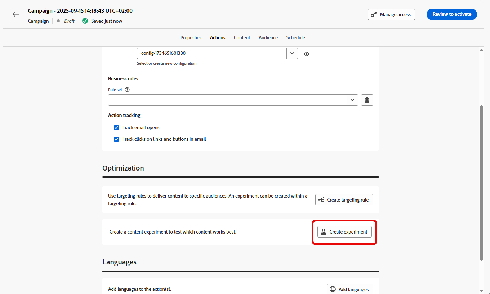

# Criar um experimento de conteúdo {#content-experiment}

>[!CONTEXTUALHELP]
>id="ajo_campaigns_content_experiment"
>title="Experimento de conteúdo"
>abstract="É possível optar por variar o conteúdo ou o assunto da mensagem para definir vários tratamentos e determinar a melhor combinação para seus públicos-alvo."

>[!NOTE]
>
>Antes de começar com o Experimento de conteúdo, verifique se a configuração de relatórios está definida para seus conjuntos de dados personalizados. Saiba mais [nesta seção](../reports/reporting-configuration.md).

O Experimento de conteúdo do Journey Optimizer permite definir vários tratamentos de delivery para medir qual tem melhor desempenho para o público-alvo. Você pode optar por variar o conteúdo ou o assunto do delivery. O público-alvo de interesse é alocado aleatoriamente para cada tratamento para determinar qual funciona melhor em termos da métrica especificada.

No exemplo abaixo, o target do delivery foi dividido em dois grupos, cada um representando 45% da população direcionada, e um grupo de controle de 10%, que não receberá o delivery.

Cada pessoa no público-alvo receberá uma versão de um email, com uma linha de assunto que é uma das duas a seguir:

* uma promovendo diretamente uma oferta de 10% na nova coleção e uma imagem.
* a outra só anuncia uma oferta especial sem especificar os 10% de desconto sem nenhuma imagem.

O objetivo aqui é ver se os recipients interagirão com o email dependendo do experimento recebido. Portanto, vamos escolher **[!UICONTROL Aberturas de email]** como a principal métrica de meta neste Experimento de conteúdo.

➡️ Saiba como usar experimentos de conteúdo para comparar decisões com o canal de experiência baseado em código neste [caso de uso](../experience-decisioning/experience-decisioning-uc.md).

## Criar seu conteúdo {#campaign-experiment}

1. Comece criando e configurando sua [campanha](../campaigns/create-campaign.md) ou [jornada](../building-journeys/journeys-message.md) de acordo com suas necessidades.

1. Na janela **[!UICONTROL Editar conteúdo]**, comece a personalizar o tratamento A.

   Para esse tratamento, especificaremos a oferta especial diretamente na linha de assunto e adicionaremos personalização.

   

1. Crie ou importe seu conteúdo original e personalize-o conforme necessário.

## Configurar o experimento de conteúdo {#configure-experiment}

>[!CONTEXTUALHELP]
>id="ajo_campaigns_content_experiment_dimension"
>title="Dimensão"
>abstract="Escolha a dimensão específica a ser rastreada para o seu experimento, como certos cliques ou visualizações de determinadas páginas."

>[!CONTEXTUALHELP]
>id="ajo_campaigns_content_experiment_success_metric"
>title="Métrica de sucesso"
>abstract="A métrica de sucesso é usada para rastrear e avaliar o tratamento com melhor desempenho em um experimento. Certifique-se de configurar seu conjunto de dados para determinadas métricas antes de usá-lo."

1. Quando sua mensagem for personalizada, na página de resumo da campanha, clique em **[!UICONTROL Criar experimento]** para começar a configurar seu experimento de conteúdo.

   

1. Selecione a **[!UICONTROL Métrica de sucesso]** que você deseja definir para o seu experimento.

   Para este exemplo, selecione **[!UICONTROL Email aberto]** para testar se os perfis abrem seus emails se o código promocional estiver na linha de assunto.

   

1. Ao configurar um experimento usando o canal no aplicativo ou na Web e escolher as **[!UICONTROL métricas de Cliques de entrada]**, **[!UICONTROL Cliques de entrada exclusivos]**, **[!UICONTROL Exibições de página]** ou **[!UICONTROL Métricas de Exibições de página exclusivas]** , o menu suspenso **[!UICONTROL Ação de clique]** permite que você rastreie e monitore precisamente os cliques e os modos de exibição em páginas específicas.

   

1. Clique em **[!UICONTROL Adicionar tratamento]** para criar quantos novos tratamentos forem necessários.

   

1. Altere o **[!UICONTROL Título]** do seu tratamento para diferenciá-los melhor.

1. Escolha adicionar um grupo **[!UICONTROL de Retenção]** à entrega. Este grupo não receberá nenhum conteúdo desta campanha.

   Se você ativar a barra de alternância ocupará automaticamente 10% da sua população, é possível ajustar essa porcentagem, se necessário.

   >[!IMPORTANT]
   >
   >Quando um grupo de controle é usado em uma ação para experimentação de conteúdo, a atribuição de controle se aplica somente a essa ação específica. Depois que a ação for concluída, os perfis no grupo de controle continuarão no caminho da jornada e poderão receber mensagens de outras ações. Portanto, certifique-se de que qualquer mensagem subsequente não dependa do recebimento de uma mensagem por um perfil que possa estar em um grupo de controle. Caso o faça, talvez seja necessário remover a atribuição de controle.

   

1. Você pode optar por alocar uma porcentagem precisa para cada **[!UICONTROL Tratamento]** ou simplesmente alternar na barra de alternância **[!UICONTROL Distribuir uniformemente]**.

   

1. Clique em **[!UICONTROL Criar]** quando sua configuração estiver definida.

## Projetar seus tratamentos {#treatment-experiment}

1. Na janela **[!UICONTROL Editar conteúdo]**, selecione seu tratamento B para alterar o conteúdo.

   Aqui, optamos por não especificar a oferta na **[!UICONTROL Linha de assunto]**.

   

1. Clique em **[!UICONTROL Editar corpo do email]** para personalizar ainda mais seu tratamento B.

   

1. Após criar seus tratamentos, clique em **[!UICONTROL Mais ações]** para acessar as opções relacionadas a seus tratamentos: **[!UICONTROL Renomear]**, **[!UICONTROL Duplicar]** e **[!UICONTROL Excluir]**.

   

1. Se necessário, acesse o menu **[!UICONTROL Configurações de experimento]** para alterar a configuração de tratamentos.

   

1. Depois que o conteúdo da mensagem for definido, clique no botão **[!UICONTROL Simular conteúdo]** para controlar a renderização da entrega e verificar as configurações de personalização com perfis de teste. [Saiba mais](../content-management/preview-test.md)

Depois de configurar sua experimentação, você pode acompanhar o sucesso do delivery com seu relatório. [Saiba mais](../reports/campaign-global-report-cja-experimentation.md)

