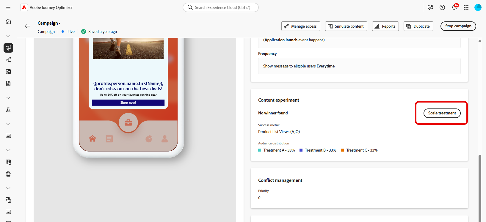

# Criar um experimento de conteúdo {#content-experiment}

>[!CONTEXTUALHELP]
>id="ajo_campaigns_content_experiment"
>title="Experimento de conteúdo"
>abstract="É possível optar por variar o conteúdo ou o assunto da mensagem para definir vários tratamentos e determinar a melhor combinação para seus públicos-alvo."

>[!NOTE]
>
>Antes de começar com o Experimento de conteúdo, verifique se a configuração de relatórios está definida para seus conjuntos de dados personalizados. Saiba mais [nesta seção](../reports/reporting-configuration.md).

O Experimento de conteúdo do Journey Optimizer permite definir vários tratamentos de delivery para medir qual tem melhor desempenho para o público-alvo. Você pode optar por variar o conteúdo ou o assunto do delivery. O público-alvo de interesse é alocado aleatoriamente para cada tratamento para determinar qual funciona melhor em termos da métrica especificada.

No exemplo abaixo, o target do delivery foi dividido em dois grupos, cada um representando 45% da população direcionada, e um grupo de controle de 10%, que não receberá o delivery.

Cada pessoa no público-alvo receberá uma versão de um email, com uma linha de assunto que é uma das duas a seguir:

* uma promovendo diretamente uma oferta de 10% na nova coleção e uma imagem.
* a outra só anuncia uma oferta especial sem especificar os 10% de desconto sem nenhuma imagem.

O objetivo aqui é ver se os recipients interagirão com o email dependendo do experimento recebido. Portanto, vamos escolher **[!UICONTROL Aberturas de email]** como a principal métrica de meta neste Experimento de conteúdo.

➡️ Saiba como usar experimentos de conteúdo para comparar decisões com o canal de experiência baseado em código neste [caso de uso](../experience-decisioning/experience-decisioning-uc.md).

## Criar seu conteúdo {#campaign-experiment}

1. Comece criando e configurando sua [campanha](../campaigns/create-campaign.md) ou [jornada](../building-journeys/journeys-message.md) de acordo com suas necessidades.

1. Na janela **[!UICONTROL Editar conteúdo]**, comece a personalizar o tratamento A.

   Para esse tratamento, especificaremos a oferta especial diretamente na linha de assunto e adicionaremos personalização.

   

1. Crie ou importe seu conteúdo original e personalize-o conforme necessário.

## Configurar o experimento de conteúdo {#configure-experiment}

>[!CONTEXTUALHELP]
>id="ajo_campaigns_content_experiment_dimension"
>title="Dimensão"
>abstract="Escolha a dimensão específica a ser rastreada para o seu experimento, como certos cliques ou visualizações de determinadas páginas."

>[!CONTEXTUALHELP]
>id="ajo_campaigns_content_experiment_success_metric"
>title="Métrica de sucesso"
>abstract="A métrica de sucesso é usada para rastrear e avaliar o tratamento com melhor desempenho em um experimento. Certifique-se de configurar seu conjunto de dados para determinadas métricas antes de usá-lo."

1. Quando sua mensagem for personalizada, na página de resumo da campanha, clique em **[!UICONTROL Criar experimento]** para começar a configurar seu experimento de conteúdo.

   

1. Selecione a **[!UICONTROL Métrica de sucesso]** que você deseja definir para o seu experimento.

   Para este exemplo, selecione **[!UICONTROL Email aberto]** para testar se os perfis abrem seus emails se o código promocional estiver na linha de assunto.

   

1. Ao configurar um experimento usando o canal no aplicativo ou na Web e escolher as **[!UICONTROL métricas de Cliques de entrada]**, **[!UICONTROL Cliques de entrada exclusivos]**, **[!UICONTROL Exibições de página]** ou **[!UICONTROL Métricas de Exibições de página exclusivas]** , o menu suspenso **[!UICONTROL Ação de clique]** permite que você rastreie e monitore precisamente os cliques e os modos de exibição em páginas específicas.

   

1. Clique em **[!UICONTROL Adicionar tratamento]** para criar quantos novos tratamentos forem necessários.

   

1. Altere o **[!UICONTROL Título]** do seu tratamento para diferenciá-los melhor.

1. Escolha adicionar um grupo **[!UICONTROL de Retenção]** à entrega. Este grupo não receberá nenhum conteúdo desta campanha.

   Se você ativar a barra de alternância ocupará automaticamente 10% da sua população, é possível ajustar essa porcentagem, se necessário.

   >[!IMPORTANT]
   >
   >Quando um grupo de controle é usado em uma ação para experimentação de conteúdo, a atribuição de controle se aplica somente a essa ação específica. Depois que a ação for concluída, os perfis no grupo de controle continuarão no caminho da jornada e poderão receber mensagens de outras ações. Portanto, certifique-se de que qualquer mensagem subsequente não dependa do recebimento de uma mensagem por um perfil que possa estar em um grupo de controle. Caso o faça, talvez seja necessário remover a atribuição de controle.

   

1. Você pode optar por alocar uma porcentagem precisa para cada **[!UICONTROL Tratamento]** ou simplesmente alternar na barra de alternância **[!UICONTROL Distribuir uniformemente]**.

   

1. Ative o experimento de dimensionamento automático para implantar automaticamente a variação vencedora do seu experimento. [Saiba mais sobre como dimensionar o vencedor](#scale-winner)

1. Clique em **[!UICONTROL Criar]** quando sua configuração estiver definida.

## Projetar seus tratamentos {#treatment-experiment}

1. Na janela **[!UICONTROL Editar conteúdo]**, selecione seu tratamento B para alterar o conteúdo.

   Aqui, optamos por não especificar a oferta na **[!UICONTROL Linha de assunto]**.

   

1. Clique em **[!UICONTROL Editar corpo do email]** para personalizar ainda mais seu tratamento B.

   

1. Após criar seus tratamentos, clique em **[!UICONTROL Mais ações]** para acessar as opções relacionadas a seus tratamentos: **[!UICONTROL Renomear]**, **[!UICONTROL Duplicar]** e **[!UICONTROL Excluir]**.

   

1. Se necessário, acesse o menu **[!UICONTROL Configurações de experimento]** para alterar a configuração de tratamentos.

   

1. Depois que o conteúdo da mensagem for definido, clique no botão **[!UICONTROL Simular conteúdo]** para controlar a renderização da entrega e verificar as configurações de personalização com perfis de teste. [Saiba mais](../content-management/preview-test.md)

Depois de configurar sua experimentação, você pode acompanhar o sucesso do delivery com seu relatório. [Saiba mais](../reports/campaign-global-report-cja-experimentation.md)

## Dimensionar o vencedor {#scale-winner}

>[!AVAILABILITY]
>
>O recurso Dimensionar o vencedor é atualmente compatível com os seguintes canais:
>
>* Canais de entrada (por exemplo, Web, mensagem no aplicativo, experiência baseada em código) em qualquer jornada ou campanha.
>* Canais de saída (por exemplo, email, notificação por push, SMS) em campanhas transacionais acionadas por API.

Dimensionar o Vencedor permite implantar automática ou manualmente a variação vencedora de um experimento em todo o seu público-alvo. Esse recurso garante que, uma vez determinado o vencedor, você possa ampliar seu alcance e eficácia sem monitorar constantemente o experimento.

Você pode escolher entre dois modos:

* **Dimensionamento automático**: defina as configurações de dimensionamento automático ao criar seu experimento escolhendo o tempo e as condições para dimensionar o tratamento vencedor ou uma opção de fallback se nenhum vencedor surgir.

* **Escala Manual**: analise manualmente os resultados do experimento e inicie a implantação do tratamento vencedor, mantendo o controle total sobre o tempo e as decisões.

### Dimensionamento automático {#autoscaling}

O dimensionamento automático permite definir regras predefinidas para quando implantar o tratamento vencedor ou um fallback, com base nos resultados do experimento.

Observe que após o dimensionamento automático, o dimensionamento manual não estará mais disponível.

Para ativar a escala automática em seus experimentos:

1. Configure sua campanha ou jornada e configure seu experimento conforme necessário. [Saiba mais](#configure-experiment)

1. Ative a opção de dimensionamento automático ao configurar seu experimento.

   

1. Selecione quando o vencedor deve ser dimensionado:

   * Assim que o vencedor for encontrado.
   * Após o experimento ficar ativo pelo tempo selecionado.

     A hora de dimensionamento automático deve ser agendada antes da data de término do experimento. Se for definido para um período posterior à data de término, um aviso de validação será exibido e a campanha ou jornada não será publicada.

   

1. Escolha o comportamento de fallback se nenhum vencedor for encontrado por tempo de escala:

   * Continue o experimento até que ele termine como programado.
   * Dimensione o tratamento alternativo após um tempo especificado.

Depois que todos os parâmetros forem atendidos, o tratamento vencedor ou alternativo será enviado para o público-alvo.

### Dimensionamento manual {#manual-scaling}

O dimensionamento manual oferece a capacidade de analisar os resultados do experimento e decidir quando implantar o tratamento vencedor de acordo com seu próprio cronograma.

Observe que, se você dimensionar manualmente o vencedor antes do tempo de dimensionamento automático programado, a dimensionamento automático será cancelada.

Para dimensionar manualmente o vencedor de seus experimentos:

1. Configure sua campanha ou jornada e configure seu experimento conforme necessário. [Saiba mais](#configure-experiment)

1. Deixe o experimento ser executado até que um vencedor seja identificado ou até que a significância estatística seja alcançada.

1. Abra o painel da campanha ou selecione a atividade de canal na jornada.

   Revise os resultados no menu **[!UICONTROL Experimento de Conteúdo]** para identificar o tratamento de melhor desempenho.

   

1. Clique em **[!UICONTROL Dimensionar tratamento]** para encaminhar o tratamento vencedor ao restante do público-alvo.

   

1. Selecione o tratamento que deseja dimensionar no menu suspenso e clique em **[!UICONTROL Escala]**.

   

Observe que o dimensionamento do tratamento pode levar até uma hora. Você receberá uma notificação quando o processo de dimensionamento manual for concluído.

