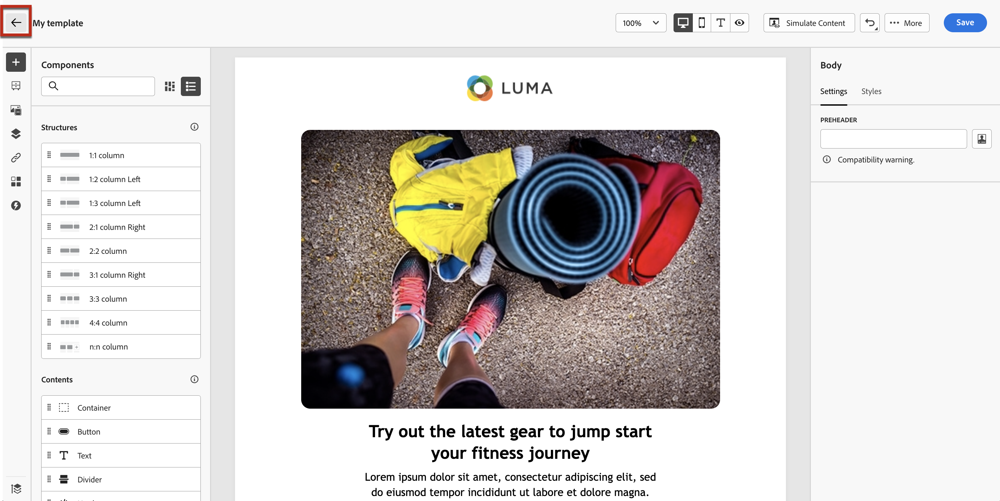

# Trabalhar com modelos de conteúdo {#content-templates}

Para um processo de design acelerado e aprimorado, é possível criar modelos independentes para reutilizar facilmente o conteúdo personalizado em [!DNL Journey Optimizer] campanhas e jornadas.

Essa funcionalidade permite que usuários orientados a conteúdo trabalhem em modelos fora de campanhas ou jornadas. Os usuários de marketing podem então reutilizar e adaptar esses modelos de conteúdo independentes em suas próprias jornadas ou campanhas.

>[!NOTE]
>
>Atualmente, somente o **email** modelos de conteúdo são compatíveis.

Por exemplo, um usuário em sua empresa é responsável apenas pelo conteúdo e, portanto, não tem acesso a campanhas ou jornadas. No entanto, esse usuário pode criar um modelo de email que os profissionais de marketing da sua organização poderão selecionar para uso em todos os emails como ponto de partida.

Você também pode criar e gerenciar modelos de conteúdo usando APIs. Para obter mais informações, consulte [Documentação das APIs do Journey Optimizer](https://developer.adobe.com/journey-optimizer-apis/references/content/){target="_blank"}.

➡️ [Saiba como criar e usar modelos neste vídeo](#video-templates)

>[!CAUTION]
>
>Para criar, editar e excluir modelos de conteúdo, você deve ter a **[!DNL Manage library items]** permissão incluída na **[!DNL Content Library Manager]** perfil do produto. [Saiba mais](../administration/ootb-product-profiles.md#content-library-manager)

## Acessar e gerenciar modelos {#access-manage-templates}

Para acessar a lista de modelos de conteúdo, selecione **[!UICONTROL Gestão de conteúdo]** > **[!UICONTROL Modelos de conteúdo]** no menu esquerdo.

Todos os modelos criados na sandbox atual - de uma jornada ou campanha usando o [Salvar como modelo](#save-as-template) opção, seja a partir da variável **[!UICONTROL Modelos de conteúdo]** - são exibidos.

Você pode classificar modelos de conteúdo por data de criação ou modificação. Você também pode optar por exibir somente os itens criados ou modificados.

Para editar o conteúdo de um modelo, clique no item desejado na lista e selecione **[!UICONTROL Editar conteúdo]**.

Para excluir um modelo, selecione o ícone de lixeira ao lado do modelo desejado.

>[!NOTE]
>
>Quando um template é editado ou excluído, as campanhas ou jornadas, incluindo emails criados usando esse template, não são afetadas.

## Criar modelos de conteúdo {#create-content-templates}

>[!CONTEXTUALHELP]
>id="ajo_create_template"
>title="Definir seu próprio modelo de conteúdo"
>abstract="Crie um modelo personalizado independente partindo do zero para tornar seu conteúdo reutilizável em várias jornadas e campanhas."

Há duas maneiras de criar modelos de conteúdo:

* Criar um modelo de conteúdo do zero, usando o painel esquerdo **[!UICONTROL Modelos de conteúdo]** menu. [Saiba como](#create-template-from-scratch)

* Ao criar um email em uma campanha ou jornada, salve o conteúdo do email como template. [Saiba como](#save-as-template)

Depois de salvo, seu template de conteúdo fica disponível para uso em uma campanha ou jornada. Seja criado do zero ou de um email anterior, agora é possível usar esse modelo ao criar qualquer [email](../email/get-started-email-design.md) no prazo de [!DNL Journey Optimizer]. [Saiba como](../email/use-email-templates.md)

>[!NOTE]
>
>* As alterações feitas em modelos de conteúdo não são propagadas para campanhas ou jornadas, estejam elas ativas ou em rascunho.
>
>* Da mesma forma, quando os modelos são usados em uma campanha ou jornada, as edições feitas na campanha e no conteúdo da jornada não afetam o modelo de conteúdo usado anteriormente.

### Criar modelo do zero {#create-template-from-scratch}

Para criar um template de conteúdo do zero, siga as etapas abaixo.

1. Acesse a lista de templates de conteúdo por meio da **[!UICONTROL Gestão de conteúdo]** > **[!UICONTROL Modelos de conteúdo]** menu esquerdo.

1. Selecionar **[!UICONTROL Criar modelo]**.

1. Preencha os detalhes do template.

   

   >[!NOTE]
   >
   >Atualmente, somente o **E-mail** canal e **HTML** tipo são compatíveis.

1. Para atribuir rótulos de uso de dados principais ou personalizados ao modelo, selecione **[!UICONTROL Gerenciar acesso]**. [Saiba mais sobre o OLAC (Object Level Access Control)](../administration/object-based-access.md).

1. Selecione ou crie tags do Adobe Experience Platform na **[!UICONTROL Tags]** para categorizar seu modelo para pesquisa aprimorada. [Saiba mais](../start/search-filter-categorize.md#tags)

1. Clique em **[!UICONTROL Criar]** e escolha como deseja criar seu modelo a partir das diferentes opções:

   * [Projetar o email do zero](../email/content-from-scratch.md) por meio da interface do Designer de email.

   * [Código ou HTML bruto de copiar e colar](../email/code-content.md) diretamente no Designer de email.

   * [Importar conteúdo de HTML existente](../email/existing-content.md) de um arquivo ou de uma pasta .zip.

   * Use conteúdo existente de uma lista de modelos incorporados ou personalizados. As etapas para usar um template de conteúdo em um email estão descritas em [nesta seção](../email/use-email-templates.md).

   

1. A variável [Email Designer](../email/get-started-email-design.md) é exibido. Edite seu conteúdo conforme necessário, da mesma forma que faria para qualquer email dentro de uma jornada ou campanha, de acordo com a opção selecionada.

   Você pode testar seu conteúdo, se necessário. [Saiba como](#test-template)

1. Quando o modelo estiver pronto, clique em **[!UICONTROL Salvar]**.

1. Se necessário, clique na seta ao lado do nome do template para voltar para a **[!UICONTROL Detalhes]** e editar seu modelo.

   

Este template está pronto para ser usado ao criar qualquer email no [!DNL Journey Optimizer]. [Saiba como](../email/use-email-templates.md)

### Salvar como modelo {#save-as-template}

>[!CONTEXTUALHELP]
>id="ajo_messages_depecrated_inventory"
>title="Saiba como migrar as mensagens"
>abstract="Em 25 de julho de 2022, o menu Mensagens desapareceu e as mensagens agora são criadas diretamente na jornada. Se você quiser reutilizar as mensagens herdadas nas jornadas, é necessário salvá-las como modelos."

Ao projetar um [email](../email/get-started-email-design.md) em uma campanha ou jornada, você pode salvar seu conteúdo de email para futura reutilização. Para fazer isso, siga as etapas abaixo.

1. No Designer de email, clique nas reticências na parte superior direita da tela.

1. Selecionar **[!UICONTROL Salvar como modelo de conteúdo]** no menu suspenso.

   

1. Adicione um nome e uma descrição para este template.

   

1. Para atribuir rótulos de uso de dados principais ou personalizados ao modelo, selecione **[!UICONTROL Gerenciar acesso]**. [Saiba mais](../administration/object-based-access.md).

1. Selecione ou crie uma tag do Adobe Experience Platform na **Tags** para categorizar seu modelo. [Saiba mais](../start/search-filter-categorize.md#tags)

1. Clique em **[!UICONTROL Salvar]**.

1. O modelo é salvo na variável **[!UICONTROL Modelos de conteúdo]** , acessível na [!DNL Journey Optimizer] menu dedicado. Ele se torna um modelo de conteúdo independente que pode ser acessado, editado e excluído como qualquer outro item nessa lista. [Saiba mais](#access-manage-templates)

Agora você pode usar este modelo ao criar qualquer [email](../email/get-started-email-design.md) no prazo de [!DNL Journey Optimizer]. [Saiba como](../email/use-email-templates.md)

>[!NOTE]
>
>Qualquer alteração nesse novo modelo não será propagada para o email de onde vem. Da mesma forma, quando o conteúdo original é editado nesse email, o novo modelo não é modificado.

## Testar seu modelo de conteúdo {#test-template}

Você pode testar a renderização de qualquer template de conteúdo de email, seja criado do zero ou por um email. Para isso, siga as etapas abaixo.

1. Acesse a lista de templates de conteúdo por meio da **[!UICONTROL Gestão de conteúdo]** > **[!UICONTROL Modelos de conteúdo]** e selecione qualquer modelo.

1. Clique em **[!UICONTROL Editar conteúdo]** do **[!UICONTROL Propriedades do modelo]**.

1. Clique em **[!UICONTROL Simular conteúdo]** e selecione um perfil de teste para verificar a renderização de email. Você pode escolher exibir no desktop ou em um dispositivo móvel. [Saiba mais](../content-management/preview-test.md)

   

1. Você pode enviar uma prova para testar seu conteúdo e aprová-lo por alguns usuários internos antes de usá-lo em uma jornada ou campanha.

   * Para fazer isso, clique no link **[!UICONTROL Enviar prova]** e siga as etapas descritas em [nesta seção](../content-management/proofs.md).

   * Antes de enviar a prova, selecione a variável [superfície de email](../configuration/channel-surfaces.md) que serão usados para testar o conteúdo.

     

>[!CAUTION]
>
>Atualmente, o rastreamento não é compatível ao testar modelos de conteúdo de email, o que significa que o rastreamento de eventos, parâmetros UTM e links de página de aterrissagem não será eficaz nas provas que estão sendo enviadas de um modelo. Para testar o rastreamento, [usar o modelo de conteúdo](../email/use-email-templates.md) em um email e [enviar uma prova](../content-management/preview-test.md#send-proofs).

## Vídeo explicativo {#video-templates}

Saiba como criar, editar e usar modelos de conteúdo no [!DNL Journey Optimizer].

>[!VIDEO](https://video.tv.adobe.com/v/3413743/?quality=12)
