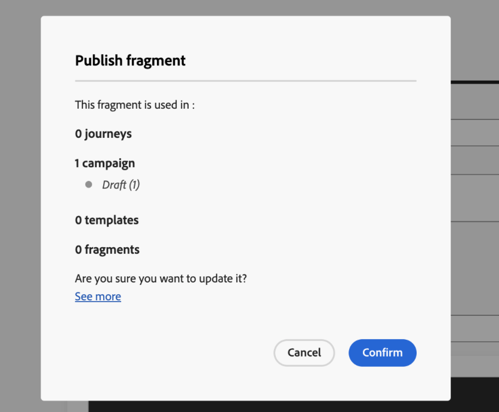

# Criar um fragmento {#create-fragments}

>[!CONTEXTUALHELP]
>id="ajo_create_visual_fragment"
>title="Selecione o tipo “Visual”"
>abstract="Crie um fragmento visual independente para tornar o conteúdo reutilizável em um email de uma jornada ou campanha ou em um modelo de conteúdo."
>additional-url="https://experienceleague.adobe.com/docs/journey-optimizer/using/email/design-email/add-content/use-visual-fragments.html?lang=pt-BR" text="Adicionar fragmentos visuais aos emails"

>[!CONTEXTUALHELP]
>id="ajo_create_expression_fragment"
>title="Selecione o tipo “Expressão”"
>abstract="Crie um fragmento de expressão independente para tornar seu conteúdo reutilizável em várias jornadas e campanhas. Ao usar o editor de personalização, é possível aproveitar todos os fragmentos de expressão criados na sandbox atual."
>additional-url="https://experienceleague.adobe.com/docs/journey-optimizer/using/content-management/personalization/expression-editor/use-expression-fragments.html?lang=pt-BR" text="Aproveitar fragmentos de expressão"

Os fragmentos podem ser criados do zero no **[!UICONTROL Fragmentos]** menu esquerdo. Além disso, também é possível salvar uma parte do conteúdo existente como fragmento ao projetar o conteúdo. [Saiba como](#save-as-fragment)

Depois de salvo, o fragmento fica disponível para uso em uma jornada, campanha ou template. Você pode usar esse fragmento ao criar qualquer conteúdo em jornadas e campanhas. Consulte [Adicionar fragmentos visuais](../email/use-visual-fragments.md) e [Aproveitar fragmentos de expressão](../personalization/use-expression-fragments.md)

Para criar um fragmento, siga as etapas abaixo.

## Definir as propriedades do fragmento {#properties}

1. Acesse a lista de fragmentos por meio da **[!UICONTROL Gestão de conteúdo]** > **[!UICONTROL Fragmentos]** menu esquerdo.

1. Selecionar **[!UICONTROL Criar fragmento]** e preencha o nome e a descrição do fragmento (se necessário).

   

1. Selecione ou crie tags do Adobe Experience Platform na **[!UICONTROL Tags]** para categorizar seu fragmento para pesquisa aprimorada. [Saiba como trabalhar com Tags unificadas](../start/search-filter-categorize.md#tags)

1. Selecione o tipo de fragmento: **Fragmento visual** ou **Fragmento da expressão**. [Saiba mais sobre fragmentos visuais e de expressão](../content-management/fragments.md#visual-expression)

   >[!NOTE]
   >
   >Por enquanto, os fragmentos visuais estão disponíveis para o **E-mail** somente canal.

1. Se estiver criando um fragmento de expressão, selecione o tipo de código que deseja usar: **[!UICONTROL HTML]**, **[!UICONTROL JSON]** ou **[!UICONTROL Texto]**.

   

1. Para atribuir rótulos de uso de dados personalizados ou principais ao fragmento, clique no **[!UICONTROL Gerenciar acesso]** na seção superior da tela. [Saiba mais sobre o OLAC (Object Level Access Control)](../administration/object-based-access.md).

1. Clique em **[!UICONTROL Criar]** para projetar o conteúdo do fragmento.

## Criar o conteúdo do fragmento {#content}

Após configurar as propriedades do fragmento, o Designer de email ou o editor de personalização é aberto, dependendo do tipo de fragmento que você está criando.

* Para fragmentos visuais, edite o conteúdo conforme necessário, da mesma forma que faria para qualquer email dentro de uma jornada ou campanha. [Saiba mais](../email/get-started-email-design.md)

  

* Para fragmentos de expressão, utilize o [!DNL Journey Optimizer] o editor de personalização com todos os seus recursos de personalização e criação para criar o conteúdo do fragmento. [Saiba mais](../personalization/personalization-build-expressions.md)

  

Quando o conteúdo estiver pronto, clique no link **Salvar** botão. O fragmento é criado e adicionado à lista de fragmentos com o **Rascunho** status. Você pode visualizá-la e publicá-la para torná-la disponível em jornadas e campanhas.

>[!NOTE]
>
>A publicação de fragmentos está sendo lançada gradualmente ao longo de vários dias após o lançamento do Journey Optimizer em junho. Embora alguns usuários tenham acesso imediato, outros podem enfrentar um atraso antes que ele se torne disponível em seus ambientes. Se esse aprimoramento ainda não estiver disponível em seu ambiente, observe que a publicação de fragmentos não é necessária para usar fragmentos em suas jornadas e campanhas.

## Pré-visualizar e publicar o fragmento {#publish}

>[!NOTE]
>
>Para publicar um fragmento, é necessário ter a **Publicar fragmento** permissão relacionada. [Saiba mais sobre permissões](../administration/ootb-permissions.md)

Se o fragmento estiver pronto para entrar no ar, você poderá visualizá-lo e publicá-lo para disponibilizá-lo em suas jornadas e campanhas. Para fazer isso, siga estes passos:

1. Volte para a tela de criação do fragmento depois de criar o conteúdo ou abra-o a partir da lista de fragmentos.

1. Uma visualização do fragmento está disponível no **Tags** , permitindo verificar sua renderização. Se precisar fazer alguma alteração, clique no link **Editar** botão na seção superior da tela para abrir o Designer de email ou o editor de personalização, dependendo do tipo de fragmento.

   

1. Clique em **Publish** no canto superior direito para publicar o fragmento.

   Se o fragmento estiver sendo usado em uma jornada ou campanha em tempo real, uma mensagem é aberta para informá-lo. Clique em **Veja mais** link para acessar a lista de jornadas e/ou campanhas onde ela é referenciada. [Saiba como explorar referências de um fragmento](../content-management/manage-fragments.md#explore-references)

   Clique em **Confirmar o** para publicar o fragmento e atualizá-lo nas jornadas/campanhas ativas que o estão usando.

   {width="70%" align="center"}

O fragmento agora está **Ao vivo** e fica disponível ao criar qualquer conteúdo dentro do [!DNL Journey Optimizer] Email Designer ou editor de personalização:

* [Saiba como usar fragmentos visuais](../email/use-visual-fragments.md)
* [Saiba como usar fragmentos de expressão](../personalization/use-expression-fragments.md)
