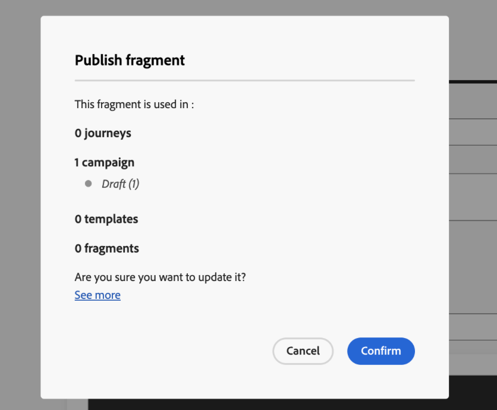

# Criar um fragmento {#create-fragments}

>[!BEGINSHADEBOX]

**Nesta página:** saiba como criar, projetar, bloquear, visualizar e publicar fragmentos visuais e de expressão para poder reutilizar conteúdo em campanhas e jornadas do Adobe Journey Optimizer.

>[!ENDSHADEBOX]

>[!CONTEXTUALHELP]
>id="ajo_create_visual_fragment"
>title="Selecione o tipo “Visual”"
>abstract="Crie um fragmento visual independente para tornar o conteúdo reutilizável em um email de uma jornada ou campanha ou em um modelo de conteúdo."
>additional-url="https://experienceleague.adobe.com/pt-br/docs/journey-optimizer/using/channels/email/design-email/add-content/use-visual-fragments" text="Adicionar fragmentos visuais a emails"

>[!CONTEXTUALHELP]
>id="ajo_create_expression_fragment"
>title="Selecione o tipo “Expressão”"
>abstract="Crie um fragmento de expressão independente para tornar seu conteúdo reutilizável em várias jornadas e campanhas. Ao usar o editor de personalização, é possível aproveitar todos os fragmentos de expressão criados na sandbox atual."
>additional-url="https://experienceleague.adobe.com/pt-br/docs/journey-optimizer/using/content-management/personalization/personalization-build-expressions" text="Trabalhar com o editor de personalização"

Os fragmentos podem ser criados do zero no menu esquerdo **[!UICONTROL Fragmentos]**. Além disso, também é possível salvar uma parte do conteúdo existente como fragmento ao projetar o conteúdo. [Saiba como](save-fragments.md#)

Depois de salvo, o fragmento fica disponível para uso em uma jornada, campanha ou template. Você pode usar esse fragmento ao criar qualquer conteúdo em jornadas e campanhas. Consulte [Adicionar fragmentos visuais](../email/use-visual-fragments.md) e [Aproveitar fragmentos de expressão](../personalization/use-expression-fragments.md).

➡️ [Gerencie seus fragmentos de conteúdo do Adobe Experience Manager](../integrations/aem-fragments-manage.md) para exibir fragmentos sincronizados, referências, marcas e sincronização manual na guia **[!UICONTROL Fragmentos do AEM]**.

Para criar um fragmento, siga as etapas abaixo.

## Definir as propriedades do fragmento {#properties}

1. Acesse a lista de fragmentos por meio do menu esquerdo **[!UICONTROL Gerenciamento de conteúdo]** > **[!UICONTROL Fragmentos]**.

1. Selecione **[!UICONTROL Criar fragmento]** e preencha o nome e a descrição do fragmento (se necessário).

   

1. Selecione ou crie tags do Adobe Experience Platform a partir do campo **[!UICONTROL Tags]** para categorizar seu fragmento para pesquisa aprimorada. [Saiba como trabalhar com Marcas Unificadas](../start/search-filter-categorize.md#tags)

1. Selecione o tipo de fragmento: **Fragmento visual** ou **Fragmento de expressão**. [Saiba mais](../content-management/fragments.md#visual-expression)

   >[!NOTE]
   >
   >Atualmente, os fragmentos visuais estão disponíveis somente para o canal **Email**.

1. Se você estiver criando um fragmento de expressão, selecione o tipo de código que deseja usar: **[!UICONTROL HTML]**, **[!UICONTROL JSON]** ou **[!UICONTROL Text]**.

   

1. Para atribuir rótulos de uso de dados personalizados ou principais ao fragmento, clique no botão **[!UICONTROL Gerenciar acesso]** na seção superior da tela. [Saiba mais sobre o OLAC (Controle de Acesso em Nível de Objeto)](../administration/object-based-access.md).

1. Clique em **[!UICONTROL Criar]** para criar o conteúdo do fragmento.

## Criar o conteúdo do fragmento {#content}

Após configurar as propriedades do fragmento, o Designer de email ou o editor de personalização é aberto, dependendo do tipo de fragmento que você está criando.

>[!NOTE]
>
>[Atributos contextuais](../personalization/personalization-build-expressions.md) não são permitidos dentro de fragmentos.
>
>Quando o rastreamento é habilitado em uma jornada ou campanha, se você adicionar links a um fragmento e esse fragmento for usado em uma mensagem, esses links serão rastreados como todos os outros links inclusos na mensagem. [Saiba mais sobre links e rastreamento](../email/message-tracking.md)

* Para fragmentos visuais, edite o conteúdo conforme necessário, da mesma forma que faria para qualquer email dentro de uma jornada ou campanha. [Saiba mais](../email/get-started-email-design.md)

  

  Para aplicar rapidamente um estilo específico que se ajuste à sua marca e design, você pode aplicar um [tema](../email/apply-email-themes.md) ao seu fragmento.

  

  >[!CAUTION]
  >
  >Os fragmentos não são compatíveis entre os modos Usar temas e Estilo manual. Ao usar um fragmento no conteúdo de email, verifique se está aplicando um tema definido para esse fragmento. [Saiba mais](../email/apply-email-themes.md#leverage-themes-fragment)

* Para fragmentos de expressão, aproveite o editor de personalização do [!DNL Journey Optimizer] com todos os seus recursos de personalização e criação para criar o conteúdo do fragmento. [Saiba mais](../personalization/personalization-build-expressions.md)

  

  >[!NOTE]
  >
  >Os fragmentos de expressão do tipo JSON são validados sintaticamente ao salvar, com todos os erros exibidos como alertas de aviso.

Quando o conteúdo estiver pronto, clique no botão **[!UICONTROL Salvar]**.

>[!NOTE]
>
>Fragmentos visuais não podem exceder 100 KB. Fragmentos de expressão não podem exceder 200 KB.

O fragmento é criado e adicionado à lista de fragmentos com o status **[!UICONTROL Rascunho]**. Você pode visualizá-la e publicá-la para torná-la disponível em jornadas e campanhas.

### Bloquear um fragmento visual {#lock-visual-fragment}

Se estiver criando ou editando um fragmento visual, você pode bloqueá-lo para impedir que os editores o modifiquem ou desanexem quando usado em emails.

Selecionar essa opção garante que o fragmento permaneça sincronizado onde quer que seja usado, ajudando a aplicar a marca, manter a consistência e cumprir os requisitos legais.

Para bloquear um fragmento visual, siga as etapas abaixo.

1. Na tela de edição do conteúdo do fragmento, vá para a guia **[!UICONTROL Configurações]**.

1. Por padrão, o fragmento é desbloqueado. Selecione **[!UICONTROL Impedir a quebra da herança]** para bloquear o fragmento.

1. Clique em **[!UICONTROL Confirmar]**.

   >[!NOTE]
   >
   >Essa configuração pode ser atualizada a qualquer momento. No entanto, as alterações se aplicam somente a usos futuros. Os emails existentes que usam esse fragmento não são modificados.

{width="70%" align="center"}

Agora, ao usar esse fragmento em um email, ele é bloqueado e não pode ser desanexado do fragmento original. [Saiba mais](../email/use-visual-fragments.md#locked-fragments)

As novas atualizações do fragmento bloqueado original são propagadas automaticamente para todos os emails que o utilizam.

## Pré-visualizar e publicar o fragmento {#publish}

>[!NOTE]
>
>Para publicar um fragmento, você deve ter a permissão de usuário [Publicar fragmento](../administration/ootb-product-profiles.md#content-library-manager).

Se o fragmento estiver pronto para entrar no ar, você poderá visualizá-lo e publicá-lo para disponibilizá-lo em suas jornadas e campanhas. Para isso, siga as etapas abaixo.

1. Volte para a tela de criação do fragmento depois de criar o conteúdo ou abra-o a partir da lista de fragmentos.

1. Uma visualização do fragmento está disponível no campo **[!UICONTROL Tags]**, permitindo verificar sua renderização. Se precisar fazer alguma alteração, clique no botão **[!UICONTROL Editar]** na seção superior da tela para abrir o Designer de email ou o editor de personalização, dependendo do tipo de fragmento. [Saiba mais](manage-fragments.md#edit-fragments)

   

1. Clique no botão **[!UICONTROL Publicar]** no canto superior direito para publicar o fragmento.

1. Se o fragmento estiver sendo usado em uma jornada ou campanha em tempo real, uma mensagem é aberta para informá-lo. Clique no link **[!UICONTROL Ver mais]** para acessar a lista de jornadas e/ou campanhas às quais ele é referenciado. [Saiba como explorar referências de um fragmento](../content-management/manage-fragments.md#explore-references)

   {width="70%" align="center"}

   Clique em **[!UICONTROL Confirmar]** para publicar o fragmento e atualizá-lo nas jornadas/campanhas ativas que o estão usando.

O fragmento agora está **[!UICONTROL Ativo]** e fica disponível ao criar qualquer conteúdo no [!DNL Journey Optimizer] Email Designer ou no editor de personalização.

* [Saiba como usar fragmentos visuais](../email/use-visual-fragments.md)
* [Saiba como usar fragmentos de expressão](../personalization/use-expression-fragments.md)

>[!CAUTION]
>
>Depois de publicado, não é possível adicionar novos atributos personalizados a um fragmento ativo. Se quiser adicionar atributos de personalização, duplique o fragmento. [Saiba mais](manage-fragments.md#adding-new-attributes)

