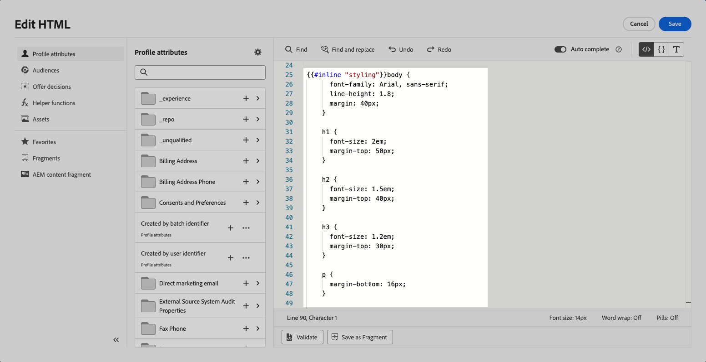

# Fragmentos personalizáveis {#customizable-fragments}

Quando os fragmentos são usados em uma campanha ou ação de jornada, eles são bloqueados por padrão devido à herança. Isso significa que quaisquer alterações feitas em um fragmento são propagadas automaticamente para todas as campanhas e jornadas em que o fragmento é usado.

Com **fragmentos personalizáveis**, campos específicos dentro de um fragmento podem ser definidos como editáveis quando o fragmento é adicionado a uma campanha ou ação de jornada. Por exemplo, suponha que você tenha um fragmento com um banner, texto e botão. Você pode designar determinados campos, como imagem ou URL de destino do botão, como editáveis. Isso permite que os usuários modifiquem esses elementos quando incorporam o fragmento em sua campanha ou jornada, fornecendo uma experiência personalizada sem afetar o fragmento original.

Fragmentos personalizáveis eliminam a necessidade de interromper a herança do fragmento, que anteriormente impedia que as alterações centralizadas no nível do fragmento fossem propagadas para as campanhas e jornadas. Essa abordagem permite que partes do conteúdo sejam ajustadas no momento do uso, oferecendo a flexibilidade de substituir valores padrão por detalhes específicos do contexto.

Ao aproveitar fragmentos personalizáveis, você pode gerenciar e personalizar seu conteúdo com eficiência sem criar blocos de conteúdo totalmente novos ou interromper a herança do fragmento original. Isso garante que as alterações feitas no nível do fragmento ainda sejam propagadas, permitindo a personalização necessária no nível da campanha ou da jornada.

Os fragmentos visuais e de expressão podem ser marcados como personalizáveis. Para obter instruções detalhadas sobre como proceder com cada tipo de fragmento, consulte as seções abaixo.

## Adicionar campos editáveis a fragmentos visuais {#visual}

Para tornar partes de um fragmento visual editáveis, siga estas etapas:

>[!NOTE]
>
>Campos editáveis podem ser adicionados aos componentes **imagem**, **texto** e **botão**. Para componentes do **HTML**, os campos editáveis são adicionados usando o editor de personalização, semelhante aos fragmentos de expressão. [Saiba como adicionar campo editável em componentes do HTML e fragmentos de expressão](#expression)

1. Abra a tela de edição de conteúdo do fragmento.

1. Selecione o componente no fragmento onde deseja configurar campos editáveis.

1. O painel de propriedades do componente é aberto no lado direito. Selecione a guia **Campos editáveis** e alterne a opção **Habilitar edição**.

1. Todos os campos que podem ser editados para o componente selecionado são listados no painel. Os campos disponíveis para edição dependem do tipo de componente selecionado.

   No exemplo abaixo, permitimos a edição do URL do botão &quot;Clique aqui&quot;.

   

1. Clique em **Visão geral** para verificar todos os campos editáveis e seus valores padrão.

   Neste exemplo, o campo URL do botão é exibido com o valor padrão definido no componente. Esse valor será personalizável pelos usuários depois de adicionarem o fragmento ao conteúdo.

   

1. Quando estiver pronto, salve as alterações para atualizar o fragmento.

1. Depois de adicionar o fragmento em um email, os usuários poderão personalizar todos os campos editáveis configurados no fragmento. [Saiba como personalizar campos editáveis em um fragmento visual](../email/use-visual-fragments.md#customize-fields)

## Adicionar campos editáveis a componentes do HTML e fragmentos de expressão {#expression}

Para tornar editáveis partes de um componente do HTML ou de um fragmento de expressão, é necessário usar uma sintaxe específica no editor de expressão. Isso envolve declarar uma **variável** com um valor padrão que os usuários podem substituir após adicionar o fragmento ao seu conteúdo.

Por exemplo, suponha que você queira criar um fragmento para adicionar aos emails e permitir que os usuários personalizem uma cor específica usada em locais diferentes, como quadros ou cores de fundo dos botões. Ao criar o fragmento, é necessário declarar uma variável com uma **ID exclusiva**, por exemplo, &quot;cor&quot;, e chamá-la nos locais desejados no conteúdo do fragmento onde deseja aplicar essa cor. Ao adicionar o fragmento ao conteúdo, os usuários poderão personalizar a cor usada sempre que a variável for referenciada.

Para componentes do HTML, somente elementos específicos podem se tornar campos editáveis. Expanda a seção abaixo para obter mais informações.

+++Elementos editáveis em componentes do HTML:

Os elementos abaixo podem se tornar campos editáveis em um componente do HTML:

* Uma parte do texto
* Um URL completo para link ou imagem (não funciona com parte de um URL)
* Propriedade CSS inteira (não funciona com a propriedade parcial)

Por exemplo, no código abaixo, cada elemento destacado em vermelho pode se tornar uma propriedade:

{width="70%"}

+++

Para declarar uma variável e usá-la no fragmento, siga estas etapas:

1. Abra o fragmento de expressão e edite o conteúdo no editor de personalização.

   

   Para componentes do HTML, selecione o componente no fragmento e clique no botão **Mostrar o código-fonte**.

1. Declarar a variável que você deseja que os usuários editem. Navegue até o menu **Funções auxiliares** no painel de navegação esquerdo e adicione a função auxiliar **embutida**. A sintaxe a ser declarada e chamada para a variável é adicionada automaticamente no conteúdo.

   

1. Substitua `"name"` por uma ID exclusiva para identificar o campo editável.

   >[!NOTE]
   >
   >A ID do campo deve ser exclusiva e não deve ter espaços. Essa ID deve ser usada em qualquer lugar no conteúdo onde você deseja exibir o valor da variável.

1. Adapte a sintaxe de acordo com suas necessidades adicionando parâmetros detalhados na tabela abaixo:

   | Ação | Parâmetro | Exemplo |
   | ------- | ------- | ------- |
   | Declarar um campo editável com um **valor padrão**. Ao adicionar o fragmento ao conteúdo, esse valor padrão será usado se você não personalizá-lo. | Adicione o valor padrão entre as tags em linha. | `{{#inline "editableFieldID"}}default_value{{/inline}}` |
   | Defina um **rótulo** para o campo editável. Esse rótulo será exibido no Designer de email ao editar os campos do fragmento. | `name="title"` | `{{#inline "editableFieldID" name="title"}}default_value{{/inline}}` |
   | Declare um campo editável contendo uma **origem da imagem** que precisa ser publicada. | `assetType="image"` | `{{#inline "editableFieldID" assetType="image"}}default_value{{/inline}}` |
   | Declarar um campo editável contendo um **URL** que precisa ser rastreado. Observe que os blocos predefinidos de &quot;URL da mirror page&quot; e &quot;Cancelar inscrição do link&quot; não podem se tornar campos editáveis. | `assetType="url"` | `{{#inline "editableFieldID" assetType="url"}}default_value{{/inline}}` |

1. Use a sintaxe `{{{name}}}` no código em todos os locais onde deseja exibir o valor do campo editável. Substitua `name` pela ID exclusiva do campo definido anteriormente.

   

1. Salve e publique o fragmento.

Ao adicionar o fragmento ao conteúdo de email, os usuários agora podem substituir os valores padrão das variáveis pelos valores escolhidos:

* Para fragmentos de expressão, uma sintaxe específica é usada para substituir valores de variáveis. [Saiba como personalizar campos editáveis em um fragmento de expressão](../personalization/use-expression-fragments.md#customize-fields)

* Para componentes do HTML, a variável é exibida na lista de campos editáveis no Designer de email. [Saiba como personalizar campos editáveis em um fragmento visual](../email/use-visual-fragments.md#customize-fields)

### Exemplo de fragmento de expressão editável {#example}

No exemplo abaixo, estamos criando um fragmento de expressão que apresenta novas coleções de esportes. Por padrão, o fragmento exibe este conteúdo: *Procurando mais? Não perca nossa última coleção de esportes!*

Queremos permitir que os usuários substituam &quot;esportes&quot; nesse conteúdo pelo esporte de sua escolha. Por exemplo: *Procurando mais? Não perca nossa última coleção de ioga!*

Para fazer isso:

1. Declarar uma variável &quot;sport&quot; com a ID &quot;sport&quot;.

   Por padrão, se os usuários não alterarem o valor da variável após adicionar o fragmento ao conteúdo, ele mostrará o valor definido entre as tags `{{#inline}}` e `{{/inline}}`, ou seja, &quot;esportes&quot;.

1. Adicione a sintaxe ``{{{sport}}}`` no conteúdo do fragmento em que deseja exibir o valor da variável, ou seja, &quot;esportes&quot; por padrão ou o valor escolhido pelos usuários.

   

1. Ao adicionar o fragmento de expressão ao seu conteúdo, os usuários podem alterar o valor da variável com sua escolha diretamente no editor de expressão. [Saiba como personalizar campos editáveis em um fragmento de expressão](../personalization/use-expression-fragments.md#customize-fields)

   

## Adicionar rich text a um fragmento personalizável {#rich-text}

Rich text como quebras de linha, negrito, itálico, etc., podem ser adicionados a um fragmento editável usando componentes do HTML. Para isso, siga as etapas abaixo.

➡️ [Saiba como adicionar e usar rich text a um fragmento editável neste vídeo](#video)

### Criar um fragmento incluindo rich text {#add-rich-text}

1. Crie um [fragmento](create-fragments.md) visual e comece a adicionar componentes.

1. Adicione um [componente do HTML](../email/content-components.md#HTML) e abra o editor do HTML.

1. Navegue até o menu **[!UICONTROL Funções auxiliares]** no painel de navegação esquerdo e adicione a função auxiliar **embutida**.

1. Substitua `"name"` pela ID que deseja usar para o conteúdo editável, por exemplo &quot;EditableContent&quot;.

1. Substitua `render_content` pelo código HTML correspondente ao conteúdo avançado padrão que você deseja. É possível adicionar negrito, itálico, quebras de linha, listas com marcadores etc.

   

1. No mesmo componente do HTML, adicione outra função auxiliar **inline** para seus elementos de estilo.

1. Substitua `"name"` e `render_content` pela ID e pelo código HTML correspondentes ao estilo padrão desejado.

   

1. Salve o conteúdo. Os campos editáveis selecionados são exibidos no lado direito.

   

1. Salve e [publique](create-fragments.md#publish) o fragmento.

### Usar fragmentos editáveis de rich text {#use-rich-text}

Ao adicionar o fragmento ao conteúdo de email, os usuários agora podem editar o conteúdo rich text e o estilo criados por você. Para usar fragmentos editáveis de rich text como profissional de marketing, siga as etapas abaixo.

1. [Crie um email](../email/create-email.md) em uma campanha ou jornada e adicione o fragmento com rich text que foi [criado](#add-rich-text).

   Você pode ver os dois campos editáveis criados no lado direito.

   

1. Você pode clicar em **[!UICONTROL Simular conteúdo]** para ver como o conteúdo editável e o estilo são renderizados. [Saiba mais sobre a visualização de conteúdo](preview-test.md)

1. Selecione o ícone **[!UICONTROL Adicionar personalização]** ao lado de um dos campos editáveis.

1. No editor de personalização que é aberto, atualize o <!--CSS-->estilo e/ou conteúdo conforme desejado adicionando ou removendo elementos do campo editável.

   

## Vídeo tutorial {#video}

Este vídeo mostra como tornar os componentes do HTML em um fragmento editáveis, permitindo atualizações dinâmicas para conteúdo e estilo.

>[!VIDEO](https://video.tv.adobe.com/v/3464373/?learn=on&#x26;enablevpops&captions=por_br)
