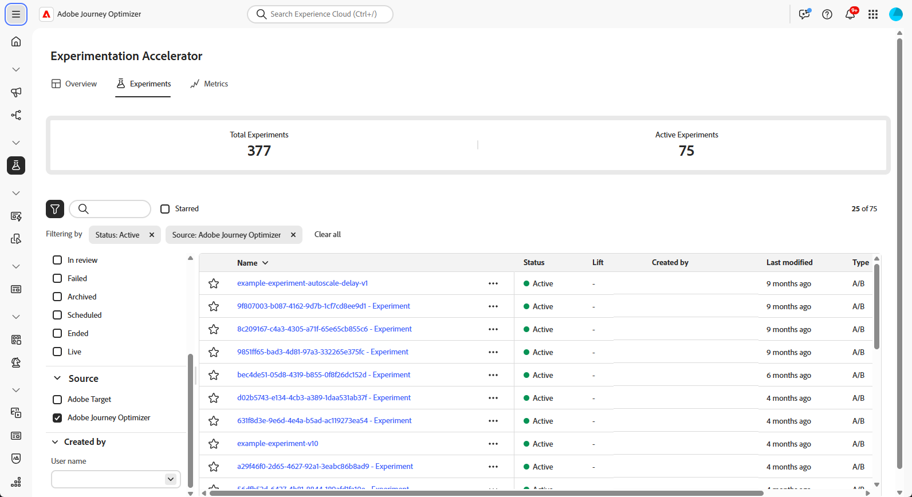

# Guia Experimentos {#monitor}

>[!BEGINSHADEBOX]

* [Introdução à Experimentation Accelerator](experiment-accelerator.md)
* **[Guia Experimentos](experiment-accelerator-monitor.md)**

>[!ENDSHADEBOX]

A guia **[!UICONTROL Experimentos]** centraliza o rastreamento e a análise de testes do Adobe Journey Optimizer e do Adobe Target. Você pode exibir todos os experimentos, revisar KPIs e filtrar ou pesquisar para localizar testes específicos.

## Painel {#dashboard}

Ao acessar a guia Experimentos, todos os experimentos disponíveis do Journey Optimizer e do Adobe Target são listados em uma exibição consolidada. Isso permite revisar e comparar experimentos rapidamente em ambas as plataformas em um único local.
A lista de Experimentos inclui:

* Experimentos do Journey Optimizer criados em Campanhas ou Jornadas.

* Experimentos do Adobe Target disponíveis na sandbox padrão de produção do Journey Optimizer vinculada à mesma organização IMS.

A seção KPI fornece métricas principais, incluindo o número total de experimentos criados e o número atualmente em andamento, oferecendo um instantâneo da atividade geral de experimentação

Acesse filtros clicando em , que oferece opções específicas de contexto, como filtragem por **[!UICONTROL Tipo]**, **[!UICONTROL Iniciado]**, **[!UICONTROL Status]** ou **[!UICONTROL Source]**. Por exemplo, você pode filtrar para mostrar somente experimentos ativos do Journey Optimizer.

Como alternativa, localize rapidamente o experimento digitando o nome na barra de pesquisa.

## Monitore seus experimentos {#monitor-page}

Para acessar e monitorar seus experimentos, selecione o experimento configurado anteriormente na lista de experimentos da guia **[!UICONTROL Experimentos]** ou use o menu avançado para **[!UICONTROL Exibir detalhes]** ou **[!UICONTROL Abrir na origem]**.

A página de detalhes do experimento está dividida na seguinte seção:

* [Resultado do experimento](#experiment-outcome)
* [Hipótese](#hypothesis)
* [Detalhes](#details)
* [Oportunidades](#opportunities)
* [Resultados](#results)
* [Insights de experimentação](#insights)

### Resultado do experimento {#experiment-outcome}

### Configuração {#set-up}

A **[!UICONTROL Hipótese]** captura as alterações planejadas a serem testadas e documenta o impacto esperado na métrica primária. Definir uma **[!UICONTROL Hipótese]** clara garante que cada experimento tenha um objetivo mensurável, tornando mais fácil avaliar os resultados e determinar se as alterações levam a melhorias significativas.

1. Clique em **[!UICONTROL Adicionar]** para criar uma **[!UICONTROL Hipótese]** para seu experimento.

1. Digite sua **[!UICONTROL Hipótese]** detalhando as alterações feitas e como elas afetarão a métrica primária.

   Clique em **[!UICONTROL Salvar]**.

1. Clique em **[!UICONTROL Revisar]** para adicionar ou substituir a imagem para cada Tratamento.

1. Selecione **[!UICONTROL Adicionar imagem]** ou **[!UICONTROL Substituir imagem]** para escolher entre seus arquivos locais a melhor captura de tela para seus **[!UICONTROL Tratamentos]**.

   Observe que a captura de tela deve capturar a página inteira.

1. Clique no ícone  para atualizar sua **[!UICONTROL Hipótese]**, se necessário.

Depois de concluir a configuração da **[!UICONTROL Hipótese]**, você precisará obter [Insights](#insights) e [Oportunidades](#opportunities) valiosos.

### Detalhes {#details}

O widget **[!UICONTROL Efeito do experimento]** fornece uma visão detalhada de como seu experimento influenciou os segmentos de público-alvo direcionados. Ele apresenta os principais indicadores de desempenho que ajudam a avaliar o engajamento e o comportamento, incluindo:

* **[!UICONTROL Métrica de sucesso]** da Journey Optimizer ou a **[!UICONTROL métrica primária]** da Adobe Target, dependendo do que foi configurado durante a criação do experimento.

* **[!UICONTROL Visitantes]**: o número total de visitantes únicos expostos ao experimento.

Você também pode ver um instantâneo em tempo real do desempenho do tratamento líder por meio das seguintes métricas:

* **[!UICONTROL Líder Atual]**: identifica o tratamento que atualmente oferece o melhor desempenho.

* **[!UICONTROL Aumento sobre a Linha de Base]**: mede a melhora da porcentagem do tratamento líder em comparação ao controle ou à linha de base.

* **[!UICONTROL Métrica de sucesso]** da Journey Optimizer ou a **[!UICONTROL métrica primária]** da Adobe Target, dependendo do que foi configurado durante a criação do experimento.

Na parte inferior do widget, você encontrará um resumo conciso da sua configuração de experimento, incluindo:

* **[!UICONTROL Métrica de sucesso]** da Journey Optimizer ou a **[!UICONTROL métrica primária]** da Adobe Target, dependendo do que foi configurado durante a criação do experimento.

* **[!UICONTROL Número de Tratamentos]**: o número total de variações testadas.

* **[!UICONTROL Público-alvo]**: os segmentos de usuários definidos direcionados durante o experimento.

## Oportunidades {#opportunities}

>[!AVAILABILITY]
>
>O recurso Oportunidades é limitado a experimentos com alterações baseadas em texto.

O painel **[!UICONTROL Oportunidades]** exibe recomendações geradas por IA projetadas para aprimorar o desempenho do teste e alinhar-se a objetivos de negócios mais amplos e KPIs.

1. Selecione a oportunidade desejada e clique em **[!UICONTROL Exibir oportunidade]**.

1. Selecionar uma oportunidade abre a janela **Detalhes da oportunidade**, que descreve um tratamento ou variação específica sugerida pela Experimentation Accelerator. Essa visualização inclui:

   * **[!UICONTROL Hipótese]**: uma hipótese gerada por IA que explica o resultado esperado do tratamento sugerido.

   * **[!UICONTROL Novo exemplo de tratamento de texto]**: palavras ou frases que demonstram o estilo que a IA recomenda usar.

   * **[!UICONTROL Razão]**: uma explicação de por que a Experimentation Accelerator sugeriu esta oportunidade.

   * **[!UICONTROL Avaliação da oportunidade]**: uma avaliação dupla da recomendação com base em:

      * **[!UICONTROL Potencial de aprendizado]**: uma estimativa de quanto novo insight a oportunidade pode oferecer, com base no quão diferente é do que foi testado anteriormente.

      * **[!UICONTROL Potencial de conversão]**: uma estimativa da probabilidade da oportunidade de superar os tratamentos atuais, com base em semelhanças com estratégias que historicamente têm funcionado bem.

1. Você pode optar por **[!UICONTROL Compartilhar]** sua oportunidade ou ativá-la diretamente selecionando **[!UICONTROL Abrir Experimento]**.

1. Se o experimento original foi criado e gerenciado no Adobe Journey Optimizer, esta ação abrirá o **[!UICONTROL Painel de experimentação de conteúdo]** dentro dessa campanha.

   Para experimentos originados de **[!DNL Adobe Target]**, as alterações sugeridas serão carregadas no fluxo de trabalho de experimentação de **[!DNL Adobe Target]**.

1. Na exibição de experimento, as mesmas **[!UICONTROL Oportunidades de experimentação]** da IA apresentadas pela Experimentation Accelerator são acessíveis.

   Selecione **[!UICONTROL Exibir]** para abrir os detalhes da oportunidade.

1. Para aplicar as alterações sugeridas, selecionar **[!UICONTROL Modificar Experimento]** permite a edição direta do experimento existente.

### Resultados {#results}

A tabela **[!UICONTROL Resultados]** fornece uma análise detalhada do desempenho de cada tratamento de um experimento. Esses indicadores ajudam a avaliar a eficácia, o engajamento do usuário e o impacto geral nos principais resultados de negócios:

* **[!UICONTROL Local]**: posição de classificação do tratamento com base no desempenho, indicando como ele se compara a outros tratamentos.

* **[!UICONTROL Pessoas]**: número de perfis de usuário qualificados como perfis de destino para suas mensagens.

* **[!UICONTROL Métrica de sucesso]** da Journey Optimizer ou a **[!UICONTROL métrica primária]** da Adobe Target, dependendo do que foi configurado durante a criação do experimento.

* **[!UICONTROL Aumento]**: medida da melhora da porcentagem na taxa de conversão de um determinado tratamento em relação à linha de base.

* **[!UICONTROL Confiança]**: evidência de que um determinado tratamento é igual ao tratamento de linha de base. [Saiba mais](../content-management/experiment-calculations.md#understand-confidence)

* **[!UICONTROL Taxa de conversão]**: porcentagem de perfis que concluíram a ação desejada (por exemplo, compra, inscrição) após verem o tratamento.

### Insights do experimento {#insights}

>[!AVAILABILITY]
>
>O recurso Insights de experimentação é limitado a experimentos com alterações baseadas em texto.

**[!UICONTROL Insights de experimento]** são aprendizados gerados por IA derivados deste experimento. Esses insights ficam disponíveis assim que o experimento atinge significância estatística e fornece compreensão contextual do que contribuiu para seu sucesso. Eles destacam os principais atributos presentes no tratamento vencedor, distintos do controle, que provavelmente influenciaram o resultado.

Observe que para que os insights do experimento sejam gerados, primeiro é necessário [confirmar a hipótese e os detalhes de tratamento](#set-up).

Clique em **[!UICONTROL Exibir detalhes]** para saber mais sobre cada insights.
