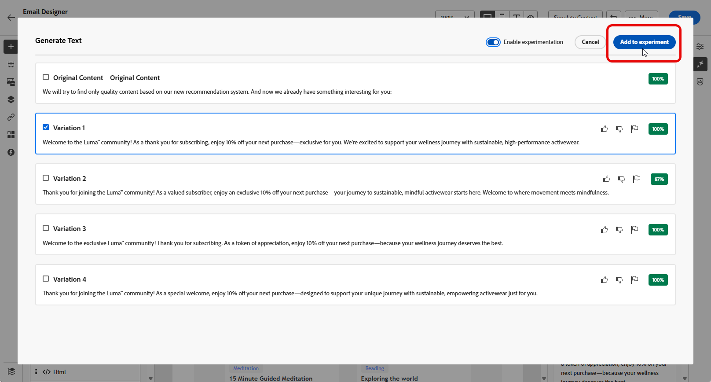

# Experimento de conteúdo com o Acelerador de conteúdo do Assistente de IA {#generative-experimentation}

>[!IMPORTANT]
>
>Antes de começar a usar esse recurso, consulte as [Medidas de proteção e limitações](gs-generative.md#generative-guardrails) relacionadas.
> 
>
>Você deve concordar com um [contrato de usuário](https://www.adobe.com/legal/licenses-terms/adobe-dx-gen-ai-user-guidelines.html) antes de usar o Acelerador de Conteúdo do Assistente de IA no Journey Optimizer. Para obter mais informações, entre em contato com o(a) representante da Adobe.

Depois de criar e personalizar suas mensagens, eleve o conteúdo com o Acelerador de conteúdo do Assistente de IA no Adobe Journey Optimizer, que inclui o recurso Experimento de conteúdo. Essa ferramenta permite definir vários tratamentos de delivery, conteúdo variável, para medir o desempenho do público-alvo.

1. Crie a campanha e use o Acelerador de conteúdo do Assistente de IA para gerar as variantes.

   Neste exemplo, geramos um email de confirmação de subscrição com um código promocional.

   

1. Navegue pelas **[!UICONTROL Variações]** geradas e clique em **[!UICONTROL Visualizar]** para exibir uma versão em tela inteira da variação selecionada.

   

1. Selecione **[!UICONTROL Habilitar experimento]** para começar a criar **[!UICONTROL tratamentos]** para sua experimentação.

1. Selecione as Variações que deseja incluir no experimento.

1. Clique em **Adicionar ao experimento**.

   

1. Na janela Experimento de Conteúdo, acesse o botão **[!UICONTROL Configurações do experimento]** para configurar o experimento. [Saiba mais sobre o Experimento de Conteúdo](../content-management/content-experiment.md)

   

1. Quando o experimento de Conteúdo estiver pronto, na página de resumo da campanha, você pode clicar em **[!UICONTROL Revisar para ativar]** para exibir um resumo da campanha. Os alertas são exibidos se qualquer parâmetro estiver incorreto ou ausente. [Saiba mais](../content-management/content-experiment.md#treatment-experiment)

1. Antes de iniciar sua campanha, verifique se todas as configurações estão corretas e clique em **[!UICONTROL Ativar]**.

Depois de configurar e personalizar com sucesso sua campanha, você pode acompanhar sua campanha no relatório de campanha. [Saiba mais](../reports/campaign-global-report-cja.md)
