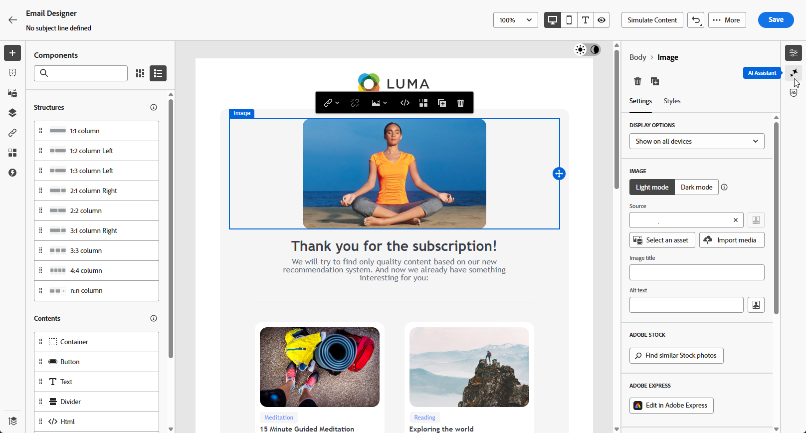
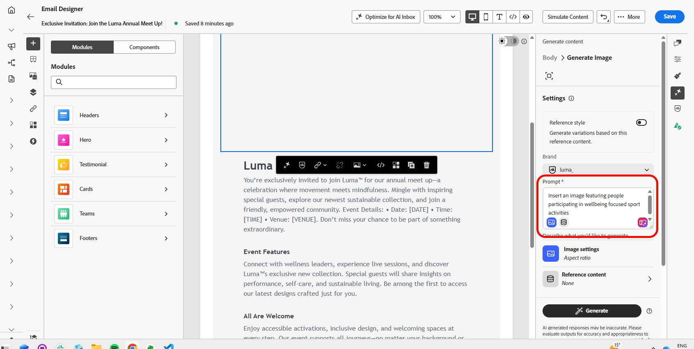
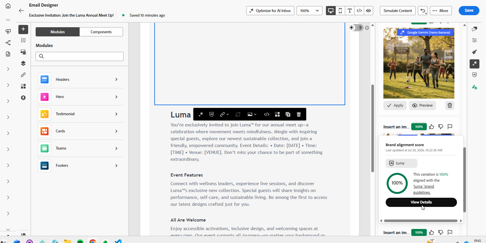
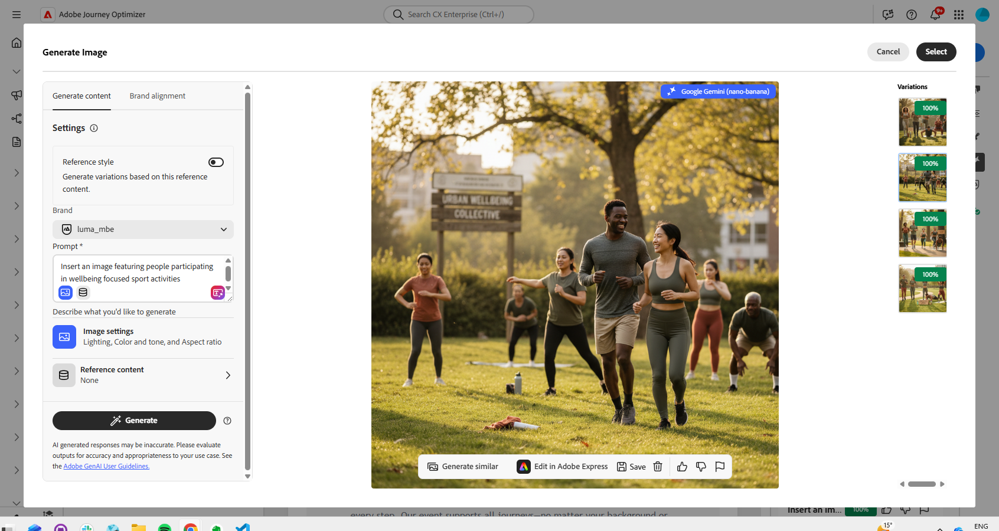
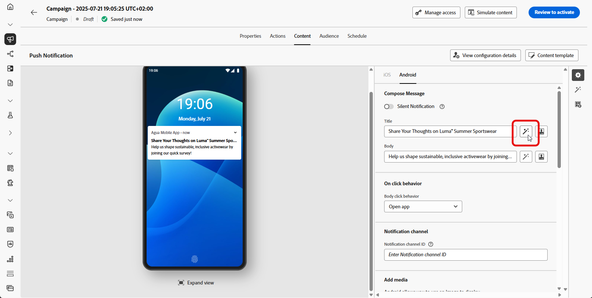
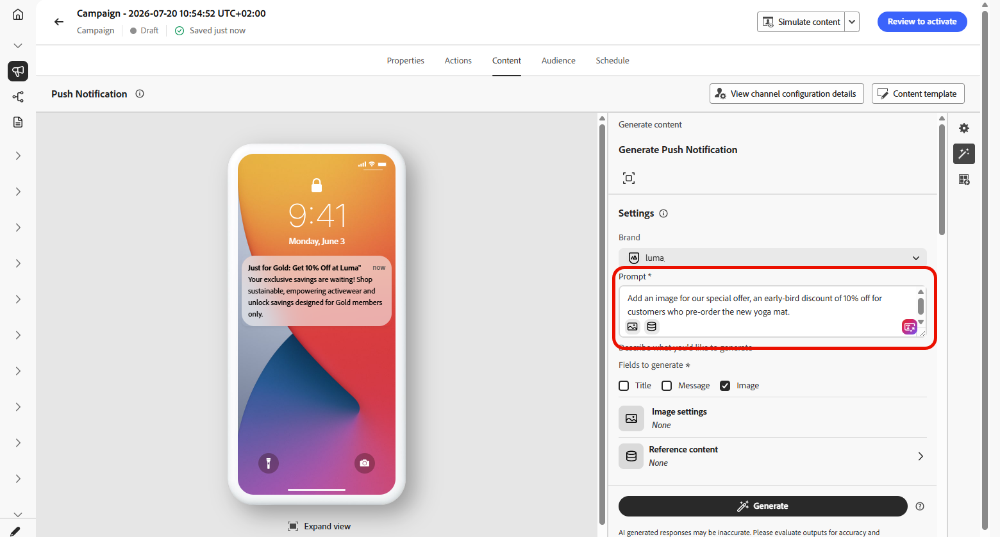
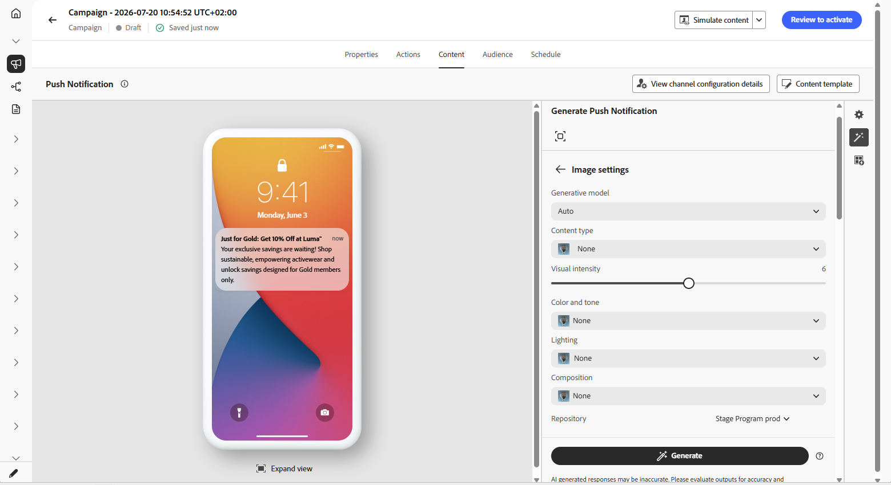
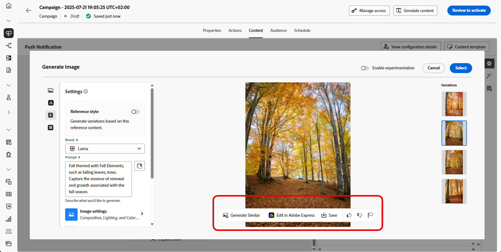

# Gere imagens com IA {#generative-image}

>[!BEGINSHADEBOX]

**Nesta página:** saiba como usar IA no Adobe Journey Optimizer para gerar, refinar e selecionar imagens da marca para seu conteúdo de email, Web, página de aterrissagem e notificação por push.

>[!ENDSHADEBOX]

>[!IMPORTANT]
>
>Antes de começar a usar esse recurso, leia as [Medidas de Proteção e Limitações](gs-generative.md#generative-guardrails) relacionadas.
> 
>
>Você deve concordar com um [contrato de usuário](https://www.adobe.com/legal/licenses-terms/adobe-dx-gen-ai-user-guidelines.html?lang=pt-BR) antes de poder usar Gerar conteúdo no Journey Optimizer. Para obter mais informações, entre em contato com o(a) representante da Adobe.

Use a IA para gerar conteúdo visual atraente que aprimore suas mensagens de email, Web, páginas de aterrissagem e notificações por push. Gerar conteúdo ajuda a otimizar e melhorar seus ativos, garantindo uma experiência mais amigável e envolvente para seu público-alvo.

## Para Email e Canais da Web {#email-web-channels}

Gerar conteúdo pode gerar experiências visuais completas para suas campanhas de email, experiências da Web e páginas de aterrissagem. Esse recurso permite produzir imagens atraentes na marca que repercutem com seu público em pontos de contato digitais.

### Acessar e configurar {#access-configure}

Para começar a gerar imagens com Gerar conteúdo, primeiro configure sua campanha ou jornada e abra o editor de conteúdo. Siga as etapas abaixo para preparar seu espaço de trabalho e acessar o painel Gerar conteúdo.

1. Crie e configure sua campanha ou jornada:
   * **Email**: depois de criar e configurar sua campanha de email, clique em **[!UICONTROL Editar conteúdo]**. [Saiba mais](../email/create-email.md)
   * **Web**: depois de criar e configurar sua página da Web, clique em **[!UICONTROL Editar página da Web]**. [Saiba mais](../web/create-web.md)
   * **Página de aterrissagem**: depois de criar e configurar sua página de aterrissagem, clique em **[!UICONTROL Abrir designer]**. [Saiba mais](../landing-pages/create-lp.md)

1. Selecione o ativo que deseja alterar com Gerar conteúdo.

1. No menu à direita, selecione **[!UICONTROL Gerar Conteúdo]** (ou **[!UICONTROL Mostrar Assistente de Conteúdo]** para Web).

   {zoomable="yes"}

### Gerar imagem {#generate-content}

Saiba como criar prompts eficazes e definir configurações de imagem para gerar imagens visualmente atraentes com Gerar conteúdo. Personalize parâmetros como proporção, intensidade visual e iluminação para criar imagens que se alinhem aos objetivos da sua marca e campanha.

1. Habilite a opção **[!UICONTROL Estilo de referência]** para Gerar conteúdo para personalizar o novo conteúdo com base no conteúdo de referência. Você também pode carregar uma imagem para adicionar contexto à sua variação.

1. Selecione sua **[!UICONTROL Marca]** para garantir que o conteúdo gerado por IA esteja alinhado às especificações da sua marca. [Saiba mais](brands.md) sobre marcas.

1. Ajuste o conteúdo descrevendo o que você deseja gerar no campo **[!UICONTROL Prompt]**.

   Se você estiver procurando ajuda para criar seu prompt, acesse a **[!UICONTROL Biblioteca de Prompts]**, que fornece diversas ideias de prompt para melhorar suas campanhas.

   {zoomable="yes"}

1. Personalize seu prompt com a opção **[!UICONTROL Configurações de imagem]**:

   * **[!UICONTROL Modelo gerativo]**: selecione entre o **[!UICONTROL modelo Adobe]** pronto para uso, o **[!UICONTROL modelo Parceiro]** para recursos especializados ou os **[!UICONTROL modelos personalizados]** treinados nos ativos da sua marca. [Saiba mais](generative-models.md). Para usar o modelo parceiro (**Gemini**) com **sobreposições de texto** em imagens geradas, consulte [Usar Gemini como modelo gerativo para imagem de sobreposição de texto](generative-uc.md#generative-gemini).
   * **[!UICONTROL Taxa de proporção]**: determina a largura e a altura do ativo. Você tem a opção de escolher entre taxas comuns, como 16:9, 4:3, 3:2 ou 1:1, ou pode inserir um tamanho personalizado.
   * **[!UICONTROL Tipo de conteúdo]**: categoriza a natureza do elemento visual, distinguindo entre diferentes formas de representação visual, como fotos, gráficos ou arte.
   * **[!UICONTROL Intensidade visual]**: você pode controlar o impacto da imagem ajustando sua intensidade. Uma configuração mais baixa (2) criará uma aparência mais suave e mais restrita, enquanto uma configuração mais alta (10) tornará a imagem mais vibrante e visualmente poderosa.
   * **[!UICONTROL Cor e tom]**: a aparência geral das cores em uma imagem e o humor ou atmosfera que ela transmite.
   * **[!UICONTROL Iluminação]**: refere-se ao relâmpago presente em uma imagem, que molda sua atmosfera e realça elementos específicos.
   * **[!UICONTROL Composição]**: refere-se à disposição dos elementos dentro do quadro de uma imagem

     {zoomable="yes"}

1. No menu **[!UICONTROL Conteúdo de referência]**, clique em **[!UICONTROL Carregar arquivo]** para adicionar qualquer ativo de marca que contenha conteúdo que possa fornecer contexto adicional para Gerar conteúdo ou selecione um que tenha sido carregado anteriormente.

   Os arquivos carregados anteriormente estão disponíveis no menu suspenso **[!UICONTROL Conteúdo de referência carregado]**. Basta alternar os ativos que deseja incluir na geração.

1. Quando estiver satisfeito com a configuração do prompt, clique em **[!UICONTROL Gerar]**.

### Refinar e finalizar {#refine-finalize}

Depois de gerar variações de imagem, você pode revisar os resultados, verificar o alinhamento da marca, editar no Adobe Express e selecionar a melhor opção para o seu conteúdo.

1. Navegue pelas **[!UICONTROL sugestões de variação]** para encontrar o ativo desejado.

1. Clique no ícone de porcentagem para exibir sua **[!UICONTROL Pontuação de alinhamento da marca]** e identificar quaisquer desalinhamentos com sua marca.

   Saiba mais sobre [Pontuação de alinhamento da marca](brands-score.md).

   {zoomable="yes"}

1. Clique em **[!UICONTROL Visualizar]** para exibir uma versão em tela inteira da variação selecionada ou em **[!UICONTROL Aplicar]** para substituir o conteúdo atual.

1. Navegue até a opção **[!UICONTROL Refinar]** na janela **[!UICONTROL Visualizar]** para acessar recursos de personalização adicionais:

   * **[!UICONTROL Gerar Semelhante]** para exibir imagens relacionadas a esta variante.
   * **[!UICONTROL Edite no Adobe Express]** para personalizar ainda mais seu ativo.

     [Saiba mais sobre a integração do Adobe Express](../integrations/express.md)

   * **[!UICONTROL Salve]** para armazenar os ativos para acesso posterior.

     {zoomable="yes"}

1. Clique em **[!UICONTROL Selecionar]** depois de encontrar o conteúdo apropriado.

1. Após definir o conteúdo da mensagem, use o método de simulação para controlar a renderização e verificar as configurações de personalização: clique em **[!UICONTROL Simular conteúdo]** para testar as variações de conteúdo com dados de entrada de exemplo ou geração automática de IA, ou clique em **[!UICONTROL Simular conteúdo]** e selecione **[!UICONTROL Simular conteúdo (perfis do AEP)]** na lista suspensa para visualizar com perfis de teste. [Saiba mais](../content-management/preview-test.md)

1. Revise e ative o conteúdo:
   * **Email**: quando tiver definido seu conteúdo, público-alvo e agendamento, você estará pronto para preparar sua campanha de email. [Saiba mais](../campaigns/review-activate-campaign.md)
   * **Web**: depois de definir suas configurações de campanha da Web e editar seu conteúdo conforme desejado, você pode revisar e ativar sua campanha da Web. [Saiba mais](../web/create-web.md#activate-web-campaign)
   * **Página de aterrissagem**: quando a página de aterrissagem estiver pronta, você poderá publicá-la para disponibilizá-la para uso em uma mensagem. [Saiba mais](../landing-pages/create-lp.md#publish-landing-page)

## Para canais móveis {#mobile-channels}

Gerar conteúdo permite gerar imagens envolventes para notificações por push, ajudando você a criar comunicações móveis visualmente atraentes que captam atenção e repercutem no seu público.

### Acessar e configurar {#mobile-access-configure}

Para usar a opção Gerar conteúdo para notificações por push, será necessário configurar a entrega por push e navegar até o editor de conteúdo. Essas etapas guiarão você pela criação do delivery e pelo acesso aos recursos de Geração de conteúdo.

1. Depois de criar e configurar a entrega de notificação por push, clique em **[!UICONTROL Editar conteúdo]**.

   Para obter mais informações sobre como configurar a entrega por push, consulte [esta página](../push/create-push.md).

1. Personalize sua notificação por push conforme necessário. [Saiba mais](../push/design-push.md)

1. Acesse o menu **[!UICONTROL Mostrar conteúdo gerado]**.

   {zoomable="yes"}

### Gerar imagem {#mobile-generate-content}

Depois de acessar Gerar conteúdo, você pode ajustar as configurações de geração para criar imagens que se alinhem à sua marca e sejam compatíveis com seus objetivos de notificação por push. Configure os parâmetros de prompt e imagem para gerar visuais otimizados para exibições móveis.

1. Selecione sua **[!UICONTROL Marca]** para garantir que o conteúdo gerado por IA esteja alinhado às especificações da sua marca. [Saiba mais](brands.md) sobre marcas.

1. Ajuste o conteúdo descrevendo o que você deseja gerar no campo **[!UICONTROL Prompt]**.

   Se você estiver procurando ajuda para criar seu prompt, acesse a **[!UICONTROL Biblioteca de Prompts]**, que fornece diversas ideias de prompt para melhorar suas campanhas.

   {zoomable="yes"}

1. Selecione **[!UICONTROL Imagem]** como campo a ser gerado.

1. Escolha suas **[!UICONTROL configurações de imagem]**:

   * **[!UICONTROL Modelo gerativo]**: selecione entre o **[!UICONTROL modelo Adobe]** pronto para uso, o **[!UICONTROL modelo Parceiro]** para recursos especializados ou os **[!UICONTROL modelos personalizados]** treinados nos ativos da sua marca. [Saiba mais](generative-models.md). Para usar o modelo parceiro (**Gemini**) com **sobreposições de texto** em imagens geradas, consulte [Usar Gemini como modelo gerativo para imagem de sobreposição de texto](generative-uc.md#generative-gemini).
   * **[!UICONTROL Tipo de conteúdo]**: categoriza a natureza do elemento visual, distinguindo entre diferentes formas de representação visual, como fotos, gráficos ou arte.
   * **[!UICONTROL Intensidade visual]**: você pode controlar o impacto da imagem ajustando sua intensidade. Uma configuração mais baixa (2) criará uma aparência mais suave e mais restrita, enquanto uma configuração mais alta (10) tornará a imagem mais vibrante e visualmente poderosa.
   * **[!UICONTROL Cor e tom]**: a aparência geral das cores em uma imagem e o humor ou atmosfera que ela transmite.
   * **[!UICONTROL Iluminação]**: refere-se ao relâmpago presente em uma imagem, que molda sua atmosfera e realça elementos específicos.
   * **[!UICONTROL Composição]**: refere-se à disposição dos elementos dentro do quadro de uma imagem

     {zoomable="yes"}

1. No menu **[!UICONTROL Conteúdo de referência]**, clique em **[!UICONTROL Carregar arquivo]** para adicionar qualquer ativo de marca que contenha conteúdo que possa fornecer contexto adicional para Gerar conteúdo ou selecione um que tenha sido carregado anteriormente.

   Os arquivos carregados anteriormente estão disponíveis no menu suspenso **[!UICONTROL Conteúdo de referência carregado]**. Basta alternar os ativos que deseja incluir na geração.

1. Quando o prompt estiver pronto, clique em **[!UICONTROL Gerar]**.

### Refinar e finalizar {#mobile-refine-finalize}

Depois de gerar variações de imagem para suas notificações por push, você pode ajustar os resultados para garantir que eles atendam aos seus requisitos exatos. Revise o alinhamento da marca, edite no Adobe Express se necessário e selecione a melhor imagem para sua campanha móvel.

1. Navegue pelas **[!UICONTROL Variações]** geradas.

1. Clique no ícone de porcentagem para exibir sua **[!UICONTROL Pontuação de alinhamento da marca]** e identificar quaisquer desalinhamentos com sua marca.

   Saiba mais sobre [Pontuação de alinhamento da marca](brands-score.md).

   {zoomable="yes"}

1. Clique em **[!UICONTROL Visualizar]** para exibir uma versão em tela inteira da variação selecionada ou em **[!UICONTROL Aplicar]** para substituir o conteúdo atual.

1. Abra a guia **[!UICONTROL Alinhamento da marca]** para ver como o seu conteúdo se alinha às suas [diretrizes da marca](brands.md).

1. Clique em **[!UICONTROL Selecionar]** depois de encontrar o conteúdo apropriado.

Depois de definir seu conteúdo, público-alvo e programação, você estará pronto para preparar sua campanha de push. [Saiba mais](../campaigns/review-activate-campaign.md)
