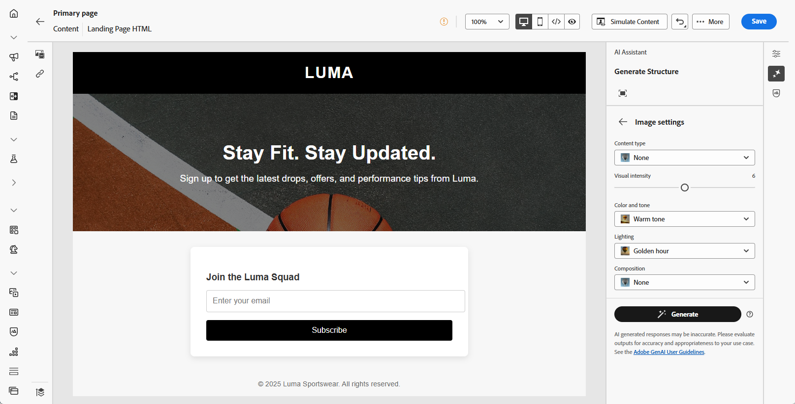

# Geração de página de aterrissagem com o Assistente de IA {#generative-lp}

>[!IMPORTANT]
>
>* Antes de começar a usar esse recurso, consulte as [Medidas de proteção e limitações](gs-generative.md#generative-guardrails) relacionadas.
>
>
>* Você deve aceitar o [contrato de usuário](https://www.adobe.com/legal/licenses-terms/adobe-dx-gen-ai-user-guidelines.html) antes de usar o Assistente de IA no Journey Optimizer. Para obter mais informações, entre em contato com o(a) representante da Adobe.

Transforme suas páginas de aterrissagem com o Assistente de IA no Journey Optimizer, viabilizado pela IA gerativa.

Crie conteúdo impactante sem esforço, incluindo páginas completas, trechos de texto personalizados e visuais que repercutem com seu público-alvo, gerando mais engajamento e interação.

Explore as guias abaixo para saber como usar o Assistente de IA no Journey Optimizer.

>[!BEGINTABS]

>[!TAB Geração completa da página de aterrissagem]

No exemplo a seguir, é possível usar o Assistente de IA para refinar um modelo de página de aterrissagem existente.

1. Depois de criar e configurar sua página de aterrissagem, clique em **[!UICONTROL Editar conteúdo]**.

   Para obter mais informações sobre como configurar sua página de aterrissagem, consulte [esta página](../landing-pages/create-lp.md).

1. Personalize seu layout conforme necessário e acesse o menu do **[!UICONTROL Assistente de IA]**.

   {zoomable="yes"}

1. Habilite a opção **[!UICONTROL Usar conteúdo original]** para que o Assistente de IA personalize o novo conteúdo com base no conteúdo selecionado.

1. Ajuste o conteúdo descrevendo o que você deseja gerar no campo **[!UICONTROL Prompt]**.

   Se você estiver procurando ajuda para criar seu prompt, acesse a **[!UICONTROL Biblioteca de Prompts]**, que fornece diversas ideias de prompt para melhorar sua página de aterrissagem.

   {zoomable="yes"}

1. Personalize seu prompt com a opção **[!UICONTROL Configurações de texto]**:

   * **[!UICONTROL Estratégia de comunicação]**: escolha o estilo de comunicação mais adequado para o texto gerado.
   * **[!UICONTROL Idiomas]**: as opções de idioma espanhol, italiano, sueco e norueguês são lançadas como um beta privado e estarão progressivamente disponíveis para todos os clientes em versões futuras.
   * **[!UICONTROL Tom]**: o tom da sua página de aterrissagem deve repercutir no seu público. Se você quiser soar informativo, divertido ou persuasivo, o Assistente de IA poderá adaptar a mensagem de acordo.

   {zoomable="yes"}

1. Escolha suas **[!UICONTROL configurações de imagem]**:

   * **[!UICONTROL Tipo de conteúdo]**: categoriza a natureza do elemento visual, distinguindo entre diferentes formas de representação visual, como fotos, gráficos ou arte.
   * **[!UICONTROL Intensidade visual]**: você pode controlar o impacto da imagem ajustando sua intensidade. Uma configuração mais baixa (2) criará uma aparência mais suave e mais restrita, enquanto uma configuração mais alta (10) tornará a imagem mais vibrante e visualmente poderosa.
   * **[!UICONTROL Cor e tom]**: a aparência geral das cores em uma imagem e o humor ou atmosfera que ela transmite.
   * **[!UICONTROL Iluminação]**: refere-se ao relâmpago presente em uma imagem, que molda sua atmosfera e realça elementos específicos.
   * **[!UICONTROL Composição]**: refere-se à disposição dos elementos dentro do quadro de uma imagem

   {zoomable="yes"}

1. No menu **[!UICONTROL Ativos de marca]**, clique em **[!UICONTROL Carregar ativo de marca]** para adicionar qualquer ativo de marca que contenha conteúdo que possa fornecer contexto adicional ao Assistente de IA ou selecione um ativo carregado anteriormente.

   Os arquivos carregados anteriormente estão disponíveis no menu suspenso **[!UICONTROL Ativos de marca carregados]**. Basta alternar os ativos que deseja incluir na geração.

   {zoomable="yes"}

1. Quando o prompt estiver pronto, clique em **[!UICONTROL Gerar]**.

1. Navegue pelas **[!UICONTROL Variações]** geradas e clique em **[!UICONTROL Visualizar]** para exibir uma versão em tela inteira da variação selecionada.

1. Navegue até a opção **[!UICONTROL Refinar]** na janela **[!UICONTROL Visualizar]** para acessar recursos de personalização adicionais:

   * **[!UICONTROL Refrase]**: o Assistente de IA pode reformular sua mensagem de diferentes maneiras, mantendo sua escrita atualizada e engajando públicos diversos.

   * **[!UICONTROL Usar linguagem mais simples]**: use o Assistente de IA para simplificar sua linguagem, garantindo clareza e acessibilidade para um público-alvo maior.

   Você também pode alterar o **[!UICONTROL Tom]** e a **[!UICONTROL estratégia de comunicação]** do seu texto.

   {zoomable="yes"}

1. Clique em **[!UICONTROL Selecionar]** depois de encontrar o conteúdo apropriado.

1. Insira campos de personalização para personalizar o conteúdo da landing page com base nos dados dos perfis. Em seguida, clique no botão **[!UICONTROL Simular conteúdo]** para controlar a renderização e verificar as configurações de personalização com perfis de teste. [Saiba mais](../personalization/personalize.md)

Quando a landing page estiver pronta, você poderá publicá-la para disponibilizá-la para uso em uma mensagem. [Saiba mais](../landing-pages/create-lp.md#publish-landing-page)

>[!TAB Geração somente texto]

No exemplo a seguir, aproveitaremos o Assistente de IA para aprimorar o conteúdo da página de aterrissagem.

1. Depois de criar e configurar sua página de aterrissagem, clique em **[!UICONTROL Editar conteúdo]**.

   Para obter mais informações sobre como configurar sua página de aterrissagem, consulte [esta página](../landing-pages/create-lp.md).

1. Selecione um **[!UICONTROL Componente de texto]** para direcionar somente a um conteúdo específico. e acesse o menu do **[!UICONTROL Assistente de IA]**.

   {zoomable="yes"}

1. Habilite a opção **[!UICONTROL Usar conteúdo original]** para que o Assistente de IA personalize o novo conteúdo com base no conteúdo selecionado.

1. Ajuste o conteúdo descrevendo o que você deseja gerar no campo **[!UICONTROL Prompt]**.

   Se você estiver procurando ajuda para criar seu prompt, acesse a **[!UICONTROL Biblioteca de Prompts]**, que fornece diversas ideias de prompt para melhorar suas páginas de aterrissagem.

   {zoomable="yes"}

1. Personalize seu prompt com a opção **[!UICONTROL Configurações de texto]**:

   * **[!UICONTROL Estratégia de comunicação]**: escolha o estilo de comunicação mais adequado para o texto gerado.
   * **[!UICONTROL Idiomas]**: as opções de idioma espanhol, italiano, sueco e norueguês são lançadas como um beta privado e estarão progressivamente disponíveis para todos os clientes em versões futuras.
   * **[!UICONTROL Tom]**: o tom da sua página de aterrissagem deve repercutir no seu público. Se você quiser soar informativo, divertido ou persuasivo, o Assistente de IA poderá adaptar a mensagem de acordo.
   * **Comprimento do texto**: use o controle deslizante para selecionar o comprimento desejado do texto.

   {zoomable="yes"}

1. No menu **[!UICONTROL Ativos de marca]**, clique em **[!UICONTROL Carregar ativo de marca]** para adicionar qualquer ativo de marca que contenha conteúdo que possa fornecer contexto adicional ao Assistente de IA ou selecione um ativo carregado anteriormente.

   Os arquivos carregados anteriormente estão disponíveis no menu suspenso **[!UICONTROL Ativos de marca carregados]**. Basta alternar os ativos que deseja incluir na geração.

   {zoomable="yes"}

1. Quando o prompt estiver pronto, clique em **[!UICONTROL Gerar]**.

1. Navegue pelas **[!UICONTROL Variações]** geradas e clique em **[!UICONTROL Visualizar]** para exibir uma versão em tela inteira da variação selecionada.

1. Navegue até a opção **[!UICONTROL Refinar]** na janela **[!UICONTROL Visualizar]** para acessar recursos de personalização adicionais:

   * **[!UICONTROL Usar como conteúdo de referência]**: a variante escolhida servirá como conteúdo de referência para gerar outros resultados.

   * **[!UICONTROL Elaborar]**: o Assistente de IA pode ajudá-lo a expandir tópicos específicos, fornecendo detalhes adicionais para melhor compreensão e engajamento.

   * **[!UICONTROL Resumir]**: informações extensas podem sobrecarregar os destinatários da página de aterrissagem. Use o Assistente de IA para condensar os pontos principais em resumos claros e concisos que chamem a atenção e os incentivem a ler mais.

   * **[!UICONTROL Refrase]**:O Assistente de IA pode reformular sua mensagem de diferentes maneiras, mantendo sua escrita atualizada e engajando públicos diversos.

   * **[!UICONTROL Usar linguagem mais simples]**: use o Assistente de IA para simplificar sua linguagem, garantindo clareza e acessibilidade para um público-alvo maior.

   Você também pode alterar o **[!UICONTROL Tom]** e a **[!UICONTROL estratégia de comunicação]** do seu texto.

   {zoomable="yes"}

1. Clique em **[!UICONTROL Selecionar]** depois de encontrar o conteúdo apropriado.

1. Insira campos de personalização para personalizar o conteúdo da landing page com base nos dados dos perfis. Em seguida, clique no botão **[!UICONTROL Simular conteúdo]** para controlar a renderização e verificar as configurações de personalização com perfis de teste. [Saiba mais](../personalization/personalize.md)

Quando a landing page estiver pronta, você poderá publicá-la para disponibilizá-la para uso em uma mensagem. [Saiba mais](../landing-pages/create-lp.md#publish-landing-page)

>[!TAB Geração somente de imagem]

No exemplo abaixo, aprenda a usar o Assistente de IA para otimizar e melhorar seus ativos, garantindo uma experiência mais amigável.

1. Depois de criar e configurar sua página de aterrissagem, clique em **[!UICONTROL Editar conteúdo]**.

   Para obter mais informações sobre como configurar sua página de aterrissagem, consulte [esta página](../landing-pages/create-lp.md).

1. Selecione o ativo que deseja alterar com o Assistente de IA.

1. No menu à direita, selecione **[!UICONTROL Assistente do AI]**.

   {zoomable="yes"}

1. Habilite a opção **[!UICONTROL Estilo de referência]** para que o Assistente de IA personalize o novo conteúdo com base no conteúdo de referência. Você também pode carregar uma imagem para adicionar contexto à sua variação.

1. Ajuste o conteúdo descrevendo o que você deseja gerar no campo **[!UICONTROL Prompt]**.

   Se você estiver procurando ajuda para criar seu prompt, acesse a **[!UICONTROL Biblioteca de Prompts]**, que fornece diversas ideias de prompt para melhorar suas páginas de aterrissagem.

   {zoomable="yes"}

1. Personalize seu prompt com a opção **[!UICONTROL Configurações de imagem]**:

   * **[!UICONTROL Taxa de proporção]**: determina a largura e a altura do ativo. Você tem a opção de escolher entre taxas comuns, como 16:9, 4:3, 3:2 ou 1:1, ou pode inserir um tamanho personalizado.
   * **[!UICONTROL Tipo de conteúdo]**: categoriza a natureza do elemento visual, distinguindo entre diferentes formas de representação visual, como fotos, gráficos ou arte.
   * **[!UICONTROL Intensidade visual]**: você pode controlar o impacto da imagem ajustando sua intensidade. Uma configuração mais baixa (2) criará uma aparência mais suave e mais restrita, enquanto uma configuração mais alta (10) tornará a imagem mais vibrante e visualmente poderosa.
   * **[!UICONTROL Cor e tom]**: a aparência geral das cores em uma imagem e o humor ou atmosfera que ela transmite.
   * **[!UICONTROL Iluminação]**: refere-se ao relâmpago presente em uma imagem, que molda sua atmosfera e realça elementos específicos.
   * **[!UICONTROL Composição]**: refere-se à disposição dos elementos dentro do quadro de uma imagem

   {zoomable="yes"}

1. No menu **[!UICONTROL Ativos de marca]**, clique em **[!UICONTROL Carregar ativo de marca]** para adicionar qualquer ativo de marca que contenha conteúdo que possa fornecer contexto adicional ao Assistente de IA ou selecione um ativo carregado anteriormente.

   Os arquivos carregados anteriormente estão disponíveis no menu suspenso **[!UICONTROL Ativos de marca carregados]**. Basta alternar os ativos que deseja incluir na geração.

1. Quando estiver satisfeito com a configuração do prompt, clique em **[!UICONTROL Gerar]**.

1. Navegue pelas **[!UICONTROL sugestões de variação]** para encontrar o ativo desejado.

   Clique em **[!UICONTROL Visualizar]** para exibir uma versão em tela inteira da variação selecionada.

1. Escolha **[!UICONTROL Gerar Semelhante]** se desejar exibir imagens relacionadas a essa variante.

   {zoomable="yes"}

1. Clique em **[!UICONTROL Selecionar]** depois de encontrar o conteúdo apropriado.

1. Após definir o conteúdo da mensagem, clique no botão **[!UICONTROL Simular conteúdo]** para controlar a renderização e verificar as configurações de personalização com perfis de teste. [Saiba mais](../personalization/personalize.md)

Quando a landing page estiver pronta, você poderá publicá-la para disponibilizá-la para uso em uma mensagem. [Saiba mais](../landing-pages/create-lp.md#publish-landing-page)

>[!ENDTABS]
