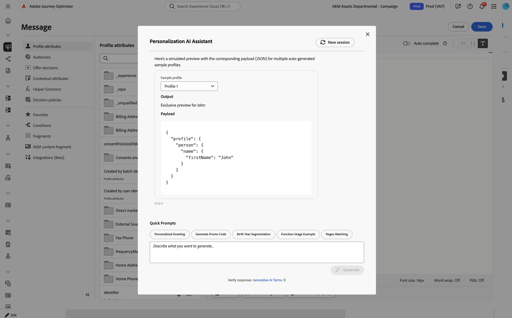
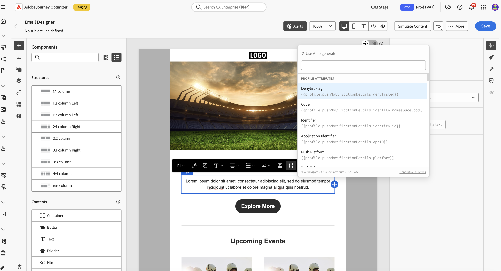
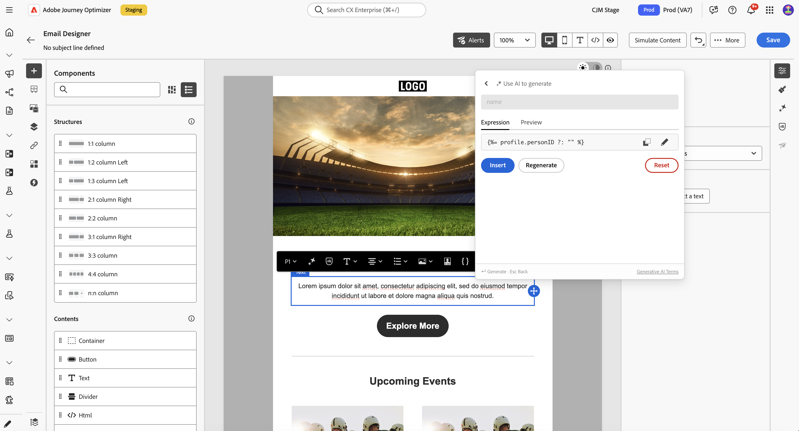

# Assistente de IA para expressões de personalização{#generative-personalization-expressions}

>[!IMPORTANT]
>
>Antes de começar a usar esse recurso, consulte as [Medidas de proteção e limitações](gs-generative.md#generative-guardrails) relacionadas.
> 
>
>Você deve concordar com um [contrato de usuário](https://www.adobe.com/legal/licenses-terms/adobe-dx-gen-ai-user-guidelines.html?lang=pt-BR) antes de usar o Assistente de IA no Journey Optimizer. Para obter mais informações, entre em contato com o(a) representante da Adobe.

## Visão geral {#where-available}

O [!UICONTROL Assistente de IA] ajuda você a gerar uma nova personalização a partir de linguagem simples, explicar o que as expressões existentes fazem e corrigir problemas no código selecionado, de modo que você gaste menos tempo na descoberta de sintaxe e de campos manuais. Você também pode iterar em uma seleção ou solicitar outras alterações na conversa. Ele está disponível a partir de dois pontos de entrada:

* **[!UICONTROL Editor do Personalization]** — onde quer que o editor esteja disponível (linha de assunto, corpo e outros campos que o abrem). Para saber onde e como abrir o editor, consulte [Adicionar personalização](../personalization/personalization-build-expressions.md#where).
* **Edição de texto em linha do Email Designer** — diretamente do popover de edição em linha ao editar um componente de texto. Consulte [Gerar a partir do Designer de email](#generate-email-designer).

Para obter mais detalhes sobre a configuração e os idiomas do Assistente de IA, consulte [Introdução ao Assistente de IA](gs-generative.md). Para conceitos de personalização, consulte [Introdução à personalização](../personalization/personalize.md). Para ideias de prompt, consulte [Práticas recomendadas de prompt da IA](ai-assistant-prompting-guide.md).

Dependendo do contexto da campanha ou da jornada, o assistente pode trabalhar com dados e construir o [!UICONTROL Personalization Editor] que já está exposto, por exemplo, atributos de perfil, associação de segmento, funções auxiliares e fontes de personalização relacionadas.

>[!NOTE]
>
>O assistente mantém o contexto de seus prompts apenas enquanto o [!UICONTROL Assistente do AI] permanece aberto nessa sessão. Fechar o assistente ou o editor limpa a conversa; na próxima vez que você abrir o assistente, iniciará uma nova conversa.

## Gerar expressões de personalização {#generate}

Essas etapas abordam a geração de expressões de personalização do zero. Para trabalhar com o código já existente no editor, consulte [Editar, corrigir ou explicar o código existente](#edit-existing).

1. Em sua mensagem ou conteúdo, abra o **[!UICONTROL Editor de Personalization]**.

1. Coloque o cursor no editor onde deseja que o código de personalização gerado seja inserido e clique no botão **[!UICONTROL Assistente de IA]**.

   

1. No campo de texto, descreva a expressão de personalização desejada em linguagem simples, por exemplo, quais atributos de perfil, segmentos ou lógica são necessários, depois clique em **[!UICONTROL Gerar]**.

   Você também pode usar prompts prontos para uso da seção **[!UICONTROL Prompts Rápidos]**, como saudação personalizada, geração de código promocional e muito mais.

   

   >[!NOTE]
   >
   >Qualquer prompt ou pergunta não relacionada retorna um erro fora do escopo. Ajuste seu prompt e faça uma pergunta relevante sobre a personalização necessária.

1. Você pode continuar discutindo com o assistente em uma conversa de vários turnos: ela mantém o contexto de seus prompts para que você possa refinar a mesma expressão passo a passo. Para recomeçar, clique no botão **[!UICONTROL Nova sessão]**.

   

1. Depois de gerar uma expressão, clique em **[!UICONTROL Mostrar visualizações para perfis de amostra]** para ver como a expressão é avaliada com dados de amostra e para exibir a carga associada como JSON. Para essa verificação, o assistente gera um conjunto limitado de perfis de amostra sintéticos; eles não são salvos nem armazenados em sua organização.

   Se você precisar de perfis de exemplo personalizados ou adicionais, descreva o que precisa na discussão com o assistente e inclua a palavra-chave **visualizar** no prompt para que ele possa gerar os perfis de visualização corretos para sua verificação.

   

   +++Visualizar exemplo

   

   >[!NOTE]
   >
   >As visualizações adicionais são para verificação pontual. O assistente é ajustado para gerar aproximadamente um a cinco perfis, solicitando um número muito grande, que pode causar falha na solicitação.

   +++

   >[!NOTE]
   >
   >Esse controle é para uma verificação rápida do seu código de personalização no editor, não para uma pré-visualização completa da mensagem do seu conteúdo. Para validação completa da experiência, use o fluxo de simulação normal. [Saiba como visualizar e testar seu conteúdo](../content-management/preview-test.md)

1. Para implementar a saída em sua expressão de personalização, clique em **[!UICONTROL Aplicar]**. A saída do assistente é inserida no local do cursor no editor de personalização. Para substituir o código que já está lá, selecione-o primeiro no editor e use o **[!UICONTROL Editar com o AI Assistant]** (consulte [Editar, corrigir ou explicar o código existente](#edit-existing)).

   Você também pode copiar a saída e colá-la onde for necessário usando o ícone .

## Editar, corrigir ou explicar o código existente {#edit-existing}

Você pode selecionar uma expressão de personalização existente e usar o AI Assistant para corrigir problemas de personalização, explicar o que o código faz ou solicitar outras alterações.

1. Selecione o código de personalização existente no editor.

1. Clique com o botão direito do mouse na seleção e escolha **[!UICONTROL Editar com o Assistente de IA]** para que o assistente use sua seleção como contexto.

   

1. O **[!UICONTROL Assistente de IA]** é aberto. Em **[!UICONTROL Comandos Rápidos]**, clique em **[!UICONTROL Explicar]** ou **[!UICONTROL Corrigir]** ou use o campo de texto para solicitar outras alterações e iniciar uma conversa.

   

1. Ao usar a **[!UICONTROL Correção]**, clique em **[!UICONTROL Mostrar detalhes da correção]** na discussão para mostrar uma explicação da correção e uma linha por linha antes e depois da visualização.

   

1. Como ocorre ao gerar uma expressão de personalização, clique em **[!UICONTROL Aplicar]** para implementar a saída do assistente. Ele substitui o código selecionado no editor de personalização. Por exemplo, se você solicitou uma explicação do código, a aplicação adicionará comentários na expressão que descrevem o que ele faz.

## Gerar a partir do Designer de email {#generate-email-designer}

O [!UICONTROL Assistente de IA para expressões de personalização] também está disponível diretamente na experiência de edição em linha no Designer de email, sem abrir o [!UICONTROL Personalization Editor] completo. A expressão gerada é inserida na posição do cursor no componente de texto.

1. No Designer de email, selecione um componente de texto e comece a editá-lo em linha.

1. Abra o popover de personalização em linha de uma das duas formas a seguir:

   * Digite `{{` na posição em que deseja inserir a expressão — o popover é aberto automaticamente.
   * Clique em **[!UICONTROL Usar IA para gerar]** no popover de edição em linha, se ele já estiver aberto.

   

1. No campo de texto, descreva a expressão de personalização desejada em linguagem simples e clique em **[!UICONTROL Gerar]**.

1. Revise o resultado na guia **[!UICONTROL Expression]** para ver a expressão gerada.

   Alterne para a guia **[!UICONTROL Visualização]** para ver como a expressão é avaliada usando valores de perfil de exemplo, para que você possa verificar a saída antes de inseri-la.

   

1. Clique em **[!UICONTROL Inserir]** para aplicar a expressão na posição do cursor no componente de texto. Use **[!UICONTROL Regenerar]** para produzir uma nova sugestão ou **[!UICONTROL Redefinir]** para recomeçar.

>[!NOTE]
>
>A sessão do [!UICONTROL Assistente de IA para expressões de personalização] no popover Email Designer embutido é independente das sessões no [!UICONTROL Editor do Personalization]. Fechar o popover apaga a conversa.
