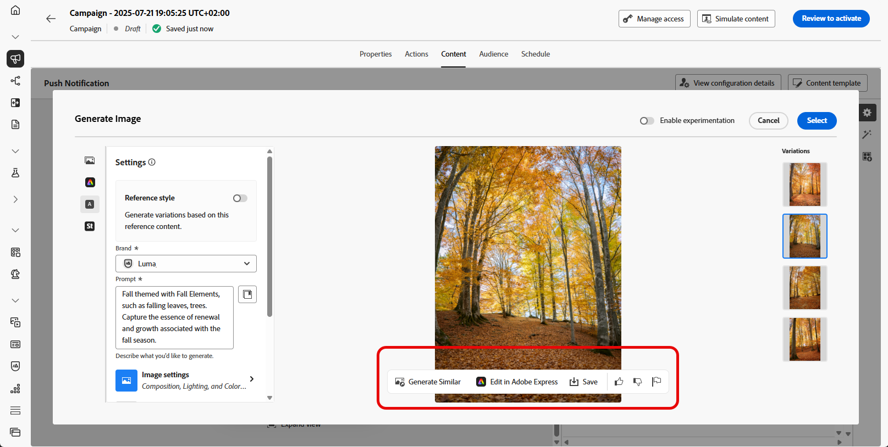

# Geração de push com o Assistente de IA {#generative-push}

>[!IMPORTANT]
>
>Antes de começar a usar esse recurso, consulte as [Medidas de proteção e limitações](gs-generative.md#generative-guardrails) relacionadas.
> 
>
>Você deve concordar com um [contrato de usuário](https://www.adobe.com/legal/licenses-terms/adobe-dx-gen-ai-user-guidelines.html) antes de usar o Assistente de IA no Journey Optimizer. Para obter mais informações, entre em contato com o(a) representante da Adobe.

Depois de criar e personalizar suas mensagens, coloque seu conteúdo de notificação por push em um novo patamar com o Assistente de IA no Journey Optimizer.

Explore as guias abaixo para saber como usar o Assistente de IA no Journey Optimizer.

>[!BEGINTABS]

>[!TAB Geração de push completa]

Neste exemplo específico, saiba como enviar uma notificação por push envolvente usando o Assistente de IA no Journey Optimizer.

Siga estas etapas:

1. Depois de criar e configurar sua campanha de notificação por push, clique em **[!UICONTROL Editar conteúdo]**.

   Para obter mais informações sobre como configurar sua campanha de notificação por push, consulte [esta página](../push/create-push.md).

1. Preencha os **[!UICONTROL detalhes Básicos]** da sua campanha. Depois de concluído, clique em **[!UICONTROL Editar conteúdo]**.

1. Personalize sua notificação por push conforme necessário. [Saiba mais](../push/design-push.md)

1. Acesse o menu **[!UICONTROL Mostrar assistente de IA]**.

   {zoomable="yes"}

1. Habilite a opção **[!UICONTROL Usar conteúdo original]** para que o Assistente de IA personalize uma nova opção de conteúdo com base no conteúdo selecionado.

1. Selecione sua **[!UICONTROL Marca]** para garantir que o conteúdo gerado por IA esteja alinhado às especificações da sua marca. [Saiba mais](brands.md) sobre marcas.

   Observe que o recurso Marcas é lançado como um beta privado e estará progressivamente disponível para todos os clientes em versões futuras.

1. Ajuste o conteúdo descrevendo o que você deseja gerar no campo **[!UICONTROL Prompt]**.

   Se você estiver procurando ajuda para criar seu prompt, acesse a **[!UICONTROL Biblioteca de Prompts]**, que fornece diversas ideias de prompt para melhorar suas campanhas.

   {zoomable="yes"}

1. Escolha qual campo você deseja gerar: **[!UICONTROL Título]**, **[!UICONTROL Mensagem]** e/ou **[!UICONTROL Imagem]**.

1. Personalize seu prompt com a opção **[!UICONTROL Configurações de texto]**:

   * **[!UICONTROL Estratégia de comunicação]**: escolha o estilo de comunicação mais adequado para o texto gerado.
   * **[!UICONTROL Idiomas]**: as opções de idioma espanhol, italiano, sueco e norueguês são lançadas como um beta privado e estarão progressivamente disponíveis para todos os clientes em versões futuras.
   * **[!UICONTROL Tom]**: o tom das suas notificações por push deve repercutir no seu público-alvo. Se você quiser soar informativo, divertido ou persuasivo, o Assistente de IA poderá adaptar a mensagem de acordo.

   {zoomable="yes"}

1. Escolha suas **[!UICONTROL configurações de imagem]**:

   * **[!UICONTROL Tipo de conteúdo]**: categoriza a natureza do elemento visual, distinguindo entre diferentes formas de representação visual, como fotos, gráficos ou arte.
   * **[!UICONTROL Intensidade visual]**: você pode controlar o impacto da imagem ajustando sua intensidade. Uma configuração mais baixa (2) criará uma aparência mais suave e mais restrita, enquanto uma configuração mais alta (10) tornará a imagem mais vibrante e visualmente poderosa.
   * **[!UICONTROL Cor e tom]**: a aparência geral das cores em uma imagem e o humor ou atmosfera que ela transmite.
   * **[!UICONTROL Iluminação]**: refere-se ao relâmpago presente em uma imagem, que molda sua atmosfera e realça elementos específicos.
   * **[!UICONTROL Composição]**: refere-se à disposição dos elementos dentro do quadro de uma imagem

   {zoomable="yes"}

1. No menu **[!UICONTROL Ativos de marca]**, clique em **[!UICONTROL Carregar ativo de marca]** para adicionar qualquer ativo de marca que contenha conteúdo que possa fornecer contexto adicional ao Assistente de IA ou selecione um ativo carregado anteriormente.

   Os arquivos carregados anteriormente estão disponíveis no menu suspenso **[!UICONTROL Ativos de marca carregados]**. Basta alternar os ativos que deseja incluir na geração.

1. Quando o prompt estiver pronto, clique em **[!UICONTROL Gerar]**.

1. Navegue pelas **[!UICONTROL Variações]** geradas e clique em **[!UICONTROL Visualizar]** para exibir uma versão em tela inteira da variação selecionada.

1. Navegue até a opção **[!UICONTROL Refinar]** na janela **[!UICONTROL Visualizar]** para acessar recursos de personalização adicionais:

   * **[!UICONTROL Usar como conteúdo de referência]**: a variante escolhida servirá como conteúdo de referência para gerar outros resultados.

   * **[!UICONTROL Refrase]**: o Assistente de IA pode reformular sua mensagem de diferentes maneiras, mantendo sua escrita atualizada e engajando públicos diversos.

   * **[!UICONTROL Usar linguagem mais simples]**: use o Assistente de IA para simplificar sua linguagem, garantindo clareza e acessibilidade para um público-alvo maior.

   Você também pode alterar o **[!UICONTROL Tom]** e a **[!UICONTROL estratégia de comunicação]** do seu texto.

   {zoomable="yes"}

1. Clique em **[!UICONTROL Selecionar]** depois de encontrar o conteúdo apropriado.

   Você também pode ativar o experimento para o seu conteúdo. [Saiba mais](generative-experimentation.md)

1. Insira campos de personalização para personalizar o conteúdo da notificação por push com base nos dados dos perfis. Em seguida, clique no botão **[!UICONTROL Simular conteúdo]** para controlar a renderização e verificar as configurações de personalização com perfis de teste. [Saiba mais](../personalization/personalize.md)

Depois de definir seu conteúdo, público-alvo e programação, você estará pronto para preparar sua campanha de push. [Saiba mais](../campaigns/review-activate-campaign.md)

>[!TAB Geração somente texto]

Neste exemplo específico, saiba como usar o Assistente de IA no Journey Optimizer para conteúdo específico. Siga estas etapas:

1. Depois de criar e configurar sua campanha de notificação por push, clique em **[!UICONTROL Editar conteúdo]**.

   Para obter mais informações sobre como configurar sua campanha por push, consulte [esta página](../push/create-push.md).

1. Preencha os **[!UICONTROL detalhes Básicos]** da sua campanha. Depois de concluído, clique em **[!UICONTROL Editar conteúdo]**.

1. Personalize sua notificação por push conforme necessário. [Saiba mais](../push/design-push.md)

1. Acesse o menu **[!UICONTROL Editar texto com o Assistente de IA]** ao lado dos campos **[!UICONTROL Título]** ou **[!UICONTROL Mensagem]**.

   {zoomable="yes"}

1. Habilite a opção **[!UICONTROL Usar conteúdo de referência]** para que o Assistente de IA personalize o novo conteúdo com base no conteúdo selecionado.

1. Selecione sua **[!UICONTROL Marca]** para garantir que o conteúdo gerado por IA esteja alinhado às especificações da sua marca. [Saiba mais](brands.md) sobre marcas.

   Observe que o recurso Marcas é lançado como um beta privado e estará progressivamente disponível para todos os clientes em versões futuras.

1. Ajuste o conteúdo descrevendo o que você deseja gerar no campo **[!UICONTROL Prompt]**.

   Se você estiver procurando ajuda para criar seu prompt, acesse a **[!UICONTROL Biblioteca de Prompts]**, que fornece diversas ideias de prompt para melhorar suas campanhas.

   {zoomable="yes"}

1. Personalize seu prompt com a opção **[!UICONTROL Configurações de texto]**:

   * **[!UICONTROL Estratégia de comunicação]**: escolha o estilo de comunicação mais adequado para o texto gerado.
   * **[!UICONTROL Idiomas]**: as opções de idioma espanhol, italiano, sueco e norueguês são lançadas como um beta privado e estarão progressivamente disponíveis para todos os clientes em versões futuras.
   * **[!UICONTROL Tom]**: o tom da sua notificação por push deve repercutir no seu público-alvo. Se você quiser soar informativo, divertido ou persuasivo, o Assistente de IA poderá adaptar a mensagem de acordo.
   * **[!UICONTROL Comprimento]**: selecione o comprimento do conteúdo usando o controle deslizante de intervalo.

   {zoomable="yes"}

1. No menu **[!UICONTROL Ativos de marca]**, clique em **[!UICONTROL Carregar ativo de marca]** para adicionar qualquer ativo de marca que contenha conteúdo que possa fornecer contexto adicional ao Assistente de IA ou selecione um ativo carregado anteriormente.

   Os arquivos carregados anteriormente estão disponíveis no menu suspenso **[!UICONTROL Ativos de marca carregados]**. Basta alternar os ativos que deseja incluir na geração.

1. Quando o prompt estiver pronto, clique em **[!UICONTROL Gerar]**.

1. Navegue até a opção **[!UICONTROL Refinar]** na janela **[!UICONTROL Visualizar]** para acessar recursos de personalização adicionais:

   * **[!UICONTROL Usar como conteúdo de referência]**: a variante escolhida servirá como conteúdo de referência para gerar outros resultados.

   * **[!UICONTROL Elaborar]**: o Assistente de IA pode ajudá-lo a expandir tópicos específicos, fornecendo detalhes adicionais para melhor compreensão e engajamento.

   * **[!UICONTROL Resumir]**: informações extensas podem sobrecarregar os destinatários. Use o Assistente de IA para condensar os pontos principais em resumos claros e concisos que chamem a atenção e os incentivem a ler mais.

   * **[!UICONTROL Refrase]**:O Assistente de IA pode reformular sua mensagem de diferentes maneiras, mantendo sua escrita atualizada e engajando públicos diversos.

   * **[!UICONTROL Usar linguagem mais simples]**: use o Assistente de IA para simplificar sua linguagem, garantindo clareza e acessibilidade para um público-alvo maior.

   Você também pode alterar o **[!UICONTROL Tom]** e a **[!UICONTROL estratégia de comunicação]** do seu texto.

   {zoomable="yes"}

1. Clique em **[!UICONTROL Selecionar]** depois de encontrar o conteúdo apropriado.

   Você também pode ativar o experimento para o seu conteúdo. [Saiba mais](generative-experimentation.md)

1. Insira campos de personalização para personalizar o conteúdo da notificação por push com base nos dados dos perfis. Em seguida, clique no botão **[!UICONTROL Simular conteúdo]** para controlar a renderização e verificar as configurações de personalização com perfis de teste. [Saiba mais](../personalization/personalize.md)

Depois de definir seu conteúdo, público-alvo e programação, você estará pronto para preparar sua campanha de push. [Saiba mais](../campaigns/review-activate-campaign.md)

>[!TAB Geração somente de imagem]

1. Depois de criar e configurar sua campanha de notificação por push, clique em **[!UICONTROL Editar conteúdo]**.

   Para obter mais informações sobre como configurar sua campanha de notificação por push, consulte [esta página](../push/create-push.md).

1. Preencha os **[!UICONTROL detalhes Básicos]** da sua campanha. Depois de concluído, clique em **[!UICONTROL Editar conteúdo]**.

1. Personalize sua notificação por push conforme necessário. [Saiba mais](../push/design-push.md)

1. Acesse o menu **[!UICONTROL Adicionar mídia]**.

   {zoomable="yes"}

1. Habilite a opção **[!UICONTROL Estilo de referência]** para que o Assistente de IA personalize o novo conteúdo com base no conteúdo de referência. Você também pode carregar uma imagem para adicionar contexto à sua variação.

1. Selecione sua **[!UICONTROL Marca]** para garantir que o conteúdo gerado por IA esteja alinhado às especificações da sua marca. [Saiba mais](brands.md) sobre marcas.

   Observe que o recurso Marcas é lançado como um beta privado e estará progressivamente disponível para todos os clientes em versões futuras.

1. Ajuste o conteúdo descrevendo o que você deseja gerar no campo **[!UICONTROL Prompt]**.

   Se você estiver procurando ajuda para criar seu prompt, acesse a **[!UICONTROL Biblioteca de Prompts]**, que fornece diversas ideias de prompt para melhorar suas campanhas.

   {zoomable="yes"}

1. Escolha suas **[!UICONTROL configurações de imagem]**:

   * **[!UICONTROL Tipo de conteúdo]**: categoriza a natureza do elemento visual, distinguindo entre diferentes formas de representação visual, como fotos, gráficos ou arte.
   * **[!UICONTROL Intensidade visual]**: você pode controlar o impacto da imagem ajustando sua intensidade. Uma configuração mais baixa (2) criará uma aparência mais suave e mais restrita, enquanto uma configuração mais alta (10) tornará a imagem mais vibrante e visualmente poderosa.
   * **[!UICONTROL Cor e tom]**: a aparência geral das cores em uma imagem e o humor ou atmosfera que ela transmite.
   * **[!UICONTROL Iluminação]**: refere-se ao relâmpago presente em uma imagem, que molda sua atmosfera e realça elementos específicos.
   * **[!UICONTROL Composição]**: refere-se à disposição dos elementos dentro do quadro de uma imagem

1. No menu **[!UICONTROL Ativos de marca]**, clique em **[!UICONTROL Carregar ativo de marca]** para adicionar qualquer ativo de marca que contenha conteúdo que possa fornecer contexto adicional ao Assistente de IA ou selecione um ativo carregado anteriormente.

   Os arquivos carregados anteriormente estão disponíveis no menu suspenso **[!UICONTROL Ativos de marca carregados]**. Basta alternar os ativos que deseja incluir na geração.

1. Quando o prompt estiver pronto, clique em **[!UICONTROL Gerar]**.

1. Navegue pelas **[!UICONTROL Variações]** geradas.

   {zoomable="yes"}

1. Selecione **[!UICONTROL Gerar semelhante]** para exibir variações de imagem que se aproximam da opção atual, fornecendo designs alternativos com um tema consistente.

1. Clique em **[!UICONTROL Selecionar]** depois de encontrar o conteúdo apropriado.

   Você também pode ativar o experimento para o seu conteúdo. [Saiba mais](generative-experimentation.md)

Depois de definir seu conteúdo, público-alvo e programação, você estará pronto para preparar sua campanha de push. [Saiba mais](../campaigns/review-activate-campaign.md)

>[!ENDTABS]
