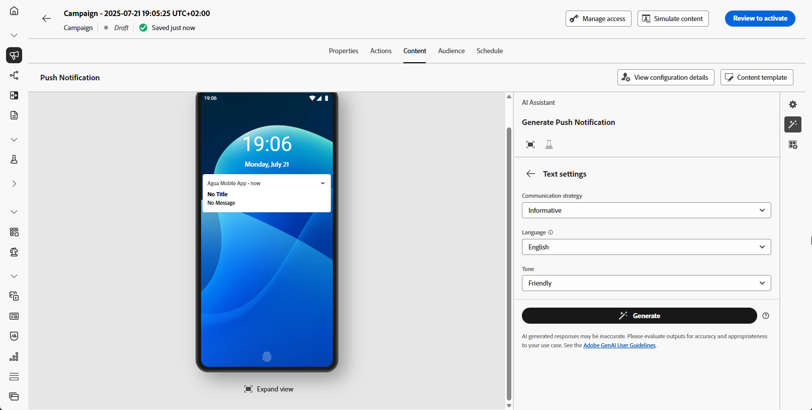

# Geração de push com o Assistente de IA {#generative-push}

>[!BEGINSHADEBOX]

**Índice**

* [Introdução ao assistente de IA](gs-generative.md)
* [Geração de email com o Assistente de IA](generative-email.md)
* [Geração de SMS com o Assistente de IA](generative-sms.md)
* **[Geração de push com o Assistente de IA](generative-push.md)**
* [Experimento de conteúdo com o Assistente de IA](generative-experimentation.md)

>[!ENDSHADEBOX]

>[!NOTE]
>
>Antes de começar a usar esse recurso, leia as informações relacionadas [Medidas de proteção e limitações](gs-generative.md#generative-guardrails).

Depois de criar e personalizar suas mensagens, leve seu conteúdo de notificação por push a um novo patamar com o Journey Optimizer AI Assistant.

Explore as guias abaixo para saber como usar o Assistente de IA no Journey Optimizer.

>[!BEGINTABS]

>[!TAB Geração de push completa]

Neste exemplo específico, saiba como enviar uma notificação por push envolvente usando o Assistente de IA.

Siga estas etapas:

1. Depois de criar e configurar sua campanha de notificação por push, clique em **[!UICONTROL Editar conteúdo]**.

   Para obter mais informações sobre como configurar a campanha de notificação por push, consulte [esta página](../push/create-push.md).

1. Preencha o **[!UICONTROL Detalhes básicos]** para a sua campanha. Depois de concluído, clique em **[!UICONTROL Editar conteúdo]**.

1. Personalize sua notificação por push conforme necessário. [Saiba mais](../push/design-push.md)

1. Acesse o **[!UICONTROL Mostrar assistente de IA]** menu.

   {zoomable=&quot;yes&quot;}

1. Ativar o **[!UICONTROL Usar conteúdo original]** opção do Assistente de IA para personalizar novo conteúdo com base no conteúdo da campanha, nome e público selecionado.

   Seu prompt deve estar sempre vinculado a um contexto específico.

1. Ajuste o conteúdo descrevendo o que você deseja gerar na variável **[!UICONTROL Aviso]** campo.

   Se você estiver procurando ajuda para elaborar seu prompt, acesse o **[!UICONTROL Biblioteca de Prompts]** que fornece uma variedade diversa de ideias rápidas para melhorar suas campanhas.

   {zoomable=&quot;yes&quot;}

1. Selecionar **[!UICONTROL Fazer upload do ativo da marca]** para adicionar qualquer ativo de marca com conteúdo que possa fornecer contexto adicional ao Assistente de IA.

1. Escolha qual campo você deseja gerar: **[!UICONTROL Título]** e/ou **[!UICONTROL Mensagem]**.

1. Personalize seu prompt com as diferentes opções:

   * **[!UICONTROL Estratégia de comunicação]**: escolha o estilo de comunicação mais adequado para o texto gerado.
   * **[!UICONTROL Idioma]**: selecione o idioma no qual deseja que o conteúdo seja gerado.
   * **[!UICONTROL Tom]**: o tom do seu email deve refletir no seu público-alvo. Se você quiser soar informativo, divertido ou persuasivo, o Assistente de IA poderá adaptar a mensagem de acordo.

   {zoomable=&quot;yes&quot;}

1. Quando o prompt estiver pronto, clique em **[!UICONTROL Gerar]**.

1. Navegue pelo arquivo gerado **[!UICONTROL Variações]** e clique em **[!UICONTROL Visualizar]** para exibir uma versão em tela cheia da variação selecionada.

1. Navegue até a **[!UICONTROL Refinar]** opção no campo **[!UICONTROL Visualizar]** para acessar recursos de personalização adicionais:

   * **[!UICONTROL Usar como conteúdo de referência]**: a variante escolhida servirá como conteúdo de referência para gerar outros resultados.

   * **[!UICONTROL Refrase]**: o Assistente de IA pode reformular sua mensagem de maneiras diferentes, mantendo sua escrita atualizada e atraente para públicos-alvo diversos.

   * **[!UICONTROL Usar idioma simples]**: use o Assistente de IA para simplificar o seu idioma, garantindo clareza e acessibilidade para um público-alvo maior.

   {zoomable=&quot;yes&quot;}

1. Clique em **[!UICONTROL Selecionar]** depois de encontrar o conteúdo apropriado.

   Você também pode ativar o experimento para o seu conteúdo. [Saiba mais](generative-experimentation.md)

1. Insira campos de personalização para personalizar seu conteúdo de email com base nos dados de perfis. Em seguida, clique no link **[!UICONTROL Simular conteúdo]** botão para controlar a renderização e verificar as configurações de personalização com perfis de teste. [Saiba mais](../personalization/personalize.md)

Depois de definir seu conteúdo, público-alvo e programação, você estará pronto para preparar sua campanha de push. [Saiba mais](../campaigns/review-activate-campaign.md)

>[!TAB Geração de texto]

Neste exemplo específico, saiba como usar o Assistente de IA para conteúdo específico. Siga estas etapas:

1. Depois de criar e configurar sua campanha de notificação por push, clique em **[!UICONTROL Editar conteúdo]**.

   Para obter mais informações sobre como configurar a campanha de push, consulte [esta página](../push/create-push.md).

1. Preencha o **[!UICONTROL Detalhes básicos]** para a sua campanha. Depois de concluído, clique em **[!UICONTROL Editar conteúdo]**.

1. Personalize sua notificação por push conforme necessário. [Saiba mais](../push/design-push.md)

1. Acesse o **[!UICONTROL Mostrar assistente de IA]** menu ao lado do seu **[!UICONTROL Título]** ou **[!UICONTROL Mensagem]** campos.

   {zoomable=&quot;yes&quot;}

1. Ativar o **[!UICONTROL Usar conteúdo de referência]** opção do Assistente de IA para personalizar novo conteúdo com base no conteúdo da campanha, nome e público selecionado.

   Seu prompt deve estar sempre vinculado a um contexto específico.

1. Ajuste o conteúdo descrevendo o que você deseja gerar na variável **[!UICONTROL Aviso]** campo.

   Se você estiver procurando ajuda para elaborar seu prompt, acesse o **[!UICONTROL Biblioteca de Prompts]** que fornece uma variedade diversa de ideias rápidas para melhorar suas campanhas.

   {zoomable=&quot;yes&quot;}

1. Selecionar **[!UICONTROL Fazer upload do ativo da marca]** para adicionar qualquer ativo de marca com conteúdo que possa fornecer contexto adicional ao Assistente de IA.

   {zoomable=&quot;yes&quot;}

1. Personalize seu prompt com as diferentes opções:

   * **[!UICONTROL Estratégia de comunicação]**: escolha o estilo de comunicação mais adequado para o texto gerado.
   * **[!UICONTROL Idioma]**: selecione o idioma no qual deseja que o conteúdo seja gerado.
   * **[!UICONTROL Tom]**: o tom do seu email deve refletir no seu público-alvo. Se você quiser soar informativo, divertido ou persuasivo, o Assistente de IA poderá adaptar a mensagem de acordo.
   * **[!UICONTROL Length]**: selecione o comprimento do conteúdo usando o controle deslizante de intervalo.

   {zoomable=&quot;yes&quot;}

1. Quando o prompt estiver pronto, clique em **[!UICONTROL Gerar]**.

1. Navegue pelo arquivo gerado **[!UICONTROL Variações]** e clique em **[!UICONTROL Visualizar]** para exibir uma versão em tela cheia da variação selecionada.

1. Navegue até a **[!UICONTROL Refinar]** opção no campo **[!UICONTROL Visualizar]** para acessar recursos de personalização adicionais:

   * **[!UICONTROL Usar como conteúdo de referência]**: a variante escolhida servirá como conteúdo de referência para gerar outros resultados.

   * **[!UICONTROL Elaborar]**: O Assistente de IA pode ajudá-lo a abordar tópicos específicos, fornecendo detalhes adicionais para melhorar a compreensão e o engajamento.

   * **[!UICONTROL Resuma]**: informações longas podem sobrecarregar os recipients de email. Use o Assistente de IA para condensar os pontos principais em resumos claros e concisos que chamem a atenção e os incentivem a ler mais.

   * **[!UICONTROL Refrase]**: O Assistente de IA pode reformular sua mensagem de maneiras diferentes, mantendo sua escrita atualizada e atraente para públicos-alvo diversos.

   * **[!UICONTROL Usar linguagem mais simples]**: use o Assistente de IA para simplificar o seu idioma, garantindo clareza e acessibilidade para um público-alvo maior.

   {zoomable=&quot;yes&quot;}

1. Clique em **[!UICONTROL Selecionar]** depois de encontrar o conteúdo apropriado.

   Você também pode ativar o experimento para o seu conteúdo. [Saiba mais](generative-experimentation.md)

1. Insira campos de personalização para personalizar seu conteúdo de email com base nos dados de perfis. Em seguida, clique no link **[!UICONTROL Simular conteúdo]** botão para controlar a renderização e verificar as configurações de personalização com perfis de teste. [Saiba mais](../personalization/personalize.md)

Depois de definir seu conteúdo, público-alvo e programação, você estará pronto para preparar sua campanha de push. [Saiba mais](../campaigns/review-activate-campaign.md)

>[!ENDTABS]
